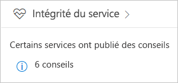
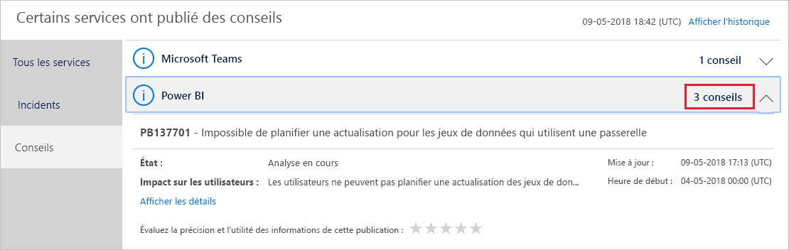
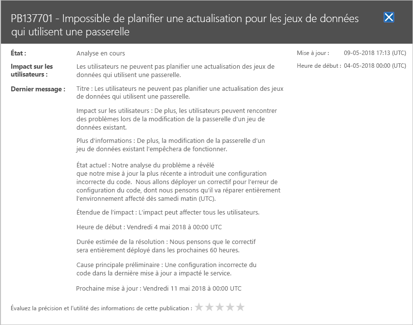

# Effectuer le suivi de l’intégrité du service Power BI dans Office 365

Le centre d’administration Microsoft 365 fournit des outils importants pour les administrateurs Power BI. Les outils incluent des informations actuelles et historiques sur l’intégrité du service. Pour accéder aux informations sur l’intégrité du service, vous devez avoir un des rôles suivants :

* Administrateur de services fédérés Power BI

* Administrateur général d’Office 365

Pour plus d’informations sur les rôles, voir [Rôles d’administrateur liés à Power BI](service-admin-administering-power-bi-in-your-organization.md#administrator-roles-related-to-power-bi).

1. Connectez-vous au [Centre d’administration Microsoft 365](https://portal.office.com/adminportal).

1. Dans la barre de navigation de gauche , sélectionnez **Afficher tout** > **Intégrité** > **Intégrité du service**. La page Intégrité du service s’affiche :

    

1. Dans la liste **Tous les services**, sélectionnez **Conseils** ou **Incidents** et passez en revue les résultats. La capture d’écran ci-dessous montre l’un des trois avis actifs.

    

1. Pour afficher plus d’informations, sélectionnez **Afficher les détails** pour un élément. La capture d’écran ci-dessous présente des informations supplémentaires, y compris les dernières mises à jour d’état.

    

    Faites défiler pour voir plus d’informations, puis fermez le volet lorsque vous avez terminé.

1. Pour afficher des informations historiques sur l’ensemble des services, sélectionnez **Afficher l’historique** dans le coin supérieur droit de page **État du service**. Ensuite, sélectionnez **7 derniers jours** ou **30 derniers jours**. 

1. Pour revenir à l’intégrité actuelle du service, sélectionnez **Afficher l’état actuel**.