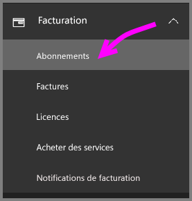
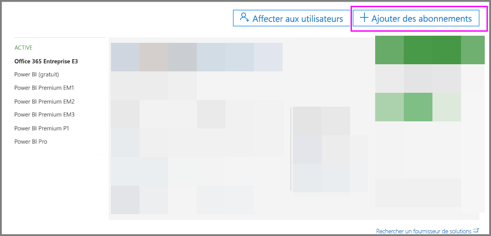
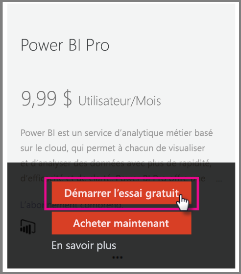
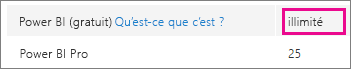
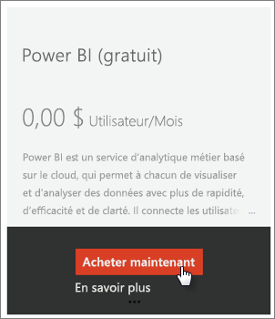
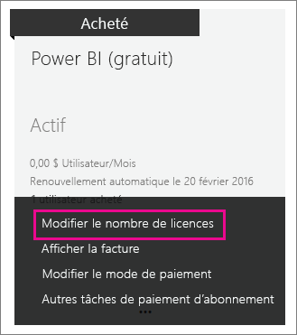

# <a name="power-bi-licensing-in-your-organization"></a>Gestion des licences Power BI dans votre organisation

[!INCLUDE [license-capabilities](includes/license-capabilities.md)]

Cet article se concentre sur la gestion des licences par utilisateur du point de vue d’un administrateur.

## <a name="manage-power-bi-pro-licenses"></a>Gérer des licences Power BI Pro

En tant qu’administrateur, vous pouvez acheter et affecter des licences Power BI Pro ; vous pouvez aussi vous inscrire pour une version d’essai de Power BI Pro pour votre organisation. Les personnes individuelles peuvent aussi s’inscrire pour un essai Power BI Pro.

### <a name="purchasing-power-bi-pro"></a>Achat de Power BI Pro

Vous achetez des licences Power BI Pro via Microsoft Office 365 ou un partenaire Microsoft certifié. Une fois que vous avez acheté les licences, vous les attribuez à des utilisateurs individuels. Pour plus d’informations, consultez [Acheter et attribuer des licences Power BI Pro](service-admin-purchasing-power-bi-pro.md).

### <a name="power-bi-pro-trial-for-individuals"></a>Essai de Power BI Pro pour les personnes individuelles

Des personnes individuelles de votre organisation peuvent s’inscrire pour une version d’essai de Power BI Pro. Pour plus d’informations, consultez [Inscription individuelle à Power BI](service-self-service-signup-for-power-bi.md).

Les utilisateurs bénéficiant de la version d’essai de Power BI Pro intégrée au produit n’apparaissent pas dans le Centre d’administration Microsoft 365 en tant qu’utilisateurs d’une version d’essai de Power BI Pro (ils apparaissent en tant qu’utilisateurs gratuits de Power BI). Ils apparaissent cependant en tant qu’utilisateurs de la version d’essai de Power BI Pro dans la page Gérer le stockage de Power BI.

### <a name="power-bi-pro-trial-for-organizations"></a>Essai de Power BI Pro pour les organisations

Si vous voulez acquérir et déployer des licences d’essai Power BI pour plusieurs utilisateurs de votre organisation sans que les utilisateurs aient à accepter individuellement les conditions de la version d’essai, inscrivez-vous pour une version d’essai de Power BI Pro pour votre organisation.

Gardez les points suivants à l’esprit avant de suivre les étapes de l’inscription :

* Pour vous inscrire, vous devez être membre du rôle [**Administrateur général** ou **Administrateur de facturation**](https://support.office.com/article/about-office-365-admin-roles-da585eea-f576-4f55-a1e0-87090b6aaa9d) dans Office 365.

* Il existe une limite d’une version d’évaluation pour organisation par client. Cela signifie que, si une personne a déjà appliqué la version d’évaluation de Power BI Pro à votre client, vous ne pouvez plus le faire. Si vous avez besoin d’aide à ce sujet, contactez le [Support de facturation d’Office 365](https://support.office.microsoft.com/article/contact-support-for-business-products-admin-help-32a17ca7-6fa0-4870-8a8d-e25ba4ccfd4b?CorrelationId=552bbf37-214f-4202-80cb-b94240dcd671).

1. Accédez au [Centre d’administration Microsoft 365](https://portal.office.com/adminportal/home#/homepage).

1. Dans le volet de navigation gauche, sélectionnez **Facturation**, puis **Abonnements**.

   

1. Sur le côté droit, sélectionnez **Ajouter des abonnements**.

   

1. Sous **Autres plans**, pointez sur l’ellipse (**. . .**) pour Power BI Pro et sélectionnez **Démarrer la version d’évaluation gratuite**.

    

1. Dans l’écran de confirmation de la commande, sélectionnez **Essayer maintenant**.

1. Dans le reçu de la commande, sélectionnez **Continuer**.

Vous pouvez maintenant [attribuer des licences dans Office 365](https://support.office.com/article/assign-licenses-to-users-in-office-365-for-business-997596b5-4173-4627-b915-36abac6786dc).

## <a name="manage-power-bi-free-licenses"></a>Gérer les licences gratuites de Power BI

Les utilisateurs au sein de votre organisation peuvent accéder aux licences gratuites de Power BI de deux façons :

* Vous pouvez leur affecter une licence Power BI au sein du Centre d’administration Microsoft 365.

* Si un utilisateur [s’inscrit à un essai de Power BI Pro](service-self-service-signup-for-power-bi.md) et que l’essai arrive à expiration, il se voit attribuer une licence gratuite.

### <a name="requesting-and-assigning-free-licenses"></a>Demande et attribution de licences gratuites

Si vous envisagez de gérer de façon centralisée les demandes et les attributions de licences, vérifiez d’abord si vous disposez déjà du bloc de licences (gratuites) de Power BI illimité.

Ce bloc de licences est disponible une fois que quelqu’un s’inscrit pour la première fois à Power BI en tant que personne individuelle. Pendant ce processus, ce bloc de licences est rattaché à votre organisation, et une licence est attribuée à l’utilisateur qui s’inscrit.

1. Dans le Centre d’administration Microsoft 365, sous **Facturation** > **Licences**, recherchez **illimité**.

    

1. Si le bloc est disponible, vous pouvez maintenant [attribuer des licences dans Office 365](https://support.office.com/article/assign-licenses-to-users-in-office-365-for-business-997596b5-4173-4627-b915-36abac6786dc). Si le bloc n’est pas disponible, vous avez deux possibilités :

    * Vous demandez à un membre de votre organisation de s’inscrire à titre individuel, ce qui déclenche la création du bloc illimité.

    * Vous passez à la procédure suivante, où vous pouvez vous inscrire pour un nombre fixe de licences.

Si le bloc de licences Power BI (gratuites) illimité n’est pas disponible et que vous ne voulez pas effectuer une inscription individuelle, suivez cette procédure.

1. Accédez au [Centre d’administration Microsoft 365](https://portal.office.com/admin/default.aspx).

1. Dans le volet de navigation de gauche, sélectionnez **Facturation** > **Abonnements**.

1. Sur le côté droit, sélectionnez **Ajouter des abonnements +**.

1. Sous **Autres plans**, pointez sur l’ellipse (**. . .**) pour Power BI (gratuit) et sélectionnez **Acheter maintenant**.

    

1. Entrez le nombre de licences que vous voulez ajouter, puis sélectionnez **Payer maintenant** ou **Ajouter au panier**.

1. Entrez les informations nécessaires pour la procédure d’achat.

    Aucun achat n’est effectué lors de cette procédure. Toutefois, vous devez entrer vos coordonnées bancaires pour le paiement ou choisir d’être facturé.

1. Vous pouvez maintenant [attribuer des licences dans Office 365](https://support.office.com/article/assign-licenses-to-users-in-office-365-for-business-997596b5-4173-4627-b915-36abac6786dc).

1. Si, par la suite, vous voulez ajouter d’autres licences, vous pouvez revenir à l’option **Ajouter des abonnements** et sélectionner **Modifier le nombre de licences** pour Power BI (gratuit).

    

### <a name="enable-or-disable-individual-user-sign-up-in-azure-active-directory"></a>Activer ou désactiver les inscriptions des utilisateurs individuels dans Azure Active Directory

En tant qu’administrateur, vous pouvez choisir d’activer ou de désactiver l’inscription des utilisateurs individuels via Azure Active Directory. Cette section de l’article vous montre comment gérer les inscriptions avec des commandes PowerShell. Pour plus d’informations sur Azure PowerShell, consultez [Vue d’ensemble d’Azure PowerShell](/powershell/azure/overview).

Le paramètre AAD qui contrôle l’inscription est **AllowAdHocSubscriptions**. Dans la plupart des locataires, ce paramètre est défini sur *true*, qui signifie qu’il est activé. Si vous avez acquis Power BI via un partenaire, ce paramètre peut être configuré sur *false*, ce qui signifie qu’il est désactivé. Si vous changez le paramètre de *true* en *false*, l’inscription individuelle de nouveaux utilisateurs de votre organisation est bloquée. Les utilisateurs inscrits pour Power BI avant la modification du paramètre conservent leurs licences.

1. Connectez-vous à Azure Active Directory avec vos informations d’identification Office 365. La première ligne du script PowerShell suivant vous invite à entrer vos informations d’identification. La deuxième ligne établit la connexion à Azure Active Directory.

    ```powershell
     $msolcred = get-credential
     connect-msolservice -credential $msolcred
    ```

   

1. Une fois connecté, exécutez la commande suivante pour voir comment votre locataire est actuellement configuré.

    ```powershell
     Get-MsolCompanyInformation | fl AllowAdHocSubscriptions
    ```
1. Exécutez la commande suivante pour activer ($true) ou désactiver ($false) **AllowAdHocSubscriptions**.

    ```powershell
     Set-MsolCompanySettings -AllowAdHocSubscriptions $true
    ```

> [!NOTE]
> L’indicateur AllowAdHocSubscriptions permet de contrôler plusieurs fonctionnalités d’utilisateur dans votre organisation, notamment la possibilité pour les utilisateurs de s’inscrire au service Azure Rights Management. La modification de cet indicateur affecte toutes ces fonctionnalités.

## <a name="next-steps"></a>Étapes suivantes

[Inscription en libre-service à Power BI](service-self-service-signup-for-power-bi.md)  

[Acheter et attribuer des licences Power BI Pro](service-admin-purchasing-power-bi-pro.md)

D’autres questions ? [Essayez d’interroger la communauté Power BI](http://community.powerbi.com/)