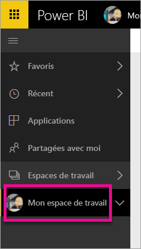
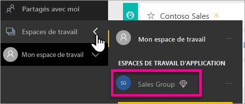
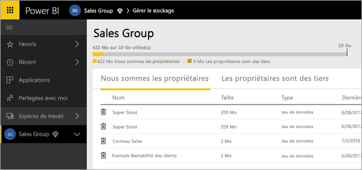
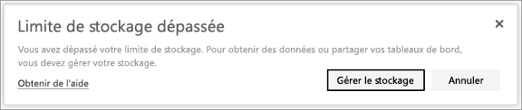

# Gérer le stockage de vos données
Découvrez comment vous pouvez gérer votre propre stockage de données ou celui d’un espace de travail d’application et ainsi veiller à ce que vous puissiez continuer à publier des rapports et jeux de données.

Les utilisateurs et les espaces de travail d’application ont leurs propres capacités concernant les données

* Les utilisateurs des versions Pro et gratuite disposent d’un espace de stockage de données maximal de 10 Go.
* Les utilisateurs de la version Pro peuvent créer des espaces de travail d’application disposant chacun d’une capacité de stockage des données de 10 Go.

Au niveau du locataire, l’utilisation totale ne peut pas dépasser 10 Go par utilisateur Pro parmi tous les utilisateurs et espaces de travail d’application Pro sur le locataire.

Découvrez plus en détail les autres fonctionnalités du [modèle de tarification de Power BI](https://powerbi.microsoft.com/pricing).

Vos propres jeux de données et rapports Excel, ainsi que ceux que d’autres personnes ont partagés avec vous, sont inclus dans votre espace de stockage des données. Les jeux de données sont les sources de données que vous avez chargées ou auxquelles vous vous êtes connecté, y compris les fichiers Power BI Desktop et les classeurs Excel que vous utilisez. Les éléments suivants sont également inclus dans votre capacité de données.

* Plages Excel épinglées aux tableaux de bord.
* Visualisations locales Reporting Services épinglées à un tableau de bord Power BI.
* Images téléchargées.

La taille d’un tableau de bord que vous partagez varie en fonction de ce qui est épinglé sur celui-ci. Par exemple, si vous épinglez des éléments à partir des deux rapports qui font partie de deux jeux de données différents, la taille inclut deux jeux de données.

<a name="manage"/>

## Gérer les éléments dont vous êtes propriétaire
Consultez l’espace de stockage des données que vous utilisez dans votre compte Power BI et gérez votre compte.

1. Pour gérer votre propre stockage, accédez à **Mon espace de travail** dans le volet de navigation gauche.
   
    
2. Sélectionnez l’icône représentant une roue dentée () située en haut à droite \> **Gérer le stockage personnel**.
   
    La barre supérieure montre la part de votre limite de stockage que vous avez utilisée.
   
    
   
    Les jeux de données et rapports sont répartis sous deux onglets :
   
    **Je suis le propriétaire :** il s’agit des rapports et des jeux de données que vous avez chargés sur votre compte Power BI, y compris les jeux de données de service tels que Salesforce et Dynamics CRM.  
    **Les autres sont les propriétaires :** ces rapports et jeux de données ont été partagés avec vous par d’autres personnes.
3. Pour supprimer un jeu de données ou un rapport, sélectionnez l’icône de la Corbeille .

N’oubliez pas que vous-même ou une autre personne pouvez avoir des rapports et des tableaux de bord basés sur un jeu de données. Si vous supprimez le jeu de données, les rapports et les tableaux de bord ne fonctionneront plus.

## Gérer votre espace de travail d’application
1. Sélectionnez la flèche en regard de **Espaces de travail** \>, puis sélectionnez le nom de l’espace de travail d’application.
   
    
2. Sélectionnez l’icône représentant une roue dentée () située en haut à droite \> **Gérer le stockage de groupe**.
   
    La barre supérieure montre la part de la limite de stockage du groupe qui est utilisée.
   
    
   
    Les jeux de données et rapports sont répartis sous deux onglets :
   
    **Nous sommes les propriétaires :** il s’agit des rapports et des jeux de données que vous-même ou une autre personne avez chargés sur le compte Power BI du groupe, y compris les jeux de données de service tels que Salesforce et Dynamics CRM.
    **Les autres sont les propriétaires :** ces rapports et jeux de données ont été partagés avec votre groupe par d’autres personnes.
3. Pour supprimer un jeu de données ou un rapport, sélectionnez l’icône de la Corbeille .
   
   > [!NOTE]
   > Tous les membres dotés d’autorisations de modification d’un espace de travail d’application sont autorisés à supprimer des jeux de données et des rapports de l’espace de travail d’application.
   > 
   > 

N’oubliez pas que vous-même ou un autre membre du groupe pouvez avoir des rapports et des tableaux de bord basés sur un jeu de données. Si vous supprimez le jeu de données, les rapports et les tableaux de bord ne fonctionneront plus.

## Limites de jeu de données
Power BI limite chaque jeu de données importé à 1 Go. Si vous conservez l’expérience Excel au lieu d’importer les données, vous serez limité à 250 Mo par jeu de données.

## Que se passe-t-il lorsque vous atteignez une limite ?
Lorsque vous atteignez la limite de capacité de données, le service vous en informe. 

Lorsque vous sélectionnez l’icône d’engrenage , vous voyez une barre rouge indiquant que vous avez dépassé votre limite de capacité de données.

Cela est également affiché dans **Gérer le stockage personnel**.

 

 Lorsque vous essayez d’exécuter une action qui atteindra l’une des limites, une invite s’affiche lorsque la limite est atteinte. Vous pouvez [gérer](#manage) votre stockage afin de réduire le volume de votre stockage et de dépasser la limite.

 

 D’autres questions ? [Essayez d’interroger la communauté Power BI](http://community.powerbi.com/)

