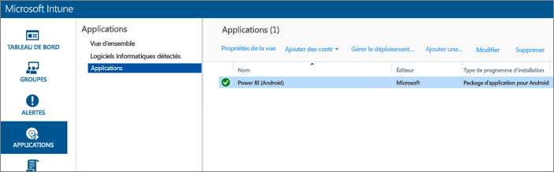
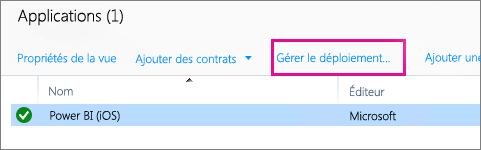
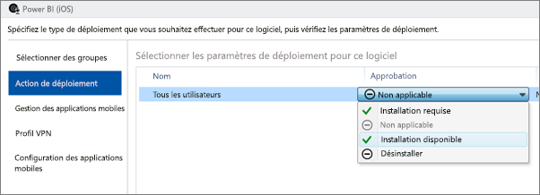
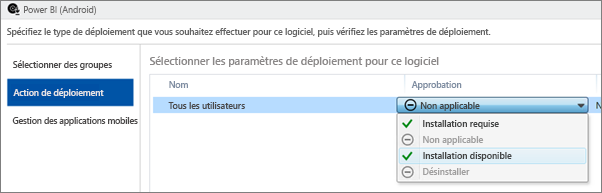
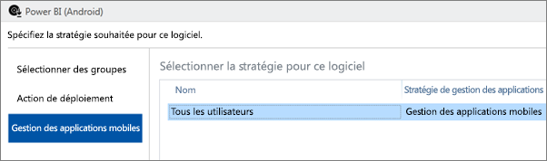
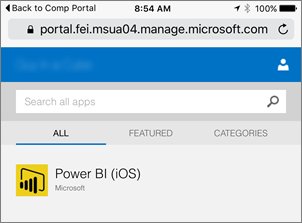
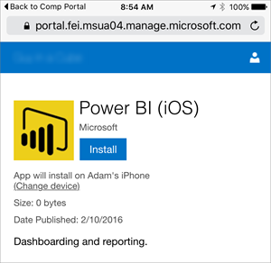
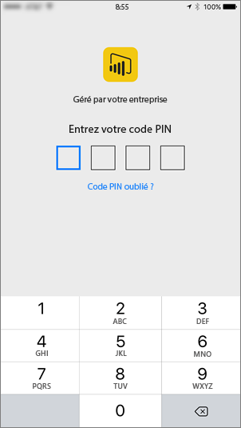

# Configurer des applications mobiles avec Microsoft Intune
Microsoft Intune permet aux organisations de gérer des appareils et des applications. Grâce à l’intégration des applications mobiles Power BI pour iOS et Android à Intune, vous pouvez gérer votre application sur vos appareils et contrôler la sécurité. Vous pouvez mettre en place des stratégies de configuration pour contrôler divers éléments, comme la nécessité de disposer d’un code confidentiel d’accès, la façon dont l’application traite les données et même le chiffrement des données de l’application quand cette dernière n’est pas utilisée.

<iframe width="560" height="315" src="https://www.youtube.com/embed/9HF-qsdQvHw?list=PLv2BtOtLblH1nPVPU2etFzTNmpz49dwXm" frameborder="0" allowfullscreen></iframe>

## Configuration générale de la gestion des appareils mobiles
Cet article n’a pas pour objet de vous expliquer comment configurer entièrement Microsoft Intune. Si vous commencez tout juste l’intégration à Intune, il est nécessaire de configurer un certain nombre d’éléments. [En savoir plus](https://technet.microsoft.com/library/jj676587.aspx)

Microsoft Intune et la gestion des appareils mobiles peuvent coexister dans Office 365. [En savoir plus](https://blogs.technet.microsoft.com/configmgrdogs/2016/01/04/microsoft-intune-co-existence-with-mdm-for-office-365/)

Cet article part du principe qu’Intune est correctement configuré et que vous avez inscrit des appareils dans Intune. Si vous faites coexister Intune et la gestion des appareils mobiles, l’appareil apparaît comme étant inscrit auprès de la gestion des appareils mobiles, mais vous pouvez tout de même le gérer dans Intune.

> [!NOTE]
> Une fois que votre organisation a configuré Microsoft Intune MAM, si vous utilisez l’application mobile Power BI sur un appareil iOS ou Android, l’actualisation des données en arrière-plan est désactivée. La prochaine fois que vous ouvrez l’application, Power BI actualise les données à partir du service Power BI sur le web.
> 
> 

## Étape 1 : obtenir l’URL de l’application
Avant de créer l’application dans Intune, vous devez obtenir les URL des applications. Pour iOS, vous pouvez obtenir cette information dans iTunes. Pour Android, cette information est disponible dans la page mobile Power BI.

Enregistrez l’URL, car vous en aurez besoin pour créer l’application.

### iOS
Pour obtenir l’URL de l’application pour iOS, nous devons accéder à iTunes.

1. Ouvrez iTunes.
2. Recherchez *Power BI*.
3. **Microsoft Power BI** doit figurer sous **Applications iPhone** et **Applications iPad**. L’URL étant la même, vous pouvez utiliser l’une ou l’autre.
4. Sélectionnez la liste déroulante **Télécharger** , puis sélectionnez **Copier le lien**.
   
    

L’URL doit ressembler à ce qui suit.

    https://itunes.apple.com/us/app/microsoft-power-bi/id929738808?mt=8

### Android
Vous pouvez obtenir l’URL vers Google Play à partir de la [page Power BI Mobile](https://powerbi.microsoft.com/mobile/). Cliquez sur l’icône **Télécharger à partir de Google Play** pour accéder à la page de l’application. Vous pouvez copier l’URL à partir de la barre d’adresses du navigateur. L’URL doit ressembler à ce qui suit.

    https://play.google.com/store/apps/details?id=com.microsoft.powerbim

## Étape 2 : créer une stratégie de gestion des applications mobiles
La stratégie de gestion des applications mobiles vous permet de forcer certains éléments, comme un code confidentiel d’accès. Vous pouvez en créer un dans le portail Intune. 

Vous pouvez commencer par créer l’application ou la stratégie. L’ordre dans lequel vous les ajoutez n’a pas d’importance. Ces deux éléments doivent simplement exister au moment du déploiement.

1. Sélectionnez **Stratégie** > **Stratégies de configuration**.
   
    
2. Sélectionnez **Ajouter**.
3. Sous **Logiciels** , vous pouvez sélectionner la gestion des applications mobiles pour Android ou iOS. Pour démarrer rapidement, vous pouvez soit sélectionner **Créer une stratégie avec les paramètres recommandés**, soit créer une stratégie personnalisée.
4. Modifiez la stratégie pour configurer les restrictions désirées sur l’application.

## Étape 3 : créer l’application
L’application est une référence ou un package qui est enregistré dans Intune en vue de son déploiement. Nous allons créer une application et référencer l’URL de l’application que nous avons obtenue dans Google Play ou iTunes.

Vous pouvez commencer par créer l’application ou la stratégie. L’ordre dans lequel vous les ajoutez n’a pas d’importance. Ces deux éléments doivent simplement exister au moment du déploiement.

1. Accédez au portail Intune et sélectionnez **Applications** dans le menu de gauche.
2. Sélectionnez **Ajouter une application**. L’application **Ajouter le logiciel** est alors lancée.

### iOS
1. Sélectionnez **Application iOS gérée à partir de l’App Store** dans la liste déroulante.
2. Entrez l’URL de l’application obtenue à l’[étape 1](#step-1-get-the-url-for-the-application), puis sélectionnez **Suivant**.
   
    
3. Indiquez un **Éditeur**, un **Nom** et une **Description**. Vous pouvez éventuellement fournir une **Icône**. La **Catégorie** s’applique à l’application Portail d’entreprise. Une fois que vous avez terminé, sélectionnez **Suivant**.
4. Vous pouvez indiquer comment vous souhaitez publier l’application : **N’importe lequel** (par défaut), **iPad** ou **iPhone**. L’option **N’importe lequel** est sélectionnée par défaut et fonctionne pour les deux types d’appareils. L’URL de l’application Power BI est la même pour iPhone et iPad. Sélectionnez **Suivant**.
5. Sélectionnez **Charger**.

> [!NOTE]
> Vous devrez peut-être actualiser la page pour la faire apparaître dans la liste d’applications. Vous pouvez cliquer sur **Vue d’ensemble** et revenir à **Applications** pour recharger la page.
> 
> 

### Android
1. Sélectionnez **Lien externe** dans la liste déroulante.
2. Entrez l’URL de l’application obtenue à l’[étape 1](#step-1-get-the-url-for-the-application), puis sélectionnez **Suivant**.
   
    
3. Indiquez un **Éditeur**, un **Nom** et une **Description**. Vous pouvez éventuellement fournir une **Icône**. La **Catégorie** s’applique à l’application Portail d’entreprise. Une fois que vous avez terminé, sélectionnez **Suivant**.
4. Sélectionnez **Charger**.

> [!NOTE]
> Vous devrez peut-être actualiser la page pour la faire apparaître dans la liste d’applications. Vous pouvez cliquer sur **Vue d’ensemble** et revenir à **Applications** pour recharger la page.
> 
> 

## Étape 4 : déployer l’application
Après avoir ajouté l’application, vous devez la déployer pour qu’elle soit accessible à vos utilisateurs finaux. C’est au cours de cette étape que vous allez lier la stratégie créée à l’application.

### iOS
1. Dans l’écran des applications, sélectionnez l’application que vous avez créée. Sélectionnez ensuite le lien **Gérer le déploiement** .
   
    
2. Dans l’écran **Sélectionner des groupes** , vous pouvez choisir les groupes vers lesquels vous souhaitez déployer cette application. Sélectionnez **Suivant**.
3. Dans l’écran **Action de déploiement** , vous pouvez choisir la façon dont vous souhaitez déployer cette application. Sélectionnez **Installation disponible**ou **Installation requise**pour rendre l’application disponible dans le Portail d’entreprise et permettre aux utilisateurs de l’installer à la demande. Après avoir effectué votre sélection, sélectionnez **Suivant**.
   
    
4. Dans l’écran **Gestion des applications mobiles**, vous pouvez sélectionner la stratégie de gestion des applications mobiles que vous avez créée à l’[étape 2](#step-2-create-a-mobile-application-management-policy). Si la stratégie que vous avez créée est la seule stratégie iOS disponible, elle est sélectionnée par défaut. Sélectionnez **Suivant**.
   
    
5. Dans l’écran **Profil VPN** , vous pouvez sélectionner une stratégie s’il en existe une pour votre organisation. L’option **Aucun**est sélectionnée par défaut. Sélectionnez **Suivant**.
6. Dans l’écran **Configuration des applications mobiles** , vous pouvez sélectionner une **Stratégie de configuration des applications** si vous en avez créé une. L’option **Aucun**est sélectionnée par défaut. Cette opération est facultative. Sélectionnez **Terminer**.

Une fois l’application déployée, la mention **Oui** doit apparaître en regard de Déployé dans la page des applications.

### Android
1. Dans l’écran des applications, sélectionnez l’application que vous avez créée. Sélectionnez ensuite le lien **Gérer le déploiement** .
   
    
2. Dans l’écran **Sélectionner des groupes** , vous pouvez choisir les groupes vers lesquels vous souhaitez déployer cette application. Sélectionnez **Suivant**.
3. Dans l’écran **Action de déploiement** , vous pouvez choisir la façon dont vous souhaitez déployer cette application. Sélectionnez **Installation disponible**ou **Installation requise**pour rendre l’application disponible dans le Portail d’entreprise et permettre aux utilisateurs de l’installer à la demande. Après avoir effectué votre sélection, sélectionnez **Suivant**.
   
    
4. Dans l’écran **Gestion des applications mobiles**, vous pouvez sélectionner la stratégie de gestion des applications mobiles que vous avez créée à l’[étape 2](#step-2-create-a-mobile-application-management-policy). Si la stratégie que vous avez créée est la seule stratégie Android disponible, elle est sélectionnée par défaut. Sélectionnez **Terminer**.
   
    

Une fois l’application déployée, la mention **Oui** doit apparaître en regard de Déployé dans la page des applications.

## Étape 5 : installer l’application sur un appareil
Vous allez installer l’application par l’intermédiaire de l’application Portail d’entreprise. Si vous n’avez pas installé le Portail d’entreprise, vous pouvez le télécharger à partir du magasin d’applications de la plateforme iOS ou Android. Vous devez vous connecter au Portail d’entreprise avec les identifiants de votre organisation.

1. Ouvrez l’application Portail d’entreprise.
2. Si l’application Power BI ne figure pas parmi les applications proposées, sélectionnez **Applications d’entreprise**.
   
    
3. Sélectionnez l’application Power BI que vous avez déployée.
   
    
4. Sélectionnez **Installer**.
   
    
5. Si vous êtes sur iOS, l’application est envoyée (Push) à votre appareil. Sélectionnez **Installer** dans la boîte de dialogue d’envoi (Push).
   
    

Une fois l’installation de votre application terminée, la mention **Géré par votre entreprise**s’affiche. Si vous avez activé l’accès avec un code confidentiel dans la stratégie, voici ce qui apparaît à l’écran.

## Étapes suivantes
[Configurer et déployer des stratégies de gestion des applications mobiles dans la console Microsoft Intune](https://technet.microsoft.com/library/dn878026.aspx)  
[Applications Power BI pour appareils mobiles](mobile-apps-for-mobile-devices.md)  

D’autres questions ? [Essayez d’interroger la communauté Power BI](http://community.powerbi.com/)

