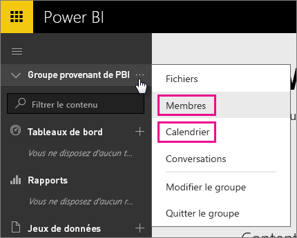
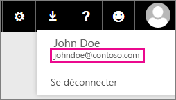

# Clients Office 365 dédiés - Problèmes connus
Power BI est maintenant pris en charge pour les clients Office 365 dédiés.  Si vous êtes un client O365 dédié, vous pouvez vous connecter avec un compte de ce client et utiliser Power BI. Il existe actuellement deux problèmes connus.

## Groupes
Lorsque vous sélectionnez **Membres** ou **Calendrier** dans le menu contextuel du groupe, vous êtes redirigé vers l’application de messagerie.  **Fichiers** et **Conversations** fonctionnent comme prévu.

## Application iPhone : la connexion avec un domaine personnel génère une erreur
Quand vous vous connectez dans l’application iPhone à l’aide d’une connexion avec un domaine personnel, une erreur peut se produire.

*Erreur de connexion*  
*Une erreur interne inattendue s’est produite. Veuillez réessayer.*

Pour contourner ce problème, connectez-vous avec l’adresse de messagerie répertoriée quand vous cliquez sur l’icône de l’utilisateur dans le service Power BI plutôt qu’avec le domaine personnel.

D’autres questions ? [Posez vos questions à la communauté Power BI](http://community.powerbi.com/)

