# Administration de Power BI dans le portail d’administration

Le portail d’administration vous permet de gérer un *client* Power BI pour votre organisation. Il comprend notamment des métriques d’utilisation, un accès au Centre d’administration Office 365, ainsi que des paramètres.

Le portail d’administration est accessible dans son intégralité à tous les utilisateurs qui sont administrateurs généraux dans Office 365 ou qui se sont vus attribuer le rôle d’administrateur de service Power BI. Si vous n’appartenez pas à l’un de ces rôles, seuls les **Paramètres de capacité** s’affichent sur le portail. Pour plus d’informations sur le rôle d’administrateur de Service Power BI, voir [Présentation du rôle d’administrateur Power BI](service-admin-role.md).

## Accès au portail d’administration

Pour obtenir l’accès au portail d’administration Power BI, votre compte doit être un compte d’**Administrateur global** dans Office 365 ou Azure Active Directory, ou doit avoir été assigné au rôle d’Administrateur de Service Power BI. Pour plus d’informations sur le rôle d’administrateur de Service Power BI, voir [Présentation du rôle d’administrateur Power BI](service-admin-role.md). Pour accéder au portail d’administration Power BI, procédez comme suit.

1. Sélectionnez l’icône des paramètres représentant une roue dentée, située en haut à droite de l’écran Power BI.

1. Sélectionnez **Portail d’administration**.

    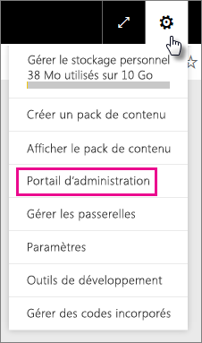

Le portail compte sept onglets. Le reste de cet article fournit des informations sur chacun de ces onglets.

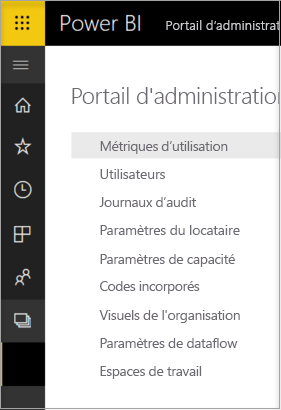

* [Métriques d’utilisation](#usage-metrics)
* [Utilisateurs](#users)
* [Journaux d’audit](#audit-logs)
* [Paramètres du locataire](#tenant-settings)
* [Paramètres Premium](#premium-settings)
* [Codes incorporés](#embed-codes)
* [Visuels organisationnels](#organization-visuals)

## Métriques d’utilisation

Les **Métriques d’utilisation** vous permettent de superviser l’utilisation de Power BI dans votre organisation. Il permet également de voir les utilisateurs et les groupes de votre organisation qui sont les plus actifs dans Power BI.

> [!NOTE]
> La première fois que vous accédez au tableau de bord ou si vous y accédez de nouveau après une longue période, un écran de chargement s’affiche probablement pendant le chargement du tableau de bord.

Une fois le tableau de bord chargé, vous voyez deux sections de vignettes. La première section comprend des données d’utilisation pour chacun des utilisateurs ; la deuxième comporte des informations similaires pour les groupes de votre organisation.

Voici le détail de ce que vous pouvez voir dans chacune d’elles :

* Le nombre de tableaux de bord, de rapports et de jeux de données de l’espace de travail utilisateur
  
    

* Le tableau de bord le plus utilisé par nombre d’utilisateurs autorisés à y accéder. Par exemple, si vous disposez d’un tableau de bord que vous avez partagé avec trois utilisateurs et que vous l’avez aussi ajouté à un pack de contenu auquel sont connectés deux autres utilisateurs, le nombre d’utilisateurs s’élève à 6 (1 + 3 + 2)
  
    

* Le contenu auquel est connecté le plus grand nombre d’utilisateurs. Il peut s’agir de tout ce que les utilisateurs peuvent obtenir via le processus Obtenir des données, autrement dit, des packs de contenu SaaS, des packs de contenu d’organisation, des fichiers ou des bases de données.
  
    

* Vue des utilisateurs les plus actifs, en fonction du nombre de tableaux de bord qu’ils possèdent, à la fois ceux qu’ils ont créés eux-mêmes et ceux qui ont été partagés avec eux.
  
    

* Vue des utilisateurs les plus actifs, en fonction du nombre de rapports qu’ils possèdent
  
    

La deuxième section affiche le même type d’informations, mais pour les groupes. Vous pouvez ainsi voir quels sont les groupes les plus actifs dans votre organisation et le type de contenu qu’ils utilisent.

Ces informations vous procurent des insights tangibles sur la façon dont les employés de votre organisation utilisent Power BI et vous permettent d’identifier les utilisateurs et les groupes les plus actifs.

## Utilisateurs

Les utilisateurs, les groupes et les administrateurs Power BI sont gérés dans le Centre d’administration Office 365. L’onglet **Utilisateurs** contient un lien qui donne accès au Centre d’administration pour votre client.

## Journaux d’audit

Les journaux d’audit Power BI sont gérés dans le Centre de sécurité et de conformité Office 365. L’onglet **Journaux d’audit** contient un lien qui donne accès au Centre de sécurité et de conformité pour votre client. [En savoir plus](service-admin-auditing.md)

Pour utiliser les journaux d’audit, vérifiez que le paramètre [**Créer des journaux d’audit pour l’audit et la conformité des activités internes**](#create-audit-logs-for-internal-activity-auditing-and-compliance) est activé.

## Paramètres du locataire

L’onglet **Paramètres du client** permet un contrôle affiné sur les fonctionnalités mises à la disposition de votre organisation. Si vous avez des inquiétudes à propos de vos données sensibles, il se peut que certaines de nos fonctionnalités ne soient pas adaptées à votre organisation. Vous pouvez aussi choisir de mettre à disposition une fonctionnalité déterminée à un groupe précis.

L’image suivante présente les deux premières sections de l’onglet **Paramètres du client**.

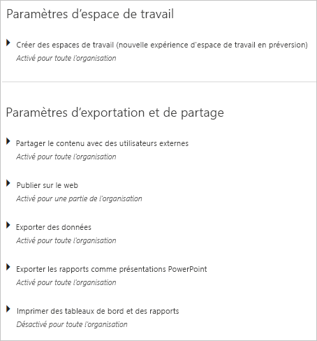

> [!NOTE]
> Jusqu’à 10 minutes peuvent être nécessaires à la prise en compte de la modification d’un paramètre pour tous les utilisateurs de votre client.

Les paramètres peuvent avoir trois états :

* **Désactivé pour toute l’organisation** : Personne dans votre organisation ne peut utiliser cette fonctionnalité.

    

* **Activé pour toute l’organisation** : Tout le monde dans votre organisation peut utiliser cette fonctionnalité.

    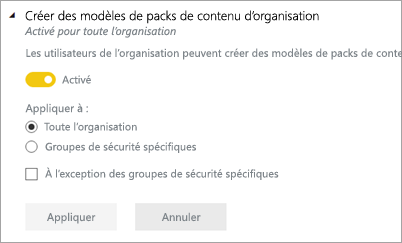

* **Activé pour une partie de l’organisation** : Un sous-ensemble spécifique d’utilisateurs ou de groupes de votre organisation peut utiliser la fonctionnalité en question.

    Vous pouvez activer la fonctionnalité pour toute votre organisation à l’exception d’un groupe spécifique d’utilisateurs.

    

    Vous pouvez aussi activer la fonctionnalité uniquement pour un groupe d’utilisateurs spécifique, mais aussi la désactiver pour un autre groupe d’utilisateurs. Cette approche permet de faire en sorte que certains utilisateurs n’ont pas accès à la fonctionnalité, même s’ils se trouvent dans le groupe autorisé.

    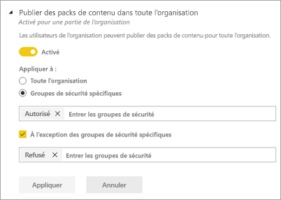

Les sections suivantes fournissent une vue d’ensemble des différents types de paramètres de locataire.

## Paramètres d’espace de travail

### Créer des espaces de travail (préversion)

Les utilisateurs de l’organisation peuvent créer des espaces de travail d’application pour collaborer sur des tableaux de bord, des rapports et autre contenu. [En savoir plus](service-create-the-new-workspaces.md)

## Paramètres d’exportation et de partage

### Partager le contenu avec des utilisateurs externes

Les utilisateurs de l’organisation peuvent partager des tableaux de bord avec des utilisateurs externes à l’organisation. [En savoir plus](service-share-dashboards.md#share-a-dashboard-or-report-with-people-outside-your-organization)

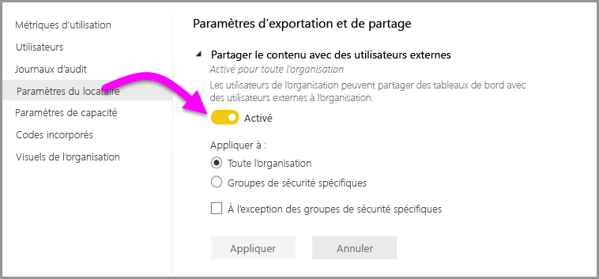

L’image suivante présente le message qui s’affiche quand vous faites un partage avec un utilisateur externe.

### Publier sur le web

Les utilisateurs de l’organisation peuvent publier des rapports sur le web. [En savoir plus](service-publish-to-web.md)

L’image suivante présente le menu **Fichier** qui s’affiche pour un rapport quand le paramètre **Publier sur le web** est activé.

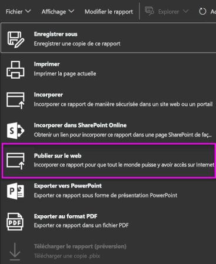

Les options présentées aux utilisateurs dans l’interface utilisateur varient en fonction de la nature du paramètre **Publier sur le web**.

|Fonctionnalité |Activée pour toute l’organisation |Désactivée pour toute l’organisation |Groupes de sécurité spécifiques   |
|---------|---------|---------|---------|
|**Publier sur le web** sous le menu **Fichier** du rapport.|Activée pour tous|Non visible pour tous|Visible uniquement par les utilisateurs ou groupes autorisés.|
|**Gérer les codes d’incorporation** sous **Paramètres**|Activée pour tous|Activée pour tous|Activée pour tous  Option * **Supprimer** uniquement pour les utilisateurs ou groupes autorisés. * **Obtenir les codes** activé pour tous.|
|**Codes d’incorporation** au sein du portail d’administration|L’état reflète l’une des options suivantes : * Actif * Non pris en charge * Bloqué|L’état affiche **Désactivé**|L’état reflète l’une des options suivantes : * Actif * Non pris en charge * Bloqué  Si un utilisateur n’est pas autorisé en fonction du paramètre de locataire, l’état affiche **violation**.|
|Rapports publiés existants|Tout activé|Tout désactivé|Les rapports continuent à être restitués pour tous.|

### Exporter des données

Les utilisateurs de l’organisation peuvent exporter des données depuis une vignette ou une visualisation. [En savoir plus](visuals/power-bi-visualization-export-data.md)

L’image suivante présente l’option d’exportation de données à partir d’une vignette.

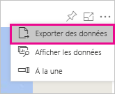

> [!NOTE]
> La désactivation du paramètre **Exporter des données** empêche également les utilisateurs d’utiliser la fonctionnalité **Analyser dans Excel** ainsi que la connexion active du service Power BI.

### Exporter les rapports comme présentations PowerPoint

Les utilisateurs de l’organisation peuvent exporter des rapports Power BI sous forme de fichiers PowerPoint. [En savoir plus](consumer/end-user-powerpoint.md)

L’image suivante présente le menu **Fichier** qui s’affiche pour un rapport quand le paramètre **Exporter les rapports comme présentations PowerPoint** est activé.

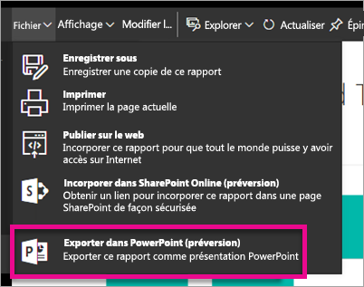

### Imprimer des tableaux de bord et des rapports

Les utilisateurs de l’organisation peuvent imprimer des tableaux de bord et des rapports. [En savoir plus](consumer/end-user-print.md)

L’image suivante présente l’option d’impression d’un tableau de bord.

L’image suivante présente le menu **Fichier** qui s’affiche pour un rapport quand le paramètre **Imprimer des tableaux de bord et des rapports** est activé.

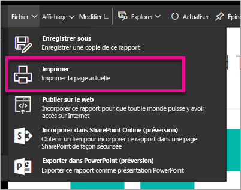

## Paramètres des applications et des packs de contenu

### Publier des packs de contenu et des applications pour toute l’organisation

Les utilisateurs de l’organisation peuvent publier des packs de contenu et des applications pour toute l’organisation, plutôt que pour des groupes spécifiques uniquement. [En savoir plus](service-organizational-content-pack-manage-update-delete.md)

L’image suivante montre l’option **Toute mon organisation** lors de la création d’un pack de contenu.

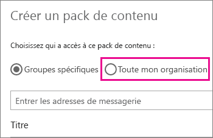

### Créer des modèles de packs de contenu et d’applications d’organisation

Les utilisateurs de l’organisation peuvent créer des packs de contenu modèles qui utilisent des jeux de données conçus dans Power BI Desktop. [En savoir plus](template-content-pack-authoring.md)

### Effectuer une transmission de type push des applications pour les utilisateurs finaux

Les utilisateurs peuvent partager directement des applications avec les utilisateurs finaux sans installation à partir d’AppSource. [En savoir plus](service-create-distribute-apps.md)

## Paramètres d’intégration

### Poser des questions sur les données à l’aide de Cortana

Les utilisateurs de l’organisation peuvent poser des questions sur leurs données en utilisant Cortana. [En savoir plus](service-cortana-enable.md)

> [!NOTE]
> Ce paramètre s’applique à toute l’organisation et ne peut pas être limité à des groupes en particulier.

### Utiliser Analyser dans Excel avec des jeux de données locaux

Les utilisateurs de l’organisation peuvent utiliser Excel pour afficher et interagir avec des jeux de données Power BI locaux. [En savoir plus](service-analyze-in-excel.md)

> [!NOTE]
> La désactivation du paramètre **Exporter des données** empêche également les utilisateurs d’utiliser la fonctionnalité **Analyser dans Excel**.

### Utiliser ArcGIS Maps pour Power BI

Les utilisateurs de l’organisation peuvent utiliser la visualisation ArcGIS Maps for Power BI fournie par Esri. [En savoir plus](visuals/power-bi-visualization-arcgis.md)

### Utiliser la recherche générale pour Power BI (préversion)

Les utilisateurs de l’organisation peuvent utiliser les fonctionnalités de recherche externe qui reposent sur le service Recherche Azure. Par exemple, les utilisateurs peuvent se servir de Cortana pour extraire des informations clés directement des tableaux de bord et des rapports Power BI. [En savoir plus](service-cortana-intro.md)

## Paramètres des visuels personnalisés

### Activer les visuels personnalisés pour l’ensemble de l’organisation

Les utilisateurs de l’organisation peuvent manipuler et partager des visuels personnalisés. [En savoir plus](power-bi-custom-visuals.md)

> [!NOTE]
> Ce paramètre s’applique à toute l’organisation et ne peut pas être limité à des groupes en particulier.

## Paramètres des visuels R

### Utiliser et partager des éléments visuels R

Les utilisateurs de l’organisation peuvent manipuler et partager des visuels créés avec des scripts R. [En savoir plus](visuals/service-r-visuals.md)

> [!NOTE]
> Ce paramètre s’applique à toute l’organisation et ne peut pas être limité à des groupes en particulier.

## Paramètres d’audit et d’utilisation

### Créer des journaux d’audit pour l’audit des activités internes et la vérification de la conformité

Les utilisateurs de l’organisation peuvent utiliser l’audit pour surveiller les actions effectuées dans Power BI par d’autres utilisateurs de l’organisation. [En savoir plus](service-admin-auditing.md)

Ce paramètre doit être activé pour pouvoir enregistrer les entrées du journal d’audit. Une fois que vous avez activé l’audit, le délai avant de pouvoir voir les données d’audit peut aller jusqu’à 48 heures. Si vous ne voyez immédiatement les données, consultez les journaux d’audit plus tard. Le délai est sensiblement le même entre le moment où vous obtenez l’autorisation de voir les journaux d’audit et le moment où vous pouvez réellement y accéder.

> [!NOTE]
> Ce paramètre s’applique à toute l’organisation et ne peut pas être limité à des groupes en particulier.

### Métriques d’utilisation pour les créateurs de contenu

Les utilisateurs de l’organisation peuvent voir les métriques d’utilisation des tableaux de bord et des rapports qu’ils créent. [En savoir plus](service-usage-metrics.md)

### Données par utilisateur dans les métriques d’utilisation pour les créateurs de contenu

Les métriques d’utilisation pour créateurs de contenu exposent les noms d’affichage et les adresses e-mail des utilisateurs qui accèdent à du contenu. [En savoir plus](service-usage-metrics.md)

Par défaut, les données par utilisateur sont activées pour les métriques d’utilisation et les informations des comptes de créateur de contenu sont incluses dans le rapport des métriques. Si vous ne souhaitez pas inclure ces informations pour tout ou partie des utilisateurs, désactivez la fonctionnalité pour des groupes de sécurité spécifiés ou pour l’ensemble de l’organisation. Les informations de compte figurent alors dans le rapport sous l’intitulé *Sans nom*.

## Paramètres du tableau de bord

### Classification des données des tableaux de bord

Les utilisateurs de l’organisation peuvent étiqueter les tableaux de bord avec des classifications indiquant les niveaux de sécurité des tableaux de bord. [En savoir plus](service-data-classification.md)

> [!NOTE]
> Ce paramètre s’applique à toute l’organisation et ne peut pas être limité à des groupes en particulier.

## Paramètres de développeur

### Incorporer du contenu dans les applications

Les utilisateurs de l’organisation peuvent incorporer des tableaux de bord et des rapports Power BI dans des applications Saas (Software as a Service). La désactivation de ce paramètre empêche les utilisateurs d’utiliser les API REST pour incorporer du contenu Power BI dans leur application. [En savoir plus](developer/embedding.md)

## Espaces de travail et paramètres d’importation

### Créer du contenu dans les espaces de travail

Les utilisateurs de l’organisation peuvent accéder aux espaces de travail pour se connecter aux données et créer du contenu. [En savoir plus](service-create-the-new-workspaces.md)

### Importer des données dans Power BI

Les utilisateurs de l’organisation peuvent importer des données dans le service, par exemple, publier des rapports Power BI Desktop, charger des fichiers de rapport Power BI et se connecter aux données directement à partir du service. [En savoir plus](desktop-upload-desktop-files.md)

## Paramètres de dataflow (préversion)

### Créer et utiliser des dataflows (préversion)

Les utilisateurs de l'organisation peuvent créer et utiliser des dataflows. Pour une vue d’ensemble des dataflows, consultez [Préparation des données en libre-service dans Power BI (préversion)](service-dataflows-overview.md). Pour activer les dataflows dans une capacité Premium, consultez [Configurer des charges de travail](service-admin-premium-manage.md#configure-workloads).

> [!NOTE]
> Ce paramètre s’applique à toute l’organisation et ne peut pas être limité à des groupes en particulier.

## Paramètres de capacité

### Power BI Premium

L’onglet **Power BI Premium** vous permet de gérer les capacités Power BI Premium (EM ou SKU P) achetées pour votre organisation. Tous les utilisateurs dans votre organisation peuvent voir l’onglet **Power BI Premium**, mais ne peuvent en voir le contenu que s’ils disposent d’autorisations *d’administrateur de capacité* ou d’autorisations d’affectation. Si un utilisateur ne possède aucune autorisation, le message suivant apparaît.

Pour plus d’informations sur la gestion des paramètres Premium, consultez [Gérer Power BI Premium](service-admin-premium-manage.md).

### Power BI Embedded

L’onglet **Power BI Embedded** vous permet d’afficher les capacités de Power BI Embedded (référence SKU A) que vous avez achetées pour votre client. Dans la mesure où vous ne pouvez acheter des références SKU A qu’à partir d’Azure, vous [gérez les capacités incorporées dans Azure](developer/azure-pbie-create-capacity.md) depuis **le portail Azure**.

Pour plus d’informations sur la gestion des paramètres de Power BI Embedded (référence SKU A), consultez [Qu’est-ce que Power BI Embedded](developer/azure-pbie-what-is-power-bi-embedded.md).

## Codes incorporés

En tant qu’administrateur, vous pouvez afficher les codes incorporés qui sont générés pour votre locataire. Vous pouvez également révoquer ou supprimer des codes. [En savoir plus](service-publish-to-web.md)

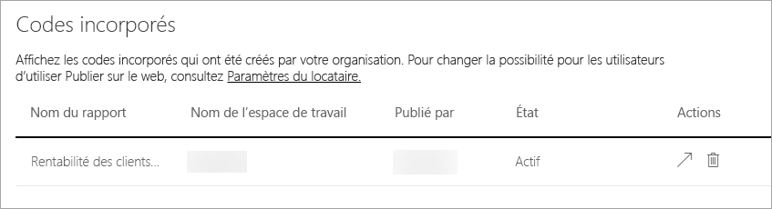

## Visuels organisationnels

L’onglet **Visuels organisationnels** vous permet de déployer et de gérer des visuels personnalisés au sein de votre organisation. Avec les visuels d’organisation, vous pouvez facilement déployer des visuels propriétaires dans votre organisation, que les auteurs de rapports peuvent ensuite détecter et importer dans leurs rapports à partir de Power BI Desktop. [En savoir plus](power-bi-custom-visuals-organization.md)

> [!WARNING]
> Un visuel personnalisé est susceptible de contenir du code présentant des risques pour la sécurité ou la confidentialité ; vérifiez que vous faites confiance à son auteur et à sa source avant de le déployer dans le référentiel de l’organisation.

L’image suivante affiche tous les visuels personnalisés actuellement déployés dans le référentiel d’une organisation.

### Ajouter un visuel personnalisé

Pour ajouter un nouveau visuel personnalisé à la liste, procédez comme suit. 

1. Dans le volet droit, sélectionnez **Ajouter un visuel personnalisé**.

    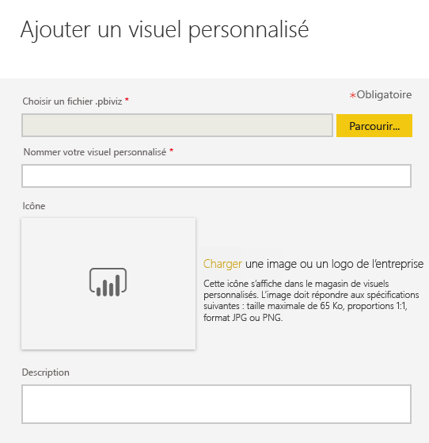

1. Renseignez le formulaire **Ajouter un visuel personnalisé** :

    * **Choisir un fichier .pbiviz** (obligatoire) : sélectionnez un fichier visuel personnalisé à charger. Seuls les visuels personnalisés d’API avec version sont pris en charge (lisez ici ce que cela signifie).

    Avant de charger un visuel personnalisé, examinez-le afin de déterminer s’il présente un risque en matière de sécurité et de confidentialité et s’il répond aux standards de votre organisation.

    * **Nommer vos visuels personnalisés** (obligatoire) : donnez un titre court au visuel pour que les utilisateurs de Power BI Desktop comprennent facilement ce qu’il fait

    * **Icône** : Il s’agit du fichier d’icône qui s’affiche dans l’interface utilisateur de Power BI Desktop.

    * **Description** : rédigez une brève description du visuel pour donner plus de contexte et d’informations à l’utilisateur

1. Sélectionnez **Ajouter** pour lancer la requête de chargement. Si elle aboutit, le nouvel élément s’affiche dans la liste. En cas d’échec, vous recevez le message d’erreur correspondant.

### Supprimer un visuel personnalisé de la liste

Sélectionnez l’icône de la corbeille pour supprimer définitivement le visuel du référentiel.

> [!IMPORTANT]
> La suppression est irréversible. Le rendu du visuel supprimé disparaît immédiatement des rapports existants. Même si vous chargez le même visuel à nouveau, il ne remplace celui qui a été supprimé. Toutefois, les utilisateurs peuvent réimporter le nouveau visuel et remplacer l’instance présente dans leurs rapports.

### Désactiver un visuel personnalisé dans la liste

Pour désactiver le visuel à partir du magasin de l’organisation, sélectionnez l’icône d’engrenage. Dans la section **Accès**, désactivez le visuel personnalisé.

Après la désactivation du visuel, son rendu ne s’affiche plus dans les rapports existants et le message d’erreur suivant s’affiche.

*Ce visuel personnalisé n’est plus disponible. Pour plus d’informations, contactez votre administrateur.*

Toutefois, les visuels marqués d’un signet continuent à fonctionner.

Après une mise à jour ou un changement d’administrateur, les utilisateurs de Power BI Desktop doivent redémarrer l’application ou actualiser le navigateur dans le service Power BI pour voir les mises à jour.

### Mettre à jour un visuel

Pour mettre à jour le visuel à partir du magasin de l’organisation, sélectionnez l’icône d’engrenage. Parcourez et chargez une nouvelle version du visuel.

Assurez-vous que l’ID du visuel reste inchangé. Le nouveau fichier remplace le fichier précédent pour tous les rapports au sein de l’organisation. Toutefois, si la nouvelle version du visuel est susceptible de rompre l’utilisation ou la structure de données de la version précédente du visuel, alors ne remplacez pas la version précédente. Au lieu de cela, vous devez créer une nouvelle liste pour la nouvelle version du visuel. Par exemple, ajoutez un nouveau numéro de version (version X.X) au titre du nouveau visuel répertorié. Ainsi, il est clair qu’il s’agit du même visuel, avec un numéro de version mis à jour, ce qui permet de ne pas rompre les fonctionnalités des rapports existants. Encore une fois, assurez-vous que l’ID du visuel reste inchangé. Puis, la prochaine fois que les utilisateurs entrent dans le référentiel de l’organisation à partir de Power BI Desktop, ils peuvent importer la nouvelle version et sont alors invités à remplacer la version déjà présente dans leur rapport.

Pour plus d’informations, consultez [Questions fréquentes sur les visuels personnalisés d’une organisation](https://docs.microsoft.com/en-us/power-bi/power-bi-custom-visuals-faq#organizational-custom-visuals)

## Stockage de dataflows (préversion)

Par défaut, les données utilisées avec Power BI sont stockées dans le stockage interne offert par Power BI. Avec l’intégration entre les flux de données et Azure Data Lake Storage Gen2 (ADLS Gen2), vous pouvez stocker vos flux de données dans le compte Azure Data Lake Storage Gen2 de votre organisation. Pour plus d’informations, consultez [Flux de données et intégration à Azure Data Lake (préversion)](service-dataflows-azure-data-lake-integration.md).

## Espaces de travail (préversion)

En tant qu’administrateur, vous pouvez afficher les espaces de travail qui existent dans votre locataire. Vous pouvez trier et filtrer la liste des espaces de travail et afficher les détails de chaque espace de travail. Notez que les colonnes de la table correspondent aux propriétés retournées par l’[API REST administrateur Power BI](/rest/api/power-bi/admin) pour les espaces de travail. Les espaces de travail personnels sont de type **PersonalGroup**, les espaces de travail hérités sont de type **Group**, et les espaces de travail modernes sont de type **Workspace**. Pour plus d’informations, consultez [Créer les nouveaux espaces de travail (préversion) dans Power BI](service-create-the-new-workspaces.md).

## Étapes suivantes

[Administration de Power BI dans votre organisation](service-admin-administering-power-bi-in-your-organization.md)  [Présentation du rôle d’administrateur Power BI](service-admin-role.md)  
[Audit de Power BI dans votre organisation](service-admin-auditing.md)  
[Gérer Power BI Premium](service-admin-premium-manage.md)  

D’autres questions ? [Essayez d’interroger la communauté Power BI](http://community.powerbi.com/)
