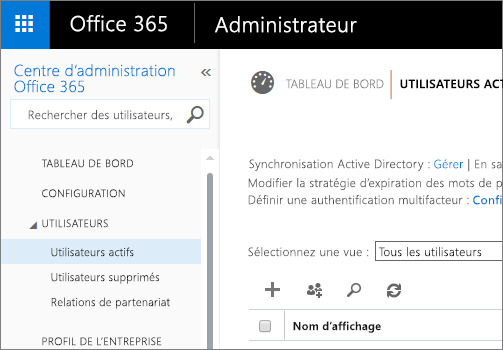
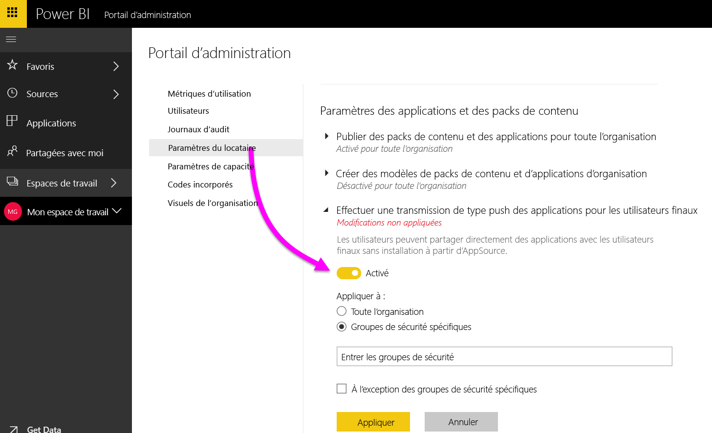
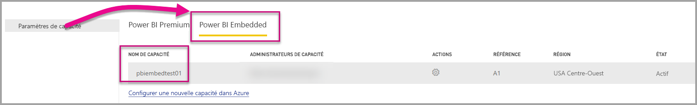
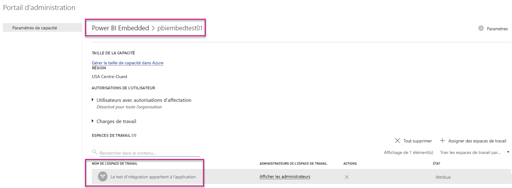

# Portail d’administration Power BI

Le portail d’administration permet de gérer les clients Power BI de votre organisation. Il comprend notamment des métriques d’utilisation, un accès au Centre d’administration Office 365 et des paramètres.

La gestion des clients Power BI de votre entreprise s’effectue via le portail d’administration Power BI. Le portail d’administration est accessible à tous les utilisateurs qui sont administrateurs généraux dans Office 365 ou qui sont assignés au rôle d’administrateur de Service Power BI. Pour plus d’informations sur le rôle d’administrateur de Service Power BI, voir [Présentation du rôle d’administrateur Power BI](service-admin-role.md).

Tous les utilisateurs peuvent voir **Portail d’administration** sous l’icône d’engrenage. Les non-administrateurs ne peuvent voir que la section **Paramètres Premium** ainsi que les capacités qu’ils ont le droit de gérer.

## Accès au portail d’administration

Pour obtenir l’accès au portail d’administration Power BI, votre compte doit être un compte d’**Administrateur global** dans Office 365 ou Azure Active Directory, ou doit avoir été assigné au rôle d’Administrateur de Service Power BI. Pour plus d’informations sur le rôle d’administrateur de Service Power BI, voir [Présentation du rôle d’administrateur Power BI](service-admin-role.md). Pour accéder au portail d’administration Power BI, procédez comme suit.

1. Sélectionnez l’icône des paramètres représentant une roue dentée, située en haut à droite de l’écran Power BI.
2. Sélectionnez **Portail d’administration**.

Le portail comporte six onglets. Ces onglets sont décrits ci-dessous.

* [Métriques d’utilisation](#usage-metrics)
* [Utilisateurs](#users)
* [Journaux d’audit](#audit-logs)
* [Paramètres du locataire](#tenant-settings)
* [Paramètres Premium](#premium-settings)
* [Codes incorporés](#embed-codes)
* [Visuels de l’organisation](#Organization-visuals)

## Métriques d’utilisation
Le premier onglet du portail d’administration est **Métriques d’utilisation**. Le rapport sur les métriques d’utilisation vous donne la possibilité de surveiller l’utilisation de Power BI au sein de votre organisation. Il permet également de voir les utilisateurs et les groupes de votre organisation qui sont les plus actifs dans Power BI.

> [!NOTE]
> La première fois que vous accédez au tableau de bord ou si vous y accédez de nouveau après une longue période, un écran de chargement s’affiche probablement pendant le chargement du tableau de bord.

Une fois le tableau de bord chargé, vous pouvez voir deux sections de vignettes. La première section comprend des données d’utilisation pour chacun des utilisateurs, et la deuxième section comporte des informations similaires pour les groupes de votre organisation.

Voici le détail de ce que vous pouvez voir dans chacune d’elles :

* Le nombre de tableaux de bord, de rapports et de jeux de données de l’espace de travail utilisateur
  
    

* Le tableau de bord le plus utilisé par nombre d’utilisateurs autorisés à y accéder. Par exemple, si vous avez un tableau de bord que vous avez partagé avec trois utilisateurs et si vous l’avez également ajouté à un pack de contenu auquel sont connectés deux autres utilisateurs, le nombre d’utilisateurs s’élève à 6 (1 + 3 + 2)
  
    

* Le contenu auquel est connecté le plus grand nombre d’utilisateurs. Il peut s’agir de tout ce que les utilisateurs peuvent obtenir via le processus Obtenir des données, autrement dit, des packs de contenu SaaS, des packs de contenu d’organisation, des fichiers ou des bases de données.
  
    

* Vue des utilisateurs les plus actifs, en fonction du nombre de tableaux de bord qu’ils possèdent, à la fois ceux qu’ils ont créés eux-mêmes et ceux qui ont été partagés avec eux.
  
    

* Vue des utilisateurs les plus actifs, en fonction du nombre de rapports qu’ils possèdent
  
    

La deuxième section affiche le même type d’informations, mais pour les groupes. Vous pouvez voir les groupes de votre organisation qui sont les plus actifs et quels types d’informations ils utilisent.

Avec ces informations, vous pourrez savoir comment les employés de votre organisation utilisent Power BI et quels sont les utilisateurs et les groupes qui sont les plus actifs.

## Users

Le deuxième onglet du portail d’administration est **Gérer les utilisateurs**. La gestion des utilisateurs Power BI s’effectue dans le Centre d’administration Office 365. Cette section vous permet d’atteindre rapidement l’emplacement où sont gérés les utilisateurs, les administrateurs et les groupes dans Office 365.

Quand vous cliquez sur **Accéder au centre d’administration O365**, vous accédez directement à la page d’accueil du centre d’administration Office 365, depuis laquelle vous pouvez gérer les utilisateurs de votre client.

## Journaux d’audit

Le troisième onglet du portail d’administration est **Journaux d’audit**. Les journaux sont situés dans le Centre de sécurité et conformité Office 365. Cette section vous permet d’accéder rapidement à cette zone dans Office 365.

Pour plus d’informations sur les journaux d’audit, consultez [Audit de Power BI dans votre organisation](service-admin-auditing.md).

## Paramètres du client

Le troisième onglet du portail d’administration est **Paramètres du client**. Les paramètres client vous permettent de décider des fonctionnalités qui doivent être mises à la disposition de votre organisation. Si vous vous inquiétez pour vos données sensibles, certaines de nos fonctionnalités peuvent ne pas être adaptées à votre organisation, ou nous vous recommandons d’attribuer certaines fonctionnalités à des groupes précis. Si c’est le cas, vous pouvez les désactiver dans votre client.

> [!NOTE]
> L’activation ou la désactivation d’un paramètre peut prendre jusqu’à 10 minutes pour tous les utilisateurs de votre client.

Les paramètres peuvent avoir trois états :

* **Désactivé pour toute l’organisation** : Vous pouvez désactiver une fonctionnalité pour que les utilisateurs ne puissent plus l’utiliser.

    

* **Activé pour toute l’organisation** : Vous pouvez activer une fonctionnalité pour toute votre organisation, ce qui permet à tous les utilisateurs d’y accéder.

    

* **Activé pour une partie de l’organisation** : Vous pouvez également activer une fonctionnalité pour une partie de votre organisation. Cela peut se produire de différentes manières. Vous pouvez l’activer pour toute votre organisation à l’exception d’un groupe spécifique d’utilisateurs.

    

    Vous pouvez également activer la fonctionnalité uniquement pour un groupe d’utilisateurs spécifique, mais également la désactiver pour un autre groupe d’utilisateurs. Vous pouvez ainsi vous assurer que certains utilisateurs n’ont pas accès à la fonctionnalité, même s’ils se trouvent dans le groupe des utilisateurs autorisés.

    

Les sections suivantes fournissent une vue d’ensemble des différents types de paramètres de locataire.

## Paramètres d’espace de travail

### Créer des espaces de travail (préversion)
Les utilisateurs de l’organisation peuvent créer des espaces de travail d’application pour collaborer sur des tableaux de bord, des rapports et autre contenu.

Pour plus d’informations, consultez [Créer les nouveaux espaces de travail](service-create-the-new-workspaces.md).

## Paramètres d’exportation et de partage

### Partager le contenu avec des utilisateurs externes

Les utilisateurs de l’organisation peuvent partager des tableaux de bord avec des utilisateurs externes à l’organisation.

Voici le message qui s’affiche lorsque vous partagez un tableau de bord avec un utilisateur externe.

### Publier sur le web

Les utilisateurs de l’organisation peuvent publier des rapports sur le web. [En savoir plus](service-publish-to-web.md)

Les utilisateurs peuvent voir différentes options dans l’interface utilisateur en fonction de la définition du paramètre de publication sur le web.

|Fonctionnalité |Activée pour toute l’organisation |Désactivée pour toute l’organisation |Groupes de sécurité spécifiques   |
|---------|---------|---------|---------|
|**Publier sur le web** sous le menu **Fichier** du rapport.|Activée pour tous|Non visible pour tous|Visible uniquement par les utilisateurs ou groupes autorisés.|
|**Gérer les codes d’incorporation** sous **Paramètres**|Activée pour tous|Activée pour tous|Activée pour tous  Option * **Supprimer** uniquement pour les utilisateurs ou groupes autorisés. * **Obtenir les codes** activé pour tous.|
|**Codes d’incorporation** au sein du portail d’administration|L’état reflète l’une des options suivantes : * Actif * Non pris en charge * Bloqué|L’état affiche **Désactivé**|L’état reflète l’une des options suivantes : * Actif * Non pris en charge * Bloqué  Si un utilisateur n’est pas autorisé en fonction du paramètre de locataire, l’état affiche **violation**.|
|Rapports publiés existants|Tout activé|Tout désactivé|Les rapports continuent à être restitués pour tous.|

### Exporter des données

Les utilisateurs de l’organisation peuvent exporter des données depuis une vignette ou une visualisation. [En savoir plus](visuals/power-bi-visualization-export-data.md)

> [!NOTE]
> La désactivation du paramètre **Exporter des données** empêche également les utilisateurs d’utiliser la fonctionnalité **Analyser dans Excel** ainsi que la connexion active du service Power BI.

### Exporter les rapports comme présentations PowerPoint

Les utilisateurs de l’organisation peuvent exporter des rapports Power BI sous forme de fichiers PowerPoint. [En savoir plus](consumer/end-user-powerpoint.md)

### Imprimer des tableaux de bord et des rapports

Les utilisateurs de l’organisation peuvent imprimer des tableaux de bord et des rapports. [En savoir plus](consumer/end-user-print.md)

## Paramètres du pack de contenu

### Publier les packs de contenu dans toute l'organisation

Les utilisateurs de l’organisation peuvent publier des packs de contenu pour toute l’organisation.

### Créer des modèles de packs de contenu d’organisation

Les utilisateurs de l’organisation peuvent créer des packs de contenu modèles qui utilisent des jeux de données basés sur une même source de données dans Power BI Desktop.

### Effectuer une transmission de type push des applications pour les utilisateurs finaux

L’administrateur de votre locataire permet de pousser des applications dans les **Paramètres du locataire**.

   

Vous pouvez basculer le paramètre sur **Activé**, puis spécifier qui obtient cette fonctionnalité (l’ensemble de l’organisation ou des groupes de sécurité spécifiques).

> [!NOTE]
> N’oubliez pas que l’application des changements de paramètre de locataire peut prendre un certain temps.

Cliquez ici pour en savoir plus sur [les applications poussées](service-create-distribute-apps.md).

## Paramètres d’intégration

### Poser des questions sur les données à l’aide de Cortana

Les utilisateurs de l’organisation peuvent poser des questions sur leurs données en utilisant Cortana.

> [!NOTE]
> Ce paramètre s’applique à toute l’organisation et ne peut pas être limité à des groupes en particulier.

### Utiliser Analyser dans Excel avec des jeux de données locaux

Les utilisateurs de l’organisation peuvent utiliser Excel pour afficher et interagir avec des jeux de données Power BI locaux. [En savoir plus](service-analyze-in-excel.md)

> [!NOTE]
> La désactivation du paramètre **Exporter des données** empêche également les utilisateurs d’utiliser la fonctionnalité **Analyser dans Excel**.

### Utiliser ArcGIS Maps pour Power BI

Les utilisateurs de l’organisation peuvent utiliser la visualisation ArcGIS Maps for Power BI fournie par Esri. [En savoir plus](power-bi-visualization-arcgis.md)

### Utiliser la recherche générale pour Power BI (préversion)

Les utilisateurs de l’organisation peuvent utiliser les fonctionnalités de recherche externe qui reposent sur le service Recherche Azure. Par exemple, les utilisateurs peuvent se servir de Cortana pour extraire des informations clés directement des tableaux de bord et des rapports Power BI. [En savoir plus](service-cortana-intro.md)

## Paramètres des visuels personnalisés

### Activer les visuels personnalisés pour l’ensemble de l’organisation

Les utilisateurs de l’organisation peuvent manipuler et partager des visuels personnalisés. [En savoir plus](power-bi-custom-visuals.md)

> [!NOTE]
> Ce paramètre s’applique à toute l’organisation et ne peut pas être limité à des groupes en particulier.

## Paramètres des visuels R

### Utiliser et partager des éléments visuels R

Les utilisateurs de l’organisation peuvent manipuler et partager des visuels créés avec des scripts R. [En savoir plus](visuals/service-r-visuals.md)

> [!NOTE]
> Ce paramètre s’applique à toute l’organisation et ne peut pas être limité à des groupes en particulier.

## Paramètres d’audit et d’utilisation

### Créer des journaux d’audit pour l’audit des activités internes et la vérification de la conformité

Les utilisateurs de l’organisation peuvent utiliser l’audit pour surveiller les actions effectuées dans Power BI par d’autres utilisateurs de l’organisation. [En savoir plus](service-admin-auditing.md)

Ce paramètre doit être activé pour pouvoir enregistrer les entrées du journal d’audit. Une fois que vous avez activé l’audit, le délai avant de pouvoir voir les données d’audit peut aller jusqu’à 48 heures. Si vous ne voyez immédiatement les données, consultez les journaux d’audit plus tard. Le délai est sensiblement le même entre le moment où vous obtenez l’autorisation de voir les journaux d’audit et le moment où vous pouvez réellement y accéder.

> [!NOTE]
> Ce paramètre s’applique à toute l’organisation et ne peut pas être limité à des groupes en particulier.

### Métriques d’utilisation pour les créateurs de contenu
Les utilisateurs de l’organisation peuvent voir les métriques d’utilisation des tableaux de bord et des rapports qu’ils ont créés. [En savoir plus](service-usage-metrics.md).

Vous pouvez passer le paramètre à **Activé**, puis spécifier qui peut voir les métriques d’utilisation (l’ensemble de l’organisation ou des groupes de sécurité spécifiques).

> [!NOTE]
> N’oubliez pas que l’application des changements de paramètre de locataire peut prendre un certain temps.

### Données par utilisateur dans les métriques d’utilisation pour les créateurs de contenu
Les métriques d’utilisation pour créateurs de contenu exposent les noms d’affichage et les adresses e-mail des utilisateurs qui accèdent à du contenu. [En savoir plus](service-usage-metrics.md).

Vous pouvez passer le paramètre à **Activé**, puis spécifier qui peut voir les noms d’affichage et les adresses e-mail dans les métriques d’utilisation (l’ensemble de l’organisation ou des groupes de sécurité spécifiques).

Par défaut, les données par utilisateur sont activées pour les métriques d’utilisation et les informations des comptes de créateur de contenu sont incluses dans le rapport des métriques. Si vous ne souhaitez pas inclure ces informations pour tout ou partie des utilisateurs, désactivez la fonctionnalité pour des groupes de sécurité spécifiés ou pour l’ensemble de l’organisation. Les informations de compte figurent alors dans le rapport sous l’intitulé *Sans nom*.

> [!NOTE]
> N’oubliez pas que l’application des changements de paramètre de locataire peut prendre un certain temps.

## Paramètres du tableau de bord

### Classification des données des tableaux de bord

Les utilisateurs de l’organisation peuvent étiqueter les tableaux de bord avec des classifications indiquant les niveaux de sécurité des tableaux de bord. [En savoir plus](service-data-classification.md)

> [!NOTE]
> Ce paramètre s’applique à toute l’organisation et ne peut pas être limité à des groupes en particulier.

## Paramètres de développeur

### Incorporer du contenu dans les applications

Les utilisateurs de l’organisation peuvent incorporer des tableaux de bord et des rapports Power BI dans des applications Saas (Software as a Service). La désactivation de ce paramètre empêche les utilisateurs d’utiliser les API REST pour incorporer du contenu Power BI dans leur application.

## Paramètres de capacité

### Paramètres Premium

L’onglet Paramètres Premium vous permet de gérer les capacités Power BI Premium (Em ou SKU P) achetées pour votre organisation. Tous les utilisateurs membres de votre organisation peuvent voir l’onglet Paramètres Premium, mais ne peuvent en voir le contenu que s’ils disposent d’autorisations d’**administrateur de capacité** ou d’autorisations d’affectation. Si un utilisateur ne possède aucune autorisation, le message suivant apparaît.

Pour plus d’informations sur la gestion des paramètres Premium, consultez [Gérer Power BI Premium](service-admin-premium-manage.md).

### Paramètres de Power BI Embedded

L’onglet Paramètres de Power BI Embedded vous permet de vous permet d’afficher les capacités de Power BI Embedded (une référence SKU A) que vous avez achetées pour votre client. Dans la mesure où vous ne pouvez acheter des références SKU A qu’à partir d’Azure, vous pouvez [gérer les capacités incorporées dans Azure](developer/azure-pbie-create-capacity.md) depuis **le portail Azure**.

Pour plus d’informations sur la gestion des paramètres de Power BI Embedded (référence SKU A), consultez [Qu’est-ce que Power BI Embedded](developer/azure-pbie-what-is-power-bi-embedded.md).

## Codes incorporés

En tant qu’administrateur, vous pouvez afficher les codes incorporés qui sont générés pour votre locataire. Vous pouvez afficher le rapport et supprimer le code incorporé pour le révoquer.

## Visuels de l’organisation

L’onglet des visuels de l’organisation vous permet de déployer et de gérer en toute simplicité les visuels personnalisés et protégés dans votre organisation, afin que les auteurs de rapports puissent les détecter facilement et les importer directement dans leurs rapports à partir de Power BI Desktop.

La page affiche tous les visuels personnalisés actuellement déployés dans le référentiel de l’organisation.

### Ajouter un visuel personnalisé

Pour ajouter un visuel personnalisé à la liste, sélectionnez **Ajouter un visuel personnalisé**.

> [!WARNING]
> Un visuel personnalisé est susceptible de contenir du code présentant des risques pour la sécurité ou la confidentialité ; vérifiez que vous faites confiance à son auteur et à sa source avant de le déployer dans le référentiel d’origine.

Remplissez les champs :

* Choisissez un fichier .pbiviz (obligatoire) : sélectionnez un fichier visuel personnalisé à charger. Seuls les visuels personnalisés d’API avec version sont pris en charge (lisez ici ce que cela signifie).

Avant de charger un visuel personnalisé, examinez-le afin de déterminer s’il présente un risque en matière de sécurité et de confidentialité et s’il répond aux standards de votre organisation. En savoir plus sur la sécurité des visuels personnalisés.

* Nommez vos visuels personnalisés (obligatoire) : donnez un titre court au visuel pour que les utilisateurs de Power BI Desktop comprennent facilement ce qu’il fait.

* Icône (obligatoire) : il s’agit du fichier d’icône qui s’affiche dans l’interface utilisateur de Power BI Desktop.

* Description : rédigez une brève description du visuel pour donner plus de contexte et d’informations à l’utilisateur.

Sélectionnez « Appliquer » pour lancer la demande de chargement. Si elle aboutit, le nouvel élément s’affiche dans la liste. En cas d’échec, vous recevez le message d’erreur correspondant.

### Supprimer un visuel personnalisé de la liste

Sélectionnez l’icône de la corbeille pour supprimer définitivement le visuel du référentiel.
Important : La suppression est irréversible. Le rendu du visuel supprimé disparaît immédiatement des rapports existants. Même si vous rechargez le même visuel, il ne remplace pas celui qui a été supprimé ; les utilisateurs peuvent réimporter le nouveau et remplacer l’instance présente dans leurs rapports.

### Désactiver un visuel personnalisé dans la liste

Pour désactiver le visuel à partir du magasin de l’organisation, sélectionnez l’icône d’engrenage. Dans la section **Accès**, désactivez le visuel personnalisé.

Après la désactivation du visuel, son rendu ne s’affiche plus dans les rapports existants et le message d’erreur suivant s’affiche.

*Ce visuel personnalisé n’est plus disponible. Pour plus d’informations, contactez votre administrateur.*

Toutefois, les visuels marqués d’un signet continuent à fonctionner.

Après une mise à jour ou un changement d’administrateur, les utilisateurs de Power BI Desktop doivent redémarrer l’application ou actualiser le navigateur dans le service Power BI pour voir les mises à jour.

### Mettre à jour un visuel

Si vous voulez mettre à jour un visuel dans le référentiel parce qu’il en existe une version plus récente (par exemples, correctifs de bogues, nouvelle fonctionnalité, etc.), sélectionnez l’icône **Mettre à jour** et chargez le nouveau fichier. Assurez-vous que l’ID du visuel reste inchangé. Le nouveau fichier remplace le fichier précédent pour tous les rapports au sein de l’organisation. Toutefois, si la nouvelle version du visuel est susceptible de rompre l’utilisation ou la structure de données de la version précédente du visuel, alors ne remplacez pas la version précédente. Au lieu de cela, vous devez créer une nouvelle liste pour la nouvelle version du visuel. Par exemple, ajoutez un nouveau numéro de version (version X.X) au titre du nouveau visuel répertorié. Ainsi, il est clair qu’il s’agit du même visuel, avec un numéro de version mis à jour, ce qui permet de ne pas rompre les fonctionnalités des rapports existants. Encore une fois, assurez-vous que l’ID du visuel reste inchangé. Puis, la prochaine fois que les utilisateurs entrent dans le référentiel de l’organisation à partir de Power BI Desktop, ils peuvent importer la nouvelle version et sont alors invités à remplacer la version déjà présente dans leur rapport.

## Étapes suivantes

[Présentation du rôle d’administrateur Power BI](service-admin-role.md)  
[Audit de Power BI dans votre organisation](service-admin-auditing.md)  
[Gérer Power BI Premium](service-admin-premium-manage.md)  
[Administration de Power BI dans votre organisation](service-admin-administering-power-bi-in-your-organization.md)  

D’autres questions ? [Essayez d’interroger la communauté Power BI](http://community.powerbi.com/)
