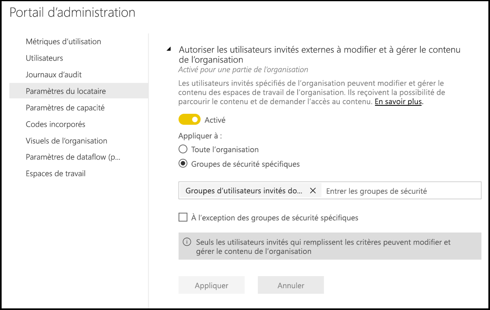
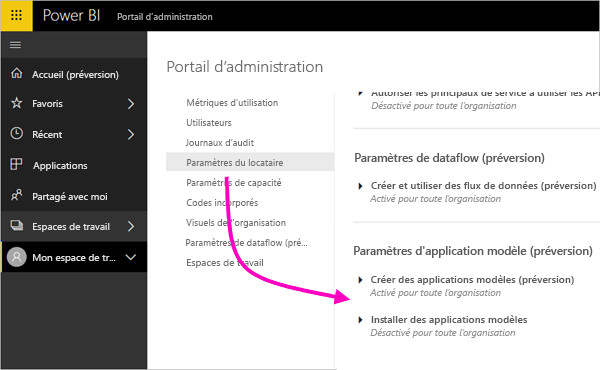
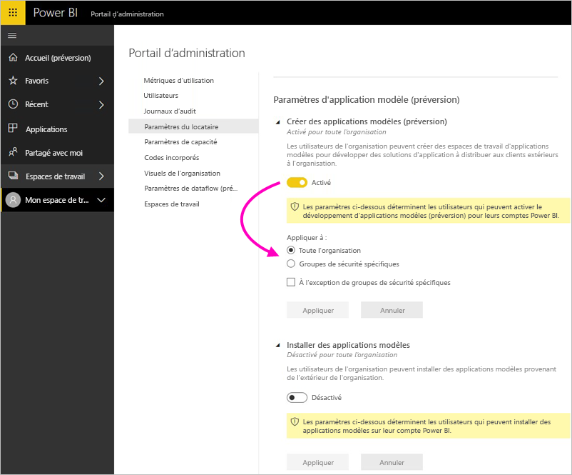
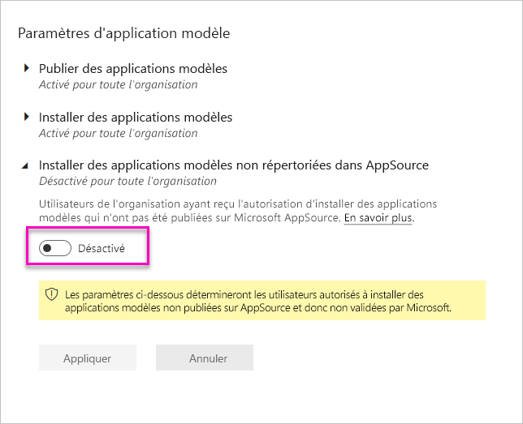

# Administration de Power BI dans le portail d’administration

Le portail d’administration vous permet de gérer un *client* Power BI pour votre organisation. Le portail comprend notamment des métriques d’utilisation, un accès au Centre d’administration Microsoft 365 et des paramètres.

Le portail d’administration est accessible dans son intégralité à tous les utilisateurs qui sont administrateurs généraux dans Office 365 ou qui se sont vus attribuer le rôle d’administrateur de service Power BI. Si vous n’appartenez pas à l’un de ces rôles, seuls les **Paramètres de capacité** s’affichent sur le portail. Pour plus d’informations sur le rôle d’administrateur de Service Power BI, voir [Présentation du rôle d’administrateur Power BI](service-admin-role.md).

## Accès au portail d’administration

Pour obtenir l’accès au portail d’administration Power BI, votre compte doit être un compte d’**Administrateur global** dans Office 365 ou Azure Active Directory, ou doit avoir été assigné au rôle d’Administrateur de Service Power BI. Pour plus d’informations sur le rôle d’administrateur de Service Power BI, voir [Présentation du rôle d’administrateur Power BI](service-admin-role.md). Pour accéder au portail d’administration Power BI, procédez comme suit.

1. Sélectionnez l’icône des paramètres représentant une roue dentée, située en haut à droite de l’écran Power BI.

1. Sélectionnez **Portail d’administration**.

    

Le portail compte neuf onglets. Le reste de cet article fournit des informations sur chacun de ces onglets.

* [Métriques d’utilisation](#usage-metrics)
* [Utilisateurs](#users)
* [Journaux d’audit](#audit-logs)
* [Paramètres du locataire](#tenant-settings)
* [Paramètres de capacité](#capacity-settings)
* [Codes incorporés](#embed-codes)
* [Visuels de l’organisation](#organizational-visuals)
* [Stockage de dataflows (préversion)](#dataflowStorage)
* [Espaces de travail](#workspaces)
* [Marque personnalisée](#custom-branding)

## Métriques d'utilisation

Les **Métriques d’utilisation** vous permettent de superviser l’utilisation de Power BI dans votre organisation. Il permet également de voir les utilisateurs et les groupes de votre organisation qui sont les plus actifs dans Power BI. 

> [!NOTE]
> La première fois que vous accédez au tableau de bord ou si vous y accédez de nouveau après une longue période, un écran de chargement s’affiche probablement pendant le chargement du tableau de bord.

Une fois le tableau de bord chargé, vous voyez deux sections de vignettes. La première section comprend des données d’utilisation pour chacun des utilisateurs ; la deuxième comporte des informations similaires pour les groupes de votre organisation.

Voici le détail de ce que vous pouvez voir dans chacune d’elles :

* Le nombre de tableaux de bord, de rapports et de jeux de données de l’espace de travail utilisateur.
  
    

* Le tableau de bord le plus utilisé par nombre d’utilisateurs autorisés à y accéder. Par exemple, si vous disposez d’un tableau de bord que vous avez partagé avec 3 utilisateurs et que vous l’avez aussi ajouté à un pack de contenu auquel sont connectés deux autres utilisateurs, le nombre d’utilisateurs s’élève à 6 (1 + 3 + 2).
  
    

* Le contenu auquel est connecté le plus grand nombre d’utilisateurs. Il peut s’agir de tout ce que les utilisateurs peuvent obtenir via le processus Obtenir des données, autrement dit, des packs de contenu SaaS, des packs de contenu d’organisation, des fichiers ou des bases de données.
  
    

* Vue des utilisateurs les plus actifs, en fonction du nombre de tableaux de bord qu’ils possèdent, à la fois ceux qu’ils ont créés eux-mêmes et ceux qui ont été partagés avec eux.
  
    

* Vue des utilisateurs les plus actifs, en fonction du nombre de rapports qu’ils possèdent.
  
    

La deuxième section affiche le même type d’informations, mais pour les groupes. Vous pouvez ainsi voir quels sont les groupes les plus actifs dans votre organisation et le type de contenu qu’ils utilisent.

Ces informations vous procurent des insights tangibles sur la façon dont les employés de votre organisation utilisent Power BI et vous permettent d’identifier les utilisateurs et les groupes les plus actifs.

## Contrôler les métriques d’utilisation

Les rapports de métriques d’utilisation sont une fonctionnalité qu’un administrateur Power BI ou Office 365 peut activer ou désactiver. Les administrateurs ont un contrôle granulaire sur l’accès des utilisateurs aux métriques d’utilisation. Ils sont **Activés** par défaut pour tous les utilisateurs de l’organisation.

Les administrateurs peuvent aussi déterminer si les créateurs de contenu peuvent voir les données par utilisateur dans les métriques d’utilisation. 

Pour plus d’informations sur les rapports eux-mêmes, consultez [Superviser les métriques d’utilisation de tableaux de bord et de rapports Power BI](service-usage-metrics.md).

### Métriques d'utilisation pour les créateurs de contenu

1. Dans le portail d’administration, sélectionnez **Paramètres du client** > **Métriques d’utilisation pour les créateurs de contenu**.

    

1. Activez (ou désactivez) les métriques d’utilisation > **Appliquer**.

    

### Données par utilisateur dans les métriques d’utilisation

Par défaut, les données par utilisateur sont activées pour les métriques d’utilisation et les informations des comptes des consommateurs des contenus sont incluses dans le rapport des métriques. Si vous ne souhaitez pas inclure ces informations pour tout ou partie des utilisateurs, désactivez la fonctionnalité pour des groupes de sécurité spécifiés ou pour l’ensemble de l’organisation. Les informations de compte figurent alors dans le rapport sous l’intitulé *Sans nom*.

### Supprimer tous le contenu des métriques d’utilisation existantes

Lors de la désactivation des métriques d’utilisation pour leur organisation toute entière, les administrateurs peuvent également choisir une ou plusieurs options pour :

- **Supprimer tout le contenu des métriques d’utilisation** pour supprimer toutes les vignettes de rapports et de tableaux de bord existantes générées à l’aide de rapports et de jeux de données des métriques d’utilisation. Cette option supprime tout accès aux données de métriques d’utilisation pour tous les utilisateurs au sein de l’organisation qui peuvent déjà les utiliser. 
- **Supprimer toutes les données existantes par utilisateur dans le contenu des métriques d’utilisation actuelles** : Cette option supprime tout accès aux données par utilisateur pour tous les utilisateurs de l’organisation qui les utilisent peut-être déjà. 

Soyez prudent, car la suppression du contenu de métriques existantes d’utilisation et par utilisateur est irréversible.

## Utilisateurs

Les utilisateurs, les groupes et les administrateurs Power BI sont gérés dans le Centre d’administration Microsoft 365. L’onglet **Utilisateurs** contient un lien qui donne accès au Centre d’administration pour votre client.

## Journaux d’audit

Les journaux d’audit Power BI sont gérés dans le Centre de sécurité et de conformité Office 365. L’onglet **Journaux d’audit** contient un lien qui donne accès au Centre de sécurité et de conformité pour votre client. [En savoir plus](service-admin-auditing.md)

Pour utiliser les journaux d’audit, vérifiez que le paramètre [**Créer des journaux d’audit pour l’audit et la conformité des activités internes**](#create-audit-logs-for-internal-activity-auditing-and-compliance) est activé.

## Paramètres du locataire

L’onglet **Paramètres du client** permet un contrôle affiné sur les fonctionnalités mises à la disposition de votre organisation. Si vous avez des inquiétudes à propos de vos données sensibles, il se peut que certaines de nos fonctionnalités ne soient pas adaptées à votre organisation. Vous pouvez aussi choisir de mettre à disposition une fonctionnalité déterminée à un groupe précis.

L’image suivante présente plusieurs paramètres de l’onglet **Paramètres du client**.

> [!NOTE]
> Jusqu’à 10 minutes peuvent être nécessaires à la prise en compte de la modification d’un paramètre pour tous les utilisateurs de votre client.

Les paramètres peuvent avoir trois états :

* **Désactivé pour toute l’organisation** : Personne dans votre organisation ne peut utiliser cette fonctionnalité.

    

* **Activé pour toute l’organisation** : Tout le monde dans votre organisation peut utiliser cette fonctionnalité.

    

* **Activé pour une partie de l’organisation** : Un sous-ensemble spécifique d’utilisateurs ou de groupes de votre organisation peut utiliser la fonctionnalité en question.

    Vous pouvez activer la fonctionnalité pour toute votre organisation à l’exception d’un groupe spécifique d’utilisateurs.

    

    Vous pouvez aussi activer la fonctionnalité uniquement pour un groupe d’utilisateurs spécifique, mais aussi la désactiver pour un autre groupe d’utilisateurs. Cette approche permet de faire en sorte que certains utilisateurs n’ont pas accès à la fonctionnalité, même s’ils se trouvent dans le groupe autorisé.

    

Les sections suivantes fournissent une vue d’ensemble des différents types de paramètres de locataire.

## Paramètres d’aide et de support

### Publier des informations « Obtenir de l’aide »

Les utilisateurs dans l’organisation peuvent accéder à l’aide interne et aux ressources de support dans le menu d’aide de Power BI. Plus précisément, ces paramètres changent le comportement des éléments du menu Apprendre, Communauté et Obtenir de l’aide.

Il est également possible de spécifier une URL pour diriger les utilisateurs vers une solution personnalisée dédiée aux demandes de licences. Ce paramètre personnalise l’URL cible du bouton Mettre à niveau le compte qu’un utilisateur sans licence Power BI Pro peut trouver dans la boîte de dialogue de mise à jour vers Power BI Pro ainsi que dans la page Gérer le stockage personnel.

### Recevoir des notifications par e-mail pour les pannes ou incidents du service

Les groupes de sécurité à extension messagerie reçoivent des notifications par e-mail si ce locataire est affecté par une panne ou un incident du service. En savoir plus sur les [notifications d’interruption de service](service-interruption-notifications.md).

## Paramètres de l’espace de travail

### Créer des espaces de travail

Les administrateurs utilisent le paramètre **Créer des espaces de travail** pour indiquer aux utilisateurs de l’organisation qu’ils peuvent créer des espaces de travail d’application afin de collaborer sur des tableaux de bord, des rapports et autre contenu. En savoir [plus sur les espaces de travail d’application](service-create-the-new-workspaces.md).

Le portail d’administration comporte une autre section de paramètres sur les espaces de travail dans votre locataire. Dans cette section, vous pouvez trier et filtrer la liste des espaces de travail et afficher les détails de chaque espace de travail. Consultez [Espaces de travail](#workspaces) pour plus d’informations.

Dans le portail d’administration, vous contrôlez également les utilisateurs qui disposent des autorisations nécessaires pour distribuer des applications à l’organisation. Consultez la section [Publier des packs de contenu et des applications pour toute l’organisation](#publish-content-packs-and-apps-to-the-entire-organization) de cet article pour plus de détails.

## Paramètres d'exportation et de partage

### Partager le contenu avec des utilisateurs externes

Les utilisateurs de l’organisation peuvent partager des tableaux de bord avec des utilisateurs externes à l’organisation. Découvrez plus en détail le [partage externe](service-share-dashboards.md#share-a-dashboard-or-report-outside-your-organization).

L’image suivante présente le message qui s’affiche quand vous faites un partage avec un utilisateur externe.

  

### Publier sur le web

Les utilisateurs de l’organisation peuvent publier des rapports sur le web. [En savoir plus](service-publish-to-web.md)

L’image suivante présente le menu **Fichier** qui s’affiche pour un rapport quand le paramètre **Publier sur le web** est activé.

Les options présentées aux utilisateurs dans l’interface utilisateur varient en fonction de la nature du paramètre **Publier sur le web**.

|Caractéristique |Activée pour toute l’organisation |Désactivée pour toute l’organisation |Groupes de sécurité spécifiques   |
|---------|---------|---------|---------|
|**Publier sur le web** sous le menu **Fichier** du rapport.|Activée pour tous|Non visible pour tous|Visible uniquement par les utilisateurs ou groupes autorisés.|
|**Gérer les codes d’incorporation** sous **Paramètres**|Activée pour tous|Activée pour tous|Activée pour tous  Option * **Supprimer** uniquement pour les utilisateurs ou groupes autorisés. * **Obtenir les codes** activé pour tous.|
|**Codes d’incorporation** au sein du portail d’administration|L’état reflète l’une des options suivantes : * Actif * Non pris en charge * Bloqué|L’état affiche **Désactivé**|L’état reflète l’une des options suivantes : * Actif * Non pris en charge * Bloqué  Si un utilisateur n’est pas autorisé en fonction du paramètre de locataire, l’état affiche **violation**.|
|Rapports publiés existants|Tout activé|Tout désactivé|Les rapports continuent à être restitués pour tous.|

### Exporter des données

Les utilisateurs de l’organisation peuvent exporter des données depuis une vignette ou une visualisation. [En savoir plus](visuals/power-bi-visualization-export-data.md)

L’image suivante présente l’option d’exportation de données à partir d’une vignette.

> [!NOTE]
> La désactivation du paramètre **Exporter des données** empêche également les utilisateurs d’utiliser la fonctionnalité **Analyser dans Excel** ainsi que la connexion active du service Power BI.

### Exporter les rapports comme présentations PowerPoint ou documents PDF

Les utilisateurs de l’organisation peuvent exporter des rapports Power BI sous forme de fichiers PowerPoint ou de documents PDF. [En savoir plus](consumer/end-user-powerpoint.md)

L’image suivante présente le menu **Fichier** qui s’affiche pour un rapport quand le paramètre **Exporter les rapports comme présentations PowerPoint ou documents PDF** est activé.

### Imprimer des tableaux de bord et des rapports

Les utilisateurs de l’organisation peuvent imprimer des tableaux de bord et des rapports. [En savoir plus](consumer/end-user-print.md)

L’image suivante présente l’option d’impression d’un tableau de bord.

L’image suivante présente le menu **Fichier** qui s’affiche pour un rapport quand le paramètre **Imprimer des tableaux de bord et des rapports** est activé.

### Autoriser les utilisateurs invités externes à modifier et à gérer le contenu de l’organisation
Les utilisateurs invités Azure B2B peuvent modifier et gérer le contenu de l’organisation. [En savoir plus](service-admin-azure-ad-b2b.md)

L’image suivante présente l’option permettant d’autoriser les utilisateurs invités externes à modifier et à gérer le contenu de l’organisation.

### Abonnements par courrier
Les utilisateurs de l'organisation peuvent créer des abonnements par courrier. En savoir plus sur les [abonnements](service-report-subscribe.md).

## Paramètres des applications et des packs de contenu

### Publier des packs de contenu et des applications pour toute l’organisation

Les administrateurs utilisent ce paramètre pour décider si les utilisateurs peuvent publier des packs de contenu et des applications pour toute l’organisation, plutôt que pour des groupes spécifiques uniquement. En savoir plus sur la [publication d’applications](service-create-distribute-apps.md).

L’image suivante montre l’option **Toute mon organisation** lors de la création d’un pack de contenu.

### Créer des modèles d’applications et des packs de contenu d’organisation

Les utilisateurs peuvent créer des modèles d’applications et des packs de contenu d’organisation qui utilisent des jeux de données basés sur une même source de données dans Power BI Desktop. En savoir plus sur les [applications modèles](template-content-pack-authoring.md).

### Effectuer une transmission de type push des applications pour les utilisateurs finaux

Les auteurs de rapports peuvent partager directement des applications avec les utilisateurs finaux sans installation à partir d’[AppSource](https://appsource.microsoft.com). En savoir plus sur l’[installation automatique d’applications pour les utilisateurs finaux](service-create-distribute-apps.md#automatically-install-apps-for-end-users).

## Paramètres d’intégration

### Poser des questions sur les données à l’aide de Cortana

Les utilisateurs de l’organisation peuvent poser des questions sur leurs données en utilisant Cortana. [En savoir plus](service-cortana-enable.md)

> [!NOTE]
> Ce paramètre s’applique à toute l’organisation et ne peut pas être limité à des groupes en particulier.

### Utiliser Analyser dans Excel avec des jeux de données locaux

Les utilisateurs de l’organisation peuvent utiliser Excel pour afficher et interagir avec des jeux de données Power BI locaux. [En savoir plus](service-analyze-in-excel.md)

> [!NOTE]
> La désactivation du paramètre **Exporter des données** empêche également les utilisateurs d’utiliser la fonctionnalité **Analyser dans Excel**.

### Utiliser ArcGIS Maps for Power BI

Les utilisateurs de l’organisation peuvent utiliser la visualisation ArcGIS Maps for Power BI fournie par Esri. [En savoir plus](visuals/power-bi-visualization-arcgis.md)

### Utiliser la recherche générale pour Power BI (préversion)

Les utilisateurs de l’organisation peuvent utiliser les fonctionnalités de recherche externe qui reposent sur le service Recherche Azure. Par exemple, les utilisateurs peuvent se servir de Cortana pour extraire des informations clés directement des tableaux de bord et des rapports Power BI. [En savoir plus](service-cortana-intro.md)

## Paramètres des visuels personnalisés

### Ajouter et utiliser des visuels personnalisés

Les utilisateurs de l’organisation peuvent manipuler et partager des visuels personnalisés. [En savoir plus](power-bi-custom-visuals.md)

> [!NOTE]
> Ce paramètre peut s’appliquer à toute l’organisation ou se limiter à des groupes particuliers.

Power BI Desktop (à compter de la version de mars 2019) prend en charge l’utilisation d’une **stratégie de groupe** pour désactiver l’utilisation de visuels personnalisés dans les ordinateurs déployés d’une organisation.

<table>
<tr><th>Attribut</th><th>Valeur</th>
</tr>
<td>key</td>
    <td>Software\Policies\Microsoft\Power BI Desktop\</td>
<tr>
<td>valueName</td>
<td>EnableCustomVisuals</td>
</tr>
</table>

La valeur 1 (décimale) active l’utilisation de visuels personnalisés dans Power BI (il s’agit de la valeur par défaut).

La valeur 0 (décimale) désactive l’utilisation de visuels personnalisés dans Power BI.

### Autoriser uniquement les visuels certifiés

Les utilisateurs de l’organisation qui disposent d’autorisations pour ajouter et utiliser des visuels personnalisés, définis par le paramètre « Ajouter et utiliser des visuels personnalisés », peuvent uniquement utiliser des [visuels personnalisés certifiés](https://go.microsoft.com/fwlink/?linkid=2002010) (les visuels non certifiés sont bloqués et affichent un message d’erreur lorsqu’ils sont utilisés). 

Power BI Desktop (à compter de la version de mars 2019) prend en charge l’utilisation d’une **stratégie de groupe** pour désactiver l’utilisation de visuels personnalisés non certifiés dans les ordinateurs déployés d’une organisation.

<table>
<tr><th>Attribut</th><th>Valeur</th>
</tr>
<td>key</td>
    <td>Software\Policies\Microsoft\Power BI Desktop\</td>
<tr>
<td>valueName</td>
<td>EnableUncertifiedVisuals</td>
</tr>
</table>

La valeur 1 (décimale) active l’utilisation de visuels personnalisés non certifiés dans Power BI (il s’agit de la valeur par défaut).

La valeur 0 (décimale) désactive l’utilisation de visuels personnalisés non certifiés dans Power BI (cette option active uniquement l’utilisation de [visuels personnalisés certifiés](https://go.microsoft.com/fwlink/?linkid=2002010)).

## Paramètres des visuels R

### Utiliser et partager des éléments visuels R

Les utilisateurs de l’organisation peuvent manipuler et partager des visuels créés avec des scripts R. [En savoir plus](visuals/service-r-visuals.md)

> [!NOTE]
> Ce paramètre s’applique à toute l’organisation et ne peut pas être limité à des groupes en particulier.

## Paramètres d'audit et d'utilisation

### Créer des journaux d'audit pour l'audit des activités internes et la vérification de la conformité

Les utilisateurs de l’organisation peuvent utiliser l’audit pour surveiller les actions effectuées dans Power BI par d’autres utilisateurs de l’organisation. [En savoir plus](service-admin-auditing.md)

Ce paramètre doit être activé pour pouvoir enregistrer les entrées du journal d’audit. Une fois que vous avez activé l’audit, le délai avant de pouvoir voir les données d’audit peut aller jusqu’à 48 heures. Si vous ne voyez immédiatement les données, consultez les journaux d’audit plus tard. Le délai est sensiblement le même entre le moment où vous obtenez l’autorisation de voir les journaux d’audit et le moment où vous pouvez réellement y accéder.

> [!NOTE]
> Ce paramètre s’applique à toute l’organisation et ne peut pas être limité à des groupes en particulier.

### Métriques d'utilisation pour les créateurs de contenu

Les utilisateurs de l’organisation peuvent voir les métriques d’utilisation des tableaux de bord et des rapports qu’ils créent. [En savoir plus](service-usage-metrics.md)

### Données par utilisateur dans les métriques d'utilisation pour les créateurs de contenu

Les métriques d'utilisation pour créateurs de contenu exposent les noms d'affichage et les adresses e-mail des utilisateurs qui accèdent à du contenu. [En savoir plus](service-usage-metrics.md)

Par défaut, les données par utilisateur sont activées pour les métriques d’utilisation et les informations des comptes de créateur de contenu sont incluses dans le rapport des métriques. Si vous ne souhaitez pas recueillir ces informations pour tous les utilisateurs, vous pouvez désactiver la fonctionnalité pour des groupes de sécurité spécifiés ou pour l’ensemble de l’organisation. Les informations de compte des utilisateurs exclus figurent alors dans le rapport sous l’intitulé *Sans nom*.

## Paramètres du tableau de bord

### Classification des données des tableaux de bord

Les utilisateurs de l’organisation peuvent étiqueter les tableaux de bord avec des classifications indiquant les niveaux de sécurité des tableaux de bord. [En savoir plus](service-data-classification.md)

> [!NOTE]
> Ce paramètre s’applique à toute l’organisation et ne peut pas être limité à des groupes en particulier.

## Paramètres de développement

### Incorporer du contenu dans les applications

Les utilisateurs de l’organisation peuvent incorporer des tableaux de bord et des rapports Power BI dans des applications Saas (Software as a Service). La désactivation de ce paramètre empêche les utilisateurs d’utiliser les API REST pour incorporer du contenu Power BI dans leur application. [En savoir plus](developer/embedding.md)

### Autoriser les principaux de service à utiliser les API Power BI

Les applications web inscrites dans Azure Active Directory (Azure AD) utiliseront un principal de service affecté pour accéder aux API Power BI sans utilisateur connecté. Pour pouvoir autoriser une application à utiliser l’authentification du principal de service, il faut que ce dernier fasse partie d’un groupe de sécurité autorisé. [En savoir plus](developer/embed-service-principal.md)

> [!NOTE]
> Les principaux de service héritent des autorisations de leur groupe de sécurité pour tous les paramètres du locataire Power BI. Pour limiter les autorisations, créez un groupe de sécurité dédié pour les principaux de service et ajoutez-le à la liste « À l’exception des groupes de sécurité spécifiques » pour les paramètres Power BI pertinents activés.

## Paramètres de dataflow

### Créer et utiliser des dataflows

Les utilisateurs de l'organisation peuvent créer et utiliser des dataflows. Pour une vue d’ensemble des dataflows, consultez [Préparation des données en libre-service dans Power BI](service-dataflows-overview.md). Pour activer les dataflows dans une capacité Premium, consultez [Configurer des charges de travail](service-admin-premium-workloads.md).

> [!NOTE]
> Ce paramètre s’applique à toute l’organisation et ne peut pas être limité à des groupes en particulier.

## Paramètres des applications modèles

Trois paramètres contrôlent la capacité des applications modèles à publier ou installer des applications modèles.

### Publier des applications modèles

Les utilisateurs de l'organisation peuvent créer des espaces de travail d’applications modèles. Choisissez quels utilisateurs peuvent publier des applications modèles ou les distribuer à des clients extérieurs à votre organisation via [AppSource](https://appsource.microsoft.com) ou d’autres méthodes de distribution.

### Installer des applications modèles répertoriées sur AppSource

Les utilisateurs de l’organisation peuvent télécharger et installer des applications modèles **uniquement** depuis [AppSource](https://appsource.microsoft.com). Choisissez quels utilisateurs spécifiques ou groupes de sécurité peuvent installer des applications modèles depuis AppSource.

### Installer des applications modèles non répertoriées sur AppSource

Choisissez quels utilisateurs dans l’organisation peuvent télécharger et installer des applications modèles **non répertoriées sur [AppSource](https://appsource.microsoft.com)** .

## Paramètres de capacité

### Power BI Premium

L’onglet **Power BI Premium** vous permet de gérer les capacités Power BI Premium (EM ou SKU P) achetées pour votre organisation. Tous les utilisateurs dans votre organisation peuvent voir l’onglet **Power BI Premium**, mais ne peuvent en voir le contenu que s’ils disposent d’autorisations *d’administrateur de capacité* ou d’autorisations d’affectation. Si un utilisateur ne possède aucune autorisation, le message suivant apparaît.

### Power BI Embedded

L’onglet **Power BI Embedded** vous permet d’afficher les capacités de Power BI Embedded (référence SKU A) que vous avez achetées pour votre client. Dans la mesure où vous ne pouvez acheter des références SKU A qu’à partir d’Azure, vous [gérez les capacités incorporées dans Azure](developer/azure-pbie-create-capacity.md) depuis **le portail Azure**.

Pour plus d’informations sur la gestion des paramètres de Power BI Embedded (référence SKU A), consultez [Qu’est-ce que Power BI Embedded](developer/azure-pbie-what-is-power-bi-embedded.md).

## Codes incorporés

En tant qu’administrateur, vous pouvez afficher les codes incorporés qui sont générés pour votre locataire. Vous pouvez également révoquer ou supprimer des codes. [En savoir plus](service-publish-to-web.md)

 ## <a name="organizational-visuals">Visuels de l’organisation</a> 

L’onglet **Visuels de l’organisation** vous permet de déployer et de gérer des visuels personnalisés au sein de votre organisation. Avec les visuels d’organisation, vous pouvez facilement déployer des visuels propriétaires dans votre organisation, que les auteurs de rapports peuvent ensuite détecter et importer dans leurs rapports à partir de Power BI Desktop. [En savoir plus](power-bi-custom-visuals-organization.md)

> [!WARNING]
> Un visuel personnalisé est susceptible de contenir du code présentant des risques pour la sécurité ou la confidentialité ; vérifiez que vous faites confiance à son auteur et à sa source avant de le déployer dans le référentiel de l’organisation.

L’image suivante affiche tous les visuels personnalisés actuellement déployés dans le référentiel d’une organisation.

### Ajouter un visuel personnalisé

Pour ajouter un nouveau visuel personnalisé à la liste, procédez comme suit. 

1. Dans le volet droit, sélectionnez **Ajouter un visuel personnalisé**.

    

1. Renseignez le formulaire **Ajouter un visuel personnalisé** :

    * **Choisir un fichier .pbiviz** (obligatoire) : sélectionnez un fichier visuel personnalisé à charger. Seuls les visuels personnalisés d’API avec version sont pris en charge (lisez ici ce que cela signifie).

    Avant de charger un visuel personnalisé, examinez-le afin de déterminer s’il présente un risque en matière de sécurité et de confidentialité et s’il répond aux standards de votre organisation.

    * **Nommer vos visuels personnalisés** (obligatoire) : donnez un titre court au visuel pour que les utilisateurs de Power BI Desktop comprennent facilement ce qu’il fait

    * **Icône** : Il s’agit du fichier d’icône qui s’affiche dans l’interface utilisateur de Power BI Desktop.

    * **Description** : rédigez une brève description du visuel pour donner plus de contexte et d’informations à l’utilisateur

1. Sélectionnez **Ajouter** pour lancer la requête de chargement. Si elle aboutit, le nouvel élément s’affiche dans la liste. En cas d’échec, vous recevez le message d’erreur correspondant.

### Supprimer un visuel personnalisé de la liste

Sélectionnez l’icône de la corbeille pour supprimer définitivement le visuel du référentiel.

> [!IMPORTANT]
> La suppression est irréversible. Le rendu du visuel supprimé disparaît immédiatement des rapports existants. Même si vous chargez le même visuel à nouveau, il ne remplace celui qui a été supprimé. Toutefois, les utilisateurs peuvent réimporter le nouveau visuel et remplacer l’instance présente dans leurs rapports.

### Désactiver un visuel personnalisé dans la liste

Pour désactiver le visuel à partir du magasin de l’organisation, sélectionnez l’icône d’engrenage. Dans la section **Accès**, désactivez le visuel personnalisé.

Après la désactivation du visuel, son rendu ne s’affiche plus dans les rapports existants et le message d’erreur suivant s’affiche.

*Ce visuel personnalisé n’est plus disponible. Pour plus d’informations, contactez votre administrateur.*

Toutefois, les visuels marqués d’un signet continuent à fonctionner.

Après une mise à jour ou un changement d’administrateur, les utilisateurs de Power BI Desktop doivent redémarrer l’application ou actualiser le navigateur dans le service Power BI pour voir les mises à jour.

### Mettre à jour un visuel

Pour mettre à jour le visuel à partir du magasin de l’organisation, sélectionnez l’icône d’engrenage. Parcourez et chargez une nouvelle version du visuel.

Assurez-vous que l’ID du visuel reste inchangé. Le nouveau fichier remplace le fichier précédent pour tous les rapports au sein de l’organisation. Toutefois, si la nouvelle version du visuel est susceptible de rompre l’utilisation ou la structure de données de la version précédente du visuel, alors ne remplacez pas la version précédente. Au lieu de cela, vous devez créer une nouvelle liste pour la nouvelle version du visuel. Par exemple, ajoutez un nouveau numéro de version (version X.X) au titre du nouveau visuel répertorié. Ainsi, il est clair qu’il s’agit du même visuel, avec un numéro de version mis à jour, ce qui permet de ne pas rompre les fonctionnalités des rapports existants. Encore une fois, assurez-vous que l’ID du visuel reste inchangé. Puis, la prochaine fois que les utilisateurs entrent dans le référentiel de l’organisation à partir de Power BI Desktop, ils peuvent importer la nouvelle version et sont alors invités à remplacer la version déjà présente dans leur rapport.

Pour plus d’informations, consultez [Questions fréquentes sur les visuels personnalisés d’une organisation](https://docs.microsoft.com/power-bi/power-bi-custom-visuals-faq#organizational-custom-visuals)

## <a name="dataflowStorage">Stockage de dataflows (préversion)</a>

Par défaut, les données utilisées avec Power BI sont stockées dans le stockage interne offert par Power BI. Avec l’intégration entre les flux de données et Azure Data Lake Storage Gen2 (ADLS Gen2), vous pouvez stocker vos flux de données dans le compte Azure Data Lake Storage Gen2 de votre organisation. Pour plus d’informations, consultez [Flux de données et intégration à Azure Data Lake (préversion)](service-dataflows-azure-data-lake-integration.md).

## Espaces de travail

En tant qu’administrateur, vous pouvez afficher les espaces de travail qui existent dans votre locataire. Vous pouvez trier et filtrer la liste des espaces de travail et afficher les détails de chaque espace de travail. Les colonnes de la table correspondent aux propriétés retournées par l’[API REST administrateur Power BI](/rest/api/power-bi/admin) pour les espaces de travail. Les espaces de travail personnels sont de type **PersonalGroup**, les espaces de travail classiques sont de type **Group**, et les nouveaux espaces de travail modernes sont de type **Workspace**. Pour plus d’informations, consultez [Créer les nouveaux espaces de travail dans Power BI](service-create-the-new-workspaces.md).

## Marque personnalisée

En tant qu’administrateur, vous pouvez personnaliser l’apparence de Power BI pour l’ensemble de votre organisation. Actuellement, il existe trois options principales :

* **Télécharger le logo** : Pour de meilleurs résultats, téléchargez un logo enregistré au format .png de 10 ko ou moins et d’au moins 200 x 30 pixels.

* **Télécharger l’image de couverture** : Pour de meilleurs résultats, téléchargez une image de couverture enregistrée au format .jpg ou .png de 1 Mo ou moins, et d’au moins 1920 x 160 pixels.

* **Sélectionner la couleur du thème** : Vous pouvez sélectionner votre thème en fonction d’une valeur hexadécimale # RVB ou de la palette fournie.

Pour plus d’informations, consultez [Marque personnalisée pour votre organisation](http://aka.ms/orgBranding).

## Étapes suivantes

[Administration de Power BI dans votre organisation](service-admin-administering-power-bi-in-your-organization.md)  
[Présentation du rôle d’administrateur Power BI](service-admin-role.md)  
[Audit de Power BI dans votre organisation](service-admin-auditing.md)  

D’autres questions ? [Essayez d’interroger la communauté Power BI](https://community.powerbi.com/)
