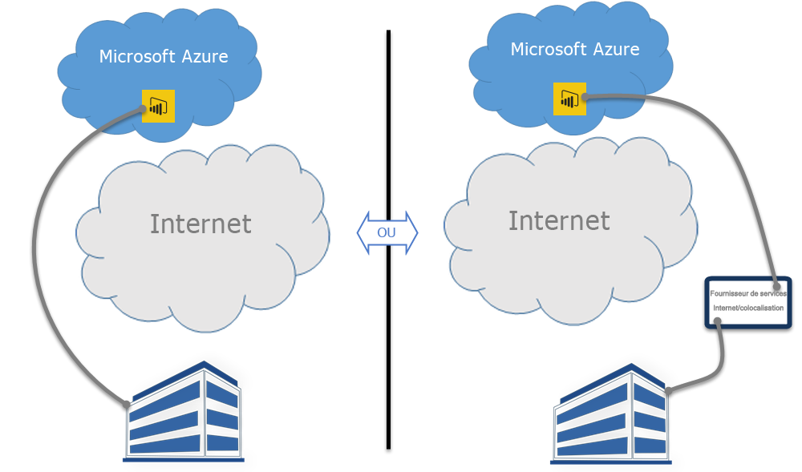

# Power BI et ExpressRoute
Avec **Power BI** et **ExpressRoute**, vous pouvez créer une connexion réseau privée de votre organisation à Power BI (ou en utilisant un centre de données d’un fournisseur de services Internet), et contourner ainsi Internet pour mieux sécuriser vos données et connexions Power BI sensibles.

**ExpressRoute** est un service Azure qui vous permet de créer des connexions privées entre des centres de données Azure (où réside Power BI) et votre infrastructure locale, ou de créer des connexions privées entre des centres de données Azure et votre centre de données.

Découvrez [plus d’informations sur ExpressRoute](https://azure.microsoft.com/services/expressroute/) ou consultez la [procédure d’inscription](https://azure.microsoft.com/pricing/details/expressroute/).

> [!NOTE]
> Power BI est pris en charge en mode d’homologation publique, comme décrit dans [ce forum aux questions](https://docs.microsoft.com/azure/expressroute/expressroute-faqs).
> 
> 

## Exceptions ExpressRoute pour Power BI
Power BI est conforme à ExpressRoute, à quelques exceptions près, où Power BI obtient ou envoie des données sur l’Internet public. Ces exceptions particulières incluent souvent des données statiques, comme des fichiers de configuration de navigateur qui sont téléchargés à partir du nœud de **réseau de distribution de contenu (CDN)** le plus proche. Il existe des exceptions générales qui s’appliquent à l’ensemble de Power BI, et des exceptions propres à un service ou une fonctionnalité. Ces deux types sont décrits dans les sections suivantes.

### Exceptions générales pour Power BI et ExpressRoute
Une exception pour **Power BI** et **ExpressRoute** signifie que les données transmises à ou depuis Power BI passent par l’Internet public, au lieu d’être transmises par le lien ExpressRoute privé.

Les deux exceptions générales de Power BI avec ExpressRoute sont :

* les fichiers statiques téléchargés à partir du **réseau de distribution de contenu (CDN)** et de sites web
* les données de **télémétrie** envoyées par l’Internet public

Power BI utilise plusieurs **réseaux de distribution de contenu (CDN)** ou sites web pour distribuer efficacement les fichiers et le contenu statiques nécessaires aux utilisateurs en fonction des paramètres régionaux par le biais de l’Internet public. Ces fichiers statiques contiennent des téléchargements de produits (tels que **Power BI Desktop**, la **passerelle de données locale** ou les **packs de contenu Power BI** de différents fournisseurs de services indépendants), des fichiers de configuration de navigateur servant à établir les connexions ultérieures avec Power BI, ainsi que la page initiale de connexion sécurisée à Power BI (les informations d’identification sont quant à elles envoyées uniquement par ExpressRoute).   

Certaines **données de télémétrie** sont également envoyées par l’Internet public et par ExpressRoute. Les données de télémétrie contiennent les statistiques d’utilisation et d’autres données similaires, qui sont transmises aux services utilisés pour surveiller l’utilisation et l’activité.

### Application SaaS Power BI et ExpressRoute
Lorsqu’un utilisateur établit une connexion au service Power BI (powerbi.com ou via Cortana), la page d’accueil Power BI, la page de connexion et les fichiers statiques qui préparent le navigateur à la connexion et à l’interaction avec Power BI sont récupérés depuis un réseau de distribution de contenu (CDN) ou des sites web, qui se connectent sur l’Internet public.

Une fois la connexion établie, les interactions de données Power BI se font par ExpressRoute, à l’exception de certains services et fonctionnalités qui dépendent des données de l’Internet public :

* Les **éléments visuels de carte** nécessitent la connexion et la transmission de données au service Bing Virtual Earth ou au service de géocodage Bing, qui sont établies sur l’Internet public.
* L’intégration de Power BI à **Cortana** nécessite l’accès à Bing sur l’Internet public.
* Lorsque des **liens personnalisés** sont ajoutés par un utilisateur, par exemple un widget d’image ou une vidéo, Power BI sollicite des données basées sur le lien fourni par l’utilisateur, qui peut utiliser ExpressRoute ou pas.
* Les utilisateurs peuvent envoyer des **commentaires sur Power BI** sous forme de texte (et éventuellement d’images) à l’aide de l’outil de commentaires User Voice, qui utilise l’Internet public pour la transmission.
* Le **fournisseur de contenu Bing Actualités** télécharge du contenu de Bing à l’aide de l’Internet public.
* Lorsqu’ils se connectent à des **applications** (par exemple, des packs de contenu), les utilisateurs sont souvent invités à entrer des informations d’identification et des paramètres à l’aide des pages fournies par le fournisseur SaaS. Ces pages peuvent utiliser ExpressRoute ou pas.

| Activité de l’utilisateur | Destination |
| --- | --- |
| Page d’accueil (avant connexion) |`maxcdn.bootstrapcdn.com ; ajax.aspnetcdn.com ; netdna.bootstrapcdn.com ; cdn.optimizely.com; google-analytics.com ` |
| Connexion |`*.mktoresp.com ; *.aadcdn.microsoftonline-p.com ; *.msecnd.com ; *.localytics.com ; ajax.aspnetcdn.com` |
| Tableau de bord, rapport, gestion du jeu de données (y compris cartes et géocodage) |`*.localytics.com ; *.virtualearth.net ; platform.bing.com; powerbi.microsoft.com; c.microsoft.com; app.powerbi.com; *.powerbi.com; dc.services.visualstudio.com ` |
| Support technique |`support.powerbi.com ; powerbi.uservoice.com ; go.microsoft.com ` |

### Power BI Desktop et ExpressRoute
Power BI Desktop est également conforme à ExpressRoute, à quelques exceptions près, décrites dans la liste suivante :

* Les **notifications de mise à jour**, qui permettent de détecter si les utilisateurs disposent de la version la plus récente de Power BI Desktop, passent par l’Internet public.
* Certaines **données de télémétrie** sont envoyées par l’Internet public
* Les **éléments visuels de carte** nécessitent la connexion et la transmission de données au service **Bing Virtual Earth** ou au service de **géocodage Bing**, qui sont établies sur l’Internet public.
* L’**obtention de données** de plusieurs sources de données telles que le **web** ou les fournisseurs SaaS tiers passe par l’Internet public.

### PaaS Power BI et ExpressRoute
Power BI propose des API et d’autres fonctionnalités basées sur une plateforme qui permettent aux développeurs de créer des solutions et applications Power BI personnalisées. Les services suivants, en plus des données de télémétrie et de réseau de distribution de contenu évoquées plus haut, sont utilisés lors de la transmission de données de PaaS Power BI sur l’Internet public :

| Activité PaaS | Autres destinations utilisées |
| --- | --- |
| Incorporation publique (télémétrie) |`c1.microsoft.com` |
| Éléments visuels personnalisés (CDN) |`*.azureedge.net` |

Certains **éléments visuels personnalisés** sont créés par des tiers, d’autres par Microsoft. Ils peuvent utiliser ExpressRoute ou pas.

### Power BI Mobile et ExpressRoute
Ce document ne traite pas de l’utilisation des applications mobiles Power BI.  

### Passerelle de données locale et ExpressRoute
Lorsqu’une **passerelle de données locale** est utilisée avec Power BI, les transmissions sont conformes à ExpressRoute, à l’exception des activités de l’utilisateur décrites dans la section **Application SaaS Power BI et ExpressRoute** située plus haut dans cette rubrique.  

