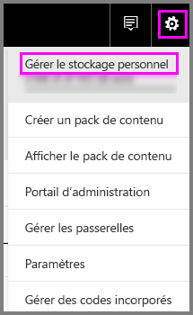
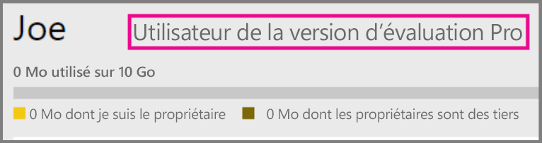
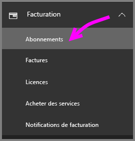
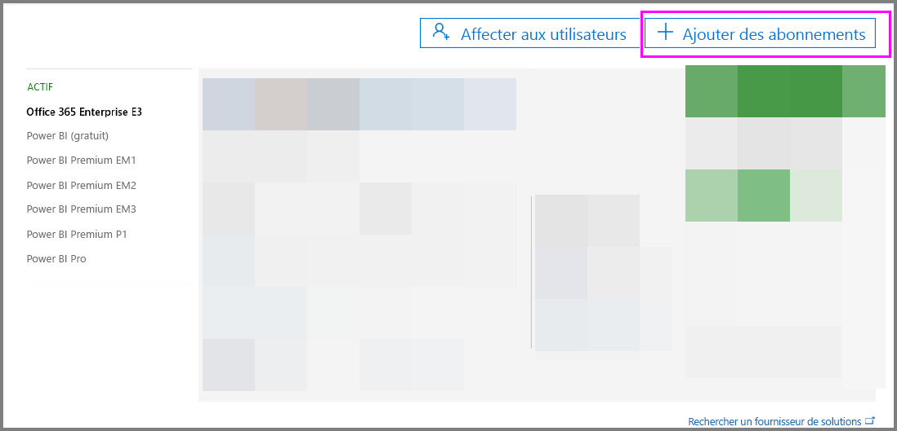
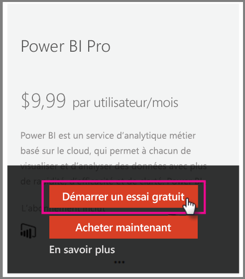

# Power BI Pro dans votre organisation

Power BI Pro est une licence payante qui donne accès à plus de fonctionnalités. Les licences Power BI Pro sont destinées à une équipe qui veut partager et collaborer avec d’autres utilisateurs pour prendre des décisions sur la base des données.  Chaque membre de l’équipe créant ou consultant du contenu Power BI partagé a besoin d’une licence Pro, sauf si le contenu est associé à une fonctionnalité dédiée utilisant Power BI Premium.

Ces fonctionnalités nécessitent une licence Power BI Pro :

* **Analyser des données dans Excel ou Power BI Desktop** : utilisez Excel ou Power BI Desktop pour afficher et interagir avec un jeu de données publié dans Power BI. Pour plus d’informations, consultez [Analyser dans Excel](service-analyze-in-excel.md).

* **Partager des tableaux de bord et collaborer avec des espaces de travail** : les espaces de travail Power BI facilitent la collaboration avec des collègues sur des tableaux de bord, des rapports et des jeux de données. Pour plus d’informations, consultez [Collaborer dans l’espace de travail de votre application Power BI](service-collaborate-power-bi-workspace.md).

* **Afficher du contenu partagé** : les utilisateurs Pro peuvent afficher des tableaux de bord et des rapports qui sont partagés avec eux, interagir avec des tableaux de bord et des rapports qui sont partagés avec eux, et repartager les tableaux de bord et les rapports qui sont partagés avec eux (s’ils y sont autorisés). Un utilisateur Pro ne peut cependant pas modifier ces tableaux de bord et ces rapports. Pour plus d’informations, consultez [Partager des rapports et des tableaux de bord Power BI avec des collègues et d’autres utilisateurs](service-share-dashboards.md).

* **Intégrer du contenu à Microsoft Teams** : vous pouvez ajouter un onglet Power BI dans un canal Microsoft (MS) Teams. MS Teams détecte automatiquement tous les rapports de l’espace de travail. Pour plus d’informations, consultez [Power BI teams up with Microsoft Teams](https://powerbi.microsoft.com/en-us/blog/power-bi-teams-up-with-microsoft-teams/). 

## Essai gratuit de 60 jours de Power BI Pro pour les particuliers

Une fois votre compte gratuit créé, vous avez la possibilité d’essayer gratuitement la version Pro pendant 60 jours. Vous aurez accès à toutes les fonctionnalités de la version Pro pendant toute la durée de la version d’évaluation. Power BI Pro dispose de toutes les fonctionnalités de la version gratuite de Power BI, ainsi que de fonctionnalités de partage et de collaboration supplémentaires. Pour plus d’informations, consultez [Tarification de Power BI](https://powerbi.microsoft.com/en-us/pricing/). Pour essayer une version d’évaluation gratuite de 60 jours de Power BI Pro, connectez-vous à Power BI et essayez une de ces fonctionnalités Power BI Pro.

* [Créer un espace de travail](service-create-distribute-apps.md)
* [Partager un tableau de bord](service-share-dashboards.md)

Lorsque vous essayez l’une de ces fonctionnalités, vous êtes invité à démarrer votre version d’évaluation gratuite. Vous pouvez sélectionner manuellement cette option en cliquant sur l’icône d’engrenage et en sélectionnant Gérer le stockage personnel. Sélectionnez ensuite Essayez gratuitement la version Pro sur la droite.

   
    
   

Vous pouvez ensuite sélectionner Démarrer l’évaluation.

   

> [!NOTE]
> Les utilisateurs bénéficiant de cette version d’évaluation Power BI Pro intégrée au produit n’apparaissent pas dans le portail d’administration d’Office 365 en tant qu’utilisateurs de la version d’évaluation Power BI Pro (ils apparaissent en tant qu’utilisateurs gratuits de Power BI). Ils apparaîtront cependant en tant qu’utilisateurs de la version d’évaluation Pro Power BI dans la page Gérer le stockage de Power BI.
>

> [!NOTE]
> Si vous êtes un administrateur informatique souhaitant acquérir et déployer des licences d’évaluation Power BI pour plusieurs utilisateurs de votre organisation sans que les utilisateurs individuels aient chacun à accepter les conditions de la version d’évaluation, vous pouvez vous inscrire pour une version d’évaluation de Power BI Pro. Vous devez être un administrateur général ou de facturation d’Office 365, ou bien créer un nouveau client à inscrire à une version d’évaluation pour administrateur. Pour plus d’informations, consultez [Achat de Power BI Pro](service-admin-purchasing-power-bi-pro.md).
>

Une fois dans le service, vous pouvez vérifier que vous avez un compte d’évaluation Pro en accédant à l’icône d’engrenage et en sélectionnant Gérer le stockage personnel.

   

## Abonnement à la version d’évaluation dans Office 365

Vous pouvez obtenir une version d’évaluation de Power BI Pro pour votre organisation. Une fois abonné, vous pouvez attribuer des licences Power BI Pro à vos utilisateurs. Pour plus d’informations sur l’affectation de licences, consultez [Affecter des licences à des utilisateurs dans Office 365](https://support.office.com/en-us/article/assign-licenses-to-users-in-office-365-for-business-997596b5-4173-4627-b915-36abac6786dc?ui=en-US&rs=en-US&ad=US).

> [!NOTE]
> Il existe une limite d’une version d’évaluation pour organisation par client. Cela signifie que, si une personne a déjà appliqué la version d’évaluation de Power BI Pro à votre client, vous ne pouvez plus le faire. Si vous avez besoin d’aide à ce sujet, vous pouvez contacter le [Support de facturation d’Office 365](https://support.office.microsoft.com/en-us/article/contact-support-for-business-products-admin-help-32a17ca7-6fa0-4870-8a8d-e25ba4ccfd4b?CorrelationId=552bbf37-214f-4202-80cb-b94240dcd671&ui=en-US&rs=en-US&ad=US).
>

Suivez ces étapes pour obtenir un abonnement d’évaluation dans Office 365 :

1. Accédez au [Centre d’administration Office 365](https://portal.office.com/adminportal/home#/homepage).
2. Dans le volet de navigation gauche, sélectionnez Facturation, puis cliquez sur Abonnements.

   

3. Sélectionnez Ajouter des abonnements sur la droite.

   

4. Dans Autres plans, survolez l’ellipse (…) pour Power BI Pro et sélectionnez Démarrer la version d’évaluation gratuite.

    

5. Dans la fenêtre de confirmation de votre commande, sélectionnez Essayer maintenant.
6. Sélectionnez Continuer sur le reçu de la commande.

## Achat de Power BI Pro

Vous pouvez acheter Power BI Pro via Microsoft Office 365 ou un partenaire Microsoft certifié. Pour plus d’informations sur l’achat de Power BI Pro, consultez [Achat de Power BI Pro](service-admin-purchasing-power-bi-pro.md).

## Étapes suivantes
[Inscription en libre-service à Power BI](service-admin-signing-up-for-power-bi-with-a-new-office-365-trial.md)
 
[Power BI (gratuit) dans votre organisation](service-admin-service-free-in-your-organization.md)
 
[Achat de Power BI Pro](service-admin-purchasing-power-bi-pro.md)
 
[Activation de la version d’essai Pro prolongée](service-extended-pro-trial.md)
 
[Affectation de licences Power BI Pro](service-admin-assigning-power-bi-pro-licenses.md)
 
[Qu’est-ce que Power BI Premium ?](service-admin-premium-manage.md)
 
[Acheter Power BI Premium](service-admin-premium-purchase.md)
 
[Livre blanc sur Power BI Premium](https://aka.ms/pbipremiumwhitepaper)

D’autres questions ? [Essayez d’interroger la communauté Power BI](https://community.powerbi.com/)