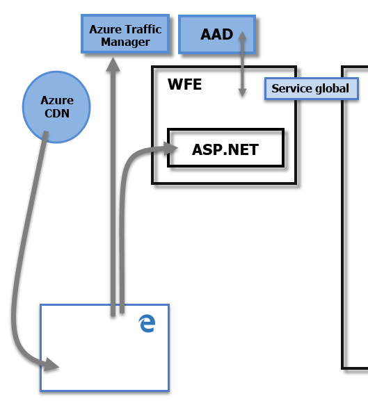

# Sécurité dans Power BI
Pour obtenir une explication détaillée de la sécurité de Power BI, [téléchargez le livre blanc sur la sécurité dans Power BI](http://go.microsoft.com/fwlink/?LinkId=829185) :

Le service Power BI repose sur **Azure**, qui est la plateforme et l’infrastructure de cloud computing de Microsoft. L’architecture du service Power BI est basée sur deux clusters : le cluster web frontal (**WFE**, Web Front End) et le cluster **principal**. Le cluster WFE est responsable de la connexion et de l’authentification initiales au service Power BI. Une fois l’authentification réussie, le cluster principal gère toutes les interactions utilisateur ultérieures. Power BI utilise Azure Active Directory (AAD) pour stocker et gérer les identités des utilisateurs, et il gère le stockage des données et des métadonnées respectivement à l’aide d’objets blob Azure et du service Azure SQL Database.

## Architecture de Power BI
Chaque déploiement de Power BI est constitué de deux clusters : un cluster web frontal (**WFE**) et un cluster **principal** .

Le cluster **WFE** gère le processus d’authentification et de connexion initial pour Power BI. Il utilise AAD pour authentifier les clients et fournir des jetons pour les connexions clientes ultérieures au service Power BI. Power BI utilise également **Azure Traffic Manager** (ATM) pour diriger le trafic utilisateur vers le centre de données le plus proche, déterminé en fonction de l’enregistrement DNS du client qui tente de se connecter, pour le processus d’authentification et pour télécharger des fichiers et du contenu statique. Power BI utilise **Azure Content Delivery Network** (CDN) pour distribuer efficacement les fichiers et le contenu statiques nécessaires aux utilisateurs en fonction des paramètres régionaux.

C’est par le biais du cluster **principal** que les clients authentifiés interagissent avec le service Power BI. Le cluster **principal** gère les visualisations, les tableaux de bord utilisateur, les jeux de données, les rapports, le stockage de données, les connexions de données, l’actualisation des données et d’autres aspects de l’interaction avec le service Power BI. Le **rôle Passerelle** sert de passerelle entre les demandes des utilisateurs et le service Power BI. Les utilisateurs n’interagissent directement avec aucun rôle autre que le **rôle Passerelle**. Le rôle **Gestion des API Azure** finira par gérer le **rôle Passerelle**.

> [!IMPORTANT]
> Il est important de noter que seuls les rôles **Gestion des API Azure** (APIM) et **Passerelle** (GW) sont accessibles par le biais de l’Internet public. Ils fournissent entre autres des fonctionnalités d’authentification, d’autorisation, de protection DDoS, de limitation, d’équilibrage de charge et de routage.
> 
> 

## Sécurité du stockage des données
Power BI utilise deux principaux référentiels pour le stockage et la gestion des données : les données chargées à partir des utilisateurs sont généralement envoyées vers le stockage d’**objets blob Azure** et toutes les métadonnées et les artefacts pour le système proprement dit sont stockés dans **Azure SQL Database**.

La ligne en pointillés dans l’image de cluster **principal** , ci-dessus, clarifie la limite entre les deux seuls composants qui sont accessibles aux utilisateurs (à gauche de la ligne en pointillés) et les rôles qui sont accessibles uniquement au système. Lorsqu’un utilisateur authentifié se connecte au service Power BI, la connexion et toute demande du client sont acceptées et gérées par le **rôle Passerelle** (et finalement gérés par le rôle **Gestion des API Azure**), qui interagit ensuite pour le compte de l’utilisateur avec le reste du service Power BI. Par exemple, quand un client tente d’afficher un tableau de bord, le **rôle Passerelle** accepte cette demande, puis envoie séparément une demande au **rôle Présentation** pour récupérer les données nécessaires au navigateur pour afficher le tableau de bord.

## Authentification utilisateur
Power BI utilise Azure Active Directory ([AAD](http://azure.microsoft.com/services/active-directory/)) pour authentifier les utilisateurs qui se connectent au service Power BI et, à son tour, utilise les informations d’identification de connexion Power BI chaque fois qu’un utilisateur essaie d’accéder à des ressources qui nécessitent une authentification. Les utilisateurs se connectent au service Power BI à l’aide de l’adresse de messagerie utilisée pour créer leur compte Power BI. Power BI utilise cette adresse de messagerie de connexion comme *nom d’utilisateur effectif*, qui est transmis aux ressources chaque fois qu’un utilisateur essaie de se connecter aux données. Le *nom d’utilisateur effectif* est ensuite mappé à un *nom d’utilisateur principal* ([UPN](https://msdn.microsoft.com/library/windows/desktop/aa380525\(v=vs.85\).aspx)) et mis en correspondance avec le compte de domaine Windows associé, auquel l’authentification est appliquée.

Pour les organisations qui utilisaient des adresses de messagerie professionnelles pour la connexion à Power BI (telles que *david@contoso.com*), le mappage entre le *nom d’utilisateur effectif* et le nom UPN est simple. Pour les organisations qui n’utilisaient pas d’adresses de messagerie professionnelles pour la connexion à Power BI (telles que *david@contoso.onmicrosoft.com*), le mappage entre les informations d’identification AAD et locales nécessite une [synchronisation d’annuaire](https://technet.microsoft.com/library/jj573653.aspx) pour fonctionner correctement.

La sécurité de plateforme pour Power BI inclut également la sécurité d’environnement d’architecture mutualisée, la sécurité réseau et la possibilité d’ajouter des mesures de sécurité supplémentaires basées sur AAD.

## Sécurité des données et des services
Pour en savoir plus, visitez le [Centre de gestion de la confidentialité de Microsoft](https://www.microsoft.com/trustcenter).

Comme décrit plus haut dans cet article, la connexion Power BI d’un utilisateur est utilisée par les serveurs Active Directory locaux pour le mappage à un nom UPN pour obtenir les informations d’identification. Toutefois, il est **important** de noter que les utilisateurs sont responsables des données qu’ils partagent : si un utilisateur se connecte à des sources de données à l’aide de ses informations d’identification et qu’il partage ensuite un rapport (ou un tableau de bord ou un jeu de données) basé sur ces données, les utilisateurs avec lesquels le tableau de bord est partagé ne sont pas authentifiés par rapport à la source de données d’origine et ils auront accès au rapport.

Les connexions à **SQL Server Analysis Services** à l’aide de la **passerelle de données locale** constituent une exception. Les tableaux de bord sont mis en cache dans Power BI, mais l’accès aux rapports ou jeux de données sous-jacents initie l’authentification de l’utilisateur qui tente d’accéder au rapport (ou au jeu de données) et l’accès n’est accordé que si l’utilisateur dispose d’informations d’identification suffisantes pour accéder aux données. Pour plus d’informations, consultez [Présentation détaillée de la passerelle de données locale](service-gateway-onprem-indepth.md).

