# Gérer les capacités dans Power BI Premium et Power BI Embedded
Découvrez comment vous pouvez gérer les capacités Power BI Premium et Power BI Embedded, qui fournissent des ressources dédiées pour votre contenu.

La capacité est au cœur des offres Power BI Premium et Power BI Embedded.

## Qu’est-ce que la capacité ?
La capacité est l’ensemble de ressources réservées à votre usage exclusif. Le fait de disposer d’une capacité vous permet de publier des tableaux de bord, rapports et jeux de données pour les utilisateurs de votre organisation sans que vous deviez acheter des licences pour ceux-ci. Cela garantit également la fiabilité et la cohérence des performances du contenu hébergé dans la capacité.

La capacité est transparente pour vos utilisateurs finaux. Ceux-ci continuent d’utiliser Power BI ou votre application comme d’habitude. Ils n’ont pas besoin de savoir que tout ou partie du contenu est hébergé dans votre capacité dédiée. Pour vos utilisateurs, tout fonctionne exactement comme auparavant.

[!INCLUDE [powerbi-premium-illustration](./includes/powerbi-premium-illustration.md)]

Pour plus d’informations, consultez [Qu’est-ce que Power BI Premium ?](service-premium.md).

### Administrateurs de capacité
> [!NOTE]
> Les administrateurs de la capacité Power BI Embedded sont définis dans le portail Microsoft Azure.

Lorsque vous êtes désigné en tant qu’administrateur d’une capacité, vous contrôlez totalement la capacité et ses fonctions d’administration. À partir du portail d’administration Power BI, vous pouvez ajouter des administrateurs de capacité (Power BI Premium uniquement) ou donner à des utilisateurs des autorisations d’attribution de capacité. Vous pouvez attribuer en bloc des espaces de travail à une capacité, ainsi qu’afficher les métriques d’utilisation d’une capacité.

Chaque capacité a ses propres administrateurs. La définition d’un administrateur de capacité pour une capacité n’a pas pour effet d’octroyer à celui-ci l’accès à toutes les capacités disponibles au sein de votre organisation. Les administrateurs de capacité n’ont pas accès à toutes les zones d’administration de Power BI, telles que les métriques d’utilisation, les journaux d’audit ou les paramètres du locataire. De plus, ils n’ont pas l’autorisation de configurer de nouvelles capacités ni de modifier la référence SKU des capacités actuelles. Seuls les administrateurs généraux ou les administrateurs de service Power BI ont accès à ces éléments.

Les administrateurs généraux Office 365 et les administrateurs Power BI sont automatiquement des administrateurs des capacités Power BI Premium et Power BI Embedded.

## Acheter de la capacité
Pour tirer parti de la capacité dédiée, vous devez acheter un abonnement Power BI Premium par le biais du Centre d’administration Office 365 ou créer une ressource Power BI Embedded dans le portail Microsoft Azure. Pour plus d’informations, consultez les ressources suivantes :

* **Power BI Premium:** [Acheter Power BI Premium](service-admin-premium-purchase.md)
* **Power BI Embedded :** [Créer une capacité Power BI Embedded dans le portail Azure](https://docs.microsoft.com/en-us/azure/power-bi-embedded/create-capacity)

Lorsque vous achetez des références (SKU) Power BI Premium, votre locataire reçoit le nombre correspondant de v-cores pour une utilisation dans les capacités opérationnelles. Par exemple, l’achat d’une référence SKU Power BI Premium P3 fournit au locataire 32 v-cores.

> [!NOTE]
> Vous bénéficierez de 30 jours d’accès total une fois votre abonnement terminé, mais après cela, votre contenu reviendra à une capacité partagée. Les modèles > 1 Go ne seront pas pris en charge avec une licence partagée standard.

## Gérer la capacité
Une fois que vous avez acheté des nœuds de capacité dans Office 365, vous devez configurer une nouvelle capacité. Son réglage s’effectue au moyen du [Portail d’administration Power BI](service-admin-portal.md). Le portail d’administration contient une section nommée **Paramètres de capacité**. C’est là que vous gérez les capacités Power BI Premium pour votre organisation.

La sélection de l’option **Paramètres de capacité** a pour effet de vous conduire à l’écran de gestion de la capacité, qui est défini sur Power BI Premium par défaut.

### Configuration d’une nouvelle capacité (Power BI Premium)
Le nombre de v-cores reflète le volume utilisé et l’espace disponible pour créer des capacités. Le volume de v-cores disponible pour votre organisation est basé sur les références (SKU) Premium que vous avez achetées. Par exemple, l’achat de références P3 et P2 met à disposition 48 cœurs (32 à partir de P3 et 16 à partir de P2).

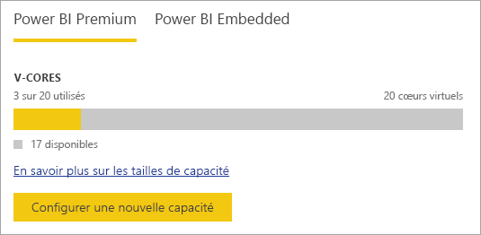

Si des v-cores sont disponibles, configurez votre nouvelle capacité en procédant comme suit.

1. Sélectionnez **Configurer une nouvelle capacité**.
2. Attribuez un **nom** à votre capacité.
3. Définissez qui est l’administrateur de cette capacité.

    Un administrateur de capacité ne doit pas nécessairement être un administrateur Power BI ou un administrateur général Office 365. Pour plus d’informations, consultez [Administrateurs de capacité Power BI Premium](#capacity-admins).
4. Sélectionnez la taille de votre capacité. Les options disponibles dépendent du nombre de v-cores disponibles. Vous ne pouvez pas sélectionner une option qui est supérieure à la quantité disponible.

    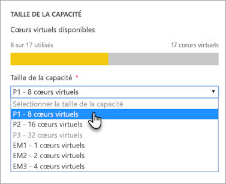
5. Sélectionnez **Configurer**.

    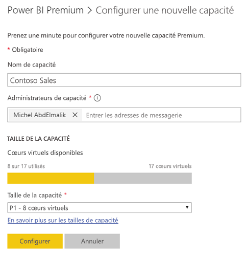

Les administrateurs de capacité, ainsi que les administrateurs Power BI et les administrateurs généraux Office 365, peuvent voir la capacité répertoriée dans le portail d’administration.

### Paramètres de capacité
Dans l’écran de gestion de capacité Premium, sous Actions, vous pouvez sélectionner l’**icône d’engrenage (Paramètres)**. Cela vous permet de renommer ou de supprimer une capacité. Vous pouvez également voir qui sont les administrateurs du service, la référence (SKU) et la taille de la capacité, ainsi que la région dans laquelle la capacité est située.

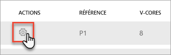

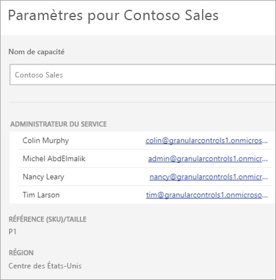

> [!NOTE]
> Les paramètres de capacité Power BI Embedded sont gérés dans le portail Microsoft Azure.

### Changer la taille de la capacité (Power BI Premium)
Les administrateurs Power BI et les administrateurs généraux Office 365 modifient la taille de la capacité Power BI Premium en sélectionnant **Changer la taille de la capacité**. Un administrateur de capacité qui n’est pas administrateur Power BI ou administrateur général Office 365 n’a pas accès à cette option.

L’écran **Changer la taille de la capacité** vous permet de passer à une taille de capacité inférieure ou supérieure si vous disposez de ressources disponibles. Les administrateurs sont libres de créer, redimensionner et supprimer des nœuds, tant qu’ils ont le nombre requis de v-cores.

Les références (SKU) P ne peuvent pas être réajustées à la référence inférieure EM. Vous pouvez pointer sur les options désactivées qui fournissent une explication.

### Attribution de la capacité
Vous pouvez gérer une capacité en sélectionnant son nom. Cela a pour effet de vous diriger vers l’écran de gestion de la capacité.

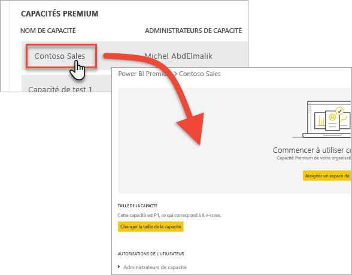

Si aucun espace de travail n’a été attribué à la capacité, vous voyez un message vous permettant d’**Assigner des espaces de travail**.

#### Autorisations de l’utilisateur
Vous pouvez désigner des **administrateurs de capacité** supplémentaires pour les capacités Power BI Premium, ainsi que des utilisateurs titulaires d’**autorisations d’attribution de capacité**. Les utilisateurs disposant d’autorisations d’affectation peuvent affecter un espace de travail d’application à la capacité s’ils sont administrateur de cet espace de travail. Ils peuvent également affecter leur espace de travail personnel (*Mon espace de travail*) à la capacité. Les utilisateurs disposant d’autorisations d’affectation n’ont pas accès au portail d’administration.

> [!NOTE]
> Les administrateurs de capacité Power BI Embedded sont définis dans le portail Microsoft Azure.
>
>

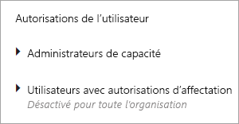

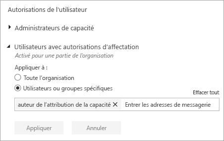

## Affecter un espace de travail à une capacité
Il existe plusieurs façons d’affecter un espace de travail à une capacité.

### Gestion de capacité via le portail d’administration
Les administrateurs de capacité, ainsi que les administrateurs Power BI et les administrateurs généraux Office 365, peuvent attribuer en bloc des espaces de travail au moyen de la section de gestion de capacité Premium du portail d’administration. Lorsque vous gérez une capacité, vous pouvez voir une section **Espaces de travail** qui vous permet d’affecter des espaces de travail.

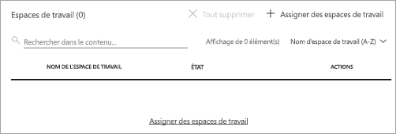

1. Sélectionnez **Assigner des espaces de travail**. Cette option figure dans plusieurs emplacements et effectue toujours la même tâche.
2. Sélectionnez **Les espaces de travail de toute l’organisation** ou **Espaces de travail spécifiques par utilisateur**.

   | Sélection | Description |
   | --- | --- |
   | **Les espaces de travail de toute l’organisation** |L’affectation des espaces de travail de toute l’organisation à une capacité Premium a pour effet d’affecter la totalité des espaces de travail d’application ainsi que des espaces Mon espace de travail dont dispose votre organisation à cette capacité Premium. Et elle a également pour effet d’autoriser tous les utilisateurs présents et futurs à réaffecter des espaces de travail spécifiques à cette capacité. |
   | **Espaces de travail spécifiques par utilisateur** |Lorsque vous affectez des espaces de travail par utilisateur ou par groupe, tous les espaces de travail appartenant à ces utilisateurs, y compris leurs espaces de travail personnels, sont affectés à la capacité Premium. Ces utilisateurs sont automatiquement autorisés à assigner leurs espaces de travail. Cela inclut les espaces de travail déjà affectés à une autre capacité. |
3. Sélectionnez **Appliquer**.

Cette option ne vous permet pas d’affecter des espaces de travail spécifiques à une capacité.

### Paramètres d’espace de travail d’application
Vous pouvez également affecter un espace de travail d’application à une capacité Premium à partir des paramètres de cet espace de travail. Pour affecter un espace de travail d’application à une capacité Premium, procédez comme suit.

Pour pouvoir déplacer un espace de travail vers une capacité, vous devez disposer d’autorisations d’administration sur cet espace de travail, ainsi que d’autorisations d’affectation de capacité sur cette capacité. Notez que les administrateurs d’un espace de travail peuvent toujours supprimer celui-ci d’une capacité Premium.

1. Modifiez un espace de travail d’application en sélectionnant les **points de suspension (...)** , puis **Modifier l’espace de travail**.

    
2. Dans **Modifier l’espace de travail**, développez **Avancé**.
3. Si vous avez reçu des autorisations d’affectation de capacité sur une capacité, vous pouvez activer **Premium** pour cet espace de travail.
4. Sélectionnez la capacité à laquelle vous souhaitez assigner cet espace de travail d’application.

    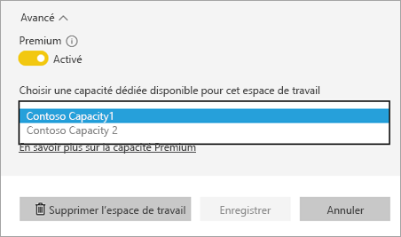
5. Sélectionnez **Enregistrer**.

Une fois enregistrés, l’espace de travail et tout son contenu sont déplacés vers la capacité Premium sans que cela occasionne d’interruption d’expérience pour les utilisateurs finaux.

## Surveiller l’utilisation de la capacité

Power BI fournit une application pour la surveillance de l’utilisation des capacités. Pour plus d’informations, consultez [Surveiller les capacités de Power BI Premium dans votre organisation](service-admin-premium-monitor-capacity.md).

## Apparence de la capacité Premium pour les utilisateurs
Le plus souvent, les utilisateurs n’ont même pas besoin de savoir qu’ils se trouvent dans une capacité Premium. Leurs tableaux de bord et rapports fonctionnent normalement. En guise d’indication visuelle, vous pouvez voir une icône en forme de losange en regard des espaces de travail qui se trouvent dans une capacité Premium.

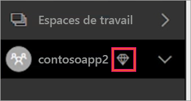

## Clé de produit Power BI Report Server
Votre clé de produit Power BI Report Server est accessible sous l’onglet **Paramètres de capacité** du portail d’administration de Power BI. Elle est réservée aux administrateurs généraux ou aux utilisateurs dotés du rôle d’administrateur du service Power BI et si vous avez acheté une référence Power BI Premium.

La sélection de **Clé de Power BI Report Server** a pour effet d’afficher une boîte de dialogue contenant votre clé de produit. Copiez-la pour l’utiliser lors de l’installation.

Pour plus d’informations, consultez [Installer Power BI Report Server](report-server/install-report-server.md).

## Étapes suivantes
Partager des applications publiées avec les utilisateurs. Pour plus d’informations, voir [Créer et distribuer des applications dans Power BI](service-create-distribute-apps.md).

D’autres questions ? [Essayez d’interroger la communauté Power BI](http://community.powerbi.com/)
