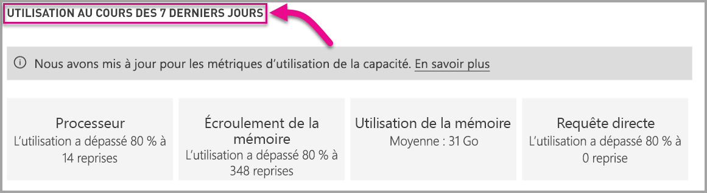

# Surveiller les capacités de Power BI Premium et Power BI Embedded

Cet article fournit une vue d’ensemble de la surveillance des métriques pour vos capacités de Power BI Premium. Surveillance de l’utilisation de capacité vous permet d’adopter une approche informée de la gestion de vos capacités.

Vous pouvez surveiller la capacité avec l’application Power BI Premium Capacity Metrics, ou dans le portail d’administration. Nous vous recommandons l’application, car elle fournit des informations plus détaillées, bien que cet article traite les deux options.

<iframe width="560" height="315" src="https://www.youtube.com/embed/UgsjMbhi_Bk?rel=0&amp;showinfo=0" frameborder="0" allowfullscreen></iframe>

## Installer l’application Premium Capacity Metrics

Vous pouvez passer directement à l’[application Premium Capacity Metrics](https://app.powerbi.com/groups/me/getapps/services/capacitymetrics) ou l’installer comme d’autres applications dans Power BI.

1. Dans Power BI, cliquez sur **Applications**.

    

2. Sur le côté droit, cliquez sur **Obtenir des application**.

3. Dans la catégorie **Applications**, recherchez l’**application Power BI Premium Capacity Metrics**.

4. Abonnez-vous pour installer l’application.

Maintenant que vous avez installé l’application, vous pouvez voir des métriques sur les capacités de votre organisation. Jetons un œil à certaines des métriques clés disponibles.

## Utilisez l’application de métriques

Lorsque vous ouvrez l’application, un tableau de bord avec un résumé de toutes les capacités pour lesquelles vous disposez de droits d’administrateur s’affiche tout d’abord.

Le rapport comporte trois onglets, que nous allons décrire en détail dans les sections qui suivent.

* **Filtres appliqués à toutes les pages** : vous permet de filtrer les autres pages du rapport sur une capacité spécifique.
* **Jeux de données** : fournit des métriques détaillées sur l’intégrité des jeux de données dans vos capacités.
* **Système**:  donne des métriques de capacité globale incluant l’utilisation élevée du processeur et de la mémoire. 

### Onglet Filtres appliqués à toutes les pages

L’onglet **Filtres appliqués à toutes les pages** vous permet de sélectionner une capacité, un jeu de données ou une plage de dates au cours des sept derniers jours. Les filtres sont ensuite appliqués à toutes les pages et vignettes concernées dans le rapport. Si aucun filtre n’est sélectionné, par défaut le rapport indique les métriques de la semaine écoulée sur chaque capacité que vous possédez.

### onglet Jeux de données

L’onglet **Jeux de données** fournit l’essentiel des mesures de l’application. Utilisez les quatre boutons en haut de l’onglet pour accéder à différentes zones : **Résumé**, **Actualisations**, **Requêtes** et **Jeux de données**.

#### Zone Résumé

La zone **Résumé** affiche une vue de vos capacités basée sur les entités, les ressources système et les charges de travail de jeux de données.

| | **Métriques** |
| --- | --- |
| **Entités** | * Le nombre de capacités que vous possédez  * Le nombre distinct de jeux de données dans votre capacité  * Le nombre distinct d’espaces de travail dans votre capacité |
| **Système** | * L’utilisation moyenne de la mémoire en Go au cours des sept derniers jours  * La consommation de mémoire la plus élevée au cours des sept derniers jours et l’heure locale où elle a eu lieu  * Le nombre de fois où l’UC a dépassé 80 % des seuils au cours des sept derniers jours, divisé en compartiments de trois minutes  * La plupart des fois où l’UC a dépassé 80 % au cours des sept derniers jours, divisé en compartiments d’une heure, et l’heure locale où cela a eu lieu  * Le nombre de fois où les requêtes directes/les connexions actives ont dépassé 80 % des seuils au cours des sept derniers jours, divisé en compartiments de trois minutes  * La plupart des fois où les requêtes directes/les connexions actives ont dépassé 80 % au cours des sept derniers jours, divisé en compartiments d’une heure, et l’heure locale où cela a eu lieu |
| **Charges de travail de jeux de données** | * Nombre total d’actualisations au cours des sept derniers jours  * Nombre total d’actualisations réussies au cours des sept derniers jours  * Nombre total d’actualisations ayant échoué au cours des sept derniers jours  * Nombre total d’actualisations ayant échoué en raison d’une mémoire insuffisante  * Durée moyenne de l’actualisation en minutes, le temps nécessaire pour terminer l’opération  * Le temps d’attente d’actualisation moyen est mesuré en minutes, délai moyen entre l’heure planifiée et le début de l’opération  * Nombre total de requêtes exécutées au cours des sept derniers jours  * Nombre total de requêtes réussies au cours des sept derniers jours  * Nombre total de requêtes ayant échoué au cours des sept derniers jours  * Durée moyenne des requêtes en minutes, le temps nécessaire pour terminer l’opération  *Nombre total de modèles exclus en raison d’une sollicitation de la mémoire |
|  |  |

#### Zone Actualisations

La zone **Actualisations** répertorie la totalité des actualisations, les mesures de réussite, le temps d’attente d’actualisation moyen/maximal et la durée d’actualisation moyenne/maximale en tranches de jeux de données au cours des sept derniers jours. Les deux graphiques du bas montrent une comparaison des actualisations et de la consommation de mémoire en Go, ainsi que les temps d’attente moyens divisés en compartiments d’une heure, signalés à l’heure locale. Les graphiques à barres du haut répertorient les cinq jeux de données principaux par la durée moyenne nécessaire pour terminer l’actualisation du jeu de données (durée d’actualisation) et la durée d’attente d’actualisation moyenne. Plusieurs pics élevés de temps d’attente d’actualisation indiquent une très forte sollicitation des capacités.

#### Zone Requêtes

La zone **Requêtes** répertorie le nombre total de requêtes exécutées, le nombre total d’attentes des requêtes pour Live query/Direct query, la durée moyenne/maximale, le temps d’attente moyen/maximal en millisecondes segmenté par jeu de données, espace de travail et intervalle d’une heure au cours des sept derniers jours. Les graphiques du bas indiquent le nombre de requêtes, la durée moyenne (en millisecondes) et le temps d’attente moyen (en millisecondes) versus la consommation de mémoire en Go, divisés en intervalles d’une heure et exprimés en heure locale. Les deux graphiques en haut à droite répertorient les cinq premiers jeux de données en fonction de la durée moyenne des requêtes et du temps d’attente nécessaire pour terminer les requêtes. Des durées de requêtes et des temps d’attente longs indiquent que la capacité est en surchauffe. Cela peut également signifier qu’un seul jeu de données est à l’origine de problèmes et que des recherches plus approfondies sont nécessaires.

#### Zone Jeux de données

L’onglet **Jeux de données** affiche les jeux de données complets exclus par heure en raison d’une sollicitation de la mémoire.

### Onglet Système

L’onglet **Système** affiche l’utilisation élevée de l’UC (nombre de fois où l’utilisation a dépassé 80 %), l’utilisation élevée des requêtes directes/des connexions actives et la consommation de mémoire.

## Surveiller la capacité de Power BI Embedded

Vous pouvez également utiliser l’application Power BI Premium Capacity Metrics pour surveiller les capacités de la *référence SKU A* dans Power BI Embedded. Ces capacités apparaîtront dans le rapport tant que vous serez un administrateur de la capacité. Toutefois, l’actualisation du rapport échoue si vous n’accordez pas certaines autorisations à Power BI pour vos références SKU A :

1. Ouvrez votre capacité dans le portail Azure.
1. Cliquez sur **Contrôle d’accès (IAM)** et ajoutez l’application « Power BI Premium » au rôle de lecteur. Si vous ne parvenez pas à trouver l’application par son nom, vous pouvez également l’ajouter via son ID client : cb4dc29f-0bf4-402a-8b30-7511498ed654.

    

> [!NOTE]
> Vous pouvez surveiller l’utilisation de la capacité de Power BI Embedded dans l’application ou dans le portail Azure, mais pas dans le portail d’administration Power BI.

## Surveillance de base dans le portail d’administration

La zone **Paramètres de capacité** du portail d’administration fournit quatre jauges qui indiquent les charges placées et les ressources utilisées par votre capacité au cours des sept derniers jours. Ces quatre vignettes fonctionnent sur une fenêtre de temps horaire qui indique le nombre d’heures où la métrique correspondante a été supérieure à 80 % au cours des sept derniers jours. Cette métrique indique une dégradation potentielle de l’expérience de l’utilisateur final.

| **Métrique** | **Description** |
| --- | --- |
| Processeur |Nombre de fois où l’utilisation du processeur a dépassé 80 %. |
| Écroulement de la mémoire |Représente la sollicitation de la mémoire sur les cœurs du serveur principal. Plus précisément, cette métrique indique le nombre de fois où des jeux de données ont été supprimés de la mémoire en raison de la sollicitation de celle-ci résultant de l’utilisation de nombreux jeux de données. |
| Utilisation de la mémoire |Utilisation moyenne de la mémoire, indiquée en gigaoctets (Go). |
| Requêtes directes/s | Nombre de fois où le nombre de requêtes directes (DirectQuery) et de connexions actives ont dépassé 80 % de la limite.   * Nous limitons le nombre total de requêtes DirectQuery et de connexions actives par seconde.* Les limites sont 30/s pour P1, 60/s pour P2 et 120/s pour P3. * En ce qui concerne la limitation ci-dessus, les requêtes DirectQuery et les connexions actives sont comptabilisées ensemble. Par exemple, si vous avez 15 requêtes DirectQuerys et 15 connexions actives par seconde, vous avez atteint votre limite. * Cela s’applique tant aux connexion locales qu’aux connexions cloud. |
|  |  |

Les métriques reflètent l’utilisation sur la dernière semaine.  Si vous souhaitez avoir une vue plus détaillée des métriques, cliquez sur les vignettes de résumé.  Des graphiques détaillés s’affichent pour chacune des métriques de votre capacité Premium. Le graphique suivant affiche les détails de la métrique de l’UC.

Ces graphiques récapitulent les données de la dernière semaine par heure. Ils permettent d’isoler plus facilement les événements liés aux performances spécifiques dans votre capacité Premium.

Vous pouvez également exporter les données sous-jacentes de chacune des métriques dans un fichier csv.  Cette exportation fournit des informations détaillées par intervalle de trois minutes pour chaque jour de la dernière semaine.

## Étapes suivantes

Maintenant que vous avez compris comment surveiller les capacités de Power BI Premium, vous pouvez en savoir plus sur l’optimisation des capacités.

> [!div class="nextstepaction"]
> [Gestion et optimisation des ressources de capacité de Power BI Premium](service-premium-understand-how-it-works.md)
