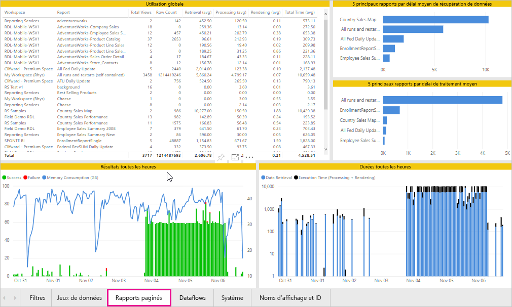
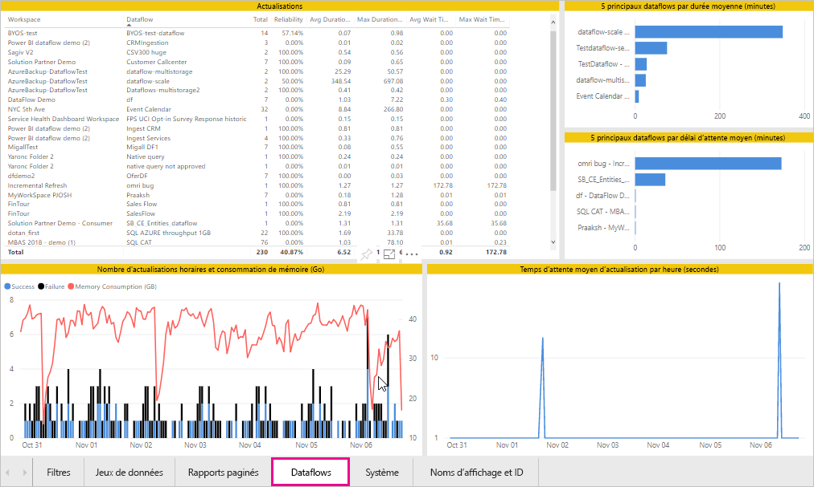
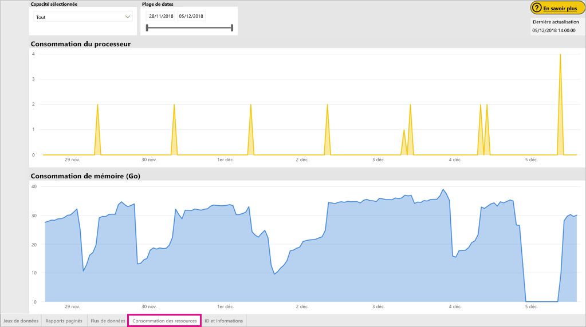
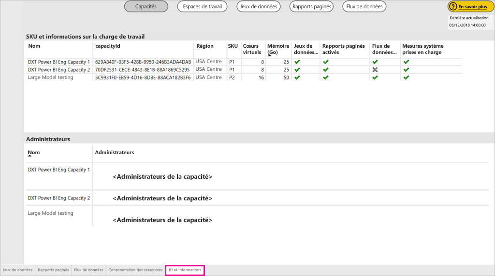

# Surveiller les capacités de Power BI Premium et Power BI Embedded

Cet article fournit une vue d’ensemble de la surveillance des métriques pour vos capacités de Power BI Premium. Surveillance de l’utilisation de capacité vous permet d’adopter une approche informée de la gestion de vos capacités.

Vous pouvez surveiller la capacité avec l’application Power BI Premium Capacity Metrics, ou dans le portail d’administration. Nous vous recommandons l’application, car elle fournit des informations plus détaillées, bien que cet article traite les deux options.

**La version actuelle de l’application est 1.10 (publiée le 13 décembre 2018).**

.

<iframe width="560" height="315" src="https://www.youtube.com/embed/UgsjMbhi_Bk?rel=0&amp;showinfo=0" frameborder="0" allowfullscreen></iframe>

## Installer l’application Premium Capacity Metrics

Vous pouvez passer directement à l’[application Premium Capacity Metrics](https://app.powerbi.com/groups/me/getapps/services/capacitymetrics) ou l’installer comme d’autres applications dans Power BI.

1. Dans Power BI, cliquez sur **Applications**.

    

1. Sur le côté droit, cliquez sur **Obtenir des application**.

1. Dans la catégorie **Applications**, recherchez l’**application Power BI Premium Capacity Metrics**.

1. Abonnez-vous pour installer l’application.

Maintenant que vous avez installé l’application, vous pouvez voir des métriques sur les capacités de votre organisation. Jetons un œil à certaines des métriques clés disponibles.

## Utilisez l’application de métriques

### Tableau de bord des métriques

Lorsque vous ouvrez l’application, un tableau de bord avec un résumé de toutes les capacités pour lesquelles vous disposez de droits d’administrateur s’affiche tout d’abord.

Le tableau de bord inclut les métriques suivantes.

| **Section du rapport** | **Métriques** |
| --- | --- |
| **Résumé du système** | * Version de l’application  * Nombre de capacités dont vous êtes administrateur  * Nombre d’espaces de travail dans vos capacités qui signalent des métriques  * Consommation moyenne de la mémoire en Go au cours des sept derniers jours  * Consommation maximale de la mémoire en Go au cours des sept derniers jours  * Heure locale à laquelle a eu lieu la consommation maximale de la mémoire  * Nombre de fois où l’UC a dépassé 80 % des seuils au cours des sept derniers jours, divisé en compartiments de trois minutes  * La plupart des fois où l’UC a dépassé 80 % au cours des sept derniers jours, divisé en compartiments d’une heure  * Heure locale à laquelle l’UC a dépassé 80 % plusieurs fois en une heure |
| **Résumé du jeu de données** | * Nombre total de jeux de données sur tous les espaces de travail dans vos capacités  * Nombre de fois où les requêtes directes/les connexions actives ont dépassé 80 % des seuils au cours des sept derniers jours, divisé en compartiments de trois minutes  * La plupart des fois où les requêtes directes/les connexions actives ont dépassé 80 % au cours des sept derniers jours, divisé en compartiments d’une heure  * Heure locale à laquelle les requêtes directes/les connexions actives ont dépassé 80 % plusieurs fois en une heure  * Nombre total d’actualisations au cours des sept derniers jours  * Temps d’attente d’actualisation moyen : le délai moyen entre l’heure planifiée et le début de l’actualisation, en minutes  * Durée moyenne de l’actualisation : le temps nécessaire pour terminer l’actualisation, en minutes  * Nombre total de requêtes exécutées au cours des sept derniers jours  * Temps d’attente moyen des requêtes : le temps qu’une requête reste en attente dans les ressources système avant le début de l’exécution, en millisecondes  * Durée moyenne des requêtes : le temps nécessaire pour terminer la requête, en millisecondes  *Nombre total de modèles exclus en raison d’une sollicitation de la mémoire  * Taille moyenne des jeux de données   * Nombre moyen de jeux de données chargés en mémoire |
| **Résumé du flux de données** | * Nombre total de flux de données sur tous les espaces de travail dans vos capacités  * Nombre total d’actualisations au cours des sept derniers jours  * Temps d’attente d’actualisation moyen : le délai moyen entre l’heure planifiée et le début de l’actualisation, en minutes  * Durée moyenne de l’actualisation : le temps nécessaire pour terminer l’actualisation, en minutes |
| **Résumé de rapport paginé** | * Nombre total de rapports paginés sur tous les espaces de travail dans vos capacités  * Nombre total de fois que tous les rapports ont été consultés par les utilisateurs  * Nombre total de lignes de données dans tous les rapports  * Temps total nécessaire pour exécuter toutes les phases (extraction, traitement et rendu des données) de tous les rapports, en millisecondes |
|  |  |

### Rapport des métriques

Cliquez sur le tableau de bord pour accéder au rapport sous-jacent. Le rapport comporte cinq onglets, que nous allons décrire en détail dans les sections qui suivent.

* **Jeux de données** : métriques détaillées sur l’intégrité des jeux de données Power BI dans vos capacités.

* **Rapports paginés** : métriques détaillées sur l’intégrité des rapports paginés dans vos capacités.

* **Flux de données** : métriques d’actualisation détaillées pour les flux de données dans vos capacités.

* **Consommation des ressources** : métriques de capacité globale incluant l’utilisation élevée du processeur et de la mémoire.

* **ID et informations** : noms, ID et propriétaires des capacités, espaces de travail et charges de travail.

Sous chaque onglet, vous pouvez filtrer les métriques par capacité et plage de dates. Si aucun filtre n’est sélectionné, le rapport indique par défaut les métriques de la semaine écoulée pour toutes les capacités qui signalent des métriques.

#### onglet Jeux de données

Utilisez les boutons au-dessus de l’onglet **Jeux de données** pour accéder à différentes zones : **Résumé**, **Actualisations**, **Durées des requêtes**, **Attentes des requêtes** et **Jeux de données**.

##### Zone Actualisations

La zone **Actualisations** contient les métriques suivantes.

| **Section du rapport** | **Métriques** |
| --- | --- |
| **Fiabilité de l’actualisation** | * Nombre total : actualisations totales pour chaque jeu de données  * Fiabilité : pourcentage des actualisations terminées pour chaque jeu de données  * Temps d’attente moyen : délai moyen entre l’heure planifiée et le début d’une actualisation du jeu de données, en minutes  * Temps d’attente maximal : délai d’attente maximal du jeu de données, en minutes   * Durée moyenne : durée moyenne d’actualisation du jeu de données, en minutes  *Durée maximale : durée de l’actualisation la plus longue en cours d’exécution pour le jeu de données, en minutes |
| **5 principaux jeux de données par durée d’actualisation moyenne** | * Les cinq jeux de données affichant la durée d’actualisation moyenne la plus longue, en minutes |
| **5 principaux jeux de données par temps d’attente moyen** | * Les cinq jeux de données affichant le temps d’attente moyen le plus long, en minutes |
| **Temps d’attente moyen d’actualisation par heure** | * Temps d’attente moyen d’actualisation, divisé en intervalles d’une heure et exprimé en heure locale. Plusieurs pics élevés de temps d’attente d’actualisation indiquent une très forte sollicitation des capacités. |
| **Nombre d’actualisations horaires et consommation de mémoire** | * Réussites, échecs et consommation de mémoire, divisés en intervalles d’une heure et exprimés en heure locale |
|  |  |

##### Zone Durées des requêtes

La zone **Durées des requêtes** contient les métriques suivantes.

| **Section du rapport** | **Métriques** |
| --- | --- |
| **Durées des requêtes** | * Les données de cette section sont segmentées par jeu de données, espace de travail et intervalles d’une heure au cours des sept derniers jours  * Total : nombre total de requêtes exécutées pour le jeu de données  * Moyenne : durée moyenne des requêtes pour le jeu de données, en millisecondes  * Max : durée de la requête en cours d’exécution la plus longue dans le jeu de données, en millisecondes|
| **Distribution des durées de requêtes** | * L’histogramme des durées de requêtes est regroupé par durées de requêtes (en millisecondes) dans les catégories suivantes : intervalles <= 30 ms, 30-100 ms, 100-300 ms, 300 ms-1 s, 1-3 s, 3-10 s, 10-30 s et >30 s. Des durées de requêtes et des temps d’attente longs indiquent que la capacité est en surchauffe. Cela peut également signifier qu’un seul jeu de données est à l’origine de problèmes et que des recherches plus approfondies sont nécessaires. |
| **5 principaux jeux de données par durée moyenne** | * Les cinq jeux de données affichant la durée de requête moyenne la plus longue, en minutes |
| **Requête directe / Connexions actives (> 80 % d’utilisation)** | * Nombre de fois où une requête directe ou une connexion active a dépassé 80 % d’utilisation du processeur, divisé en intervalles d’une heure et exprimé en heure locale |
| **Distributions des durées de requêtes par heure** | * Nombre et durée moyenne (en millisecondes) des requêtes par rapport à la consommation de mémoire en Go, divisé en intervalles d’une heure et exprimé en heure locale |
|  |  |

##### Zone Attentes des requêtes

La zone **Attentes des requêtes** contient les métriques suivantes.

| **Section du rapport** | **Métriques** |
| --- | --- |
| **Temps d’attente de la requête** | * Les données de cette section sont segmentées par jeu de données, espace de travail et intervalles d’une heure au cours des sept derniers jours  * Total : nombre total de requêtes exécutées pour le jeu de données  * Nombre d’attentes : nombre de requêtes dans le jeu de données en attente dans les ressources système avant le début de l’exécution   * Moyenne : temps d’attente moyen des requêtes pour le jeu de données, en millisecondes  * Max : durée de la requête en attente la plus longue dans le jeu de données, en millisecondes|
| **Distribution des temps d’attente** | * L’histogramme des temps d’attente regroupés par durées de requêtes (en millisecondes) dans les catégories suivantes : intervalles <= 50 ms, 50-100 ms, 100-200 ms, 200-400 ms, 400 ms-1 s, 1-5 s, et >5 s |
| **5 principaux jeux de données par temps d’attente moyen** | * Les cinq jeux de données avec le temps d’attente moyen le plus longue pour lancer l’exécution d’une requête, en millisecondes |
| **Nombres d’attentes et temps d’attente des requêtes par heure** | * Nombre d’attentes et temps d’attente moyen (en millisecondes) des requêtes par rapport à la consommation de mémoire en Go, divisé en intervalles d’une heure et exprimé en heure locale |
|  |  |

##### Zone Jeux de données

La zone **Jeux de données** contient les métriques suivantes.

| **Section du rapport** | **Métriques** |
| --- | --- |
| **Nombre d’éviction de jeux de données** | * Total : nombre total d’*évictions* de jeux de données pour chaque capacité. Quand une capacité est confrontée à une sollicitation de la mémoire, le nœud supprime un ou plusieurs jeux de données de la mémoire. Les jeux de données qui sont inactifs (ceux pour lesquels aucune opération d’interrogation ou d’actualisation n’est en cours d’exécution) sont supprimés en premier. Ensuite, l’ordre d’éviction est basé sur une mesure dite « dernier récemment utilisé (LRU) ».|
| **Évictions de jeux de données par heure et consommation de mémoire** | * Évictions de jeux de données et consommation de mémoire en Go, divisées en intervalles d’une heure et exprimé en heure locale |
| **Nombre de jeux de données chargés par heure** | * Nombre de jeux de données chargés en mémoire et consommation de mémoire en Go, divisé en intervalles d’une heure et exprimé en heure locale |
| **Tailles de données**  | * Taille maximale : taille maximale du jeu de données, en Mo, pour la période affichée |
|  |  |

#### Onglet Rapports paginés

L’onglet **Rapports paginés** affiche des métriques détaillées sur l’intégrité des rapports paginés dans vos capacités.

L’onglet **Rapports paginés** contient les métriques suivantes.

| **Section du rapport** | **Métriques** |
| --- | --- |
| **Utilisation globale** | * Vues totales : nombre de fois où le rapport a été consulté par les utilisateurs  * Nombre de lignes : nombre de lignes de données dans le rapport  * Extraction (moy) : délai moyen nécessaire pour récupérer des données pour le rapport, en millisecondes. De longs délais peuvent indiquer des requêtes lentes ou d’autres problèmes au niveau de la source de données.   * Traitement (moy) : délai moyen nécessaire pour traiter les données d’un rapport, en millisecondes * Rendu (moy) : délai moyen nécessaire pour afficher un rapport dans le navigateur, en millisecondes  * Temps total : temps nécessaire pour exécuter toutes les phases du rapport, en millisecondes|
| **5 principaux rapports par délai moyen d’extraction de données** | * Les cinq rapports affichant le délai moyen d’extraction de données le plus long, en millisecondes |
| **5 principaux rapports par délai de traitement moyen** | * Les cinq rapports affichant le délai moyen de traitement le plus long, en millisecondes |
| **Durées toutes les heures** | * Délai d’extraction de données par rapport au délai de traitement et de rendu, divisé en intervalles d’une heure et exprimé en heure locale |
| **Résultats toutes les heures** | * Réussites, échecs et consommation de mémoire, divisés en intervalles d’une heure et exprimés en heure locale |
|  |  |

#### Onglet Flux de données

L’onglet **Flux de données** affiche des métriques d’actualisation détaillées pour les flux de données dans vos capacités.

L’onglet **Flux de données** contient les métriques suivantes.

| **Section du rapport** | **Métriques** |
| --- | --- |
| **Actualisation** | * Total : actualisations totales pour chaque flux de données  * Fiabilité : pourcentage des actualisations terminées pour chaque flux de données  * Temps d’attente moyen : délai moyen entre l’heure planifiée et le début d’une actualisation du flux de données, en minutes  * Temps d’attente maximal : délai d’attente maximal du flux de données, en minutes   * Durée moyenne : durée moyenne d’actualisation du flux de données, en minutes  *Durée maximale : durée de l’actualisation la plus longue en cours d’exécution pour le flux de données, en minutes |
| **5 principaux flux de données par durée d’actualisation moyenne** | * Les cinq flux de données affichant la durée d’actualisation moyenne la plus longue, en minutes |
| **5 principaux flux de données par temps d’attente moyen** | * Les cinq flux de données affichant le délai d’attente d’actualisation moyen le plus long, en minutes |
| **Temps d’attente moyen d’actualisation par heure** | * Temps d’attente moyen d’actualisation, divisé en intervalles d’une heure et exprimé en heure locale. Plusieurs pics élevés de temps d’attente d’actualisation indiquent une très forte sollicitation des capacités. |
| **Nombre d’actualisations horaires et consommation de mémoire** | * Réussites, échecs et consommation de mémoire, divisés en intervalles d’une heure et exprimés en heure locale |
|  |  |

#### Onglet Consommation des ressources

L’onglet **Consommation des ressources** affiche la consommation du processeur et de la mémoire dans l’ensemble des capacités et charges de travail.

L’onglet **Consommation des ressources** contient les métriques suivantes.

| **Section du rapport** | **Métriques** |
| --- | --- |
| **Consommation du processeur** | * Le nombre de fois où l’UC a dépassé 80 % des seuils au cours des sept derniers jours, divisé en compartiments de trois minutes |
| **Consommation de mémoire** | * Consommation de mémoire au cours des sept derniers jours, divisée en intervalles de trois minutes |
|  |  |

#### Onglet ID et informations

L’onglet **ID et informations** contient les noms, ID et propriétaires des capacités, espaces de travail et charges de travail.

## Surveiller la capacité de Power BI Embedded

Vous pouvez également utiliser l’application Power BI Premium Capacity Metrics pour surveiller les capacités de la *référence SKU A* dans Power BI Embedded. Ces capacités apparaîtront dans le rapport tant que vous serez un administrateur de la capacité. Toutefois, l’actualisation du rapport échoue si vous n’accordez pas certaines autorisations à Power BI pour vos références SKU A :

1. Ouvrez votre capacité dans le portail Azure.

1. Cliquez sur **Contrôle d’accès (IAM)** et ajoutez l’application « Power BI Premium » au rôle de lecteur. Si vous ne parvenez pas à trouver l’application par son nom, vous pouvez également l’ajouter via son ID client : cb4dc29f-0bf4-402a-8b30-7511498ed654.

    

> [!NOTE]
> Vous pouvez surveiller l’utilisation de la capacité de Power BI Embedded dans l’application ou dans le portail Azure, mais pas dans le portail d’administration Power BI.

## Surveillance de base dans le portail d’administration

La zone **Paramètres de capacité** du portail d’administration fournit quatre jauges qui indiquent les charges placées et les ressources utilisées par votre capacité au cours des sept derniers jours. Ces quatre vignettes fonctionnent sur une fenêtre de temps horaire qui indique le nombre d’heures où la métrique correspondante a été supérieure à 80 % au cours des sept derniers jours. Cette métrique indique une dégradation potentielle de l’expérience de l’utilisateur final.

| **Métrique** | **Description** |
| --- | --- |
| Processeur |Nombre de fois où l’utilisation du processeur a dépassé 80 %. |
| Écroulement de la mémoire |Représente la sollicitation de la mémoire sur les cœurs du serveur principal. Plus précisément, cette métrique indique le nombre de fois où des jeux de données ont été supprimés de la mémoire en raison de la sollicitation de celle-ci résultant de l’utilisation de nombreux jeux de données. |
| Utilisation de la mémoire |Utilisation moyenne de la mémoire, indiquée en gigaoctets (Go). |
| Requêtes directes/s | Nombre de fois où le nombre de requêtes directes (DirectQuery) et de connexions actives ont dépassé 80 % de la limite.   * Nous limitons le nombre total de requêtes DirectQuery et de connexions actives par seconde.* Les limites sont 30/s pour P1, 60/s pour P2 et 120/s pour P3. * En ce qui concerne la limitation ci-dessus, les requêtes DirectQuery et les connexions actives sont comptabilisées ensemble. Par exemple, si vous avez 15 requêtes DirectQuerys et 15 connexions actives par seconde, vous avez atteint votre limite. * Cela s’applique tant aux connexion locales qu’aux connexions cloud. |
|  |  |

Les métriques reflètent l’utilisation sur la dernière semaine.  Si vous souhaitez avoir une vue plus détaillée des métriques, cliquez sur les vignettes de résumé.  Des graphiques détaillés s’affichent pour chacune des métriques de votre capacité Premium. Le graphique suivant affiche les détails de la métrique de l’UC.

Ces graphiques récapitulent les données de la dernière semaine par heure. Ils permettent d’isoler plus facilement les événements liés aux performances spécifiques dans votre capacité Premium.

Vous pouvez également exporter les données sous-jacentes de chacune des métriques dans un fichier csv.  Cette exportation fournit des informations détaillées par intervalle de trois minutes pour chaque jour de la dernière semaine.

## Étapes suivantes

Maintenant que vous avez compris comment surveiller les capacités de Power BI Premium, vous pouvez en savoir plus sur l’optimisation des capacités.

> [!div class="nextstepaction"]
> [Gestion et optimisation des ressources de capacité de Power BI Premium](service-premium-understand-how-it-works.md)
