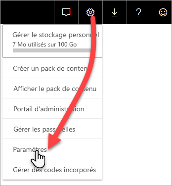
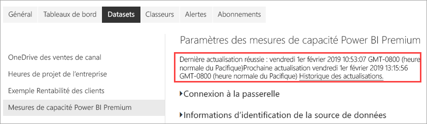
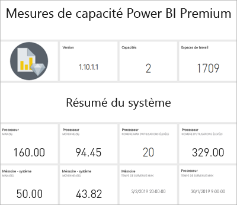

# Superviser les capacités Premium avec l’application

La supervision de vos capacités est essentielle pour prendre des décisions avisées sur la meilleure utilisation de vos ressources de capacité Premium. Vous pouvez superviser les capacités dans le portail d’administration ou avec l’application **Métriques de capacité Power BI Premium**. Cet article décrit l’utilisation de l’application Métriques de capacité Premium. L’application fournit les informations les plus détaillées sur les performances de vos capacités. Pour une vue d’ensemble générale des métriques de l’utilisation moyenne sur les sept derniers jours, vous pouvez utiliser le portail d’administration. Pour plus d’informations sur la supervision dans le portail, consultez [Superviser les capacités Premium dans le portail d’administration](service-admin-premium-monitor-portal.md).

L’application est mise à jour régulièrement avec de nouvelles fonctionnalités. Vérifiez que vous exécutez la version la plus récente. Si vous avez une version antérieure de l’application déjà installée, il est préférable de la supprimer de vos applications, puis d’appuyer sur Ctrl+F5 pour l’actualiser. 

## Installer l’application

Vous pouvez accéder directement à l’[application Métriques de capacité Premium](https://app.powerbi.com/groups/me/getapps/services/capacitymetrics) ou bien l’installer comme vous le faites pour d’autres applications dans Power BI.

1. Dans Power BI, cliquez sur **Applications**.   
    

2. Sur le côté droit, cliquez sur **Obtenir des application**.
3. Dans la catégorie **Applications**, recherchez l’**application Power BI Premium Capacity Metrics**.
4. Abonnez-vous pour installer l’application.

Soyez patient. Quelques minutes sont nécessaires pour installer et actualiser les métriques. Si l’application affiche des métriques vides, appuyez sur F5 pour actualiser votre navigateur.

## Obtenir l’historique d’actualisation de l’application

Pour vérifier quand votre application Métriques de capacité Premium a été actualisée pour la dernière fois, cliquez sur **Paramètres** > **Jeux de données** > **Métriques de capacité Power BI Premium** > **Historique des actualisations**. 

La dernière actualisation est indiquée. Vous pouvez aussi cliquer sur **Historique des actualisations** pour voir les actualisations planifiées et à la demande.

## Superviser les capacités avec l’application

Maintenant que vous avez installé l’application, vous pouvez voir des métriques pour les capacités de votre organisation. L’application fournit un tableau de bord avec des résumés des métriques et des rapports de métriques détaillés.

### Tableau de bord

Pour afficher un tableau de bord qui résume les métriques clés pour les capacités dont vous êtes un administrateur, dans **Tableaux de bord**, cliquez sur **Métriques de capacité Power BI Premium**. Un tableau de bord s’affiche.

Le tableau de bord inclut les métriques suivantes :

#### Haut

| Métrique | Description |
| --- | --- |
| Version | Version de l’application. | 
| Capacités | Nombre de capacités dont vous êtes administrateur | 
| Espaces de travail | Nombre d’espaces de travail dans vos capacités qui signalent des métriques|
|||

#### Résumé du système

| Métrique | Description |
| --- | --- |
| Capacité d’utilisation maximale de l’UC | Capacité avec le nombre maximal de fois où l’UC a dépassé 80 % des seuils dans les sept derniers jours. |
| Nombre maximal d’utilisations de l’UC | Nombre de fois où la capacité nommée a dépassé 80 % des seuils au cours des sept derniers jours. | 
| Capacité d’utilisation maximale de mémoire | Capacité avec le nombre maximal de fois où la limite maximale de mémoire a été atteinte au cours des sept derniers jours, divisé en intervalles de trois minutes.  |
| Nombre maximal d’utilisations de la mémoire| Nombre de fois où la capacité nommée a atteint la limite maximale de mémoire au cours des sept derniers jours, divisé en intervalles de trois minutes. |
|||

#### Résumé du jeu de données

| Métrique | Description |
| --- | --- |
| Jeux de données | Nombre total de jeux de données sur tous les espaces de travail dans vos capacités.|
| Taille moyenne des jeux de données (Mo) | Taille moyenne des jeux de données sur tous les espaces de travail dans vos capacités.|  
| Nombre moyen de jeux de données chargés | Nombre moyen de jeux de données chargés en mémoire. |  
| Jeux de données : moyenne des jeux de données actifs (%)| Moyenne des jeux de données actifs au cours des sept derniers jours. Un jeu de données est défini comme actif si l’utilisateur a interagi avec les visuels dans les trois dernières minutes. |
| UC : max. jeu de données (%)| Consommation max. d’UC par la charge de travail des jeux de données au cours des sept derniers jours. |
| UC : moyenne des jeux de données (%)| Consommation moyenne d’UC par la charge de travail des jeux de données au cours des sept derniers jours. |
| Mémoire : moyenne des jeux de données (Go) | Consommation moyenne de mémoire par la charge de travail des jeux de données au cours des sept derniers jours. |
| Mémoire : maximum de jeux de données (Go) | Consommation max. de mémoire par la charge de travail des jeux de données au cours des sept derniers jours.|
| Éviction de jeux de données | Nombre total de jeux de données supprimés en raison d’une forte sollicitation de la mémoire. |
| Nombre élevé d’utilisations DirectQuery/actives| Nombre de fois où les connexions DirectQuery/actives ont dépassé 80 % des seuils au cours des sept derniers jours, divisé en intervalles de trois minutes. |
| Nombre max. d’utilisations DirectQuery/actives| La plupart du temps, les connexions DirectQuery/actives ont dépassé 80 % au cours des sept derniers jours, divisées en intervalles d’une heure. |
| Utilisation élevée max. DirectQuery/active | Nombre maximal de fois où les connexions DirectQuery/actives ont dépassé 80 % des seuils au cours des sept derniers jours, divisé en intervalles de trois minutes.|
| Heure de survenue du max. de requêtes DirectQuery/actives | Heure UTC à laquelle les connexions DirectQuery/actives ont dépassé 80 % plusieurs fois en une heure. |
| Total des actualisations | Nombre total d’actualisations au cours des sept derniers jours. |
| Fiabilité des actualisations (%) | Nombre d’actualisations réussies divisé par le nombre total d’actualisations au cours des sept derniers jours. |
| Durée moyenne des actualisations (minutes) | Durée moyenne de l’actualisation. |
| Temps d’attente moyen des actualisations (minutes)| Temps moyen écoulé avant le début de l’actualisation. |
| Nombre total de requêtes |  Nombre total de requêtes exécutées au cours des sept derniers jours. |
| Nombre total d’attente de requêtes | Nombre total de requêtes en attente avant d’être exécutées. |
| Durée moyenne des requêtes (ms) | Temps moyen nécessaire pour exécuter les requêtes. |
| Temps d’attente moyen des requêtes (ms) | Temps d’attente moyen des requêtes sur les ressources système avant d’être exécutées. |
|||

#### Résumé du flux de données

| Métrique | Description |
| --- | --- |
| Flux de données |  Nombre total de flux de données sur tous les espaces de travail de vos capacités.|
| Total des actualisations | Nombre total d’actualisations au cours des sept derniers jours.|  
| Durée moyenne des actualisations (minutes) | Le temps nécessaire pour terminer l’actualisation. |
| Actualise les temps t’attente moyens (minutes) | Le décalage entre l’heure planifiée et le démarrage effectif de l’actualisation.|
| UC : flux de données max. (%) | Consommation max. d’UC par la charge de travail des flux de données au cours des sept derniers jours. |
| UC : moyenne des flux de données (%) | Consommation moyenne d’UC par la charge de travail des flux de données au cours des sept derniers jours. |
| Mémoire : flux de données max. (Go) | Consommation max. de mémoire par la charge de travail des flux de données au cours des sept derniers jours. |
| Mémoire : moyenne des flux de données (Fo) | Consommation moyenne de mémoire par la charge de travail des flux de données au cours des sept derniers jours. |
|||

#### Résumé du rapport paginé

| Métrique | Description |
| --- | --- |
| Rapports paginés |  Nombre total de rapports paginés sur tous les espaces de travail dans vos capacités. |
| Nombre total de vues | Nombre total de fois où tous les rapports ont été consultés par les utilisateurs. | 
| Nombre total de lignes | Nombre total de lignes de données dans tous les rapports.|
| Temps total | Temps total nécessaire pour exécuter toutes les phases (extraction, traitement et affichage des données) de tous les rapports, en millisecondes. |
| UC : max. de rapports paginés (%) | Consommation maximum d’UC par la charge de travail des rapports paginés au cours des sept derniers jours. |
| UC : moyenne de rapports paginés (%) | Consommation moyenne d’UC par la charge de travail des rapports paginés au cours des sept derniers jours. |
| Mémoire : max. de rapports paginés (Go) | Consommation maximum de mémoire par la charge de travail des rapports paginés au cours des sept derniers jours. |
| Mémoire : moyenne de rapports paginés (Go) | Consommation moyenne de mémoire par la charge de travail des rapports paginés au cours des sept derniers jours. |
|||

#### Résumé de l’intelligence artificielle

| Métrique | Description |
| --- | --- |
| Exécution de la fonction d’intelligence artificielle | Nombre total d’exécutions au cours des sept derniers jours. |
| Fiabilité de l’exécution de la fonction d’intelligence artificielle (%) | Nombre d’exécutions réussies divisé par le nombre total d’exécutions au cours des sept derniers jours. |
| Utilisation maximale de l’UC (%)| Consommation maximale d’UC par la charge de travail d’intelligence artificielle au cours des sept derniers jours. |
| Utilisation maximale de la mémoire (Go) | Consommation maximale de mémoire par la charge de travail d’intelligence artificielle au cours des sept derniers jours.|
| Temps d’attente maximal (ms) de l’exécution de la fonction d’intelligence artificielle | Durée maximale avant le début de l’exécution. |
| Temps d’attente moyen (ms) de l’exécution de la fonction d’intelligence artificielle| Durée moyenne avant le début de l’exécution. |
| Durée max (ms) de l’exécution de la fonction d’intelligence artificielle | Durée maximale de l’exécution. |
| Durée moyenne (ms) de l’exécution de la fonction d’intelligence artificielle| Durée moyenne de l’exécution. |
| | |

### Rapports

Les rapports fournissent des métriques plus détaillées. Pour consulter les rapports des capacités dont vous êtres un administrateur, dans **Rapports**, cliquez sur **Métriques de capacité Power BI Premium**. Ou, dans le tableau de bord, cliquez sur une cellule de métrique pour accéder au rapport sous-jacent. 

En bas du rapport il y a cinq *onglets* :

[**Jeux de données**](#datasets) : fournit des détaillées sur l’intégrité des jeux de données Power BI dans vos capacités.
[**Rapports paginés**](#paginated-reports) : fournit des métriques détaillées sur l’intégrité des rapports paginés dans vos capacités.
[**Flux de données**](#dataflows) : fournit des métriques d’actualisation détaillées pour les flux de données dans vos capacités.
[**Intelligence artificielle**](#ai) : fournit des métriques détaillées sur l’intégrité des fonctions d’intelligence artificielle utilisées dans vos capacités.
[**Consommation des ressources**](#resource-consumption) : fournit des métriques de ressources détaillées, notamment l’utilisation élevée de la mémoire et de l’UC.
[**ID et informations**](#ids-and-info) : noms, ID et propriétaires des capacités, des espaces de travail et des charges de travail.

Chaque onglet ouvre une page où vous pouvez filtrer les métriques par capacité et par plage de dates. Si aucun filtre n’est sélectionné, le rapport indique par défaut les métriques de la semaine écoulée pour toutes les capacités qui signalent des métriques. 

### Jeux de données

La page Jeux de données a différentes *zones*, parmi lesquelles **Actualisations**, **Durées des requêtes**, **Attentes des requête** et **Jeux de données**. Utilisez les boutons en haute de la page pour naviguer jusqu’aux différentes zones.

#### Zone Actualisations

| Section du rapport | Métriques |
| --- | --- |
| Actualisations |  Nombre total : nombre total d’actualisations pour chaque jeu de données.   Fiabilité : pourcentage des actualisations terminées pour chaque jeu de données.   Temps d’attente moyen : délai moyen entre l’heure planifiée et le début d’une actualisation du jeu de données, en minutes.   Temps d’attente maximal : délai d’attente maximal du jeu de données, en minutes.   Durée moyenne : durée moyenne d’actualisation du jeu de données, en minutes.   Durée maximale : durée de l’actualisation la plus longue en cours d’exécution pour le jeu de données, en minutes. |
| 5 premiers jeux de données par durée moyenne (minutes) |  Les cinq jeux de données avec la durée d’actualisation moyenne la plus longue, en minutes. |
| 5 premiers jeux de données par temps d’attente moyen (minutes) |  Les cinq jeux de données avec le temps d’attente moyen le plus long, en minutes. |
| Nombre d’actualisations horaires et consommation de mémoire (Go) |  Réussites, échecs et consommation de mémoire, divisés en intervalles d’une heure et exprimés en heure UTC. |
| Temps d’attente moyen d’actualisation par heure (minutes) |  Temps d’attente moyen d’actualisation, divisé en intervalles d’une heure et exprimé en heure UTC. Plusieurs pics élevés de temps d’attente d’actualisation indiquent une très forte sollicitation des capacités. |
|  |  |

#### Zone Durées des requêtes

| Section du rapport | Métriques |
| --- | --- |
| Durées des requêtes |  Les données de cette section sont segmentées par jeux de données, espaces de travail et intervalles d’une heure au cours des sept derniers jours.   Total : Nombre total de requêtes exécutées pour le jeu de données.   Moyenne : durée moyenne des requêtes pour le jeu de données, en millisecondes   Max : Durée de la requête dont l’exécution est la plus longue dans le jeu de données, en millisecondes.|
| Distribution des durées de requêtes |  L’histogramme des durées de requêtes est segmenté par durées des requêtes (en millisecondes) selon les catégories suivantes : intervalles <= 30 ms, 30-100 ms, 100-300 ms, 300 ms-1 s, 1-3 s, 3-10 s, 10-30 s et > 30 s. Des durées de requêtes et des temps d’attente longs indiquent que la capacité est en surchauffe. Cela peut également signifier qu’un seul jeu de données est à l’origine de problèmes et que des recherches plus approfondies sont nécessaires. |
| 5 premiers jeux de données par durée moyenne |  Les cinq jeux de données avec la durée de requête moyenne la plus longue, en millisecondes. |
| Distributions des durées de requêtes par heure |  Nombre et durée moyenne (en millisecondes) des requêtes par rapport à la consommation de mémoire en Go, divisés en intervalles d’une heure et exprimé en heure UTC. |
| Connexions DirectQuery / actives (> 80 % d’utilisation) |  Nombre de fois où une connexion DirectQuery ou active directe a dépassé 80 % d’utilisation de l’UC, divisé en intervalles d’une heure et exprimé en heure UTC. |
|  |  |

#### Zone Attentes des requêtes

| Section du rapport | Métriques |
| --- | --- |
| Temps d’attente des requêtes |  Les données de cette section sont segmentées par jeux de données, espaces de travail et intervalles d’une heure au cours des sept derniers jours.   Total : Nombre total de requêtes exécutées pour le jeu de données.   Nombre d’attentes : Nombre de requêtes dans le jeu de données en attente dans les ressources système avant le début de l’exécution.   Moyenne : Temps d’attente moyen des requêtes pour le jeu de données, en millisecondes.   Max : Durée de la requête à l’attente la plus longue dans le jeu de données, en millisecondes.|
| 5 premiers jeux de données par délai d’attente moyen |  Les cinq jeux de données avec le temps d’attente moyen le plus long pour lancer l’exécution d’une requête, en millisecondes. |
| Distributions des temps d’attente |  L’histogramme de durée de la requête est segmenté par durées des requêtes (en millisecondes) selon les catégories suivantes : intervalles <= 50 ms, 50 à 100 ms, 100 à 200 ms, 200 à 400 ms, 400 ms à 1 s, 1 à 5 s et > 5 s. |
| Distributions horaires des temps d’attente des requêtes |  Nombre d’attentes et temps d’attente moyen (en millisecondes) des requêtes par rapport à la consommation de mémoire en Go, divisés en intervalles d’une heure et exprimés en heure UTC. |
|  |  |

#### Zone Jeux de données

| **Section du rapport** | **Métriques** |
| --- | --- |
| Tailles des jeu de données  |  Taille maximale : taille maximale du jeu de données, en Mo, pour la période affichée. |
| Nombre d’éviction de jeux de données |  Total : nombre total d’*évictions* de jeux de données pour chaque capacité. Quand une capacité est confrontée à une sollicitation de la mémoire, le nœud supprime un ou plusieurs jeux de données de la mémoire. Les jeux de données qui sont inactifs (ceux pour lesquels aucune opération d’interrogation ou d’actualisation n’est en cours d’exécution) sont supprimés en premier. Ensuite, l’ordre d’éviction est basé sur une mesure dite « dernier récemment utilisé (LRU) ».|
| Nombre de jeux de données chargés par heure |  Nombre de jeux de données chargés en mémoire et consommation de mémoire en Go, divisés en intervalles d’une heure et exprimé en heure UTC. |
| Évictions de jeux de données par heure et consommation de mémoire |  Évictions de jeux de données et consommation de mémoire en Go, divisées en intervalles d’une heure et exprimées en heure UTC. |
| Pourcentages de mémoire consommée |  Nombre total de jeux de données actifs en mémoire sous forme de pourcentage de la mémoire totale. Le delta entre Actifs et Tous définit les jeux de données qui peuvent être évincés. Affiché toutes les heures, pour les sept jours précédents. |
|  |  |

### Rapports paginés

| **Section du rapport** | **Métriques** |
| --- | --- |
| Utilisation globale |  Nombre total de vues : nombre de fois où le rapport a été consulté par les utilisateurs.   Nombre de lignes : nombre de lignes de données dans le rapport.   Récupération (moyenne) : délai moyen nécessaire pour récupérer des données pour le rapport, en millisecondes. De longs délais peuvent indiquer des requêtes lentes ou d’autres problèmes au niveau de la source de données.    Traitement (moyenne) : délai moyen nécessaire pour traiter les données pour un rapport, en millisecondes.  Rendu (moyenne) : délai moyen nécessaire pour afficher un rapport dans le navigateur, en millisecondes.   Temps total : temps nécessaire pour exécuter toutes les phases du rapport, en millisecondes. |
| 5 premiers rapports par délai moyen d’extraction de données |  Les cinq rapports avec le délai moyen d’extraction de données le plus long, en millisecondes. |
| 5 premiers rapports par délai moyen de traitement |  Les cinq rapports avec le délai moyen de traitement le plus long, en millisecondes. |
| Résultats par heure |  Réussites, échecs et consommation de mémoire, divisés en intervalles d’une heure et exprimés en heure UTC. |
| Durées par heure |  Délai d’extraction des données par rapport au délai de traitement et de rendu, divisé en intervalles d’une heure et exprimé en heure UTC. |
|  |  |

### Flux de données

| **Section du rapport** | **Métriques** |
| --- | --- |
| Actualisations |  Total : total des actualisations pour chaque flux de données.   Fiabilité : pourcentage des actualisations terminées pour chaque flux de données.   Temps d’attente moyen : délai moyen entre l’heure planifiée et le début d’une actualisation du flux de données, en minutes.   Temps d’attente maximal : délai d’attente maximal du flux de données, en minutes.   Durée moyenne : durée moyenne d’actualisation du flux de données, en minutes.   Durée maximale : durée de l’actualisation la plus longue en cours d’exécution pour le flux de données, en minutes. |
| 5 principaux flux de données par durée d’actualisation moyenne |  Les cinq flux de données avec la durée d’actualisation moyenne la plus longue, en minutes. |
| 5 premiers flux de données par délai d’attente moyen. |  Les cinq flux de données avec le délai d’attente d’actualisation moyen le plus long, en minutes. |
| Délais d’attente d’actualisation moyens par heure |  Temps d’attente moyen d’actualisation, divisé en intervalles d’une heure et exprimé en heure UTC. Plusieurs pics élevés de temps d’attente d’actualisation indiquent une très forte sollicitation des capacités. |
| Nombre d’actualisations par heure et consommation de mémoire |  Réussites, échecs et consommation de mémoire, divisés en intervalles d’une heure et exprimés en heure UTC. |
|  |  |

### Intelligence artificielle

| **Section du rapport** | **Métriques** |
| --- | --- |
| Consommation de mémoire d’intelligence artificielle | Consommation de mémoire en Go, divisée en intervalles d’une heure et exprimée en heure UTC. |
| Exécution de la fonction d’intelligence artificielle toutes les heures et temps d’attente moyen | Exécutions d’intelligence artificielle et temps d’attente moyen (en millisecondes) divisés en intervalles d’une heure et exprimés en heure UTC. |
| Utilisation globale | Nombre total : nombre de fonctions d’intelligence artificielle dans un espace de travail ou un flux de données.   Fiabilité du système : pourcentage d’exécutions terminées.  Avg. Temps d’attente : délai moyen entre l’heure planifiée et le début d’une exécution, en millisecondes.  Temps d’attente maximal : Délai d’attente maximal, en millisecondes.  Avg. Durée moyenne : Durée moyenne d’une exécution, en millisecondes.  Durée maximale : Durée de l’exécution la plus longue, en millisecondes.  Taille totale moyenne : Taille moyenne, en octets, des données d’entrée et de sortie pour la fonction d’intelligence artificielle. |
| | |

### Consommation des ressources

| **Section du rapport** | **Métriques** |
| --- | --- |
| Consommation de l’UC |  Consommation par charge de travail sous forme de pourcentage de la capacité totale de l’UC. Affiché toutes les heures, pour les sept jours précédents. |
| Consommation de mémoire |  Consommation de mémoire en Go par charge de travail (lignes pleines) au delà des limites des charges de travail (ligne en pointillés). Affiché toutes les heures, pour les sept jours précédents. |
|  |  |

### ID et informations

L’onglet **ID et informations** contient les zones **Capacités**, **Espaces de travail**, **Jeux de données**, **Rapports paginés** et **Flux de données**.

#### Zone Capacités

| Section du rapport | Métriques |
| --- | --- |
| SKU et informations sur la charge de travail | Paramètres de référence (SKU) et de charge de travail pour la capacité. |
| Administrateurs | Noms des administrateurs de la capacité. |
|||

#### Zone Espaces de travail

| Section du rapport | Métriques |
| --- | --- |
| Espaces de travail | Noms et ID pour tous les espaces de travail. |
|||

#### Zone Jeux de données

| Section du rapport | Métriques |
| --- | --- |
| Jeux de données | Noms des espaces de travail et des ID pour tous les jeux de données. |
|||

#### Zone Rapports paginés

| Section du rapport | Métriques |
| --- | --- |
| Rapports paginés | Noms, noms d’espaces de travail et ID pour tous les rapports paginés. |
|||

#### Zone Flux de données

| Section du rapport | Métriques |
| --- | --- |
| Flux de données | Noms de flux de données, noms d’espaces de travail et ID pour tous les flux de données. |
|||

## Surveiller la capacité de Power BI Embedded

Vous pouvez également utiliser l’application Métriques de capacité Power BI Premium pour superviser les capacités de la *référence SKU A* dans Power BI Embedded. Ces capacités apparaîtront dans le rapport tant que vous serez un administrateur de la capacité. Toutefois, l’actualisation du rapport échoue si vous n’accordez pas certaines autorisations à Power BI pour vos références SKU A :

1. Ouvrez votre capacité dans le portail Azure.

1. Cliquez sur **Contrôle d’accès (IAM)** et ajoutez l’application **Power BI Premium** au rôle de lecteur. Si vous ne parvenez pas à trouver l’application par son nom, vous pouvez également l’ajouter via son ID client : `cb4dc29f-0bf4-402a-8b30-7511498ed654`.

    

> [!NOTE]
> Vous pouvez surveiller l’utilisation de la capacité de Power BI Embedded dans l’application ou dans le portail Azure, mais pas dans le portail d’administration Power BI.

## Étapes suivantes

> [!div class="nextstepaction"]
> [Optimisation des capacités Power BI Premium](service-premium-capacity-optimize.md)
