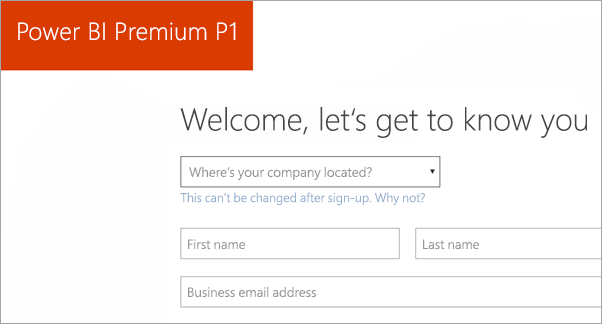
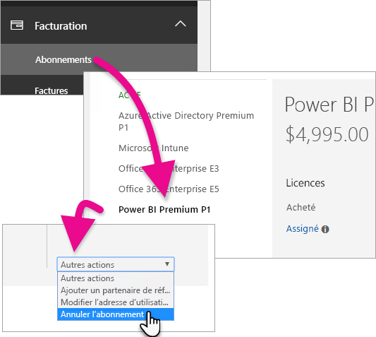
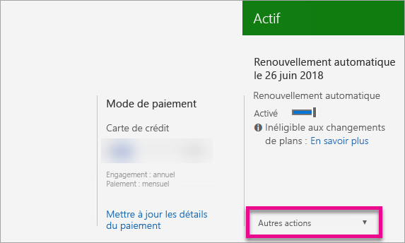

# Acheter Power BI Premium
Apprenez-en davantage sur l’achat de la capacité Power BI Premium pour votre organisation.

<iframe width="640" height="360" src="https://www.youtube.com/embed/NkvYs5Qp4iA?rel=0&amp;showinfo=0" frameborder="0" allowfullscreen></iframe>

Vous pouvez acheter un nœud de capacité Power BI Premium via le Centre d’administration Office 365. Vous pouvez également avoir une combinaison quelconque de références SKU de capacité Premium (P1 à P3) au sein de votre organisation. Elles fournissent différentes capacités de ressources.

Pour plus d’informations sur Power BI Premium, consultez [Qu’est-ce que Power BI Premium ?](service-premium.md). Pour connaître les prix actuels de Power BI, consultez [Tarification](https://powerbi.microsoft.com/pricing/). Vous pouvez également planifier vos coûts pour Power BI Premium à l’aide de la [Calculatrice Power BI Premium](https://powerbi.microsoft.com/calculator/).

> [!IMPORTANT]
> Les auteurs de contenu ont toujours besoin d’une licence Power BI Pro, même s’ils achètent Power BI Premium.
> 
> 

## Créer un locataire avec Power BI Premium P1
Si vous ne disposez pas déjà d’un locataire et que vous voulez en créer un, vous pouvez acheter Power BI Premium en même temps. Le lien suivant vous guide lors du processus de création d’un locataire pour une utilisation avec Office 365 et vous permet d’acheter Power BI Premium. Une fois que le locataire est créé, vous devez acheter une licence Power BI Pro pour un utilisateur. Lorsque vous créez votre locataire, vous en êtes automatiquement l’administrateur général.

Pour effectuer cet achat, référez-vous à l’[offre Power BI Premium P1](https://signup.microsoft.com/Signup?OfferId=b3ec5615-cc11-48de-967d-8d79f7cb0af1).

## Acheter une capacité Power BI Premium pour votre organisation
Si vous avez déjà une organisation, pour pouvoir acheter des abonnements et des licences, vous devez être Administrateur général ou Administrateur de facturation. Pour plus d’informations, consultez [À propos des rôles d’administrateur Office 365](https://support.office.com/article/About-Office-365-admin-roles-da585eea-f576-4f55-a1e0-87090b6aaa9d).

Pour acheter une capacité Premium, vous devez procédez comme suit.

1. Dans le service Power BI, choisissez le **sélecteur d’application Office 365** > **Admin**. Vous pouvez également accéder au Centre d’administration Office 365. Pour ce faire, ouvrez la page https://portal.office.com et sélectionnez **Admin**.
   
    
2. Sélectionnez **Facturation** > **Acheter des services**.
3. Sous **Autres offres**, recherchez les offres Power BI Premium. Celles-ci s’affichent sous les noms P1 à P3, EM3 et P1 (de mois en mois).
4. Positionnez le curseur sur les **points de suspension (...)** , puis sélectionnez **Acheter maintenant**.
   
    
5. Suivez les étapes pour terminer l’achat.

Vous pouvez également sélectionner les liens suivants pour accéder directement aux pages d’achat de ces éléments. Pour plus d’informations sur ces références SKU, consultez [Qu’est-ce que Power BI Premium ?](service-premium.md#premiumskus).

Pour acheter la référence SKU Power BI Premium, ***vous devez être Administrateur général ou Administrateur de facturation*** de votre locataire. La sélection des liens ci-dessous génère une erreur si vous n’êtes pas administrateur.

| Liens pour un achat direct |
| --- |
| [Référence EM3 (de mois en mois)](https://portal.office.com/commerce/completeorder.aspx?OfferId=4004702D-749C-4F74-BF47-3048F1833780&adminportal=1) |
| [Référence P1](https://portal.office.com/commerce/completeorder.aspx?OfferId=b3ec5615-cc11-48de-967d-8d79f7cb0af1&adminportal=1) |
| [Référence P1 (de mois en mois)](https://portal.office.com/commerce/completeorder.aspx?OfferId=E4C8EDD3-74A1-4D42-A738-C647972FBE81&adminportal=1) |
| [Référence P2](https://portal.office.com/commerce/completeorder.aspx?OfferId=062F2AA7-B4BC-4B0E-980F-2072102D8605&adminportal=1) |
| [Référence P3](https://portal.office.com/commerce/completeorder.aspx?OfferId=40c7d673-375c-42a1-84ca-f993a524fed0&adminportal=1) |

Une fois l’achat terminé, l’écran Acheter des services indique que l’élément est acheté et actif.

Vous pouvez à présent gérer cette capacité au sein du Centre d’administration Power BI. Pour plus d’informations, consultez [Gérer Power BI Premium](service-admin-premium-manage.md).

## Acheter davantage de capacités
Dans la section **Paramètres Premium** du portail d’administration Power BI, si vous êtes administrateur, vous pouvez voir le bouton **Acheter plus**. Ce bouton vous dirige vers le portail Microsoft Office 365. Une fois dans le Centre d’administration Office 365, vous pouvez effectuer les opérations suivantes.

1. Sélectionnez **Facturation** > **Acheter des services**.
2. Recherchez l’élément Power BI Premium que vous souhaitez acheter en plus grand nombre sous **Autres offres**.
3. Positionnez le curseur sur les **points de suspension (...)** , puis sélectionnez **Modifier la quantité de licences**.
   
    
4. Modifiez le nombre d’instances dont vous souhaitez disposer pour cet élément. Lorsque vous avez terminé, sélectionnez **Soumettre** une fois.
   
   > [!IMPORTANT]
   > La sélection de **Soumettre** entraîne le prélèvement de frais sur la carte bancaire enregistrée.
   > 
   > 

La page **Acheter des services** indique ensuite le nombre d’instances dont vous disposez. Dans le portail d’administration Power BI, sous **Paramètres de capacité**, les v-cores disponibles reflètent la nouvelle capacité achetée.

Vous pouvez à présent gérer cette capacité au sein du Centre d’administration Power BI. Pour plus d’informations, consultez [Gérer Power BI Premium](service-admin-premium-manage.md).

## Annuler votre abonnement
Vous pouvez annuler votre abonnement à partir du centre d’administration Office 365. Pour annuler votre abonnement Premium, procédez comme suit.

1. Accédez au Centre d’administration Office 365.
2. Sélectionnez **Facturation** > **Abonnements**.
3. Dans la liste, sélectionnez votre abonnement Power BI Premium.
4. Dans la liste déroulante **Autres actions**, sélectionnez **Annuler l’abonnement**.
   
    
5. La page **Annuler l’abonnement** indique si vous devez régler des [frais d’arrêt anticipé](https://support.office.com/article/early-termination-fees-6487d4de-401a-466f-8bc3-c0beb5cc40d3). Cette page vous permet aussi de savoir quand les données sont supprimées de l’abonnement.
6. Lisez les informations et si vous souhaitez continuer, sélectionnez **Annuler l’abonnement**.

## Étapes suivantes
[Tarification de Power BI](https://powerbi.microsoft.com/pricing/)  
[Calculatrice Power BI Premium](https://powerbi.microsoft.com/calculator/)  
[Qu’est-ce que Power BI Premium ?](service-premium.md)  
[Gérer Power BI Premium](service-admin-premium-manage.md)  
[Questions fréquentes Power BI Premium](service-premium-faq.md)  
[Notes de publication Power BI Premium](service-premium-release-notes.md)  
[Livre blanc sur Microsoft Power BI Premium](https://aka.ms/pbipremiumwhitepaper)  
[Livre blanc Planification d’un déploiement de Power BI en entreprise](https://aka.ms/pbienterprisedeploy)  
[Portail d’administration Power BI](service-admin-portal.md)  
[Administration de Power BI dans votre organisation](service-admin-administering-power-bi-in-your-organization.md)  

D’autres questions ? [Essayez d’interroger la communauté Power BI](http://community.powerbi.com/)

