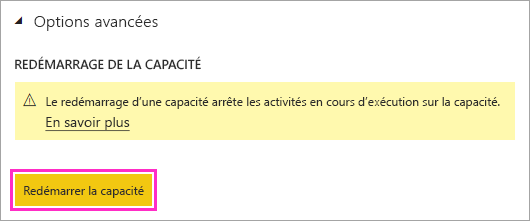

# Redémarrer une capacité Power BI Premium

En tant qu’un administrateur Power BI, vous pouvez avoir besoin de redémarrer une capacité Premium. Cet article explique comment redémarrer une capacité et répond à plusieurs questions sur les performances et le redémarrage.

## Pourquoi cette option est-elle fournie par Power BI ?

Power BI offre aux utilisateurs la possibilité d’effectuer des analyses complexes sur des quantités gigantesques de données. Malheureusement, ces utilisateurs peuvent provoquer des problèmes de performance en surchargeant le service Power BI avec des travaux, en écrivant des requêtes trop complexes, en créant des références circulaires, etc.

La capacité partagée de Power BI assure une certaine protection contre de telles situations en imposant des limites sur les tailles de fichiers, les planifications d’actualisation et d’autres aspects du service. En revanche, dans une capacité Power BI Premium, la plupart de ces limites sont augmentées. Par conséquent, un seul rapport contenant une expression DAX incorrecte ou un modèle très complexe peut entraîner d’importants problèmes de performance. Lors de son traitement, le rapport peut consommer toutes les ressources disponibles sur la capacité. 

Power BI s’améliore constamment dans la manière de protéger les utilisateurs de la capacité Premium contre ces problèmes. Nous mettons également à la disposition des administrateurs les outils nécessaires pour analyser à quels moments et pourquoi les capacités sont surchargées. Pour plus d’informations, consultez notre [session de formation courte](https://www.youtube.com/watch?v=UgsjMbhi_Bk&feature=youtu.be) et notre [session de formation longue](https://www.microsoft.com/businessapplicationssummit/video/BAS2018-2174). En même temps, vous avez besoin d’être en mesure d’atténuer ces problèmes majeurs dès qu’ils se produisent. Le moyen le plus rapide pour cela consiste à redémarrer la capacité.

## Le processus de redémarrage est-il sûr ? Vais-je perdre des données ?

Tous les tableaux de bord, rapports, données, définitions qui sont enregistrés sur votre capacité sont totalement intacts après un redémarrage. Quand vous redémarrez une capacité, toutes les planifications en cours et actualisations ad-hoc sont arrêtées. Le service tente une nouvelle actualisation quand la capacité est disponible. Les utilisateurs qui interagissent avec la capacité perdent tout travail non enregistré. Il est donc préférable qu’ils actualisent leurs navigateurs une fois le redémarrage terminé.

## Comment redémarrer une capacité ?

Suivez ces étapes pour redémarrer une capacité.

1. Dans le portail d’administration Power BI, sous l’onglet **Paramètres de capacité**, accédez à votre capacité. 

1. Ajoutez l’*indicateur de fonctionnalité* **CapacityRestart** à l’URL de votre capacité : https://app.powerbi.com/admin-portal/capacities/<YourCapacityId>?capacityRestartButton=true.

1. Sous **Paramètres avancés** > **Redémarrage de la capacité**, sélectionnez **Redémarrer la capacité**.

    

1. Dans la boîte de dialogue **Redémarrage de la capacité**, sélectionnez **Oui, redémarrer la capacité**.

    

## Comment empêcher d’autres problèmes à l’avenir ?

La meilleure façon d’éviter ces problèmes consiste à former les utilisateurs à une modélisation efficace des données. Pour plus d’informations, consultez notre [session de formation](https://www.microsoft.com/businessapplicationssummit/video/BAS2018-2170).

Nous vous recommandons également de [superviser vos capacités](service-admin-premium-monitor-capacity.md) régulièrement afin de rechercher d’éventuelles tendances indiquant des problèmes sous-jacents. Nous prévoyons des versions régulières de l’application de supervision et d’autres outils afin de vous permettre de superviser et gérer vos capacités plus efficacement.

## Étapes suivantes

[Qu’est-ce que Power BI Premium ?](service-premium-what-is.md)

D’autres questions ? [Essayez d’interroger la communauté Power BI](http://community.powerbi.com/)
