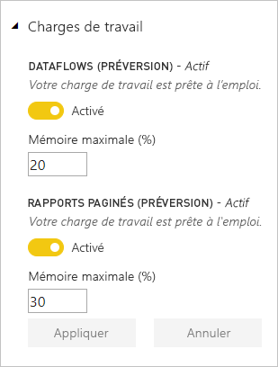

# Configurer des charges de travail dans une capacité Premium

Cet article décrit comment activer et configurer des charges de travail pour les capacités Power BI Premium. Par défaut, les capacités prennent en charge uniquement la charge de travail qui est associée aux requêtes Power BI en cours d’exécution. Vous pouvez également activer et configurer des charges de travail supplémentaires pour **[IA (Cognitive Services)](service-cognitive-services.md)**, **[Flux de données](service-dataflows-overview.md#dataflow-capabilities-on-power-bi-premium)** et **[Rapports paginés](paginated-reports-save-to-power-bi-service.md)**.

## Paramètres de mémoire par défaut

Les charges de travail de requête sont optimisées pour, et limitées par, les ressources déterminées par votre référence SKU de capacité Premium. Les capacités Premium prennent également en charge des charges de travail supplémentaires pouvant utiliser les ressources de votre capacité. Les valeurs de mémoire par défaut pour ces charges de travail dépendent des nœuds de capacité disponibles pour votre référence SKU. Les paramètres de mémoire maximale ne sont pas cumulés. La mémoire, à hauteur de la valeur maximale spécifiée, est allouée de façon dynamique pour l’IA et les dataflows, mais allouée de façon statique pour les rapports paginés. 

### Références (SKU) Microsoft Office pour les scénarios SaaS (Software as a Service)

|                     | EM2                      | EM3                       | P1                      | P2                       | P3                       |
|---------------------|--------------------------|--------------------------|-------------------------|--------------------------|--------------------------|
| IA (Cognitive Services) | 20 % par défaut ; mini TBD| 20 % par défaut ; mini TBD | 20 % par défaut ; mini TBD | 20 % par défaut ; mini TBD | 20 % par défaut ; mini TBD |
| Flux de données | N/A |20 % par défaut ; 12 % minimum  | 20 % par défaut ; 5 % minimum  | 20 % par défaut ; 3 % minimum | 20 % par défaut ; 2 % minimum  |
| Rapports paginés | N/A |N/A | 20 % par défaut ; 10 % minimum | 20 % par défaut ; 5 % minimum | 20 % par défaut ; 2,5 % minimum |
| | | | | | |

### Références (SKU) Microsoft Azure pour les scénarios PaaS (Platform as a Service)

|                  | A1                       | A2                       | A3                      | A4                       | A5                      | A6                        |
|-------------------|--------------------------|--------------------------|-------------------------|--------------------------|-------------------------|---------------------------|
| IA (Cognitive Services) | N/A                      | 20 % par défaut ; mini TBD                      | 20 % par défaut ; mini TBD                     | 20 % par défaut ; mini TBD | 20 % par défaut ; mini TBD | 20 % par défaut ; mini TBD |
| Flux de données         | 40 % par défaut ; 40 % minimum | 24 % par défaut ; 24 % minimum | 20 % par défaut ; 12 % minimum | 20 % par défaut ; 5 % minimum  | 20 % par défaut ; 3 % minimum | 20 % par défaut ; 2 % minimum   |
| Rapports paginés | N/A                      | N/A                      | N/A                     | 20 % par défaut ; 10 % minimum | 20 % par défaut ; 5 % minimum | 20 % par défaut ; 2,5 % minimum |
| | | | | | |

## Configurer des charges de travail

Optimisez les ressources disponibles de votre capacité en activant uniquement les charges de travail qui seront utilisées. Ne modifiez les paramètres de mémoire que si vous avez constaté que les paramètres par défaut ne répondent pas aux besoins en ressources de votre capacité de mémoire.  

### Pour configurer des charges de travail dans le portail d’administration Power BI

1. Dans **Paramètres de capacité** > **CAPACITÉS PREMIUM**, sélectionnez une capacité.

1. Sous **PLUS D’OPTIONS**, développez **Charges de travail**.

1. Activer une ou plusieurs charges de travail et définir une valeur de **Mémoire maximale**.   

    
    

1. Cliquez sur **Appliquer**.

> [!NOTE]
> Si vous activez la charge de travail des rapports paginés, les rapports paginés vous permettent d’exécuter votre propre code lors de la génération d’un rapport (par exemple, pour changer dynamiquement la couleur du texte en fonction du contenu). Power BI Premium génère les rapports paginés dans un espace contenu au sein de la capacité. La mémoire maximale attribuée à cet espace est utilisée, que la charge de travail soit activée ou non. Si vous utilisez des rapports Power BI ou des flux de données dans la même capacité, veillez à définir pour les rapports paginés une mémoire suffisamment faible qui n’affecte pas négativement les autres charges de travail. dans de rares cas, la charge de travail des rapports paginés peut devenir indisponible. La charge de travail affiche alors un état d’erreur dans le portail d’administration, et les utilisateurs voient des délais d’expiration pour la génération des rapports. Pour résoudre ce problème, désactivez la charge de travail, puis réactivez-la.

### API REST

Les charges de travail peuvent être activées et attribuées à une capacité à l’aide des API REST [Capacités](https://docs.microsoft.com/rest/api/power-bi/capacities).

## Surveillance des charges de travail

L’[application Métriques de capacité Power BI Premium](service-admin-premium-monitor-capacity.md) fournit un jeu de données, des flux de données et des métriques de rapports paginés afin de surveiller les charges de travail activées pour vos capacités. 

## Étapes suivantes

[Gestion et optimisation des ressources de capacité de Power BI Premium](service-premium-understand-how-it-works.md)   
[Préparation des données en libre-service dans Power BI avec des dataflows](service-dataflows-overview.md)   
[Présentation des rapports paginés dans Power BI Premium](paginated-reports-report-builder-power-bi.md)   

D’autres questions ? [Poser des questions à la communauté Power BI](http://community.powerbi.com/)