# Acheter et attribuer des licences utilisateur Power BI Pro

Power BI Pro est une licence utilisateur individuelle qui permet aux utilisateurs de lire et d’interagir avec des rapports et des tableaux de bord que d’autres utilisateurs ont publiés dans le service Power BI, et de partager du contenu et de collaborer avec d’autres utilisateurs Power BI Pro. Seuls les utilisateurs disposant d’une licence utilisateur Power BI Pro peuvent publier ou partager du contenu avec d’autres utilisateurs ou consommer du contenu créé par d’autres utilisateurs, sauf si ce contenu est hébergé dans une capacité Power BI Premium. Pour plus d’informations, consultez [Fonctionnalités de Power BI par type de licence](service-features-license-type.md).

## Acheter et attribuer des licences utilisateur Power BI Pro

Cet article explique comment acheter des licences utilisateur Power BI Pro dans le Centre d’administration Microsoft 365, puis explique deux options des administrateurs pour attribuer ces licences à des utilisateurs individuels : dans le Centre d’administration Microsoft 365 et dans le portail Azure (choisissez une option).

### Conditions préalables

Pour acheter et attribuer des licences dans le Centre d’administration Microsoft 365, vous devez être membre du rôle **[Administrateur général ou Administrateur de facturation](https://support.office.com/article/about-office-365-admin-roles-da585eea-f576-4f55-a1e0-87090b6aaa9d)** dans Microsoft 365.

Pour attribuer des licences dans le portail Azure, vous devez être propriétaire de l’abonnement Azure utilisé par Power BI pour les recherches Azure Active Directory.

### Acheter des licences dans Microsoft 365

Suivez ces étapes pour acheter des licences Power BI Pro dans le Centre d’administration Microsoft 365 :

1. Ouvrez le [Centre d’administration Microsoft 365](https://portal.office.com/adminportal/home#/homepage).

2. Dans le volet de navigation, sélectionnez **Facturation** > **Abonnements**.

    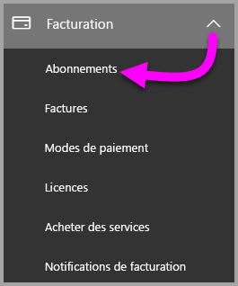

3. Dans le coin supérieur droit de la page **Abonnements**, cliquez sur **Ajouter des abonnements**.

    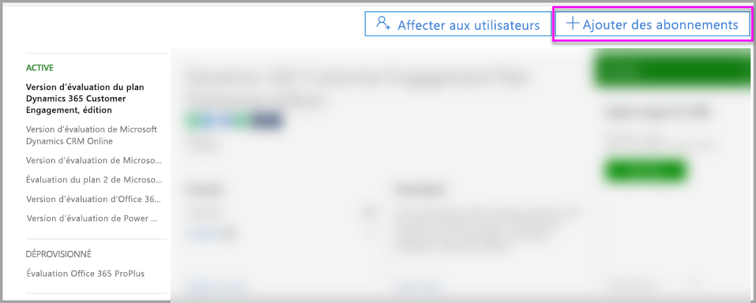

4. Recherchez l’offre d’abonnement souhaitée :

    Sous **Enterprise Suite**, sélectionnez **Office 365 Entreprise E5**.

    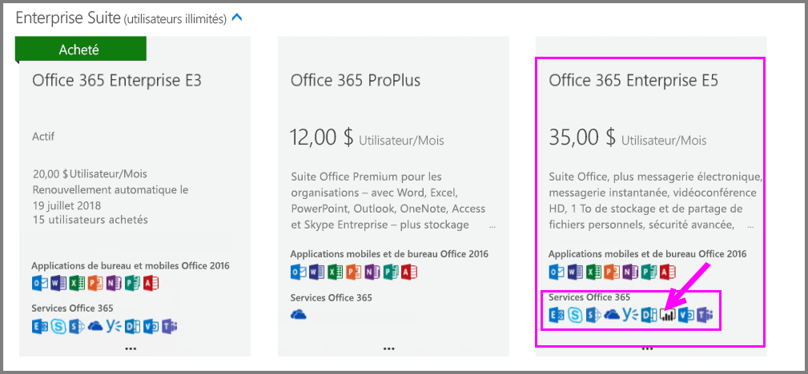

    Sous **Autres forfaits**, sélectionnez **Power BI Pro**.

    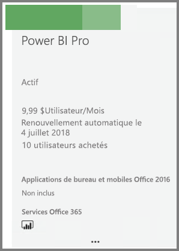

5. Placez le curseur sur les points de suspension ( **. . .** ) pour l’abonnement souhaité et sélectionnez **Acheter maintenant**.

    

6. Choisissez **Paiement mensuel** ou **Paiement pour toute une année**, en fonction de vos préférences de facturation.

7. Sous **Combien d’utilisateurs voulez-vous ?** , entrez le nombre de licences souhaité, puis sélectionnez **Commander maintenant** pour finaliser la transaction.

8. Vérifiez que l’abonnement acquis apparaît maintenant sur la page **Abonnements**.

   

9. Pour ajouter d’autres licences après l’achat initial, sélectionnez **Power BI Pro** sur la page **Abonnements**, puis **Ajouter/supprimer des licences**.

### Attribuer des licences dans le Centre d’administration Microsoft 365

Suivez ces étapes pour affecter des licences Power BI Pro à des comptes d’utilisateur individuels :

1. Ouvrez le [Centre d’administration Microsoft 365](https://portal.office.com/adminportal/home#/homepage).

2. Dans le volet de navigation, développez **Utilisateurs**, puis sélectionnez **Utilisateurs actifs**.

    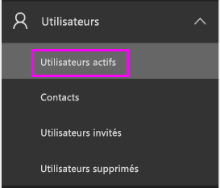

3. Sélectionnez un utilisateur puis, sous **Licences**, choisissez **Modifier**.

    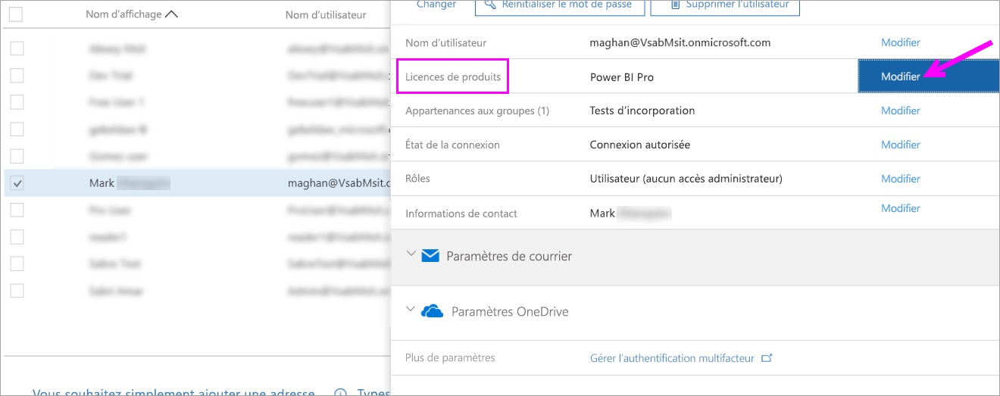

4. Sous **Power BI Pro**, faites passer la valeur à **Activé**, puis sélectionnez **Enregistrer**.

    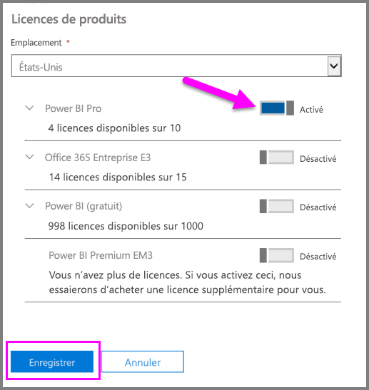

5. Sous **État** pour le compte sélectionné, vérifiez que la licence Power BI Pro a été affectée.

    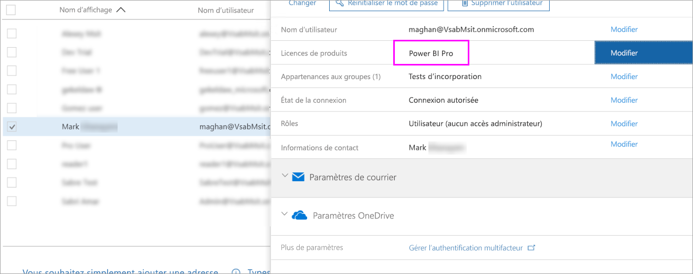

### Attribuer des licences dans le portail Azure

Suivez ces étapes pour affecter des licences Power BI Pro à des comptes d’utilisateur individuels :

1. Accédez au [portail Azure](https://ms.portal.azure.com/#@microsoft.onmicrosoft.com/dashboard/private/39bc3cf7-31a4-43f6-954c-f2d69ca2f0).

2. Dans le volet de navigation, sélectionnez **Azure Active Directory**.

    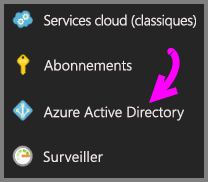

3. Sous **Azure Active Directory**, sélectionnez **Licences**.

    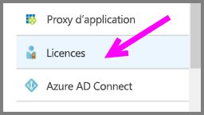

4. Sous **Licences**, sélectionnez **Tous les produits**, puis **Power BI Pro** pour afficher la liste des utilisateurs avec licence.

    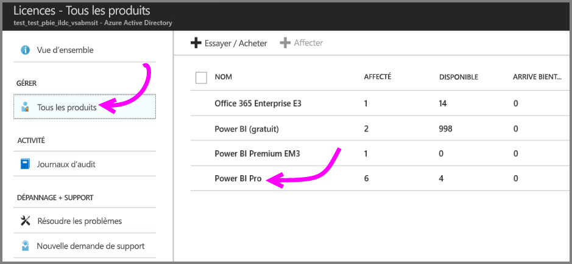

5. Sélectionnez **Attribuer** pour ajouter une licence Power BI Pro à un compte d’utilisateur.

    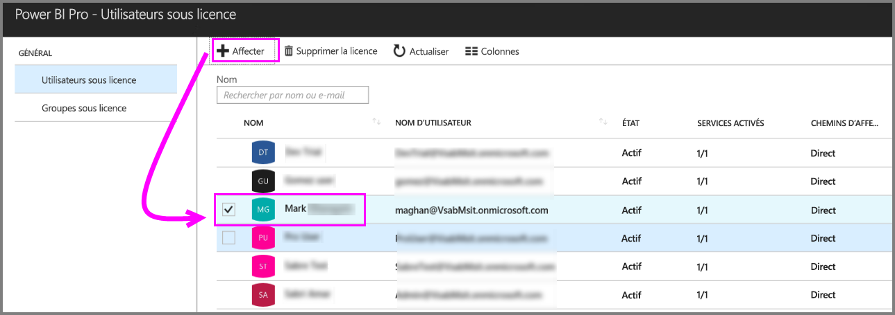

## Étapes suivantes

Maintenant que vous avez affecté des licences, découvrez plus en détail Power BI Pro.

[Gestion des licences Power BI dans votre organisation](service-admin-licensing-organization.md)

[Rechercher les utilisateurs Power BI qui se sont connectés](service-admin-access-usage.md)

D’autres questions ? [Essayez d’interroger la communauté Power BI](https://community.powerbi.com/)
