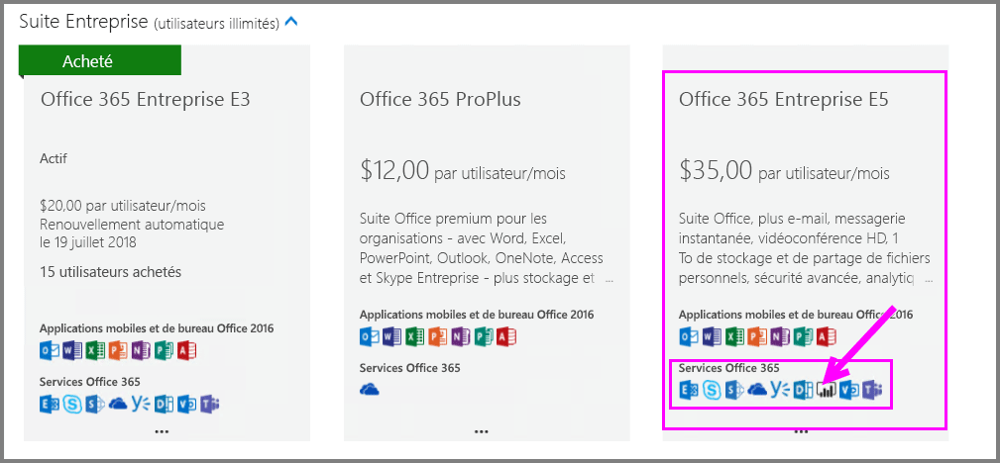
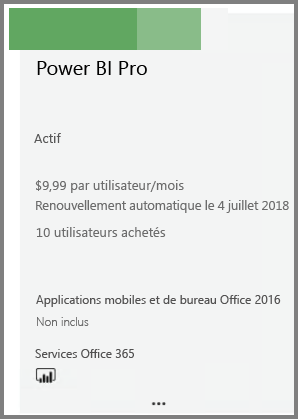
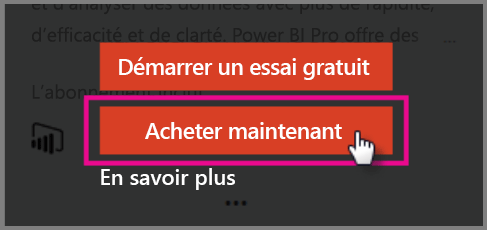
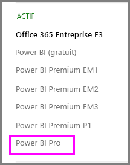

# Démarrage rapide : Acheter des licences Power BI Pro

Power BI Pro est une licence individuelle qui autorise l’accès à la totalité du contenu et des fonctionnalités du service Power BI, y compris la possibilité de partager du contenu et de collaborer avec d’autres utilisateurs Pro. Seuls les utilisateurs Pro peuvent publier et consulter du contenu sur des espaces de travail d’application, partager des tableaux de bord et s’abonner à des rapports et à des tableaux de bord. Cet article explique comment acheter des licences Power BI Pro dans Office 365.

## Conditions préalables

Vous devez être membre du rôle [**Administrateur général** ou **Administrateur de facturation**](https://support.office.com/article/about-office-365-admin-roles-da585eea-f576-4f55-a1e0-87090b6aaa9d?ui=en-US&rs=en-US&ad=US) dans Office 365. 

## Acheter des licences Power BI Pro dans Office 365

Suivez ces étapes pour acheter des licences Power BI Pro :

1. Ouvrez le [Centre d’administration Office 365](https://portal.office.com/adminportal/home#/homepage).

2. Dans le volet de navigation de gauche, sélectionnez **Facturation** > **Abonnements**.

    

3. Dans le coin supérieur droit de la page **Abonnements**, cliquez sur **Ajouter des abonnements**.

    

4. Recherchez l’offre d’abonnement souhaitée :

    Sous **Enterprise Suite**, sélectionnez **Office 365 Entreprise E5**.

    

    Sous **Autres forfaits**, sélectionnez **Power BI Pro**.

    

5. Placez le curseur sur les points de suspension (...) de l’abonnement souhaité et sélectionnez **Acheter maintenant**.

    

6. Choisissez **Paiement mensuel** ou **Paiement pour toute une année**, en fonction de vos préférences de facturation.

7. Sous **Combien d’utilisateurs voulez-vous ?**, entrez le nombre de licences souhaité, puis sélectionnez **Commander maintenant** pour finaliser la transaction.

8. Vérifiez que l’abonnement acquis apparaît maintenant sur la page **Abonnements**.

   

9. Pour ajouter d’autres licences après l’achat initial, sélectionnez **Power BI Pro** sur la page **Abonnements**, puis **Ajouter/supprimer des licences**.

## Étapes suivantes

Maintenant que vous avez acheté des licences, affectez-les aux utilisateurs de votre client.

[Affecter des licences aux utilisateurs dans Office 365](service-admin-assigning-power-bi-pro-licenses.md)

[Affecter des licences aux utilisateurs dans Azure](service-admin-assigning-power-bi-pro-licenses-azure.md)

[Prix de Power BI](https://powerbi.microsoft.com/en-us/pricing/)
