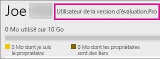

# Achat de Power BI Pro
Power BI Pro s’adresse aux utilisateurs qui publient des rapports, partagent des tableaux de bord, collaborent avec des collègues dans des espaces de travail et sont impliqués dans d’autres activités connexes, par exemple :

* Analyser des données dans Excel ou Power BI Desktop
* Partager avec la prise en charge d’Excel Web App
* Partager des tableaux de bord et collaborer avec des espaces de travail d’application
* Afficher le contenu partagé
* intégration de contenu avec Microsoft Teams.

Les administrateurs IT disposent de différentes options pour utiliser Power BI Pro au sein de votre organisation. Vous pouvez acheter Power BI Pro dans le centre d’administration Office 365 ou auprès de votre représentant ou partenaire Microsoft. Cet article s’intéresse aux deux versions d’essai disponibles pour Power BI Pro et aux possibilités d’achat de Power BI Pro en tant qu’organisation.

Pour plus d’informations sur Power BI Premium, et sur l’inclusion de Power BI Pro dans l’offre Premium, consultez [Qu’est-ce que Power BI Premium ?](service-premium.md).

## Tarification
Pour obtenir les informations de tarification les plus récentes de Power Pro et la liste des fonctionnalités intégrées, consultez [Tarification de Power BI](https://powerbi.microsoft.com/pricing/).

## Essai gratuit de 60 jours de Power BI Pro pour les particuliers
Une fois votre compte gratuit créé, vous avez la possibilité d’essayer gratuitement la version Pro pendant 60 jours. Vous aurez accès à toutes les fonctionnalités de la version Pro pendant toute la durée de la version d’évaluation. Power BI Pro dispose de toutes les fonctionnalités de la version gratuite de Power BI, ainsi que de fonctionnalités de partage et de collaboration supplémentaires. Pour plus d’informations, consultez [Tarification de Power BI](https://powerbi.microsoft.com/pricing). Pour essayer une version d’évaluation gratuite de 60 jours de Power BI Pro, connectez-vous à Power BI et essayez l’une des fonctionnalités Power BI Pro suivantes :

* [Créer un espace de travail d’application](service-create-distribute-apps.md)
* [Partager un tableau de bord](service-share-dashboards.md)

Lorsque vous essayez l’une de ces fonctionnalités, vous êtes invité à démarrer votre version d’évaluation gratuite. Vous pouvez sélectionner manuellement cette option en cliquant sur l’icône d’engrenage et en sélectionnant **Gérer le stockage personnel**. Sélectionnez ensuite **Essayez gratuitement la version Pro** sur la droite.

Vous pouvez ensuite sélectionner **Démarrer l’évaluation**.

> [!NOTE]
> Les utilisateurs bénéficiant de cette version d’évaluation Power BI Pro intégrée au produit n’apparaissent pas dans le portail d’administration d’Office 365 en tant qu’utilisateurs de la version d’évaluation Power BI Pro (ils apparaissent en tant qu’utilisateurs gratuits de Power BI). Ils apparaîtront toutefois en tant qu’utilisateurs de la version d’évaluation Pro Power BI dans la page **Gérer le stockage** de Power BI.

> [!NOTE]
> Si vous êtes un administrateur informatique souhaitant acquérir et déployer des licences d’évaluation Power BI pour plusieurs utilisateurs de votre organisation sans que les utilisateurs individuels aient à accepter les conditions de la version d’évaluation individuellement, vous pouvez vous inscrire à une [version d’évaluation Power BI Pro](https://portal.office.com/Signup/MainSignup15.aspx?OfferId=d59682f3-3e3b-4686-9c00-7c7c1c736085&dl=POWER_BI_PRO). Vous devez être un administrateur général ou de facturation d’Office 365, ou bien créer un nouveau client à inscrire à une version d’évaluation pour administrateur. Pour plus d’informations, consultez [Achat de Power BI Pro](service-admin-purchasing-power-bi-pro.md).

> [!NOTE]
> Avec la disponibilité de Power BI Premium et les modifications apportées à l’offre Power BI gratuite le 1 juin 2017, vous pouvez peut-être bénéficier de la version d’essai Pro prolongée. Pour plus d’informations, consultez [Activation de la version d’essai Pro prolongée](service-extended-pro-trial.md).

### Aperçu au sein du service
Une fois dans le service, vous pouvez vérifier que vous avez un compte professionnel d’essai gratuit en accédant à l’icône **d’engrenage** et en sélectionnant **Gérer le stockage personnel**.

## Abonnement à la version d’évaluation dans Office 365
Vous pouvez obtenir une version d’évaluation de Power BI Pro pour votre organisation. Une fois abonné, vous pouvez attribuer des licences Power BI Pro à vos utilisateurs. Pour plus d’informations sur l’affectation de licences, consultez [Attribuer des licences aux utilisateurs dans Office 365](https://support.office.com/article/Assign-or-unassign-licenses-for-Office-365-for-business-997596b5-4173-4627-b915-36abac6786dc).

> [!NOTE]
> Il existe une limite d’une version d’évaluation pour organisation par client. Cela signifie que, si une personne a déjà appliqué la version d’évaluation de Power BI Pro à votre client, vous ne pouvez plus le faire. Si vous avez besoin d’aide à ce sujet, vous pouvez contacter le [Support de facturation d’Office 365](https://support.office.microsoft.com/article/Contact-Office-365-for-business-support-Admin-Help-32a17ca7-6fa0-4870-8a8d-e25ba4ccfd4b?CorrelationId=552bbf37-214f-4202-80cb-b94240dcd671&ui=en-US&rs=en-US&ad=US#BKMK_call_support).
> 

1. Accédez au [Centre d’administration Office 365](https://portal.office.com/admin/default.aspx).
2. Dans le volet de navigation de gauche, sélectionnez Facturation > Abonnements.
3. Sélectionnez Ajouter des abonnements +, sur la droite.
4. Dans Autres plans, survolez l’ellipse (…) pour Power BI Pro et sélectionnez Démarrer la version d’évaluation gratuite.
   
    
5. Dans la fenêtre de confirmation de votre commande, sélectionnez Essayer maintenant.
6. Sélectionnez Continuer sur le reçu de la commande.

Dans **Facturation** > **Abonnements**, vous verrez **Version d’évaluation de Power BI Pro** avec 25 licences disponibles. Cette version d’évaluation est valide pendant un mois.

### Aperçu au sein du service
Une fois dans le service, vous pouvez vous assurer de disposer d’un compte Pro en accédant à l’icône d’**engrenage** et en sélectionnant **Gérer le stockage personnel**. Rien n’indique qu’il s’agit d’une version d’évaluation.

## Achat d’un abonnement dans Office 365
Vous pouvez acheter Power BI Pro pour votre organisation via le centre d’administration Office 365. Une fois abonné, vous pouvez attribuer des licences Power BI Pro à vos utilisateurs. Pour plus d’informations sur l’affectation de licences, consultez [Attribuer des licences aux utilisateurs dans Office 365](https://support.office.com/article/Assign-or-unassign-licenses-for-Office-365-for-business-997596b5-4173-4627-b915-36abac6786dc).

1. Accédez au [Centre d’administration Office 365](https://portal.office.com/admin/default.aspx).
2. Dans le volet de navigation de gauche, sélectionnez Facturation > Abonnements.
3. Sélectionnez Ajouter des abonnements +, sur la droite.
4. Dans Autres plans, survolez l’ellipse (…) pour Power BI Pro et sélectionnez Acheter maintenant.
   
    
5. Entrez le nombre de licences que vous souhaitez ajouter, puis sélectionnez Achat rapide ou Ajouter au panier.
   
   > [!NOTE]
   > Vous pouvez ajouter plus d’articles ultérieurement, si nécessaire.
   > 
   > 
6. Entrez les informations nécessaires lors de la procédure d’achat.

> [!NOTE]
> Si vous disposez déjà de la version d’évaluation de Power BI Pro, vous êtes directement dirigé vers la fenêtre de paiement où vous êtes invité à entrer le nombre de licences souhaitées.
> 
> 

Dans **Facturation** > **Abonnements**, **Power BI Pro** est répertorié. Si, par la suite, vous souhaitez ajouter d’autres licences, vous pouvez revenir à l’option **Ajouter des abonnements** et sélectionner **Modifier le nombre de licences**.

### Aperçu au sein du service
Une fois dans le service, vous pouvez vous assurer de disposer d’un compte Pro en accédant à l’icône d’**engrenage** et en sélectionnant **Gérer le stockage personnel**.

## Période de grâce
Il existe une période de grâce de 30 jours après l’expiration d’une licence Power BI Pro. 

L’abonnement Power BI Pro dispose du même cycle de vie qu’Office 365. Pour plus d’informations, consultez [Qu’arrive-t-il à mes données et à mon accès à la fin de mon abonnement Office 365 pour les entreprises ?](https://support.office.com/en-us/article/What-happens-to-my-data-and-access-when-my-Office-365-for-business-subscription-ends-4436582f-211a-45ec-b72e-33647f97d8a3)

## Étapes suivantes
[Inscription en libre-service à Power BI](service-self-service-signup-for-power-bi.md)  
[Power BI (gratuit) dans votre organisation](service-admin-service-free-in-your-organization.md)  
[Activation de la version d’essai Pro prolongée](service-extended-pro-trial.md)  
[Qu’est-ce que Power BI Premium ?](service-premium.md)  
[Acheter Power BI Premium](service-admin-premium-purchase.md)  
[Livre blanc sur Power BI Premium](https://aka.ms/pbipremiumwhitepaper)  

D’autres questions ? [Essayez d’interroger la communauté Power BI](http://community.powerbi.com/)

