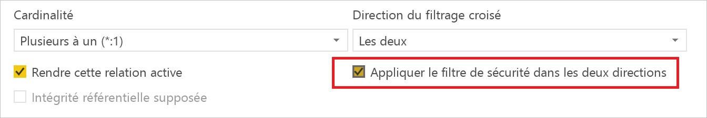
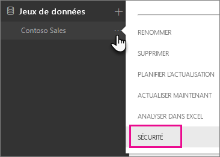
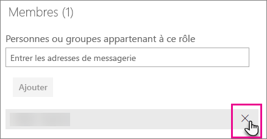

# Sécurité au niveau des lignes avec Power BI

La sécurité au niveau des lignes avec Power BI peut être utilisée pour restreindre l’accès aux données pour certains utilisateurs. Les filtres limitent l’accès aux données au niveau des lignes, et vous pouvez définir des filtres dans des rôles. N’oubliez pas que, dans le service Power BI, les membres d’un espace de travail ont accès aux jeux de données de l’espace de travail. La sécurité au niveau des lignes (SNL) ne restreint pas cet accès aux données.

Vous pouvez configurer la sécurité au niveau des lignes (SNL) pour les modèles de données importés dans Power BI avec Power BI Desktop. Vous pouvez également configurer la sécurité au niveau des lignes sur les jeux de données qui utilisent DirectQuery, tels que SQL Server. Auparavant, vous pouviez uniquement implémenter la sécurité au niveau des lignes dans les modèles Analysis Services locaux en dehors de Power BI. Pour les connexions actives Analysis Services, la sécurité au niveau des lignes doit être configurée sur le modèle local. L’option de sécurité ne s’affiche pas pour les jeux de données d’une connexion active.

[!INCLUDE [include-short-name](./includes/rls-desktop-define-roles.md)]

Par défaut, le filtrage de la sécurité au niveau des lignes utilise des filtres unidirectionnels, même si les relations sont définies à sens unique ou bidirectionnel. Vous pouvez activer manuellement le filtrage croisé bidirectionnel avec une sécurité au niveau des lignes en sélectionnant la relation et en cochant la case **Appliquer le filtre de sécurité dans les deux directions**. Vous devez cocher cette case lors de l’implémentation de la [sécurité dynamique au niveau des lignes](https://docs.microsoft.com/sql/analysis-services/supplemental-lesson-implement-dynamic-security-by-using-row-filters), où la sécurité au niveau des lignes est définie en fonction de l’ID de connexion ou du nom d’utilisateur.

Pour plus d’informations, consultez [Filtrage croisé bidirectionnel avec DirectQuery dans Power BI Desktop](desktop-bidirectional-filtering.md) et [Sécurisation du modèle sémantique BI tabulaire](http://download.microsoft.com/download/D/2/0/D20E1C5F-72EA-4505-9F26-FEF9550EFD44/Securing%20the%20Tabular%20BI%20Semantic%20Model.docx).

[!INCLUDE [include-short-name](./includes/rls-desktop-view-as-roles.md)]

## Gérer la sécurité sur votre modèle

Pour gérer la sécurité sur votre modèle de données, vous devez effectuer les opérations suivantes.

1. Cliquez sur les **points de suspension (…)** d’un jeu de données.
2. Sélectionnez **Sécurité**.
   
   

Cette action vous dirige vers la page de la fonctionnalité Sécurité au niveau des lignes pour ajouter des membres à un rôle que vous avez créé dans Power BI Desktop. L’option Sécurité est disponible uniquement pour les propriétaires du jeu de données. Si le jeu de données se trouve dans un groupe, seuls les administrateurs de ce groupe verront l’option de sécurité. 

Vous pouvez uniquement créer ou modifier des rôles dans Power BI Desktop.

## Utilisation des membres

### Ajouter des membres

Vous pouvez ajouter un membre au rôle en entrant l’adresse de messagerie ou le nom de l’utilisateur, du groupe de sécurité ou de la liste de distribution que vous voulez ajouter. Le membre doit faire partie de votre organisation. Vous ne pouvez pas ajouter les groupes qui ont été créés dans Power BI.

Vous pouvez également voir combien de membres font partie du rôle grâce au nombre entre parenthèses situé en regard du nom du rôle ou en regard des membres.

### Supprimer des membres

Vous pouvez supprimer des membres en cliquant sur la croix correspondant à leur nom. 

## Validation du rôle au sein du service Power BI

Vous pouvez vérifier que le rôle que vous avez défini fonctionne correctement en le testant. 

1. Sélectionnez les **points de suspension (...)** situés en regard du rôle.
2. Sélectionnez **Tester les données comme rôle**

Vous verrez ensuite les rapports qui sont disponibles pour ce rôle. Les tableaux de bord ne s’affichent pas dans cette vue. Dans la barre bleue située au-dessus, vous voyez ce qui est appliqué.

Vous pouvez tester les autres rôles, ou une combinaison de rôles, en sélectionnant **Affichage actuel comme**.

Vous pouvez choisir d’afficher les données assignées à une personne spécifique, ou vous pouvez sélectionner une combinaison de rôles disponibles pour tester leur fonctionnement. 

Pour revenir à l’affichage normal, sélectionnez **Retour à la sécurité au niveau des lignes**.

[!INCLUDE [include-short-name](./includes/rls-usernames.md)]

## Utilisation de la sécurité au niveau des lignes (SNL) avec des espaces de travail d’applications dans Power BI

Si vous publiez votre rapport Power BI Desktop dans un espace de travail d’applications du service Power BI, les rôles sont appliqués aux membres en lecture seule. Vous devez alors indiquer dans les paramètres de l’espace de travail d’applications que les membres peuvent uniquement afficher du contenu Power BI.

> [!WARNING]
> Si vous avez configuré l’espace de travail d’applications afin que les membres disposent d’autorisations de modification, les rôles SNL ne s’appliquent pas à eux. Les utilisateurs sont en mesure de voir toutes les données.

[!INCLUDE [include-short-name](./includes/rls-limitations.md)]

[!INCLUDE [include-short-name](./includes/rls-faq.md)]

## Étapes suivantes
[Sécurité au niveau des lignes avec Power BI Desktop](desktop-rls.md)  

D’autres questions ? [Essayez d’interroger la communauté Power BI](http://community.powerbi.com/)