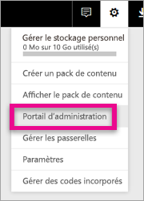
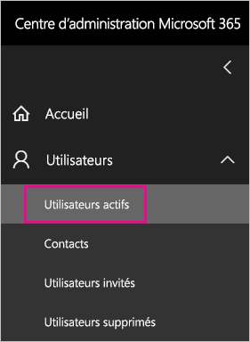
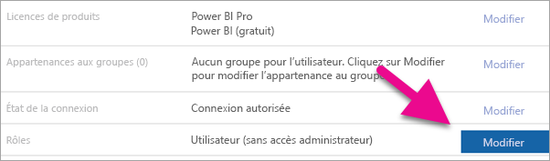
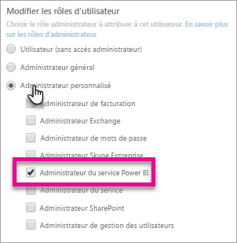
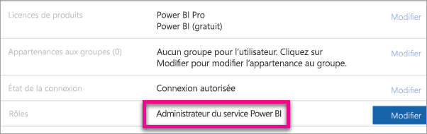

# <a name="understanding-the-power-bi-admin-role"></a>Présentation du rôle d’administrateur Power BI
Découvrez comment vous pouvez utiliser le rôle d’administrateur Power BI au sein de votre organisation.

<iframe width="640" height="360" src="https://www.youtube.com/embed/PQRbdJgEm3k?showinfo=0" frameborder="0" allowfullscreen></iframe>

Le rôle d’administrateur du service Power BI peut être affecté à des utilisateurs qui doivent pouvoir accéder au portail d’administration de Power BI, sans leur accorder d’autre accès administrateur à Office 365. Par exemple, le rôle Administrateur global. Le rôle d’administrateur de Service Power BI est destiné aux personnes chargées d’administrer Power BI pour leur organisation.

Des administrateurs d'utilisateurs Office 365 peuvent assigner des utilisateurs à des rôles d’administrateur de Power BI via le Centre d’administration Office 365 ou via un script PowerShell. Une fois qu’un utilisateur est assigné, il peut accéder au [portail d’administration Power BI](service-admin-portal.md). À partir de là, il a accès aux mesures d’utilisation du locataire et peut contrôler l’utilisation que celui-ci fait des fonctionnalités de Power BI.



## <a name="using-the-office-365-admin-center-to-assign-a-role"></a>Utilisation du Centre d’administration Office 365 pour attribuer un rôle
Pour affecter des utilisateurs au rôle d’administrateur de Power BI dans le Centre d’administration Office 365, vous pouvez procéder comme suit.

1. Accédez au Centre d’administration Office 365, puis sélectionnez **Utilisateurs** > **Utilisateurs actifs**.
   
    
2. Sélectionnez l’utilisateur que vous souhaitez assigner au rôle.
3. Sélectionnez **Modifier** pour les rôles.
   
    
4. Sélectionnez **Administrateur personnalisé** > **Administrateur de Service Power BI**.
   
    
5. Sélectionnez **Enregistrer**.

Vous devriez voir **Administrateur de Service Power BI** s’afficher pour le rôle de cet utilisateur. Cet utilisateur a alors accès au [portail d’administration Power BI](service-admin-portal.md).



## <a name="using-powershell-to-assign-a-role"></a>Utilisation de PowerShell pour attribuer un rôle
Pour exécuter la commande PowerShell, vous devez disposer du module Azure Active Directory PowerShell installé.

### <a name="download-azure-ad-powershell-module"></a>Télécharger le module Azure AD PowerShell
[Télécharger Azure Active Directory PowerShell version 2](https://github.com/Azure/azure-docs-powershell-azuread/blob/master/Azure%20AD%20Cmdlets/AzureAD/index.md)

[Télécharger Azure Active Directory PowerShell version 1.1.166.0 GA](http://connect.microsoft.com/site1164/Downloads/DownloadDetails.aspx?DownloadID=59185)

### <a name="command-to-add-role-to-member"></a>Commande pour ajouter un rôle à un membre
**Commande Azure AD PowerShell v2**

Vous devez obtenir l’**ObjectId** pour le rôle **Administrateur de Service Power BI**. Pour obtenir l’**ObjectId**, vous pouvez exécuter l’applet de commande [Get-AzureADDirectoryRole](https://docs.microsoft.com/powershell/azuread/v2/get-azureaddirectoryrole).

```
PS C:\Windows\system32> Get-AzureADDirectoryRole

ObjectId                             DisplayName                        Description
--------                             -----------                        -----------
00f79122-c45d-436d-8d4a-2c0c6ca246bf Power BI Service Administrator     Full access in the Power BI Service.
250d1222-4bc0-4b4b-8466-5d5765d14af9 Helpdesk Administrator             Helpdesk Administrator has access to perform..
3ddec257-efdc-423d-9d24-b7cf29e0c86b Directory Synchronization Accounts Directory Synchronization Accounts
50daa576-896c-4bf3-a84e-1d9d1875c7a7 Company Administrator              Company Administrator role has full access t..
6a452384-6eb9-4793-8782-f4e7313b4dfd Device Administrators              Device Administrators
9900b7db-35d9-4e56-a8e3-c5026cac3a11 AdHoc License Administrator        Allows access manage AdHoc license.
a3631cce-16ce-47a3-bbe1-79b9774a0570 Directory Readers                  Allows access to various read only tasks in ..
f727e2f3-0829-41a7-8c5c-5af83c37f57b Email Verified User Creator        Allows creation of new email verified users.
```

Dans ce cas, l’ObjectID du rôle est 00f79122-c45d-436d-8d4a-2c0c6ca246bf.

Vous devez également connaître l’**ObjectID** des utilisateurs. Vous pouvez le trouver en exécutant l’applet de commande [Get-AzureADUser](https://docs.microsoft.com/powershell/azuread/v2/get-azureaduser).

```
PS C:\Windows\system32> Get-AzureADUser -SearchString 'tim@contoso.com'

ObjectId                             DisplayName UserPrincipalName      UserType
--------                             ----------- -----------------      --------
6a2bfca2-98ba-413a-be61-6e4bbb8b8a4c Tim         tim@contoso.com        Member
```

Pour ajouter le membre au rôle, exécutez l’applet de commande [Add-AzureADDirectoryRoleMember](https://docs.microsoft.com/powershell/azuread/v2/add-azureaddirectoryrolemember).

| Paramètre | Description |
| --- | --- |
| ObjectId |ObjectId du rôle. |
| RefObjectId |ObjectId des membres. |

```
Add-AzureADDirectoryRoleMember -ObjectId 00f79122-c45d-436d-8d4a-2c0c6ca246bf -RefObjectId 6a2bfca2-98ba-413a-be61-6e4bbb8b8a4c
```

**Commande Azure AD PowerShell v1**

Pour ajouter un membre à un rôle à l’aide d’applets de commande Azure AD v1, vous devez exécuter la commande [Add-MsolRoleMember](https://docs.microsoft.com/powershell/msonline/v1/add-msolrolemember).

```
Add-MsolRoleMember -RoleMemberEmailAddress "tim@contoso.com" -RoleName "Power BI Service Administrator"
```

## <a name="limitations-and-considerations"></a>Considérations et limitations
Le rôle d’administrateur de service Power BI ne donne pas accès à ce qui suit.

* Modification des utilisateurs et des licences dans le centre d’administration Office 365.
* Accès aux journaux d’audit. Pour plus d’informations, consultez [Utilisation de l’audit dans votre organisation](service-admin-auditing.md).

## <a name="next-steps"></a>Étapes suivantes
[Portail d’administration Power BI](service-admin-portal.md)  
[Add-AzureADDirectoryRoleMember](https://docs.microsoft.com/powershell/azuread/v2/add-azureaddirectoryrolemember)  
[Add-MsolRoleMember](https://docs.microsoft.com/powershell/msonline/v1/add-msolrolemember)  
[Audit de Power BI dans votre organisation](service-admin-auditing.md)  
[Administration de Power BI dans votre organisation](service-admin-administering-power-bi-in-your-organization.md)  

D’autres questions ? [Essayez d’interroger la communauté Power BI](http://community.powerbi.com/)

