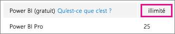
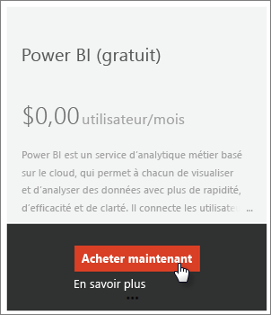
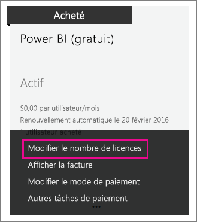

# Power BI (gratuit) dans votre organisation
Cet article explique comment utiliser l’offre Power BI (gratuit) au sein de votre organisation. Le terme « organisation » signifie que vous disposez d’un client et que vous pouvez gérer les utilisateurs et services au sein de ce client. En tant qu’administrateur, vous pouvez contrôler l’attribution des licences ou autoriser les utilisateurs à s’inscrire en tant que particuliers. Nous nous intéresserons à la licence Power BI (gratuit) et à la manière dont vous pouvez contrôler l’inscription des particuliers.

## Inscription individuelle et attribution de licence
Les utilisateurs au sein de votre organisation peuvent accéder à Power BI de deux manières différentes. Ils peuvent s’inscrire individuellement à Power BI ou vous pouvez leur attribuer une licence Power BI dans le portail d’administration d’Office 365.

Les inscriptions individuelles permettent de réduire la charge, pour les administrateurs de l’organisation, en autorisant les utilisateurs intéressés par Power BI à s’inscrire gratuitement.

Pour plus de contrôle, vous pouvez bloquer chaque inscription individuelle et attribuer vous-même les licences Power BI dans le centre d’administration d’Office 365. Cela vous permet d’indiquer précisément qui peut accéder à quels services au sein de l’organisation. C’est également une option intéressante si vous devez gérer les audits et que devez savoir exactement à quels services a accès chaque utilisateur.

## Comment obtenir le bloc de licences illimitées
Dans le Centre d’administration Office 365, sous **Facturation** > **Licences**, Power BI (gratuit) avec licences illimitées s’affiche peut-être.

Ce bloc de licences s’affiche lorsqu’une personne se connecte pour la première fois après s’être inscrit à Power BI en tant qu’individu. Pendant ce processus, ce bloc de licence est associé à votre organisation et une licence est attribuée à l’utilisateur qui s’inscrit.

Si vous bloquez l’inscription des utilisateurs individuels et que personne ne s’est inscrit, ce bloc de licence n’est pas visible. Vous pouvez autoriser l’inscription des utilisateurs individuels et autoriser un utilisateur à s’inscrire ou bien obtenir des licences gratuites grâce à la procédure d’ajout d’abonnement Office 365, sujet de la prochaine section.

Une fois le bloc de licence Power BI (gratuit) disponible, vous pouvez attribuer ces licences à vos utilisateurs. Pour plus d’informations sur l’affectation de licences, consultez [Attribuer des licences aux utilisateurs dans Office 365](https://support.office.com/article/Assign-or-unassign-licenses-for-Office-365-for-business-997596b5-4173-4627-b915-36abac6786dc).

## Obtention de licences gratuites en ajoutant des abonnements dans Office 365
1. Accédez au [Centre d’administration Office 365](https://portal.office.com/admin/default.aspx).
2. Dans le volet de navigation de gauche, sélectionnez **Facturation** > **Abonnements**.
3. Sélectionnez **Ajouter des abonnements +**, sur la droite.
4. Dans Autres plans, survolez **l’ellipse (…)** pour Power BI (gratuit) et sélectionnez **Acheter maintenant**.
   
    
5. Entrez le nombre de licences que vous voulez ajouter, puis sélectionnez **Achat rapide** ou **Ajouter au panier**.
   
   > [!NOTE]
   > Vous pouvez ajouter plus d’articles ultérieurement, si nécessaire.
   > 
   > 
6. Entrez les informations nécessaires lors de la procédure d’achat.

Aucun achat n’est effectué lors de cette procédure. Toutefois, vous devez entrer vos coordonnées bancaires pour le paiement ou choisir d’être facturé.

Si, par la suite, vous voulez ajouter d’autres licences, vous pouvez revenir à l’option **Ajouter des abonnements** et sélectionner **Modifier le nombre de licences** pour Power BI (gratuit).

Vous pouvez désormais attribuer ces licences à vos utilisateurs. Pour plus d’informations sur l’affectation de licences, consultez [Attribuer des licences aux utilisateurs dans Office 365](https://support.office.com/article/Assign-or-unassign-licenses-for-Office-365-for-business-997596b5-4173-4627-b915-36abac6786dc).

## Activation ou désactivation de l’inscription des utilisateurs individuels dans Azure Active Directory
En tant qu’administrateur, vous pouvez choisir d’activer ou désactiver l’inscription des utilisateurs individuels dans le cadre d’Azure Active Directory (ADD). Si vous savez comment exploiter les commandes PowerShell AAD, vous pouvez activer ou désactiver vous-même les abonnements ad-hoc. [En savoir plus](https://technet.microsoft.com/library/jj151815.aspx)

Le paramètre AAD qui contrôle cette option est **AllowAdHocSubscriptions**. Chez la plupart des clients, ce paramètre est configuré sur True. Cela signifie qu’il est activé. Si vous avez acquis Power BI via un partenaire, ce paramètre peut être configuré sur False par défaut. Cela signifie qu’il est désactivé.

1. Vous devez tout d’abord vous connecter à Azure Active Directory à l’aide de vos informations d’identification Office 365. La première ligne vous invite à indiquer vos informations d’identification. La deuxième ligne établit la connexion à Azure Active Directory.
   
     $msolcred = get-credential   connect-msolservice -credential $msolcred
   
   
2. Une fois connecté, vous pouvez émettre la commande suivante pour voir la configuration actuelle de votre client.
   
     Get-MsolCompanyInformation | fl AllowAdHocSubscriptions
3. Vous pouvez utiliser cette commande pour activer ($true) ou désactiver ($false) AllowAdHocSubscriptions.
   
     Set-MsolCompanySettings -AllowAdHocSubscriptions $true

> [!NOTE]
> Ce blocage empêche les nouveaux utilisateurs de votre organisation de s’inscrire à Power BI. Les utilisateurs qui se sont inscrits à Power BI avant que vous ne désactiviez les nouvelles inscriptions conserveront leurs licences.
> 
> 

## Étapes suivantes
[Inscription en libre-service à Power BI](service-self-service-signup-for-power-bi.md)  
[Achat de Power BI Pro](service-admin-purchasing-power-bi-pro.md)  
[Inscrivez-vous à Power BI (gratuit) avec un locataire Azure Active Directory personnalisé](developer/create-an-azure-active-directory-tenant.md)  
[Qu’est-ce que Power BI Premium ?](service-premium.md)  
[Livre blanc sur Power BI Premium](https://aka.ms/pbipremiumwhitepaper)  

D’autres questions ? [Essayez d’interroger la communauté Power BI](http://community.powerbi.com/)

