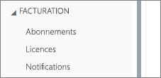
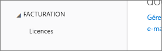
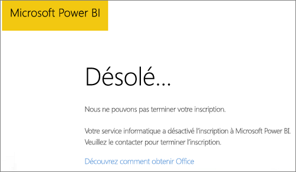

# Impossible d’ajouter Power BI à l’abonnement du partenaire Office 365
Les entreprises peuvent revendre Office 365 dans une offre groupée et intégrée à leurs propres solutions, pour fournir aux utilisateurs finaux un seul point de contact pour l’achat, la facturation et le support technique.

Si vous avez envie d’acquérir Power BI, conjointement à votre abonnement Office 365, nous vous recommandons de contacter votre partenaire. Si votre partenaire ne propose pas Power BI, différentes options sont envisageables pour vous.

1. Vous pouvez acheter le service auprès d’un autre canal, soit directement auprès de Microsoft, soit auprès d’un autre partenaire. Cette option n’est pas disponible pour tous les clients car elle varie selon leur relation avec le partenaire. Pour le vérifier, accédez au **portail d’administration Office 365** > **Facturation** > **Abonnements**. Si vous voyez **Abonnements**, vous pouvez acquérir directement le service auprès de Microsoft, ou également contacter un partenaire qui propose Power BI.
   
    
2. Si **Abonnements** n’apparaît pas sous **Facturation**, vous ne pouvez pas acheter directement auprès de Microsoft ou d’un autre partenaire. 
   
   

Si vous n’êtes pas en mesure d’acheter Power BI directement, et selon le type d’abonnement Power BI qui vous intéresse, d’autres options sont possibles.

[Power BI (version gratuite)](#power-bi-free)

[Power BI Pro et Premium](#power-bi-pro)

## Power BI (version gratuite)
Si l’offre gratuite de Power BI vous convient, vous pouvez vous inscrire au service gratuit. Par défaut, les inscriptions individuelles, également appelées abonnements ad hoc, sont désactivées. Lorsque vous essayez de vous inscrire à Power BI, un message vous indique que votre service informatique a désactivé l’inscription à Microsoft Power BI.

    Your IT department has turned off signup for Microsoft Power BI.

Pour activer les abonnements ad hoc, vous pouvez contacter votre partenaire pour le lui demander. Si vous êtes administrateur de votre client et savez comment exploiter les commandes PowerShell Azure Active Directory, vous pouvez activer les abonnements ad-hoc vous-même. [En savoir plus](https://technet.microsoft.com/library/jj151815.aspx)

1. Vous devez tout d’abord vous connecter à Azure Active Directory à l’aide de vos informations d’identification Office 365. La première ligne vous invite à indiquer vos informations d’identification. La deuxième ligne établit la connexion à Azure Active Directory.
   
        $msolcred = get-credential
        connect-msolservice -credential $msolcred
   
    
2. Une fois que vous êtes connecté, vous pouvez émettre la commande suivante pour activer les inscriptions gratuites.
   
        Set-MsolCompanySettings -AllowAdHocSubscriptions $true

## Power BI Pro et Premium
Si vous voulez souscrire un abonnement à Power BI Pro ou Power BI Premium, vous devez déterminer avec votre partenaire les options à votre disposition.

* Votre partenaire accepte d’ajouter Power BI à son portefeuille pour que vous puissiez réaliser des achats auprès de lui.
* Votre partenaire est en mesure de vous faire passer vers un modèle qui vous permet d’acheter Power BI directement auprès de Microsoft ou d’un autre partenaire qui propose Power BI.

Cette vidéo traite de la syndication Office 365 et de l’achat de Power BI :

<iframe width="560" height="315" src="https://www.youtube.com/embed/C357phT94A8" frameborder="0" allowfullscreen></iframe>

## Étapes suivantes
[Gérer Azure AD à l’aide de Windows PowerShell](https://technet.microsoft.com/library/jj151815.aspx)  
[Qu’est-ce que Power BI Premium ?](service-premium.md)

D’autres questions ? [Essayez d’interroger la communauté Power BI](http://community.powerbi.com/)

