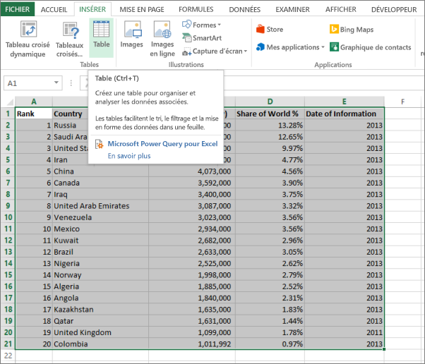
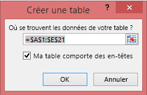
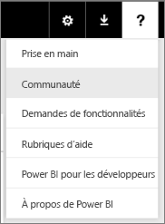

# Erreur : Nous n’avons pas pu trouver des données dans votre classeur Excel

>[!NOTE]  
>Cet article s’applique à Excel 2007 et versions ultérieures.

Quand vous importez un classeur Excel dans Power BI, l’erreur suivante peut s’afficher :

*Erreur : Nous n’avons pas pu trouver des données sous formatées de tableau. Pour importer à partir d’Excel dans le service Power BI, vous devez mettre en forme les données sous forme de table. Sélectionnez toutes les données que vous voulez dans le tableau et appuyez sur Ctrl + T.*

## Solution rapide
1. Ouvrez votre classeur dans Excel en vue de le modifier.
2. Sélectionnez la plage de cellules qui contient vos données. La première ligne doit contenir vos en-têtes de colonnes (noms des colonnes).
3. Appuyez sur **Ctrl+T** pour créer une table.
4. Enregistrez le classeur.
5. Revenez à Power BI et importez de nouveau votre classeur ou, si vous travaillez dans Excel 2016 et avez enregistré votre classeur sur OneDrive Entreprise, dans Excel, cliquez sur Fichier > Publier.

## Détails
### Cause
Dans Excel, vous pouvez créer une **table** hors d’une plage de cellules, ce qui facilite le tri, le filtrage et la mise en forme des données.

Quand vous importez un classeur Excel, Power BI recherche ces tables et les importe dans un jeu de données. S’il ne trouve aucune table, ce message d’erreur s’affiche.

### Solution
1. Ouvrez votre classeur dans Excel. 
    >[!NOTE]
    >Les images fournies proviennent d’Excel 2013. Si vous utilisez une autre version, l’aspect des fenêtres peut différer légèrement, mais la procédure reste la même.
    
    
2. Sélectionnez la plage de cellules qui contient vos données. La première ligne doit contenir vos en-têtes de colonnes (noms des colonnes) :
   
    
3. Dans le ruban, sous l’onglet **Insérer** , cliquez sur **Table**. (Ou, en guise de raccourci, appuyez sur **Ctrl+T**.)
   
    
4. La boîte de dialogue suivante apparaît. Assurez-vous que la case **Ma table comporte des en-têtes** est cochée, puis sélectionnez **OK**:
   
    
5. Vos données apparaissent maintenant sous la forme d’une table :
   
    
6. Enregistrez le classeur.
7. Revenez à Power BI. Sélectionnez Obtenir des données en bas du volet de navigation gauche.
   
    
8. Dans la zone **Fichiers** , sélectionnez **Obtenir**.
   
    
9. Importez à nouveau votre classeur Excel. Cette fois-ci, l’importation doit trouver la table et réussir.
   
    Si l’importation échoue encore, faites-le nous savoir en cliquant sur **Communauté** dans le menu ? (Aide) :
   
    
