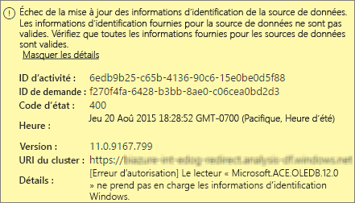
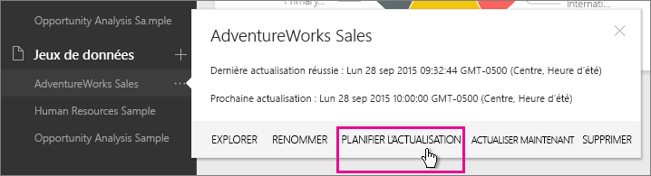
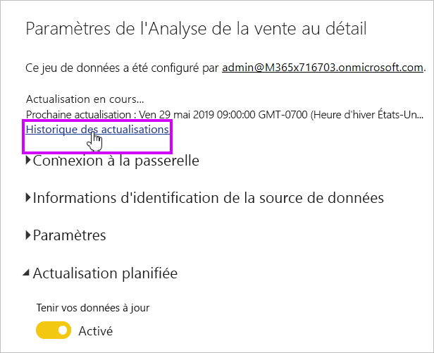
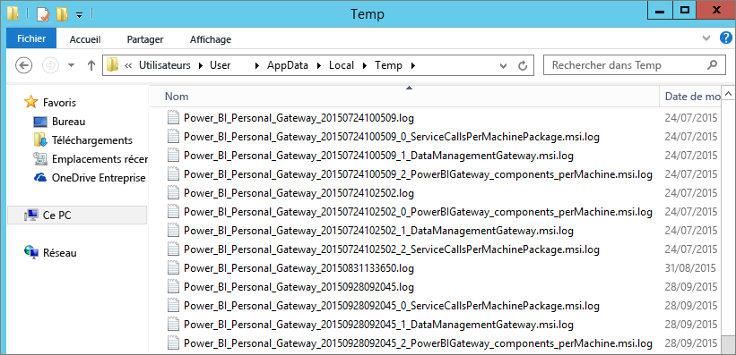

# Résolution des problèmes de Power BI Gateway - Personal
Les sections suivantes présentent certains problèmes courants que vous êtes susceptible de rencontrer lorsque vous utilisez le Power BI Gateway-Personal.

> [!NOTE]
> La version actuelle de la passerelle utilisée à des fins personnelles est la suivante : **Passerelle de données locale (mode personnel)**. Mettez à jour votre installation pour utiliser cette version.
> 
> 

## Procéder à une mise à jour vers la dernière version
Nombreux problèmes peuvent se manifester si la version de passerelle est obsolète.  Il est recommandé pour vous assurer que vous êtes sur la dernière version. Si vous n’avez pas mis à jour de la passerelle pour un mois, voire davantage, envisagez d’installer la dernière version de la passerelle. Consultez ensuite, si vous pouvez reproduire le problème.

## Installation
**Passerelle personnelle est de 64 bits** -si votre machine est 32 bits, vous ne pouvez pas installer la passerelle personnelle. Votre système d’exploitation doit être la version 64 bits. Installez une version 64 bits de Windows ou la passerelle personnelle sur un ordinateur 64 bits.

**Passerelle personnelle ne parvient pas à installer en tant que service, même si vous êtes un administrateur local de l’ordinateur** -Installation peut échouer si l’utilisateur est dans le groupe administrateur local de l’ordinateur, mais la stratégie de groupe n’autorise pas ce nom d’utilisateur pour vous connecter en tant qu’un service. Pour le moment, vérifiez que la stratégie de groupe permet à un utilisateur de se connecter en tant que service. Nous travaillons sur la résolution de ce problème. [En savoir plus](https://technet.microsoft.com/library/cc739424.aspx)

**Délai d’attente** -ce message est courant si l’ordinateur (machine physique ou virtuelle) sur lequel vous installez personal gateway dispose d’un processeur à cœur unique. Fermez toutes les applications et désactivez tous les processus non essentiels, puis retentez l’installation.

**Passerelle de gestion des données ou Analysis Services Connector ne peut pas être installé sur le même ordinateur que personal gateway** : Si vous disposez déjà d’Analysis Services Connector ou passerelle de gestion des données, vous devez d’abord désinstaller le connecteur ou la passerelle. Ensuite, réessayez d’installer la passerelle personnelle.

> [!NOTE]
> Si vous rencontrez un problème lors de l’installation, les journaux d’installation peuvent fournir des informations pour vous aider à résoudre le problème. Pour plus d’informations, consultez [journaux d’installation](#SetupLogs).
> 
> 

 **Configuration du proxy** vous pouvez voir les problèmes avec la configuration de la passerelle personnelle si votre environnement nécessite l’utilisation d’un proxy. Pour en savoir plus sur la configuration des informations du proxy, consultez [Configuration des paramètres de proxy pour les passerelles Power BI](service-gateway-proxy.md)

## Planifier l’actualisation
**Erreur : les informations d’identification stockées dans le cloud sont manquantes.**

Vous pouvez obtenir cette erreur dans les paramètres pour \<dataset\> si vous avez planifié une actualisation puis désinstallé et réinstallé personal gateway. Lorsque vous désinstallez personal gateway, les informations d’identification de source de données pour un jeu de données qui a été configuré pour l’actualisation sont supprimées à partir du service Power BI.

**Solution :** dans Power BI, accédez aux paramètres d’actualisation pour un jeu de données. Dans gérer les Sources de données, pour n’importe quelle source de données avec une erreur, sélectionnez **modifier les informations d’identification** et vous reconnecter à la source de données.

**Erreur : les informations d’identification fournies pour le jeu de données ne sont pas valides. Mettez à jour les informations d’identification via une actualisation ou dans la boîte de dialogue Paramètres de la source de données pour continuer.**

**Solution** : si vous obtenez un message relatif aux informations d’identification, cela peut signifier ce qui suit :

* Assurez-vous que les noms d’utilisateur et mots de passe pour vous connecter à des sources de données sont à jour. Dans Power BI, accédez aux paramètres d’actualisation pour le jeu de données. Dans gérer les Sources de données, sélectionnez **modifier les informations d’identification** pour mettre à jour les informations d’identification pour la source de données.
* Applications Web hybrides entre une source cloud et une source locale, dans une requête unique, l’actualisation échouent à dans la passerelle personnelle si une des sources utilise OAuth pour l’authentification. Un exemple de ce problème est une application Web hybride entre CRM Online et un serveur SQL local. L’application Web hybride échoue, car CRM Online requiert OAuth.
  
  Cette erreur est un problème connu et il est recherché. Pour contourner le problème, utilisez une requête distincte pour la source de cloud et de la source locale. Ensuite, utilisez une fusion ou une requête pour combiner ces deux Ajout.

**Erreur : source de données non prise en charge.**

**Solution :** si vous obtenez un message indiquant une source de données non prise en charge dans les paramètres de planification de l’actualisation, cela peut signifier ce qui suit : 

* La source de données n’est pas actuellement pris en charge pour l’actualisation dans Power BI. 
* Le classeur Excel ne contient pas un modèle de données, seules les données de feuille de calcul. Power BI ne prend actuellement en charge l’actualisation que si le classeur Excel téléchargé contient un modèle de données. Quand vous importez des données à l’aide de Power Query dans Excel, veillez à choisir l’option pour charger des données dans un modèle de données. Cette option garantit des données sont importées dans un modèle de données. 

**Erreur : [Impossible de combiner des données] &lt;partie de la requête&gt;/&lt;... &gt; / &lt;... &gt; accède à des sources de données qui ont des niveaux de confidentialité ne peuvent pas être utilisés ensemble. Reconstruisez cette combinaison de données.**

**Solution** : Cette erreur est en raison de restrictions du niveau de confidentialité et les types de sources de données que vous utilisez.

**Erreur : erreur de source de données : Désolé... Nous n'avons pas pu convertir la valeur « \[Table\] » en type Table.**

**Solution** : Cette erreur est en raison de restrictions du niveau de confidentialité et les types de sources de données que vous utilisez.

**Erreur : espace insuffisant pour cette ligne.**

Cette erreur se produit si vous avez une seule ligne supérieure à 4 Mo la taille. Recherchez la ligne à partir de votre source de données et essayez de filtrer ou de réduire la taille de cette ligne.

## Sources de données
**Fournisseur de données manquant** – la passerelle personnelle est la version 64 bits uniquement. Il requiert une version 64 bits des fournisseurs de données à installer sur le même ordinateur où Personal Gateway est installé. Par exemple, si la source de données dans le jeu de données est Microsoft Access, vous devez installer le fournisseur ACE 64 bits sur le même ordinateur où Personal Gateway est installé.  

>[!NOTE]
>Si vous avez la version 32 bits d’Excel, vous ne pouvez pas installer un fournisseur ACE de version 64 bits sur le même ordinateur.

**L’authentification Windows n’est pas prise en charge pour la base de données Access** : Power BI ne prend actuellement en charge que l’authentification anonyme pour la base de données Access. Nous travaillons sur l’activation de l’authentification Windows pour la base de données Access.

**Erreur de connexion lors de la saisie des informations d’identification pour une source de données** -si vous obtenez une erreur semblable à celui-ci lors de la saisie des informations d’identification Windows pour une source de données, vous pouvez toujours être sur une version antérieure de la passerelle personnelle. [Installez la dernière version de Power BI Gateway - Personal](https://powerbi.microsoft.com/gateway/).

  

**Erreur : Erreur de connexion lors de la sélection de l’authentification Windows pour une source de données avec ACE OLEDB**. Si vous obtenez l’erreur suivante lors de la saisie des informations d’identification de la source de données pour une source de données avec le fournisseur ACE OLEDB :

Power BI ne prend actuellement en charge l’authentification Windows pour une source de données à l’aide du fournisseur ACE OLEDB.

**Solution :** Pour contourner cette erreur, vous pouvez sélectionner **l’authentification anonyme**. Pour le fournisseur ACE OLEDB hérité, les informations d’identification anonymes sont égales aux informations d’identification Windows.

## Actualisation des vignettes
Si vous recevez une erreur avec l’actualisation des vignettes de tableau de bord, consultez l’article suivant.

[Résolution des erreurs de vignette](refresh-troubleshooting-tile-errors.md)

## Outils de résolution des problèmes
### Historique des actualisations
**L’historique d’actualisation** vous aide à déterminer quelles erreurs se sont produites et fournit des données utiles si vous avez besoin créer une demande de support. Vous pouvez afficher à la fois planifiée et à la demande, les actualisations. Voici comment vous accédez à la **historique d’actualisation**.

1. Dans le volet de navigation Power BI, dans **Jeux de données**, sélectionnez un jeu de données &gt; Menu Ouvrir &gt; **Planifier l’actualisation**
   
1. Dans **paramètres pour...** , sélectionnez **historique d’actualisation**.  
   
   
   

### Journaux d’événements
Journaux des événements peuvent fournir des informations. Les deux premiers, **Data Management Gateway** et **PowerBIGateway**, sont présents si vous êtes un administrateur sur l’ordinateur.  Si vous n’êtes pas un administrateur, et à l’aide de la passerelle personnelle, vous verrez les entrées de journal dans le **Application** journal.

Les journaux **Passerelle de gestion des données** et **PowerBIGateway** se situent sous **Journaux des applications et des services**.

### Trace Fiddler
[Fiddler](http://www.telerik.com/fiddler) est un outil gratuit de Telerik qui surveille le trafic HTTP. Vous pouvez voir la communication avec le service Power BI à partir de l’ordinateur client. Cette communication peut afficher les erreurs et autres informations connexes.

### Journaux d’installation
Si le **Personal Gateway**, ne parvient pas à installer, vous verrez un lien pour afficher le journal d’installation. Le journal d’installation peut afficher des détails sur l’échec. Ces journaux sont Windows Installer, également appelés journaux MSI. Ils peuvent être assez complexes et difficiles à lire. En règle générale, l’erreur qui en résulte est en bas, mais déterminer la cause de l’erreur n’est pas trivial. Elle peut être due à des erreurs dans un autre journal ou à une erreur apparue plus haut dans le journal.

Ou, vous pouvez accéder à votre **dossier Temp** (% Temp%) et recherchez les fichiers qui commencent par **Power\_BI\_**.

> [!NOTE]
> En accédant à %temp%, vous risquez de vous retrouver dans un sous-dossier de temp. Le **Power\_BI\_**  fichiers se trouvent dans la racine du répertoire temp.  Vous serez peut-être amené à monter d’un ou deux niveaux.
> 
> 

## Étapes suivantes
[Configuration des paramètres de proxy pour les passerelles Power BI](service-gateway-proxy.md)  
[Actualisation des données](refresh-data.md)  
[Power BI Gateway - Personal](service-gateway-personal-mode.md)  
[Résolution des erreurs de vignette](refresh-troubleshooting-tile-errors.md)  
[Résolution des problèmes de passerelle de données locale](service-gateway-onprem-tshoot.md)  
D’autres questions ? [Posez vos questions à la communauté Power BI](http://community.powerbi.com/)

