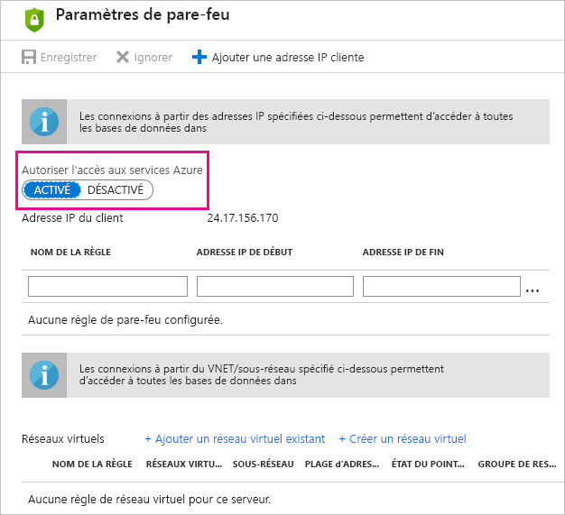

# Dépannage d’une actualisation planifiée pour Azure SQL Database dans Power BI

Pour plus d’informations sur l’actualisation, consultez [Actualiser des données dans Power BI](refresh-data.md) et [Configurer une actualisation planifiée](refresh-scheduled-refresh.md).

Pendant la configuration de l’actualisation planifiée pour une base de données Azure SQL, si vous obtenez une erreur avec le code d’erreur 400 pendant la modification des informations d’identification, essayez de procéder comme suit pour configurer la règle de pare-feu appropriée :

1. Connectez-vous au [portail Azure](https://portal.azure.com).

1. Accédez à la base de données Azure SQL pour laquelle vous configurez l’actualisation.

1. En haut du panneau **Vue d’ensemble**, sélectionnez **Définir le pare-feu du serveur**.

1. Dans le panneau **Paramètres de pare-feu**, vérifiez que l’option **Autoriser l’accès aux services Azure** a la valeur **ON** (Activé).

      

D’autres questions ? [Posez vos questions à la communauté Power BI](https://community.powerbi.com/)
