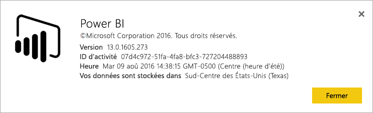
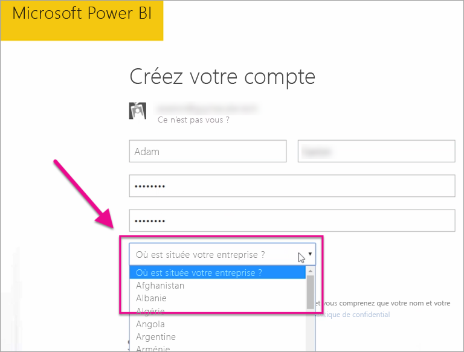

# Où est situé mon client Power BI ?

<iframe width="560" height="315" src="https://www.youtube.com/embed/0fOxaHJPvdM?showinfo=0" frameborder="0" allowfullscreen></iframe>

Découvrez où se trouve votre client Power BI et comment l’emplacement est sélectionné. Il est important de connaître l'emplacement, car cela peut avoir un impact sur les interactions que vous avez avec le service.

## Déterminer où est situé votre client Power BI

Pour rechercher la région où se trouve votre client, procédez comme suit.

1. Dans le service Power BI, menu supérieur, sélectionnez l’aide ( **?** ), puis **À propos de Power BI**.

1. Recherchez la valeur suivante à côté de **Vos données sont stockées dans**. C’est la région où se trouve votre client. La valeur est également la région où sont stockées vos données, sauf si vous utilisez des capacités dédiées dans différentes régions pour vos espaces de travail.

    

## Méthode de sélection de la région de données

La région de données est basée sur le pays que vous sélectionnez lors de la création du client. La sélection s’applique à l’inscription à la fois à Office 365 et à Power BI, car ces informations sont partagées. S’il s’agit d’un nouveau client, sélectionnez le pays approprié dans la liste lorsque vous vous inscrivez.

Power BI sélectionne la région de données la plus proche de votre sélection, qui détermine où les données sont stockées pour votre locataire.

> [!IMPORTANT]
> Vous ne pouvez pas modifier la sélection après avoir créé le client.

D’autres questions ? [Posez vos questions à la communauté Power BI](https://community.powerbi.com/)

