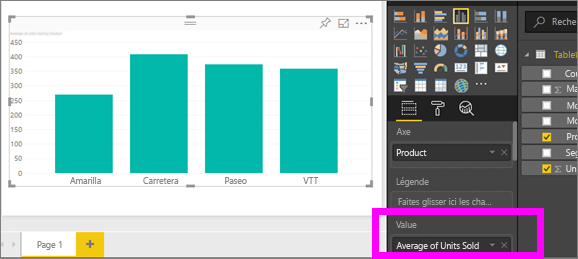
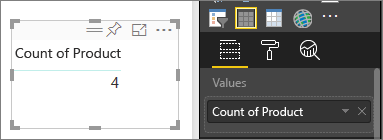
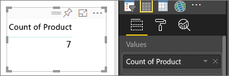

# Agrégations dans les visualisations Power BI
## Qu’est qu’un agrégat ?
Vous pouvez parfois mathématiquement combiner des valeurs dans vos données. L’opération mathématique peut être une somme, une moyenne, un maximum, un nombre, etc. Lorsque vous combinez des valeurs dans vos données, cette opération est appelée *agrégation*. Le résultat de cette opération mathématique est une *agrégation*. 

Lorsque le service Power BI et Power BI Desktop créent des visualisations, ils peuvent agréger vos données. L’agrégation peut parfois vous convenir, sauf si vous souhaitez regrouper les valeurs d’une autre manière.  Par exemple, une somme ou une moyenne. Il existe différentes façons de gérer et de modifier l’agrégation utilisée dans une visualisation.

Tout d’abord, examinons les *types* de données, car le type de données détermine le mode d’agrégation et la possibilité de faire appel à cette fonctionnalité.

## Types des données
La plupart des jeux de données ont plusieurs types de données. Au niveau le plus basique, les données sont numériques ou ne le sont pas. Les données numériques peuvent être agrégées à l’aide d’une fonction somme, moyenne, nombre, minimum, écart et bien plus encore. Même les données textuelles, souvent appelées données *catégorielles*, peuvent être agrégées. S vous tentez d’agréger un champ de catégorie (en le plaçant dans un compartiment uniquement numérique comme **Valeurs** ou **Info-bulles**), Power BI compte les occurrences de chaque catégorie ou les occurrences distinctes de chaque catégorie. De plus, des types de données spéciaux, tels que des dates, ont leurs propres options d’agrégation : plus ancien, plus récent, premier et dernier. 

Prenons l’exemple ci-dessous :
- **Units Sold (Unités vendues)** et **Manufacturing Price (Prix de fabrication)** sont des colonnes qui contiennent des données numériques.
-  **Segment**, **Country (Pays)**, **Product (Produit)**, **Month (Mois)** et **Month Name (Nom du mois)** contiennent des données catégorielles.

   

Lorsque vous créez une visualisation dans Power BI, les champs numériques sont agrégés (la valeur par défaut étant *somme*) sur un champ catégoriel.  Par exemple, « Unités vendues ***par produit***, « Unités vendues ***par mois***» et « Prix de fabrication ***par Segment*** ». Certains champs numériques sont appelés **mesures**. Il est facile d’identifier les mesures dans l’éditeur de rapport Power BI : celles-ci sont indiquées par le symbole ∑ dans la liste de champs. Pour plus d’informations, consultez [Découverte de l’éditeur de rapport](service-the-report-editor-take-a-tour.md).

## Pourquoi les agrégats ne fonctionnent pas comme je le souhaite ?
L’utilisation d’agrégats dans le service Power BI peut prêter à confusion ; vous disposez peut-être d’un champ numérique et Power BI ne vous permet pas de modifier l’agrégation. Ou vous disposez peut-être d’un champ, comme une année, et vous ne souhaitez pas l’agréger, mais simplement compter le nombre d’occurrences.

En règle générale, la source du problème est la façon dont le champ a été défini dans le jeu de données. Il se peut que le champ soit défini en tant que texte, ce qui explique pourquoi il ne peut pas faire l’objet d’une somme ou d’une moyenne. Malheureusement, [seul le propriétaire du jeu de données peut modifier la façon dont un champ est classé](desktop-measures.md). Par conséquent, si vous disposez des autorisations de propriétaire sur le jeu de données, soit dans Desktop ou le programme qui a été utilisé pour créer le jeu de données (par exemple, Excel), vous pouvez résoudre ce problème. Dans le cas contraire, vous devez contacter le propriétaire du jeu de données pour lui demander de l’aide.  

Pour vous aider, nous avons inclus une section spéciale à la fin de cet article, appelée **Considérations et résolution des problèmes**.  Si vous n’y trouvez pas votre réponse, publiez votre question sur le [forum de la communauté Power BI](http://community.powerbi.com) pour obtenir une réponse rapide directement de l’équipe Power BI.

## Modifier le mode d’agrégation d’un champ numérique
Supposons que vous avez un graphique qui fait la somme des unités vendues pour différents produits. Or, il s’avère que vous préfèreriez obtenir la moyenne. 

1. Créez un graphique qui utilise une catégorie et une mesure. Dans cet exemple, utilisez Units Sold by Product (Unités vendues par produit).  Par défaut, Power BI crée un graphique qui additionne les unités vendues (mesure dans le compartiment Valeur) pour chaque produit (catégorie dans le compartiment Axe).

   

2. Dans le volet Visualisations, cliquez avec le bouton droit sur la mesure, puis sélectionnez le type d’agrégation dont vous avez besoin. Dans ce cas, sélectionnez Moyenne. Si vous ne voyez pas l’agrégation dont vous avez besoin, consultez Considérations et résolution des problèmes ci-dessous.  
   
   
   
   > [!NOTE]
   > Les options disponibles dans la liste déroulante varient en fonction 1) du champ sélectionné et 2) de la façon dont le champ a été classé par le propriétaire du jeu de données.
   > 
3. Votre visualisation est à présent agrégée par moyenne.

   

##    Comment regrouper vos données

Voici certaines des options qui peuvent être disponibles pour l’agrégation d’un champ :

* **Ne pas résumer**. si vous choisissez cette option, chaque valeur du champ en question est traitée séparément et n’est pas résumée. Cette option est souvent utilisée en présence d’une colonne d’ID numériques qui ne doivent pas être additionnés.
* **Somme**. cette option permet d’ajouter toutes les valeurs contenues dans le champ.
* **Moyenne**. prend une moyenne arithmétique des valeurs.
* **Minimum**. affiche la valeur la plus petite.
* **Maximum**. affiche la valeur la plus grande.
* **Nombre (non vide).** compte le nombre de valeurs dans le champ qui ne sont pas vides.
* **Nombre (distinct).** compte le nombre de valeurs différentes dans le champ.
* **Écart type.**
* **Écart**.
* **Médiane**.  Affiche la valeur médiane (centrale). Il s’agit de la valeur ayant le même nombre d’éléments au-dessus et au-dessous.  S’il existe 2 médianes, Power BI calcule une moyenne.

Par exemple, ces données :

| Pays | Montant |
|:--- |:--- |
| États-Unis |100 |
| Royaume-Uni |150 |
| Canada |100 |
| Allemagne |125 |
| France | |
| Japon |125 |
| Australie |150 |

donneraient les résultats suivants :

* **Ne pas résumer**: chaque valeur est affichée séparément
* **Somme**: 750
* **Moyenne**: 125
* **Maximum** : 150
* **Minimum**: 100
* **Nombre (non vide)** : 6
* **Nombre (distinct)** : 4
* **Écart type :** 20.4124145...
* **Écart :** 416.666...
* **Médiane :** 125

## Créez une agrégation à l’aide d’un champ de catégorie (texte)
Vous pouvez également agréger un champ non numérique. Par exemple, si vous avez un champ Nom de produit, vous pouvez l’ajouter comme valeur et le définir sur **Nombre**, **Nombre distinct**, **Premier** ou **Dernier**. 

1. Dans cet exemple, nous avons déplacé le champ **Produit** dans le compartiment Valeurs. Le compartiment Valeurs sert généralement pour les champs numériques. Power BI reconnaît qu’il s’agit d’un champ de texte, définit l’agrégation **Ne pas synthétiser** et propose une table avec une seule colonne.
   
   
2. Si vous remplacez l’agrégation par défaut **Ne pas synthétiser** par **Nombre (distinct)**, Power BI compte le nombre de produits différents. Dans cet exemple, il y en a 4.
   
   
3. Et si vous remplacez l’agrégation par **Nombre**, Power BI compte le nombre total. Dans cet exemple, il y a 7 entrées pour **Produit**. 
   
   

4. En faisant glisser ce même champ (dans ce cas **Produit**) dans le compartiment Valeurs et en laissant l’agrégation par défaut **Ne pas synthétiser**, Power BI décompose le nombre par produit.

   

## Considérations et résolution des problèmes
Q : Pourquoi est-ce que l’option **Ne pas synthétiser** ne s’affiche pas ?

R : Le champ que vous avez sélectionné est probablement une mesure calculée ou une mesure avancée créée dans Excel ou [Power BI Desktop](desktop-measures.md). Chaque mesure calculée a sa propre formule codée en dur. Vous ne pouvez pas changer l’agrégation utilisée.  Par exemple, s’il s’agit d’une somme, elle peut uniquement être une somme. Dans la liste Champs, les *mesures calculées* sont indiquées par le symbole de calculatrice.

Q : Mon champ **est** numérique. Pourquoi mes seuls choix sont **Nombre** et **Comptage de valeurs** ?

R1 : L’explication la plus probable est que le propriétaire du jeu de données n’a *pas* classé le champ en tant que nombre, accidentellement ou volontairement. Par exemple, si un jeu de données a un champ **année**, le propriétaire du jeu de données peut le classer comme texte, car il est plus que probable que le champ **année** fasse l’objet d’un décompte (par exemple le nombre de personnes nées en 1974) et non d’une somme ou d’une moyenne. Si vous êtes le propriétaire, vous pouvez ouvrir le jeu de données dans Power BI Desktop et utiliser l’onglet **Modélisation** pour modifier le type de données.  

R2 : Si le champ a une icône de calculatrice, cela signifie qu’il s’agit d’une *mesure calculée* et chaque mesure calculée possède sa propre formule codée en dur qui ne peut être modifiée que par le propriétaire du jeu de données. Le calcul utilisé peut être une agrégation simple comme une moyenne ou une somme, mais il peut également être plus complexe, comme un « pourcentage de contribution à la catégorie parente » ou « total cumulé depuis le début de l’année ». Power BI ne va pas calculer la somme ou la moyenne des résultats, mais juste recalculer (à l’aide de la formule codée en dur) chaque point de données.

R3 : Il se peut également que vous ayez supprimé le champ dans un *compartiment* qui autorise uniquement les valeurs de catégorie.  Dans ce cas, les seules options proposées sont Nombre et Comptage de valeurs.

R4 : Une troisième possibilité est que vous utilisez le champ pour un axe. Sur l’axe d’un histogramme par exemple, Power BI affiche une barre pour chaque valeur distincte et n’agrège pas du tout les valeurs de champ. 

>[!NOTE]
>L’exception à cette règle est le graphique à nuages de points, qui *nécessite* des valeurs agrégées pour les axes X et Y.

Q : J’ai un graphique à nuages de points et je ne veux *pas* d’agrégation pour mon champ.  Comment faire ?

R : Ajoutez le champ au compartiment **Détails** et pas aux compartiments des axes X ou Y.

Q : Quand j’ajoute des champs numériques à une visualisation, la plupart de ces champs ont par défaut le type Somme, alors que d’autres sont de type Moyenne ou Nombre ou une autre agrégation.  Pourquoi l’agrégation par défaut est-elle différente à chaque fois ?

R : Les propriétaires du jeu de données ont la possibilité de définir le résumé par défaut pour chaque champ. Si vous êtes propriétaire d’un jeu de données, modifiez le résumé par défaut dans l’onglet **Modélisation** de Power BI Desktop.

Q : Je suis propriétaire d’un jeu de données et je veux être certain qu’aucun champ n’est jamais agrégé.

R : Dans Power BI Desktop, dans l’onglet **Modélisation**, définissez **Type de données** sur **Texte**.

Q : Je ne vois pas **Ne pas synthétiser** en tant qu’option dans ma liste déroulante.

R : Essayez de supprimer le champ puis de le rajouter.

D’autres questions ? [Posez vos questions à la communauté Power BI](http://community.powerbi.com/)

