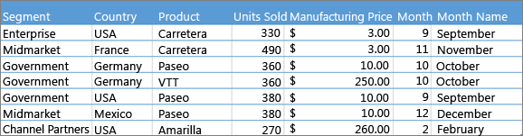
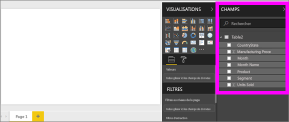
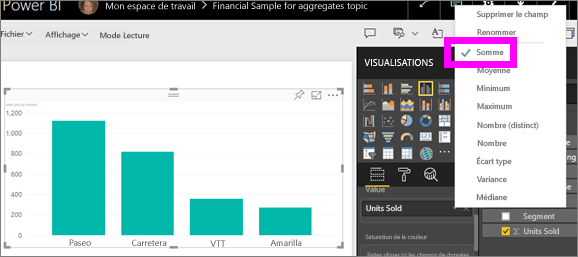
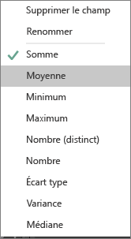
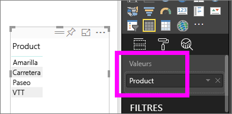
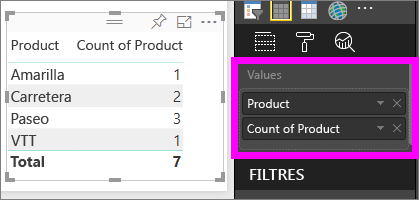

# Utiliser des agrégats (somme, moyenne, etc.) dans le service Power BI

## Qu’est qu’un agrégat ?

Vous pouvez parfois mathématiquement combiner des valeurs dans vos données. L’opération mathématique peut être une somme, une moyenne, un maximum, un nombre, etc. Lorsque vous combinez des valeurs dans vos données, cette opération est appelée *agrégation*. Le résultat de cette opération mathématique est une *agrégation*.

Lorsque le service Power BI et Power BI Desktop créent des visualisations, ils peuvent agréger vos données. L’agrégation peut parfois vous convenir, sauf si vous souhaitez regrouper les valeurs d’une autre manière.  Par exemple, une somme ou une moyenne. Il existe différentes façons de gérer et de changer l’agrégation que Power BI utilise dans une visualisation.

Tout d’abord, examinons les *types* de données, car le type de données détermine le mode d’agrégation et la possibilité pour Power BI de faire appel à cette fonctionnalité.

## Types des données

La plupart des jeux de données ont plusieurs types de données. Au niveau le plus basique, les données sont numériques ou ne le sont pas. Power BI peut agréger des données numériques à l’aide d’une fonction somme, moyenne, nombre, minimum, écart et bien plus encore. Le service peut même agréger des données textuelles, souvent appelées données par *catégorie*. Si vous tentez d’agréger un champ de catégorie en le plaçant dans un compartiment uniquement numérique comme **Valeurs** ou **Info-bulles**, Power BI compte les occurrences de chaque catégorie ou les occurrences distinctes de chaque catégorie. Des types de données spéciaux, tels que des dates, ont leurs propres options d’agrégation : plus ancien, plus récent, premier et dernier.

Prenons l’exemple ci-dessous :

- Les colonnes **Units Sold (Unités vendues)** et **Manufacturing Price (Prix de fabrication)** contiennent des données numériques.

- **Segment**, **Country (Pays)** , **Product (Produit)** , **Month (Mois)** et **Month Name (Nom du mois)** contiennent des données catégorielles.

   

Lorsque vous créez une visualisation dans Power BI, le service agrège les champs numériques (la valeur par défaut étant *somme*) sur un champ catégoriel.  Par exemple, « Unités vendues ***par produit*** », « Unités vendues ***par mois*** » et « Prix de fabrication ***par Segment*** ». Power BI fait référence aux champs numériques comme à des **mesures**. Il est facile d’identifier les mesures dans l’éditeur de rapport Power BI : la liste **Champs** indique les mesures avec le symbole ∑ situé en regard. Pour plus d’informations, consultez la [visite guidée de l’éditeur de rapport](service-the-report-editor-take-a-tour.md).

## Pourquoi les agrégats ne fonctionnent pas comme je le souhaite ?

L’utilisation d’agrégats dans le service Power BI peut prêter à confusion. Vous avez peut-être un champ numérique dont Power BI ne vous permet pas de changer l’agrégation. Ou vous disposez peut-être d’un champ, comme une année, et vous ne souhaitez pas l’agréger, mais simplement compter le nombre d’occurrences.

En général, le problème sous-jacent est lié à la définition du champ dans le jeu de données. Peut-être que le propriétaire du jeu de données a défini le champ en tant que texte, ce qui explique pourquoi Power BI ne peut pas en calculer la somme ou la moyenne. Malheureusement, [seul le propriétaire du jeu de données peut modifier la façon dont un champ est classé](desktop-measures.md). Donc, si vous avez des autorisations de propriétaire sur le jeu de données, soit dans Desktop, soit dans le programme utilisé pour créer ce jeu de données (par exemple, Excel), vous pouvez résoudre ce problème. Dans le cas contraire, vous devez contacter le propriétaire du jeu de données pour lui demander de l’aide.  

Il existe une section spéciale à la fin de cet article, appelée [**Considérations et résolution des problèmes**](#considerations-and-troubleshooting). Elle propose des astuces et des conseils. Si vous n’y trouvez pas votre réponse, postez votre question sur le [forum de la communauté Power BI](https://community.powerbi.com). Vous obtiendrez ainsi une réponse rapide directement de l’équipe Power BI.

## Modifier le mode d’agrégation d’un champ numérique

Supposons que vous avez un graphique qui fait la somme des unités vendues pour différents produits. Or, il s’avère que vous préfèreriez obtenir la moyenne.

1. Créez un **histogramme groupé** qui utilise une mesure et une catégorie. Dans cet exemple, utilisez Units Sold by Product (Unités vendues par produit).  Par défaut, Power BI crée un graphique qui additionne les unités vendues (faites glisser la mesure dans le compartiment **Valeur**) pour chaque produit (faites glisser la catégorie dans le compartiment **Axe**).

   

1. Dans le volet **Visualisations**, cliquez avec le bouton droit sur la mesure, puis sélectionnez le type d’agrégation dont vous avez besoin. Dans ce cas, sélectionnez **Moyenne**. Si vous ne voyez pas l’agrégation dont vous avez besoin, consultez la section [**Considérations et résolution des problèmes**](#considerations-and-troubleshooting).

   

   > [!NOTE]
   > Les options disponibles dans la liste déroulante varient en fonction 1) du champ sélectionné et 2) de la façon dont le propriétaire du jeu de données a classé ce champ.

1. Votre visualisation est à présent agrégée par moyenne.

   

## Comment regrouper vos données

Voici certaines des options qui peuvent être disponibles pour l’agrégation d’un champ :

- **Ne pas résumer**. Si vous choisissez cette option, Power BI traite chaque valeur de ce champ séparément et ne les totalise pas. Utilisez cette option en présence d’une colonne d’ID numériques que le service ne doit pas additionner.

- **Somme**. Additionne toutes les valeurs contenues dans le champ.

- **Moyenne**. prend une moyenne arithmétique des valeurs.

- **Minimum**. affiche la valeur la plus petite.

- **Maximum**. affiche la valeur la plus grande.

- **Nombre (non vide).** Compte le nombre de valeurs dans le champ qui ne sont pas vides.

- **Nombre (distinct).** Compte le nombre de valeurs différentes dans le champ.

- **Écart type.**

- **Écart**.

- **Médiane**.  Affiche la valeur médiane (centrale). Cette valeur a le même nombre d’éléments au-dessus et en dessous.  S’il existe deux médianes, Power BI calcule leur moyenne.

Par exemple, ces données :

| Pays | Montant |
|:--- |:--- |
| États-Unis |100 |
| Royaume-Uni |150 |
| Canada |100 |
| Germany |125 |
| France | |
| Japon |125 |
| Australie |150 |

donneraient les résultats suivants :

- **Ne pas synthétiser** : chaque valeur est affichée séparément

- **Somme** : 750

- **Moyenne** : 125

- **Maximum** :  150

- **Minimum** : 100

- **Nombre (non vide) :** 6

- **Nombre (distinct) :** 4

- **Écart type :** 20.4124145...

- **Variance :** 416.666...

- **Médiane :** 125

## Créez une agrégation à l’aide d’un champ de catégorie (texte)

Vous pouvez également agréger un champ non numérique. Par exemple, si vous avez un champ Nom de produit, vous pouvez l’ajouter comme valeur et le définir sur **Nombre**, **Nombre distinct**, **Premier** ou **Dernier**.

1. Faites glisser le champ **Produit** dans le compartiment **Valeurs**. Le compartiment **Valeurs** sert généralement pour les champs numériques. Power BI reconnaît qu’il s’agit d’un champ de texte, définit l’agrégation **Ne pas synthétiser** et propose une table avec une seule colonne.

   

1. Si vous remplacez l’agrégation par défaut **Ne pas synthétiser** par **Nombre (distinct)** , Power BI compte le nombre de produits différents. Dans cet exemple, il y en a quatre.
  
   

1. Et si vous remplacez l’agrégation par **Nombre**, Power BI compte le nombre total. Dans cet exemple, il y a sept entrées pour **Produit**.

   

1. En faisant glisser ce même champ (dans cet exemple, **Produit**) dans le compartiment **Valeurs** et en laissant l’agrégation par défaut **Ne pas synthétiser**, Power BI décompose le nombre par produit.

   

## Considérations et résolution des problèmes

Q :  Pourquoi est-ce que l’option **Ne pas synthétiser** ne s’affiche pas ?

R :  Le champ que vous avez sélectionné est probablement une mesure calculée ou une mesure avancée créée dans Excel ou [Power BI Desktop](desktop-measures.md). Chaque mesure calculée a sa propre formule codée en dur. Vous ne pouvez pas changer l’agrégation que Power BI utilise. Par exemple, s’il s’agit d’une somme, elle peut uniquement être une somme. La liste **Champs** indique les *mesures calculées* avec le symbole de calculatrice.

Q :  Mon champ **est** numérique. Pourquoi mes seuls choix sont **Nombre** et **Comptage de valeurs** ?

R1 :  L’explication la plus probable est que le propriétaire du jeu de données n’a *pas* classé le champ en tant que nombre. Par exemple, si un jeu de données comporte un champ **Année**, le propriétaire du jeu de données peut classer cette valeur en tant que texte. Dans Power BI, il est plus probable que le champ **Année** soit compté (par exemple, le nombre de personnes nées en 1974). Il y a moins de chances pour que Power BI en calcule la somme ou la moyenne. Si vous êtes le propriétaire, vous pouvez ouvrir le jeu de données dans Power BI Desktop et utiliser l’onglet **Modélisation** pour changer le type de données.

R2 : Si le champ a une icône de calculatrice, cela signifie qu’il s’agit d’une *mesure calculée*. Chaque mesure calculée a sa propre formule codée en dur que seul le propriétaire du jeu de données peut changer. Le calcul que Power BI utilise peut être une agrégation simple comme une moyenne ou une somme. Il peut également s’agir d’une opération plus compliquée comme un « pourcentage de contribution à la catégorie parente » ou un « total cumulé depuis le début de l’année ». Power BI ne va pas calculer la somme ou la moyenne des résultats. C’est un simple recalcul qui est plutôt effectué (à l’aide de la formule codée en dur) pour chaque point de données.

R3 :  Il se peut également que vous ayez supprimé le champ dans un *compartiment* qui autorise uniquement les valeurs de catégorie.  Dans ce cas, les seules options proposées sont Nombre et Comptage de valeurs.

R4 :  Une quatrième possibilité est que vous utilisez le champ pour un axe. Sur l’axe d’un histogramme par exemple, Power BI affiche une barre pour chaque valeur distincte et n’agrège pas du tout les valeurs de champ.

>[!NOTE]
>L’exception à cette règle est le graphique à nuages de points, qui *nécessite* des valeurs agrégées pour les axes X et Y.

Q :  Pourquoi je ne peux pas agréger des champs de texte pour des sources de données SQL Server Analysis Services (SSAS) ?

R :  Les connexions actives à des modèles multidimensionnels SSAS n’autorisent pas les agrégations côté client, notamment les agrégations dernier, moyenne, min, max et somme.

Q :  J’ai un graphique à nuages de points et je ne veux *pas* d’agrégation pour mon champ.  Comment faire ?

R :  Ajoutez le champ au compartiment **Détails** et pas aux compartiments des axes X ou Y.

Q :  Quand j’ajoute des champs numériques à une visualisation, la plupart de ces champs ont par défaut le type Somme, alors que d’autres sont de type Moyenne ou Nombre ou une autre agrégation.  Pourquoi l’agrégation par défaut est-elle différente à chaque fois ?

R :  Les propriétaires du jeu de données peuvent définir le résumé par défaut pour chaque champ. Si vous êtes propriétaire d’un jeu de données, changez la totalisation par défaut sous l’onglet **Modélisation** de Power BI Desktop.

Q :  Je suis propriétaire d’un jeu de données et je veux être certain qu’aucun champ n’est jamais agrégé.

R :  Dans Power BI Desktop, dans l’onglet **Modélisation**, définissez **Type de données** sur **Texte**.

Q :  Je ne vois pas l’option **Ne pas synthétiser** dans ma liste déroulante.

R :  Essayez de supprimer le champ puis de le rajouter.

D’autres questions ? [Posez vos questions à la communauté Power BI](https://community.powerbi.com/)