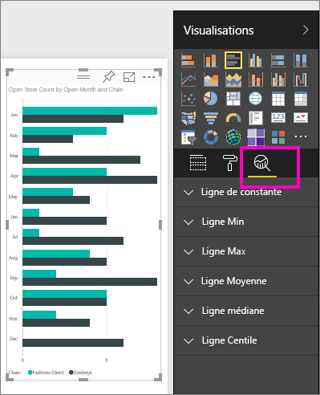
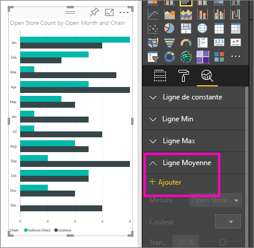
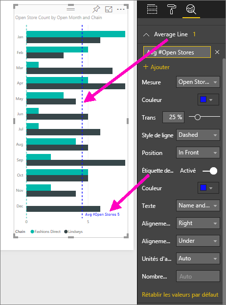
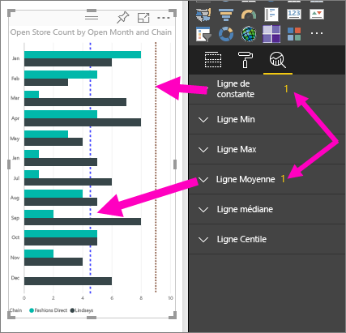
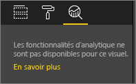

# Volet Analyse du service Power BI
Avec le volet **Analyse** de **Service Power BI**, vous pouvez ajouter des *lignes de référence* dynamiques aux visualisations et mettre en relief les analyses ou les tendances importantes.

> [!NOTE]
> Le volet **Analyse** s’affiche uniquement quand vous sélectionnez un visuel sur le canevas de rapport.
> 
> 

## Utilisation du volet Analyse
Avec le volet **Analyse**, vous pouvez créer les types de lignes de référence dynamiques (toutes les lignes ne sont pas disponibles pour tous les types d’éléments visuels) suivants :

* Ligne de constante de l’axe X
* Ligne de constante de l’axe Y
* Ligne Min
* Ligne Max
* Ligne moyenne
* Ligne médiane
* Ligne Centile

Pour afficher les lignes de référence dynamiques pour un élément visuel, procédez comme suit :

1. Sélectionnez ou créez un visuel, puis sélectionnez l’icône **Analyse** dans le volet **Visualisations**.

2. Sélectionnez la flèche vers le bas pour le type de ligne que vous souhaitez créer afin de développer ses options. Dans ce cas, nous allons sélectionner **Ligne moyenne**.
   
   

3. Pour créer une ligne, sélectionnez **+ Ajouter** et choisissez la mesure qui servira à créer la ligne.  La liste déroulante **Mesure** est automatiquement remplie avec les données disponibles à partir de la visualisation sélectionnée. Nous allons utiliser **Open store count** (Nombre de magasins ouverts).

5. Il existe toutes sortes d’options de ligne, telles que la couleur, la transparence, le style et la position (par rapport aux éléments de données du visuel). Si vous souhaitez étiqueter la ligne, donnez-lui un titre, puis déplacez le curseur **Étiquette de données** sur **Activé**.  Dans ce cas, nommez la ligne *Avg # Open Stores* (Nombre moyen de magasins ouverts) et personnalisez certaines des autres options, comme indiqué ci-dessous.
   
   

1. Notez le numéro qui s’affiche en regard de l’élément **Ligne moyenne** dans le volet **Analyse**. Ce dernier indique le nombre de lignes dynamiques dont vous disposez actuellement sur votre élément visuel, ainsi que leur type. Si vous ajoutez une **Ligne de constante** en tant qu’objectif de nombre de magasins (9), vous pouvez voir que le volet **Analyse** affiche à présent également une ligne de référence **Ligne de constante** appliquée à ce visuel.
   
   
   

Vous pouvez mettre en relief des analyses intéressantes en créant des lignes de référence dynamiques avec le volet **Analyse**.

## Considérations et résolution des problèmes

Si l’élément visuel que vous avez sélectionné ne peut comporter de lignes de référence dynamiques (dans ce cas, un élément visuel **Carte**), vous verrez les éléments suivants en sélectionnant le volet **Analyse**.
   

La possibilité d’utiliser des lignes de référence dynamiques est basée sur le type d’élément visuel utilisé. La liste suivante affiche les lignes dynamiques qui sont actuellement disponibles pour des éléments visuels donnés :

L’utilisation complète des lignes dynamiques est disponible sur les éléments visuels suivants :

* Graphique en aires
* Graphique en courbes
* Nuage de points
* Histogramme groupé
* Graphique à barres groupées

Les éléments visuels suivants peuvent utiliser uniquement une *ligne de constante* à partir du volet **Analyse** :

* Aires empilées
* Barres empilées
* Histogrammes empilés
* Barres empilées 100 %
* Histogrammes empilés 100 %

Pour les éléments visuels suivants, une *courbe de tendance* est actuellement la seule option :

* Ligne non empilée
* Histogramme groupé

Enfin, les éléments visuels non cartésiens ne peuvent pas appliquer actuellement des lignes dynamiques à partir du volet **Analyse**, par exemple :

* Matrice
* Graphique en secteurs
* Graphique en anneau
* Table

## Étapes suivantes
[Volet Analyse de Power BI Desktop](desktop-analytics-pane.md)

D’autres questions ? [Posez vos questions à la communauté Power BI](http://community.powerbi.com/)

