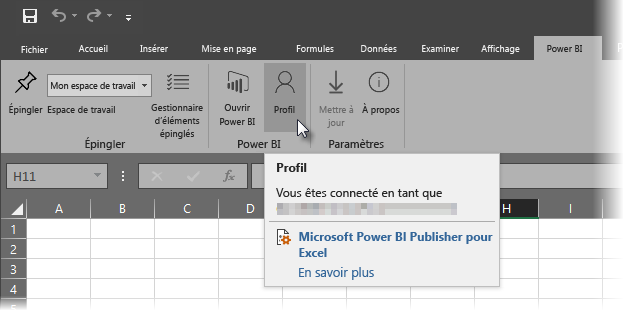
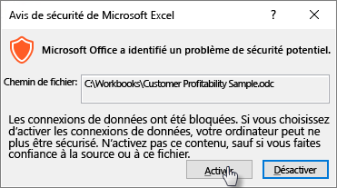

# Analyser dans Excel
Vous pouvez utiliser Excel pour afficher et interagir avec un jeu de données Power BI. L’option qui permet cela se nomme **Analyser dans Excel**. Cette option permet également d’accéder aux fonctionnalités de segments, de graphiques et de tableaux croisés dynamiques d’Excel, selon le jeu de données qui se trouve dans Power BI.

## Configuration requise
Il existe certaines conditions à l’utilisation de l’option **Analyser dans Excel** :

* **Analyser dans Excel** est compatible avec Microsoft Excel 2010 SP1 et versions ultérieures.
* Les tableaux croisés dynamiques d’Excel ne prennent pas en charge l’agrégation des champs numériques en mode glisser-déposer. Des *mesures doivent être prédéfinies* pour votre jeu de données dans Power BI.
* Certaines organisations appliquent des règles de stratégie de groupe qui empêchent l’installation des mises à jour requises relatives à l’option **Analyser dans Excel**. Si vous ne parvenez pas à installer les mises à jour, contactez votre administrateur.
* **Analyser dans Excel** requiert une licence Pro. Pour en savoir plus sur les différences de fonctionnalités entre la licence gratuite et la licence Pro, consultez la section [Comparaison entre Power BI gratuit et Power BI Pro](service-free-vs-pro.md). 

## Comment ça marche ?
Quand vous sélectionnez **Analyser dans Excel** à partir du bouton de sélection (...) associé à un groupe de données ou à un rapport dans **Power BI**, Power BI crée un fichier .ODC et le télécharge sur votre ordinateur à partir du navigateur.

Quand vous ouvrez le fichier dans Excel, une liste de **champs** et de **tableaux croisés dynamiques** vides s’affiche avec tous les tableaux, les champs et les mesures de votre jeu de données Power BI. Vous pouvez créer des tableaux croisés dynamiques et des graphiques, et analyser le jeu de données comme vous le feriez pour un jeu de données local dans Excel.

Le fichier .ODC comporte une chaîne de connexion MSOLAP, connectée à votre jeu de données dans Power BI. Quand vous analysez ou manipulez les données, Excel interroge le jeu de données de Power BI et renvoie les résultats à Excel. Si le jeu de données est connecté à une source de données active via DirectQuery, Power BI interroge la source de données et renvoie les résultats vers Excel.

L’option **Analyser dans Excel** est très utile pour les jeux de données et les rapports qui se connectent aux bases de données *multidimensionnelles* ou *tabulaires Analysis Services* ou à partir de fichiers Power BI Desktop ou de classeurs Excel avec des modèles de données qui possèdent des mesures modèles créés à l’aide de Data Analysis Expressions (DAX).

## Prise en main de l’option Analyser dans Excel
Dans Power BI, cliquez sur le bouton de sélection (...) en regard d’un rapport ou d’un jeu de données, puis, dans le menu qui s’affiche, sélectionnez **Analyser dans Excel**.

### Installer les mises à jour d’Excel
Quand vous utilisez **Analyser dans Excel**, vous devez installer les mises à jour des bibliothèques Excel. Vous serez invité à télécharger et à exécuter les mises à jour Excel. Cela démarrera l’installation du package Windows Installer *SQL_AS_OLEDDB.msi*. Ce package installe **Microsoft AS OLE DB Provider pour SQL Server 2016 RC0 (version préliminaire)**.

> [!NOTE]
> Veillez à activer l’option **Ne plus afficher ce message** dans la boîte de dialogue **Installer les mises à jour Excel**. La mise à jour ne doit être installée qu’une seule fois.
> 
> 

Si vous avez besoin d’installer de nouveau les mises à jour Excel pour l’option **Analyser dans Excel**, vous pouvez les télécharger à partir de l’icône de **téléchargement** de Power BI, comme illustré dans l’image suivante.

### Connectez-vous à Power BI
Même si vous êtes déjà connecté à Power BI dans votre navigateur, vous êtes invité à vous connecter à Power BI avec votre compte Power BI la première fois que vous ouvrez un nouveau fichier .ODC dans Excel. Cela permet d’authentifier la connexion entre Excel et Power BI.

### Utilisateurs disposant de plusieurs comptes Power BI
Certains utilisateurs possèdent plusieurs comptes Power BI. Il peut arriver qu’ils soient connectés dans Power BI avec un compte, alors que le compte utilisé par l’option Analyser dans Excel pour accéder au jeu de données est un compte différent. Dans ce cas, vous risquez d’obtenir une erreur **Interdit** ou un message d’échec de connexion si vous tentez d’accéder à un jeu de données qui est utilisé par l’option Analyser dans Excel.

Vous aurez l’occasion de vous connecter à nouveau. Vous pourrez alors vous connecter à l’aide du compte Power BI qui a accès au jeu de données utilisé par l’option Analyser dans Excel. Vous pouvez également sélectionner **Profil** à partir de l’onglet du ruban **Power BI** dans Excel, qui identifie le compte actuellement connecté et fournit un lien qui vous permet de vous déconnecter (et par la suite, de vous connecter avec un compte différent).

### Activez les connexions de données
Afin d’analyser vos données Power BI dans Excel, vous êtes invité à vérifier le nom et le chemin du fichier .odc, puis à sélectionner **Activer**.

> [!NOTE]
> Les administrateurs de locataires Power BI peuvent utiliser le *portail d’administration Power BI* pour désactiver l’utilisation de la fonction **Analyser dans Excel** avec les jeux de données locaux hébergés dans des bases de données Analysis Services (AS). Lorsque cette option est désactivée, la fonction **Analyser dans Excel** est désactivée pour les bases de données, mais reste disponible pour une utilisation avec d’autres jeux de données.
> 
> 

## Analyser
Maintenant qu’Excel est ouvert et que vous disposez d’un tableau croisé dynamique vide, vous êtes prêt à effectuer toutes sortes d’analyses avec votre jeu de données Power BI. Comme avec les autres classeurs locaux, la fonctionnalité Analyser dans Excel vous permet de créer des tableaux croisés dynamiques et des graphiques, d’ajouter des données à partir d’autres sources, etc. Bien sûr, vous pouvez également créer des feuilles de calcul variées avec différents types d’affichages de données.

> [!NOTE]
> L’utilisation de l’**analyse dans Excel** expose toutes les données de niveau de détail à tous les utilisateurs autorisés à accéder au jeu de données.
> 
> 

## Enregistrer
Vous pouvez enregistrer ce classeur connecté au jeu de données Power BI comme n’importe quel autre classeur. Toutefois, vous ne pouvez pas publier ni importer le classeur dans Power BI, car vous pouvez uniquement publier ou importer dans Power BI les classeurs qui comprennent des tables de données ou des modèles de données. Étant donné que le nouveau classeur est connecté au jeu de données dans Power BI, la publication ou l’importation dans Power BI seraient redondantes.

## Partager
Une fois que le classeur est enregistré, vous pouvez le partager avec d’autres utilisateurs Power BI dans votre organisation.

Quand un utilisateur avec lequel vous avez partagé votre classeur ouvre celui-ci pour la première fois, vos tableaux croisés dynamiques et vos données s’affichent tels qu’ils étaient quand vous avez enregistré le classeur pour la dernière fois. Il peut donc ne pas s’agir de la dernière version de vos données. Pour obtenir la dernière version des données, l’utilisateur doit cliquer sur le bouton **Actualiser** du ruban **Données**. Étant donné que le classeur se connecte à un jeu de données dans Power BI, les utilisateurs qui tentent d’actualiser le classeur doivent se connecter à Power BI et installer les mises à jour Excel la première fois qu’ils tentent une mise à jour à l’aide de cette méthode.

Étant donné que les utilisateurs doivent actualiser le jeu de donnée et que l’actualisation n’est pas prise en charge dans Excel Online pour les connexions externes, il est recommandé d’ouvrir le classeur dans une version de bureau d’Excel.

## Résolution des problèmes
Il peut arriver que vous obteniez un résultat inattendu lors de l’utilisation de la fonctionnalité Analyser dans Excel, ou que la fonctionnalité ne fonctionne pas comme prévu. [Cette page offre des résolutions communes des problèmes associés à l’utilisation de Analyser dans Excel](desktop-troubleshooting-analyze-in-excel.md)