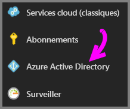
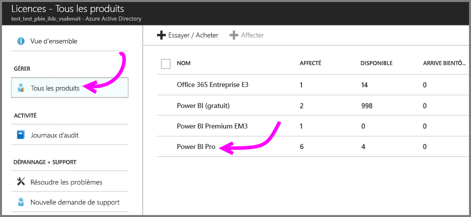
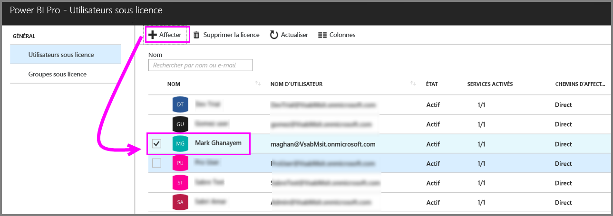
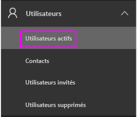
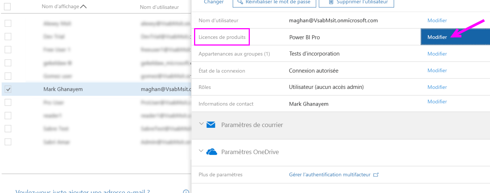
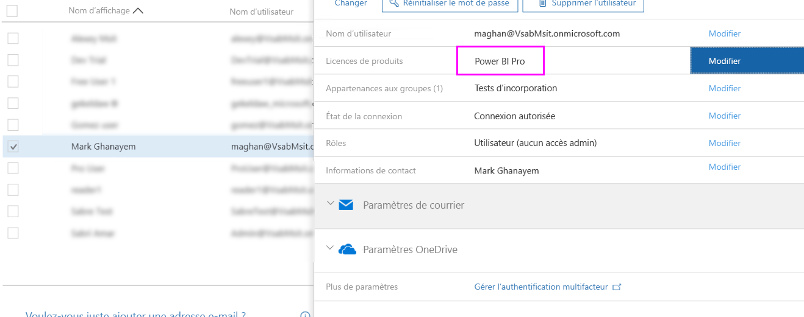

# Affectation de licences Power BI Pro

Les administrateurs peuvent choisir parmi différents portails de gestion et d’applets de commande PowerShell pour affecter des licences Power BI Pro aux utilisateurs. La gestion des licences Power BI s’appuie sur Azure Active Directory (Azure AD).

* Les propriétaires d’un abonnement Azure peuvent utiliser le panneau Azure Active Directory dans le [portail Azure Portal](https://ms.portal.azure.com/#@microsoft.onmicrosoft.com/dashboard/private/39bc3cf7-31a4-43f6-954c-f2d69ca2f0). 

* Les administrateurs généraux et les administrateurs de comptes d’utilisateur peuvent utiliser le [Centre d’administration Office 365](https://portal.office.com/AdminPortal/Home#/homepage).

## Gestion des licences Power BI Pro dans le portail Azure

Power BI utilise Azure AD comme service de base. Azure AD stocke les comptes et les groupes d’utilisateurs, de même que d’autres paramètres comme des informations sur les produits achetés.

### Affectation de licences à des comptes d’utilisateur individuels

Suivez ces étapes pour affecter des licences Pro à des comptes d’utilisateur individuels si vous êtes propriétaire d’un abonnement Azure :

1. Accédez au [portail Azure](https://ms.portal.azure.com/#@microsoft.onmicrosoft.com/dashboard/private/39bc3cf7-31a4-43f6-954c-f2d69ca2f0). 

2. Dans la barre de navigation gauche, cliquez sur Azure Active Directory.

    

3. Dans le panneau Azure Active Directory, cliquez sur Licences.

    

4. Dans le panneau Licences, cliquez sur Tous les produits, puis cliquez sur Power BI Pro pour afficher la liste des utilisateurs avec licence.

    

5. Cliquez sur Affecter pour ajouter une licence Power BI Pro à un compte d’utilisateur supplémentaire.

    

> [!NOTE]
> Bien que la plupart des aspects de licences puissent être gérés, il n’est pas possible d’acheter des licences Power BI Pro dans le portail Azure. Utilisez le Centre d’administration Office 365 pour acheter un abonnement Power BI Pro. Pour plus d’informations, consultez [Achat de Power BI Pro](https://docs.microsoft.com/en-us/power-bi/service-admin-purchasing-power-bi-pro).
>

## Gestion des licences Power BI Pro dans le Centre d’administration Office 365

Si vous êtes un administrateur général, vous achetez un abonnement Power BI Pro et vous gérez les licences associées pour l’organisation dans le Centre d’administration Office 365.

Suivez ces étapes pour affecter des licences Pro à des comptes d’utilisateur individuels si vous êtes un administrateur Office 365 :

1. Accédez au Centre d’administration Office 365.

2. Dans le volet de navigation gauche, développez Utilisateurs, puis cliquez sur Utilisateurs actifs.

    

3. Sélectionnez un ou plusieurs utilisateurs, puis cliquez sur Modifier les licences de produits.

    

4. Sous Power BI Pro, faites passer la valeur à Activé, puis cliquez sur Enregistrer.

    

5. Vérifiez sous État pour le ou les comptes sélectionnés que la licence Power BI Pro a été affectée.

    

> [!NOTE]
> Si votre abonnement ne dispose plus de suffisamment de licences, ajoutez-en en développant Facturation dans le volet de navigation gauche, puis en cliquant sur Abonnements. Dans la page Abonnements, sélectionnez l’abonnement Power BI Pro, puis cliquez sur Ajouter/supprimer des licences.
>

## Étapes suivantes
[Termes et conditions de l’offre d’essai Pro prolongé](https://aka.ms/power-bi-trial)
 
[Contrat du service Power BI pour les utilisateurs individuels](https://powerbi.microsoft.com/terms-of-service/)
 
[Annonce de Power BI Premium](https://aka.ms/pbipremium-announcement)
 
[Trouver les utilisateurs Power BI qui se sont connectés](service-admin-access-usage.md)

D’autres questions ? [Essayez d’interroger la communauté Power BI](https://community.powerbi.com/)