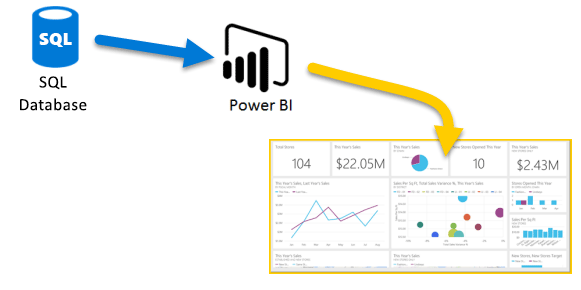
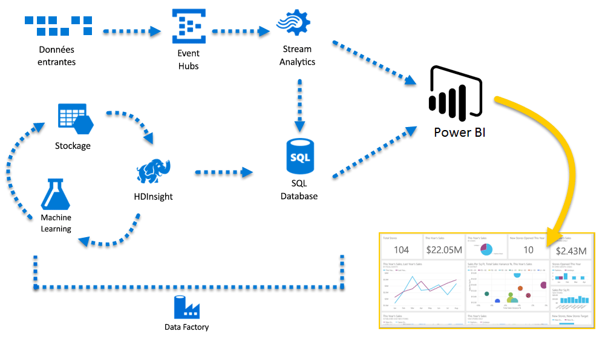

# Azure et Power BI

Avec les services **Azure** et **Power BI**, vos efforts de traitement des données peuvent aboutir à des analyses et des rapports qui fournissent des informations en temps réel sur votre entreprise. Azure et Power BI disposent de fonctionnalités d’intégration et de connectivité intégrées qui permettent de concrétiser vos efforts d’aide à la décision, que le traitement de vos données soit dans le cloud ou local, simple ou complexe, à source unique ou à grande échelle, sur des données stockées ou en temps réel.

Power BI dispose d’une multitude de connexions Azure, et les solutions d’aide à la décision que vous pouvez créer avec ces services sont aussi uniques que votre entreprise. Vous pouvez connecter une seule source de données Azure, ou quelques-unes, puis modeler et affiner vos données pour générer des rapports personnalisés.

## Azure SQL Database et Power BI

Vous pouvez démarrer avec une connexion directe à Azure SQL Database et créer des rapports pour surveiller la progression de votre entreprise. À l’aide de [Power BI Desktop](desktop-getting-started.md), vous pouvez créer des rapports pour identifier les tendances et les indicateurs de performance clés qui font avancer votre entreprise.

Il existe de nombreuses informations qui vous permettront d’en savoir plus sur [Azure SQL Database](http://azure.microsoft.com/services/sql-database/).

## Transformez, modelez et fusionnez vos données cloud

Avez-vous des données plus complexes et de sources très variées ? Aucun problème. Avec **Power BI Desktop** et les services Azure, il vous suffit d’une pression sur votre écran pour ouvrir la boîte de dialogue **Obtenir des données** . Dans la même requête, vous pouvez vous connecter à votre base de données **Azure SQL Database**, à votre source de données **Azure HDInsight** et à **Stockage Blob Azure** (ou **Stockage Table Azure**), puis sélectionner uniquement les parties dont vous avez besoin dans chacun d’eux et affiner votre sélection.

Vous pouvez également créer différents rapports pour différents publics, en utilisant les mêmes connexions de données, voire la même requête. Il vous suffit de créer une page de rapport, d’affiner vos visualisations pour chaque public et de la regarder vous donner des informations sur l’activité de l’entreprise.

Pour plus d’informations, examinez les ressources suivantes :

* [Azure SQL Database](http://azure.microsoft.com/services/sql-database/)
* [Azure HDInsight](http://azure.microsoft.com/services/hdinsight/)
* [Stockage Azure](http://azure.microsoft.com/services/storage/) (Stockage Blob et Stockage Table)

## Avancez avec Azure Services et Power BI sans craindre la complexité

Vous pouvez vous développer autant que nécessaire avec Azure et Power BI. Maîtrisez le traitement des données de plusieurs sources, employez des systèmes en temps réel massifs, utilisez [Stream Analytics](http://azure.microsoft.com/services/stream-analytics/) et [Event Hubs](http://azure.microsoft.com/services/event-hubs/), et fusionnez vos différents services SaaS dans des rapports d’aide à la décision qui donnent un avantage certain à votre entreprise.

## Informations de contexte avec l’analytique Power BI Embedded

Incorporez des visualisations de données interactives impressionnantes dans des applications, sites web et portails, entre autres, afin de tirer parti de vos données métier. Avec [Power BI Embedded en tant que ressource dans Azure](https://azure.microsoft.com/services/power-bi-embedded/), vous pouvez incorporer facilement des rapports et tableaux de bord interactifs afin d’offrir à vos utilisateurs des expériences cohérentes et haute fidélité sur leurs divers appareils.  Utilisé avec l’incorporation d’analytique, Power BI vous aide à parcourir le processus Données ->Connaissances -> Insights -> Actions.  Vous pouvez également augmenter la valeur de Power BI Pro et d’Azure en incorporant une analytique visuelle dans des [applications et portails internes de votre organisation](https://powerbi.microsoft.com/developers/embedded-analytics/organization/).

Vous trouverez des informations très complètes sur les API Power BI dans le [portail des développeurs Power BI](http://dev.powerbi.com).

Pour plus d’informations, consultez [Que peuvent faire les développeurs avec Power BI ?](developer/what-can-you-do.md).

## Incorporer vos données Power BI au sein de votre application

Incorporez des visualisations de données interactives impressionnantes dans des applications, sites web et portails, entre autres, afin de mettre en valeur vos données métier dans le contexte. Avec [Power BI Embedded dans Azure](https://azure.microsoft.com/services/power-bi-embedded/), vous pouvez incorporer facilement des rapports et tableaux de bord interactifs afin d’offrir à vos utilisateurs des expériences cohérentes et haute fidélité sur leurs divers appareils.

## Que pouvez-vous faire avec Azure et Power BI ?

Il existe toutes sortes de scénarios dans lesquels **Azure** et **Power BI** peuvent être combinés : les possibilités et les opportunités sont aussi uniques que votre entreprise. Pour plus d’informations sur les **services Azure**, consultez cette [page de vue d’ensemble](https://docs.microsoft.com/azure/machine-learning/team-data-science-process/plan-your-environment) qui décrit des **scénarios d’analyse de données à l’aide d’Azure**, et découvrez comment transformer vos sources de données en informations qui permettent de faire avancer votre entreprise.