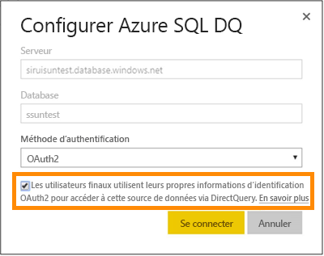
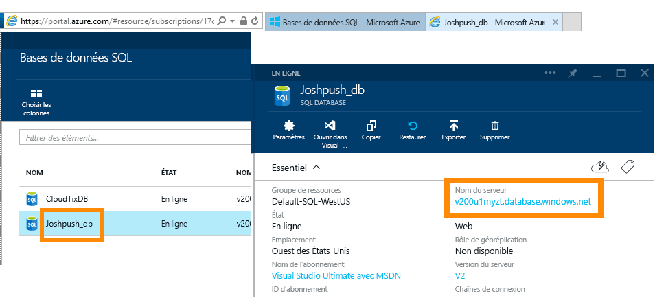
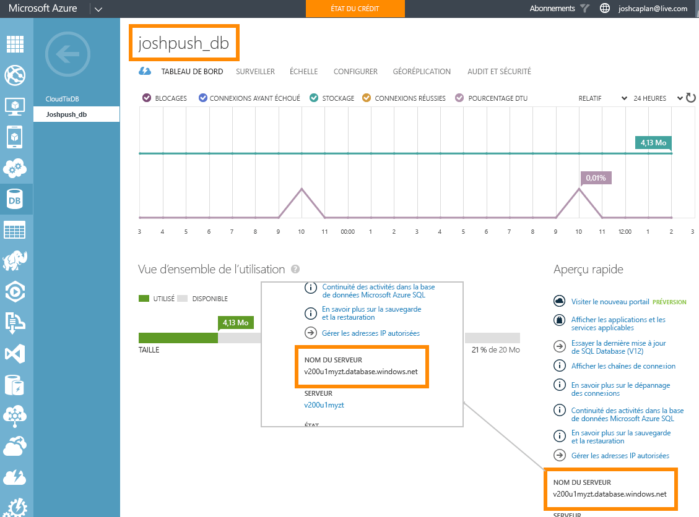

# Azure SQL Database avec DirectQuery
Découvrez comment vous pouvez vous connecter directement à Azure SQL Database et créer des rapports qui utilisent des données actives. Vous pouvez conserver vos données à la source et pas dans Power BI.

Avec DirectQuery, les requêtes sont renvoyées à Azure SQL Database pendant que vous explorez les données dans l’affichage Rapport. Cette fonctionnalité est suggérée aux utilisateurs qui connaissent bien les bases de données et les entités auxquelles ils se connectent.

**Remarques :**

* Spécifiez le nom de serveur complet lors de la connexion (voir ci-dessous pour plus de détails)
* Vérifiez que les règles de pare-feu de la base de données sont définies sur [Autoriser l’accès aux services Azure](https://msdn.microsoft.com/library/azure/ee621782.aspx).
* Chaque action, telle que la sélection d’une colonne ou l’ajout d’un filtre, renverra une requête à la base de données
* Les vignettes sont actualisées chaque heure (il n’est pas nécessaire de planifier l’actualisation). Vous pouvez régler cet intervalle dans les paramètres avancés lorsque vous vous connectez.
* Il n’y a pas de Q&R disponibles pour les jeux de données DirectQuery.
* Les modifications apportées aux schémas ne sont pas appliquées automatiquement.

Ces points sont susceptibles de changer, car nous travaillons actuellement à améliorer le produit. Les étapes de connexion sont détaillées ci-dessous. 

## Power BI Desktop et DirectQuery
Pour vous connecter à Azure SQL Database à l’aide de DirectQuery, vous devez utiliser Power BI Desktop. Cette approche offre des fonctionnalités et une flexibilité supplémentaires. Les rapports créés à l’aide de Power BI Desktop peuvent ensuite être publiés sur le service Power BI. Vous pouvez en savoir plus sur la connexion à [Azure SQL Database à l’aide de DirectQuery](desktop-use-directquery.md) dans Power BI Desktop. 

## Authentification unique

Une fois que vous avez publié un jeu de données Azure SQL DirectQuery dans le service, vous pouvez activer l’authentification unique (SSO) via OAuth2 d’Azure Active Directory (Azure AD) pour vos utilisateurs finaux. 

Pour activer l’authentification unique, accédez aux paramètres du jeu de données, ouvrez l’onglet **Sources de données**, puis cochez la case de l’authentification unique.

Lorsque l’option d’authentification unique est activée et que vos utilisateurs accèdent aux rapports basés sur la source de données, Power BI envoie leurs informations d’identification Azure AD dans les requêtes à Azure SQL Database. Ainsi, Power BI est en mesure de respecter les paramètres de sécurité qui sont configurés au niveau de la source de données.

L’option d’authentification unique prend effet sur tous les jeux de données qui utilisent cette source de données. Elle n’affecte pas la méthode d’authentification utilisée pour les scénarios d’importation.

## Recherche des valeurs de paramètres
Le nom complet de votre serveur et celui de votre base de données se trouvent dans le portail Azure.

## Étapes suivantes
[Utiliser DirectQuery dans Power BI Desktop](desktop-use-directquery.md)  
[Prise en main de Power BI](service-get-started.md)  
[Obtenir des données pour Power BI](service-get-data.md)  
D’autres questions ? [Posez vos questions à la communauté Power BI](http://community.powerbi.com/)
