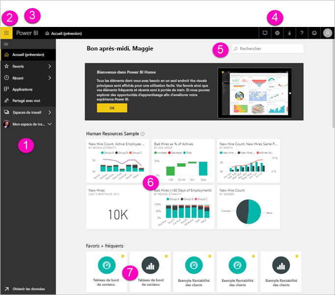
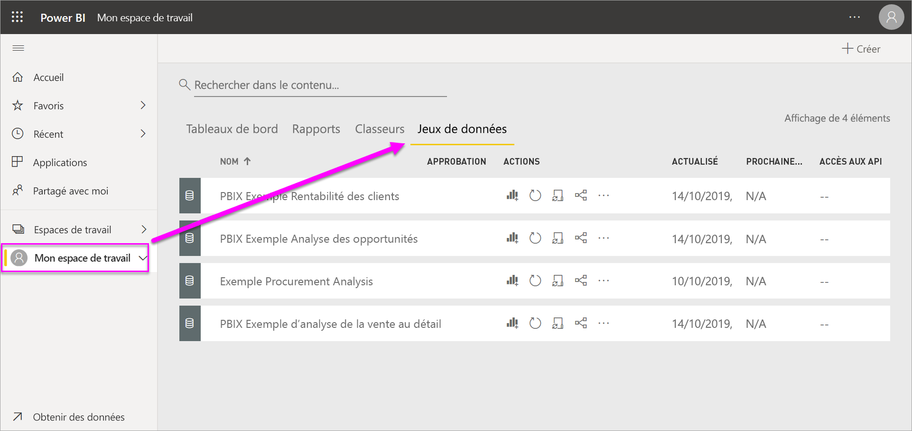
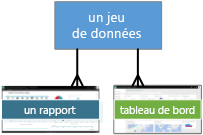
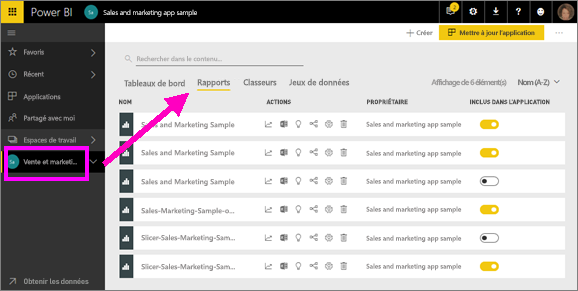
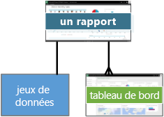
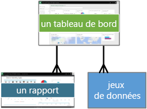
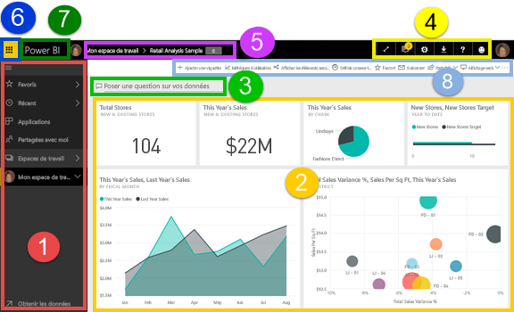
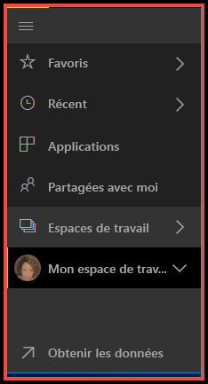
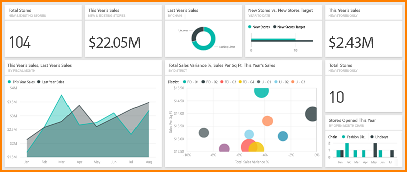
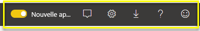

# Fondamentaux pour les concepteurs dans le service Power BI

Cet article part du principe que vous êtes déjà [inscrit au service Power BI](service-self-service-signup-for-power-bi.md) et que vous avez [ajouté des données](service-get-data.md). Si vous n’avez pas encore de données, essayez d’installer un [exemple de pack de contenu Power BI](sample-datasets.md#the-power-bi-samples-as-content-packs).

Voici les éléments que vous voyez lorsque vous ouvrez le service Power BI dans le navigateur :

1. Volet de navigation (gauche)
2. Lanceur d’applications Office 365
3. bouton Accueil de Power BI
4. Boutons d’icône, notamment paramètres, aide et commentaires
5. Zone de recherche
6. Vignettes d’un tableau de bord favori
7. Rapports et tableaux de bord favoris et fréquents

Nous étudierons ces fonctionnalités ultérieurement, mais passons tout d’abord en revue quelques concepts propres à Power BI.

Vous pouvez également regarder cette vidéo avant de lire le reste de cet article.  Dans cette vidéo, Will passe en revue les concepts de base et propose une visite guidée du service Power BI.

<iframe width="560" height="315" src="https://www.youtube.com/embed/B2vd4MQrz4M" frameborder="0" allowfullscreen></iframe>

## Concepts Power BI
Les 4 principaux composants de Power BI sont les **_tableaux de bord_**, les **_rapports_**, les **_classeurs_** et les **_jeux de données_**. Ceux-ci sont tous organisés en **_espaces de travail_**. Il est important de bien comprendre les espaces de travail avant d’étudier les quatre principaux composants. Nous allons donc commencer par cela.

## Espaces de travail
Les espaces de travail sont des conteneurs pour les tableaux de bord, rapports, classeurs et jeux de données dans Power BI. Il existe deux types d’espaces de travail : *Mon espace de travail* et les *espaces de travail d’application*. Qu’est-ce qu’une *application* ? Une *application* Power BI est une collection de tableaux de bord et de rapports destinés à fournir des mesures clés pour votre organisation. Les applications sont interactives, mais ne peuvent pas être modifiées.

- *Mon espace de travail* est l’espace de travail personnel qui permet à un client Power BI de travailler avec son propre contenu. Vous êtes le seul utilisateur à avoir accès à Mon espace de travail. Vous pouvez partager des tableaux de bord et des rapports à partir de votre espace Mon espace de travail. Pour collaborer sur des tableaux de bord et des rapports ou créer une application, vous devez travailler dans un espace de travail d’application.      
-  Les *espaces de travail d’application* permettent de collaborer et de partager du contenu avec vos collègues. C’est également l’endroit où vous créez, publiez et gérez des applications pour votre organisation. Considérez-les comme des zones intermédiaires et des conteneurs pour le contenu d’une application Power BI. Vous pouvez ajouter des collègues à vos espaces de travail d’application et collaborer sur des tableaux de bord, rapports, classeurs et jeux de données. Tous les membres de l’espace de travail d’application doivent avoir des licences Power BI Pro, mais les consommateurs de l’application (collègues qui ont accès aux applications) ne doivent pas nécessairement avoir des licences Pro.  

Pour plus d’informations, consultez la section **Partager votre travail** de la Table des matières, en commençant par [Comment dois-je collaborer et partager des tableaux de bord et rapports](service-how-to-collaborate-distribute-dashboards-reports.md)

Étudions maintenant les principaux composants de Power BI. Vous ne pouvez pas avoir de tableaux de bord ni de rapports sans données (vous pouvez avoir des tableaux de bord et des rapports vides, mais ils ne sont pas utiles tant qu’ils ne contiennent pas de données). Pour commencer, intéressons-nous aux **jeux de données**.

## Jeux de données
Un *jeu de données* est une collection de données que vous *importez* ou auxquelles vous *vous connectez*. Power BI vous permet de vous connecter à toutes sortes de jeux de données regroupés au même endroit et de les importer dans un même emplacement.  

Les jeux de données associés aux *espaces de travail* et un même jeu de données peuvent faire partie de nombreux espaces de travail. Lorsque vous ouvrez un espace de travail, les jeux de données associés sont répertoriés sous l’onglet **Jeux de données**. Chaque jeu de données répertorié représente une source de données unique, telle qu’un classeur Excel sur OneDrive, un jeu de données tabulaires SSAS locales ou un jeu de données Salesforce. Il existe de nombreuses sources de données prises en charge différentes, et nous en ajoutons de nouvelles en permanence. [Consultez la liste des types de jeux de données qui peuvent être utilisés avec Power BI](service-get-data.md).

Dans l’exemple ci-dessous, j’ai sélectionné l’espace de travail d’application « Ventes et marketing » et cliqué sur l’onglet pour **Jeux de données**.

**UN** jeu de données…

* peut être utilisé plusieurs fois dans un ou plusieurs espaces de travail ;
* peut être utilisé dans de nombreux rapports.
* peut comprendre différentes visualisations, et ces visualisations peuvent être affichées dans de nombreux tableaux de bord différents.

  

Pour vous [connecter à un jeu de données ou en importer un](service-get-data.md), sélectionnez **Obtenir des données** (au bas de la barre de navigation gauche) ou sélectionnez **+ Créer un jeux de données** (dans le coin supérieur droit). Suivez les instructions permettant de vous connecter à la source spécifique ou de l’importer et d’ajouter le jeu de données à l’espace de travail actif. Les nouveaux jeux de données sont signalés par un astérisque jaune. Le travail que vous effectuez dans Power BI ne modifie pas le jeu de données sous-jacent.

Si vous faites [partie d’un **_espace de travail d’application_**](service-collaborate-power-bi-workspace.md), les jeux de données ajoutés par un membre de cet espace de travail sont accessibles par les autres membres de l’espace de travail.

Les jeux de données peuvent être actualisés, renommés, explorés et supprimés. Utilisez un jeu de données pour créer un rapport à partir de zéro ou en exécutant [Informations rapides](service-insights.md).  Pour afficher les rapports et les tableaux de bord qui utilisent déjà un jeu de données, sélectionnez **Afficher les éléments associés**. Pour explorer un jeu de données, sélectionnez-le. En agissant ainsi, vous ouvrez le rapport de données dans l’éditeur de rapport, ce qui vous permet de vous pencher concrètement sur les données et de créer des visualisations. Intéressons-nous à la rubrique suivante : les rapports.

### Aller plus loin
* [Qu’est-ce que Power BI Premium ?](service-premium.md)
* [Obtenir des données pour Power BI](service-get-data.md)
* [Exemples de jeux de données pour Power BI](sample-datasets.md)

## Rapports
Un rapport Power BI correspond à une ou plusieurs pages de visualisations comme des graphiques en courbes, des cartes et des treemaps. Les visualisations sont également appelées **_visuels_**. Toutes les visualisations dans un rapport proviennent d’un seul jeu de données. Les rapports peuvent être créés de toutes pièces dans Power BI, être importés avec les tableaux de bord que des collègues partagent avec vous ou être créés automatiquement quand vous vous connectez à des jeux de données à partir d’Excel, de Power BI Desktop, de bases de données, d’applications SaaS et d’[applications](service-get-data.md).  Par exemple, quand vous vous connectez à un classeur Excel qui contient des feuilles Power View, Power BI crée un rapport basé sur ces feuilles. Et lorsque vous vous connectez à une application SaaS, Power BI importe un rapport prédéfini.

Il existe deux modes d’affichage et d’interaction pour les rapports : [mode Lecture et mode Édition](service-reading-view-and-editing-view.md).  Seuls la personne qui a créé le rapport, les copropriétaires et les personnes autorisées ont accès à l’ensemble des fonctions d’exploration, de conception, de génération et de partage du **_mode Edition_** pour ce rapport. Les personnes avec qui ils partagent le rapport peuvent l’explorer et interagir avec lui en **_mode Lecture_**.   

Lorsque vous ouvrez un espace de travail, les rapports associés sont répertoriés sous l’onglet **Rapports**. Chaque rapport répertorié représente une ou plusieurs pages de visualisations basées sur un seul des jeux de données sous-jacents. Pour ouvrir un rapport, sélectionnez-le.

Lorsque vous ouvrez une application, vous voyez un tableau de bord.  Pour accéder à un rapport sous-jacent, sélectionnez une vignette de tableau de bord (nous approfondirons ce sujet ultérieurement) qui a été épinglée à partir d’un rapport. Gardez à l’esprit que toutes les vignettes ne sont pas épinglées à partir de rapports. Vous devrez donc peut-être cliquer sur quelques vignettes pour trouver un rapport.

Par défaut, le rapport s’ouvre en mode Lecture.  Sélectionnez **Modifier le rapport** pour l’ouvrir en Mode Édition (si vous avez les autorisations requises).

Dans l’exemple ci-dessous, j’ai sélectionné l’espace de travail d’application « Ventes et marketing » et cliqué sur l’onglet pour **Rapports**.

**UN** rapport…

* est contenu dans un seul espace de travail.
* peut être associé à plusieurs tableaux de bord au sein de cet espace de travail (les vignettes épinglées à partir de ce rapport peuvent apparaître sur plusieurs tableaux de bord).
* peut être créé à l'aide des données d'un jeu de données unique (la seule exception à cela est que Power BI Desktop peut combiner plusieurs jeux de données dans un même rapport et que ce rapport peut être importé dans Power BI).

  

### Aller plus loin
* [Rapports dans Power BI Desktop et le service Power BI](service-reports.md)
* [Rapports dans les applications mobiles Power BI](mobile-reports-in-the-mobile-apps.md)

## Tableaux de bord
Un *tableau de bord* est un élément que vous créez dans **Power BI** ou qu’un collègue crée **dans le service Power BI** et partage avec vous. Il s’agit d’un canevas unique qui contient zéro vignette et widget ou plus. Chaque vignette épinglée à partir d’un rapport ou de la zone [Questions et réponses](power-bi-q-and-a.md) affiche une [visualisation](power-bi-report-visualizations.md) unique qui a été créée à partir d’un jeu de données et épinglée au tableau de bord. Des pages de rapport entières peuvent aussi être épinglées à un tableau de bord sous forme de vignette unique. Il existe plusieurs façons d’ajouter des vignettes à votre tableau de bord, bien trop nombreuses pour être traitées dans cette rubrique de présentation. Pour plus d’informations, consultez [Vignettes de tableau de bord dans Power BI](service-dashboard-tiles.md).

Pourquoi créer des tableaux de bord ?  En voici quelques raisons :

* Pour voir en un coup d’œil toutes les informations nécessaires pour prendre des décisions.
* Pour superviser les informations les plus importantes concernant votre activité.
* Pour vous assurer que tous vos collègues accèdent à la même page, et qu’ils consultent et utilisent les mêmes informations que vous.
* Pour surveiller la santé d’une entreprise, d’un produit, d’une unité organisationnelle, d’une campagne marketing, etc.
* Pour créer une vue personnalisée d’un tableau de bord plus large en affichant les métriques qui vous intéressent.

Lorsque vous ouvrez un espace de travail, les tableaux de bord associés sont répertoriés sous l’onglet **Tableaux de bord**. Pour ouvrir un tableau de bord, sélectionnez-le. Lorsque vous ouvrez une application, vous voyez un tableau de bord.  Chaque tableau de bord représente une vue personnalisée d’un sous-ensemble des jeux de données sous-jacents.  Si vous êtes propriétaire du tableau de bord, vous avez aussi accès en modification aux jeux de données et rapports sous-jacents.  Si le tableau de bord a été partagé avec vous, vous pouvez interagir avec le tableau de bord et les rapports sous-jacents, mais vous ne pouvez pas enregistrer de modifications.

Il existe différentes manières de [partager un tableau de bord](service-share-dashboards.md). Power BI Pro est nécessaire pour partager un tableau de bord et peut être requis pour afficher un tableau de bord partagé.

**UN** tableau de bord…

* est associé à un seul espace de travail.
* peut afficher des visualisations à partir de nombreux jeux de données différents ;
* peut afficher des visualisations à partir de nombreux rapports différents
* peut afficher des visualisations épinglées à partir d’autres outils (par exemple, Excel)

  

### Aller plus loin
* [Créez un tableau de bord vide, puis obtenez des données](service-dashboard-create.md).
* [Dupliquer un tableau de bord](service-dashboard-copy.md)
* [Créer une vue téléphone d’un tableau de bord](service-create-dashboard-mobile-phone-view.md)

## Classeurs
Les classeurs sont un type spécial de jeu de données. Si vous avez lu la section **Jeux de données** ci-dessus, vous savez presque tout sur les classeurs. Mais vous vous demandez peut-être pourquoi Power BI considère parfois un classeur Excel comme un **jeu de données** et parfois comme un **classeur**.

Lorsque vous utilisez **Obtenir des données** avec des fichiers Excel, vous avez la possibilité d’*importer* un fichier ou de vous *connecter* au fichier. Lorsque vous choisissez Se connecter, votre classeur apparaît dans Power BI comme il le ferait dans Excel Online. Mais contrairement à Excel Online, Power BI offre des fonctionnalités utiles pour épingler des éléments directement de vos classeurs sur vos tableaux de bord.

Vous ne pouvez pas modifier votre classeur dans Power BI. Toutefois, si vous devez apporter des modifications, vous pouvez cliquer sur Modifier, puis choisir de modifier votre classeur dans Excel Online ou l’ouvrir dans Excel sur votre ordinateur. Toutes les modifications apportées sont enregistrées dans le classeur sur OneDrive.

### Aller plus loin
* [Obtenir des données de classeurs Excel](service-excel-workbook-files.md)
* [Publier sur Power BI à partir d’Excel](service-publish-from-excel.md)

## Un tableau de bord dans Mon espace de travail
Nous avons couvert les espaces de travail et les principaux composants. Rassemblons tout ça et passons en revue les éléments qui composent un tableau de bord dans le service Power BI.

### 1. **Volet de navigation gauche**
Utilisez le volet de navigation pour rechercher et parcourir vos espaces de travail et les principaux composants de Power BI : tableaux de bord, rapports, classeurs et jeux de données.  

  

* Sélectionnez **Obtenir des données** pour [ajouter des jeux de données, des rapports et des tableaux de bord à Power BI](service-get-data.md).
* Développer et réduire le volet de navigation avec cette icône .
* Ouvrez ou gérez votre contenu favori en sélectionnant **Favoris**.
* Affichez et ouvrez votre contenu le plus récemment visité en sélectionnant **Récents**.
* Affichez, ouvrez ou supprimez une application en sélectionnant **Applications**.
* Un collègue a partagé du contenu avec vous ? Sélectionnez **Partagés avec moi** pour rechercher et trier le contenu dont vous avez besoin.
* Affichez et ouvrez vos espaces de travail en sélectionnant **Espaces de travail**.

Cliquez une seule fois sur ces éléments :

* une icône ou un titre pour l’ouvrir en mode Contenu
* une flèche vers la droite (>) pour ouvrir un menu contextuel Favoris, Récents et Espaces de travail.
* une icône de chevron pour afficher la liste déroulante **Mon espace de travail** constituée de tableaux de bord, rapports, classeurs et jeux de données.

### 2. **Canevas**
Étant donné que nous avons ouvert un tableau de bord, le canevas affiche des vignettes de visualisation. Si, par exemple, nous avions ouvert l’éditeur de rapport, le canevas afficherait une page de rapport.

Les tableaux de bord se composent de [vignettes](service-dashboard-tiles.md).  Les vignettes sont créées en mode Édition dans les rapports, dans Questions et réponses, dans d’autres tableaux de bord et peuvent être épinglées à partir d’Excel, de SSRS et bien plus encore. Un type spécial de vignette appelé [widget](service-dashboard-add-widget.md) est ajouté directement au tableau de bord. Les vignettes qui apparaissent dans un tableau de bord y ont été placées spécifiquement par un créateur/propriétaire de rapport.  Le fait d’ajouter une vignette à un tableau de bord est appelé *épinglage*.

Pour plus d’informations, consultez [Tableaux de bord](#dashboards) (ci-dessus).

### 3. **Zone Questions et réponses**
Une manière d’explorer vos données consiste à poser une question et à laisser Q&R Power BI y répondre, sous la forme d’une visualisation. La zone Questions et réponses peut être utilisée pour ajouter du contenu à un rapport ou tableau de bord.

La fonctionnalité Questions et réponses recherche une réponse dans le ou les jeux de données connectés au tableau de bord.  Un jeu de données connecté possède au moins une vignette épinglée à ce tableau de bord.

Dès que vous commencez à taper votre question, Q&R vous conduit à la page Q&R. Au fur et à mesure que vous tapez du texte, la fonctionnalité Questions et réponses vous aide à poser la bonne question et à trouver la meilleure réponse via des reformulations, la saisie semi-automatique, des suggestions, etc. Quand vous obtenez une visualisation (réponse) qui vous satisfait, épinglez-la à votre tableau de bord. Pour plus d’informations, consultez [Q&R dans Power BI](power-bi-q-and-a.md).

### 4. **Boutons d’icônes**
Les icônes figurant dans l’angle supérieur droit sont des ressources vous permettant de définir des configurations, des notifications, d’effectuer des téléchargements, d’obtenir de l’aide et de fournir des commentaires à l’équipe Power BI. Cliquez sur la flèche double pour ouvrir le tableau de bord en mode **Plein écran**.  

### 5. **Titre du tableau de bord** (chemin de navigation, également appelé fil d’Ariane)
Comme il n’est pas toujours facile de déterminer quels espaces de travail et tableaux de bord sont actifs, Power BI crée un chemin de navigation pour vous.  Dans cet exemple, vous voyez l’espace de travail (Mon espace de travail) et le titre du tableau de bord (Exemple Analyse de la vente au détail).  Si nous avions ouvert un rapport, le nom du rapport serait ajouté à la fin du chemin de navigation.  Chaque section du chemin est un lien hypertexte actif.  

Notez l’icône « C » après le titre du tableau de bord. Ce tableau de bord comporte une [balise de classification de données](service-data-classification.md) nommée « confidentiel ». La balise identifie la sensibilité et le niveau de sécurité des données. Si votre administrateur a activé la classification des données, chaque tableau de bord a une étiquette par défaut définie. Les propriétaires de tableaux de bord doivent modifier la balise en fonction du niveau de sécurité approprié de leur tableau de bord.

### 6. **Lanceur d’applications Office 365**
Avec le Lanceur d’applications, toutes vos applications Office 365 sont facilement disponibles en un clic. En effet, il vous permet de démarrer rapidement votre e-mail, vos documents, votre calendrier et bien plus encore.

### 7. **Accueil de Power BI**
Sélectionnez **Power BI** pour revenir à la page d’accueil de Power BI.

   

### 8. **Boutons d’icônes étiquetés**
Cette zone de l’écran contient des options supplémentaires pour interagir avec le contenu (dans ce cas, avec le tableau de bord).  En plus des icônes étiquetées que vos pouvez voir, sélectionner le bouton de sélection (points de suspension) pour afficher les options de duplication, d’impression et d’actualisation du tableau de bord et bien plus encore.

   

## Étapes suivantes
- [Qu’est-ce que Power BI ?](power-bi-overview.md)  
- [Navigation : Découverte du service Power BI](service-the-new-power-bi-experience.md)
- [Vidéos Power BI](videos.md)  
- [Éditeur de rapport - Suivre une visite guidée](service-the-report-editor-take-a-tour.md)

D’autres questions ? [Essayez d’interroger la communauté Power BI](http://community.powerbi.com/)
