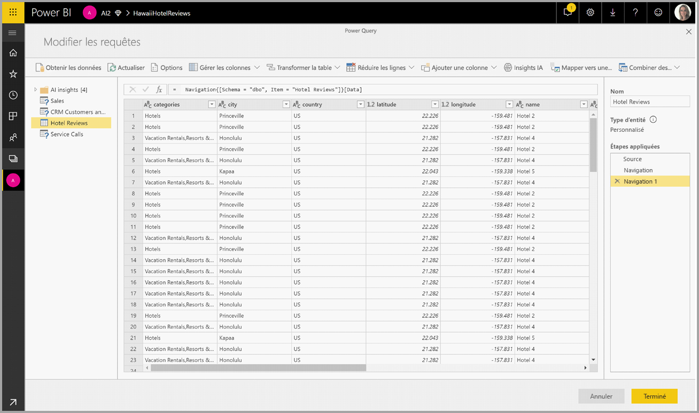
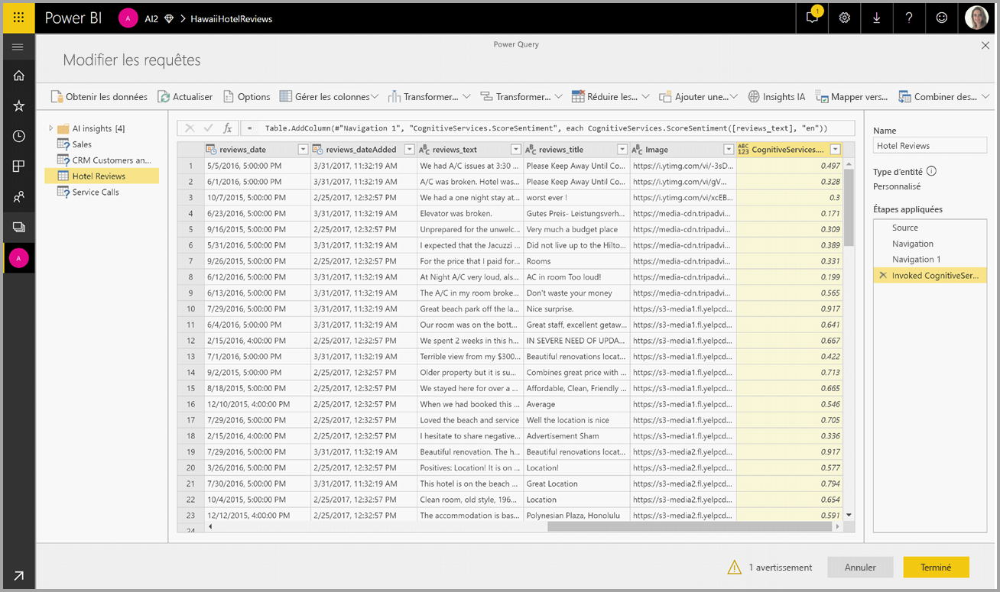

# Cognitive Services dans Power BI (préversion)

Avec Cognitive Services dans Power BI, vous pouvez appliquer différents algorithmes d’[Azure Cognitive Services](https://azure.microsoft.com/services/cognitive-services/) pour enrichir vos données dans la préparation des données de libre-service pour les flux de données.

Les services actuellement pris en charge sont l’[analyse des sentiments](https://docs.microsoft.com/azure/cognitive-services/text-analytics/how-tos/text-analytics-how-to-sentiment-analysis), l’[extraction de phrases clés](https://docs.microsoft.com/azure/cognitive-services/text-analytics/how-tos/text-analytics-how-to-keyword-extraction), la [détection de langue](https://docs.microsoft.com/azure/cognitive-services/text-analytics/how-tos/text-analytics-how-to-language-detection) et le [balisage des images](https://docs.microsoft.com/azure/cognitive-services/computer-vision/concept-tagging-images). Les transformations sont exécutées sur le Service Power BI et ne nécessitent pas d’abonnement Azure Cognitive Services. Cette fonctionnalité requiert Power BI Premium.

## **Activation de fonctionnalités d’intelligence artificielle**

Cognitives services est pris en charge pour les nœuds de capacité Premium EM2, A2 ou P1 et versions ultérieures. Une charge de travail d’intelligence artificielle distincte sur la capacité est utilisée pour exécuter les services cognitifs. Dans la préversion publique, cette charge de travail est désactivée par défaut. Avant d’utiliser les services cognitifs dans Power BI, la charge de travail d’intelligence artificielle doit être activée dans les paramètres de capacité du portail d’administration. Vous pouvez activer la charge de travail d’intelligence artificielle dans la section des charges de travail et définir la quantité maximale de mémoire que vous souhaitez que cette charge de travail utilise. La limite de mémoire recommandée est de 20 %. Le dépassement de cette limite ralentit la requête.

## **Prise en main de Cognitive Services dans Power BI**

Les transformations de Cognitive Services font partie de la [préparation des données de libre-service pour les flux de données](https://powerbi.microsoft.com/blog/introducing-power-bi-data-prep-wtih-dataflows/). Pour enrichir vos données avec Cognitive Services, commencez par modifier un flux de données.

Sélectionnez le bouton **Insights d’intelligence artificielle** dans le ruban supérieur de l’éditeur Power Query.

Dans la fenêtre contextuelle, sélectionnez la fonction que vous souhaitez utiliser et les données que vous souhaitez transformer. Dans cet exemple, je note le sentiment d’une colonne qui contient le texte de la révision.

**CultureInfo** est une entrée facultative pour spécifier la langue du texte. Ce champ attend un code ISO. Vous pouvez utiliser une colonne ou un champ statique en tant qu’entrée pour Cultureinfo. Dans cet exemple, la langue spécifiée pour toute la colonne est l’anglais (en). Si vous laissez ce champ vide, Power BI détecte automatiquement la langue avant d’appliquer la fonction. Ensuite, sélectionnez **Appeler.**

Après que la fonction a été appelée, le résultat est ajouté à la table en tant que nouvelle colonne. La transformation est également ajoutée en tant qu’étape appliquée dans la requête.

Si la fonction retourne plusieurs champs de sortie, l’appel de la fonction ajoute une nouvelle colonne avec un enregistrement de plusieurs champs de sortie.

Utilisez l’option de développement pour ajouter une ou les deux valeurs en tant que colonnes à vos données.

## **Fonctions disponibles**

Cette section décrit les fonctions disponibles dans Cognitive Services dans Power BI.

### **Détecter la langue**

La fonction de détection de langue évalue le texte entré et, pour chaque champ, retourne le nom de la langue et l’identificateur ISO. Cette fonction est utile pour les colonnes de données qui collectent du texte arbitraire dont la langue est inconnue. La fonction attend des données au format texte en tant qu’entrée.

L’analyse de texte reconnaît jusqu'à 120 langues. Pour plus d’informations, consultez [langues prises en charge](https://docs.microsoft.com/azure/cognitive-services/text-analytics/text-analytics-supported-languages).

### **Extraire les phrases clés**

La fonction **Extraction de phrases clés** évalue du texte non structuré et, pour chaque champ de texte, retourne une liste de phrases clés. La fonction requiert un champ de texte en tant qu’entrée et accepte une entrée facultative pour **Cultureinfo**. (Consultez la section **Prise en main** plus haut dans cet article.)

L’extraction de phrases clés fonctionne au mieux lorsque vous lui donnez de plus grands blocs de texte à traiter. C’est le contraire avec l’analyse des sentiments, qui fonctionne mieux sur des blocs de texte plus petits. Pour obtenir les meilleurs résultats lors des deux opérations, envisagez de restructurer les entrées en conséquence.

### **Noter le sentiment**

La fonction **Noter le sentiment** évalue une entrée de texte et retourne un score de valeur de 0 (négatif) à 1 (positif) pour chaque document. Cette fonction est utile pour détecter les sentiments positifs et négatifs dans les médias sociaux, les avis de clients et les forums de discussion.

L’analyse de texte utilise un algorithme de classification de Machine Learning pour générer un score de sentiment entre 0 et 1. Des scores plus proches de 1 indiquent un sentiment positif, des scores plus proches de 0 un sentiment négatif. Le modèle est préformé avec un corps de texte étendu contenant des associations de sentiments. Il n’est actuellement pas possible de fournir vos propres données d’apprentissage. Le modèle utilise une combinaison de techniques pendant l’analyse de texte, notamment le traitement de texte, l’analyse morphosyntaxique, le placement des mots et les associations de mots. Pour plus d’informations sur l’algorithme, consultez [Introduction à l’analyse de texte](https://blogs.technet.microsoft.com/machinelearning/2015/04/08/introducing-text-analytics-in-the-azure-ml-marketplace/).

L’analyse des sentiments est effectuée sur tout le champ d’entrée, par opposition à l’extraction des sentiments pour une entité particulière du texte. Dans la pratique, on a tendance à noter la précision d’amélioration lorsque des documents contiennent une ou deux phrases plutôt qu’un grand bloc de texte. Pendant une phase d’évaluation de l’objectivité, le modèle détermine si un champ d’entrée en tant que tout est objectif ou contient des sentiments. Un champ d’entrée principalement objectif ne passe pas à la phase de détection des sentiments. Un score de .50 est généré sans traitement supplémentaire. Pour que les champs d’entrée continuent dans le pipeline, la phase suivante génère un score inférieur ou supérieur à .50, selon le degré de sentiment détecté dans le champ d’entrée.

Actuellement, l’analyse des sentiments prend en charge l’anglais, l’allemand, l’espagnol et le français. D’autres langues sont en préversion. Pour plus d’informations, consultez [Langues prises en charge](https://docs.microsoft.com/azure/cognitive-services/text-analytics/text-analytics-supported-languages).

### **Baliser des images**

La fonction **Baliser des images** retourne des balises basées sur plus de 2 000 objets, êtres vivants, scènes et actions reconnaissables. Lorsque des balises sont ambiguës ou ne sont pas connues de beaucoup de personnes, la sortie donne des « indications » pour clarifier la signification de la balise dans le contexte d’un paramètre connu. Les balises ne sont pas organisées sous la forme d’une taxonomie et il n’y a pas de hiérarchies d’héritage. Une collection de balises de contenu constitue le fondement d’une « description » d’image affichée en tant que langage lisible humain mis en forme dans des phrases complètes.

Après le chargement d’une image ou la spécification d’une URL d’image, les algorithmes de vision par ordinateur sortent des balises basées sur des objets, des êtres vivants et des actions identifiés dans l’image. Le balisage n’est pas limité à l’objet principal, par exemple une personne au premier plan, mais inclut également le cadre (intérieur ou extérieur), le mobilier, les outils, les plantes, les animaux, les accessoires, les gadgets, etc.

Cette fonction requiert une URL de l’image ou un champ de base de données 64 bits en tant qu’entrée. Actuellement, le balisage des images prend en charge l’anglais, l’espagnol, le japonais, le portugais et le chinois simplifié. Pour plus d’informations, consultez [Langues prises en charge](https://docs.microsoft.com/rest/api/cognitiveservices/computervision/tagimage/tagimage#uri-parameters).

## Étapes suivantes

Cet article donne une vue d’ensemble de l’utilisation de Cognitive Services avec le service Power BI. Les articles suivants pourraient également être intéressants et utiles pour vous. 

* [Tutoriel : Appeler un modèle Machine Learning Studio dans Power BI (préversion)](service-tutorial-invoke-machine-learning-model.md)
* [Intégration d’Azure Machine Learning dans Power BI (préversion)](service-machine-learning-integration.md)
* [Tutoriel : Utilisation de Cognitive Services dans Power BI](service-tutorial-use-cognitive-services.md)

Pour plus d’informations sur les flux de données, lisez les articles suivants :
* [Créer et utiliser des flux de données dans Power BI](service-dataflows-create-use.md)
* [Utilisation d’entités calculées sur Power BI Premium (préversion)](service-dataflows-computed-entities-premium.md)
* [Utilisation de flux de données avec des sources de données locales (préversion)](service-dataflows-on-premises-gateways.md)
* [Ressources du développeur pour les flux de données Power BI (préversion)](service-dataflows-developer-resources.md)
* [Flux de données et intégration à Azure Data Lake (préversion)](service-dataflows-azure-data-lake-integration.md)