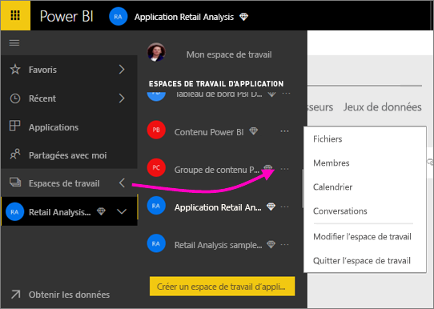
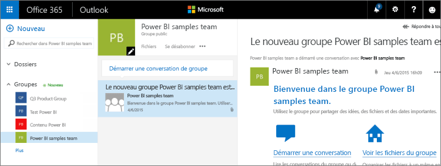

# Collaborer dans l’espace de travail de votre application Power BI
Les espaces de travail d’application Power BI sont d’excellents environnements pour collaborer avec vos collègues sur des tableaux de bord, des rapports et des jeux de données afin de créer des *applications*. La collaboration ne s’arrête pas aux espaces de travail dans Power BI. Office 365 offre d’autres services de groupe, comme le partage de fichiers sur OneDrive Entreprise, les conversations dans Exchange, le calendrier partagé, les tâches, etc. En savoir plus sur les[groupes dans Office 365](https://support.office.com/article/Create-a-group-in-Office-365-7124dc4c-1de9-40d4-b096-e8add19209e9)

> [!NOTE]
> L’expérience des nouveaux espaces de travail en préversion change la relation entre les espaces de travail Power BI et les groupes Office 365. Vous ne créez plus automatiquement un groupe Office 365 chaque fois que vous créez un nouvel espace de travail. Pour plus d’informations, consultez [Création des nouveaux espaces de travail (préversion)](service-create-the-new-workspaces.md)

Les espaces de travail d’application sont disponibles seulement avec une [licence Power BI Pro](service-features-license-type.md).

## Collaborer sur des fichiers Power BI Desktop dans votre espace de travail d’application
Après avoir créé un fichier Power BI Desktop, si vous publiez celui-ci dans votre espace de travail d’application Power BI, tous les membres de votre espace de travail peuvent collaborer sur ce fichier.

1. Dans Power BI Desktop, sélectionnez **Publier** dans le ruban **Accueil**, puis, dans la zone **Sélectionner une destination**, sélectionnez votre espace de travail d’application.
   
    
2. Dans le service Power BI, sélectionnez la flèche située en regard de Espaces de travail, puis sélectionnez votre espace de travail d’application.
   
    
3. Sélectionnez l’onglet Rapports, puis votre rapport.
   
    
   
    Celui-ci est semblable à tout autre rapport dans Power BI. Vous et d’autres utilisateurs de l’espace de travail d’application pouvez [modifier le rapport](consumer/end-user-reports.md) et enregistrer des vignettes dans le tableau de bord de votre choix.

## Collaborer dans Office 365
La collaboration dans Office 365 débute dans l’espace de travail d’application dans Power BI.

1. Dans le service Power BI, sélectionnez la flèche située en regard de Espaces de travail, puis sélectionnez les points de suspension (**…**) en regard du nom de votre espace de travail. 
   
   
2. Dans ce menu, vous pouvez collaborer avec votre groupe de plusieurs façons : 
   
   * Avoir une [conversation de groupe dans Office 365](service-collaborate-power-bi-workspace.md#have-a-group-conversation-in-office-365).
   * [Planifier un événement](service-collaborate-power-bi-workspace.md#schedule-an-event-on-the-group-workspace-calendar) dans le calendrier de l’espace de travail de groupe de l’application.
   
   Quand vous accédez pour la première fois à l’espace de travail de groupe de votre application dans Office 365, la procédure peut prendre un certain temps. Patientez 15 à 30 minutes, puis actualisez votre navigateur.

## Avoir une conversation de groupe dans Office 365
1. Sélectionnez les points de suspension (…) en regard du nom de votre espace de travail d’application \> **Conversations**. 
   
    
   
   Le site de courrier et de conversation de l’espace de travail de groupe de votre application s’ouvre dans Outlook pour Office 365.
   
   
2. En savoir plus sur les [conversations de groupe dans Outlook pour Office 365](https://support.office.com/Article/Have-a-group-conversation-a0482e24-a769-4e39-a5ba-a7c56e828b22).

## Planifier un événement dans le calendrier de l’espace de travail de groupe de l’application
1. Sélectionnez les points de suspension (**…**) en regard du nom de l’espace de travail de votre application \> **Calendrier**. 
   
   
   
   Cela a pour effet d’ouvrir le calendrier de l’espace de travail de groupe de votre application dans Outlook pour Office 365.
   
   
2. En savoir plus sur les [calendriers de groupe dans Outlook pour Office 365](https://support.office.com/Article/Add-edit-and-subscribe-to-group-events-0cf1ad68-1034-4306-b367-d75e9818376a).

## Gérer un espace de travail d’application
Si vous êtes propriétaire ou administrateur d’un espace de travail d’application, vous pouvez également ajouter ou supprimer des membres. Pour en savoir plus, voir [Gérer votre espace de travail d’application dans Power BI](service-manage-app-workspace-in-power-bi-and-office-365.md).

## Étapes suivantes
* [Créer des applications et des espaces de travail d’application dans Power BI](service-create-distribute-apps.md)
* D’autres questions ? [Essayez la communauté Power BI](http://community.powerbi.com/)
* Vous souhaitez formuler des commentaires ? Consultez la page des [suggestions concernant Power BI](https://ideas.powerbi.com/forums/265200-power-bi).

