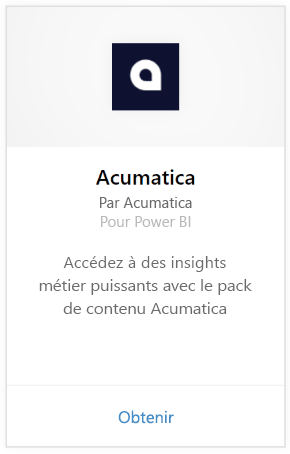
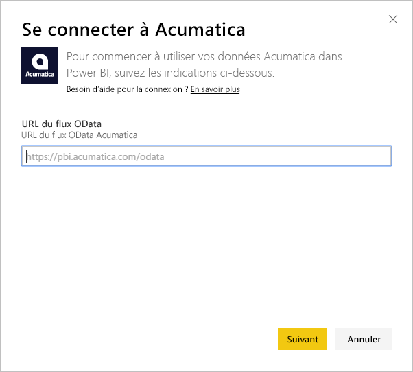
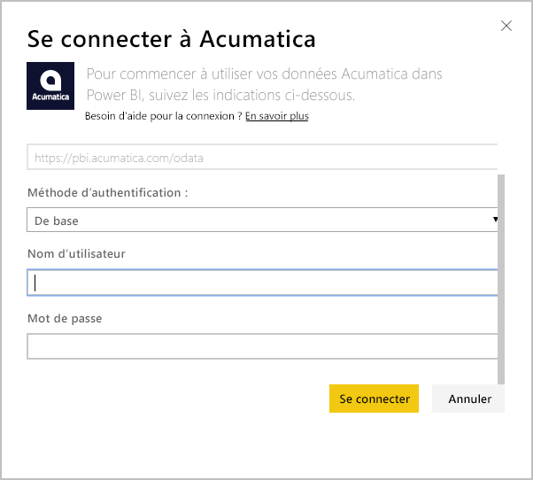
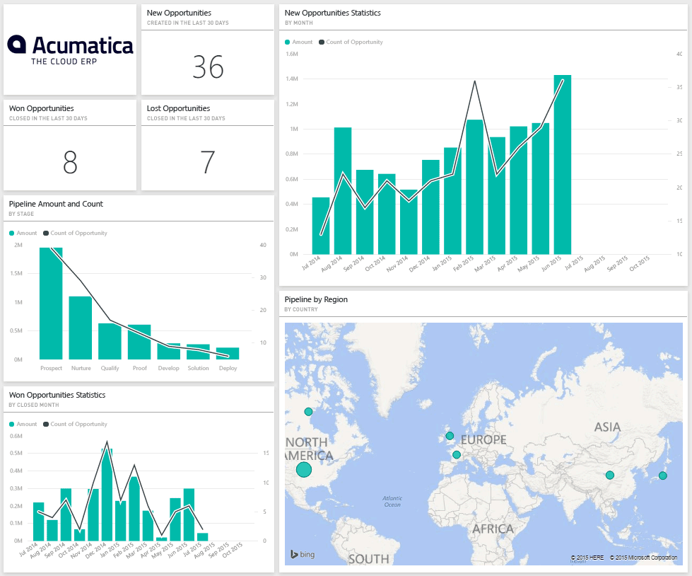
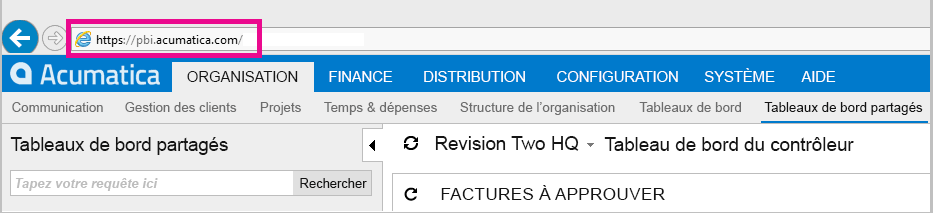
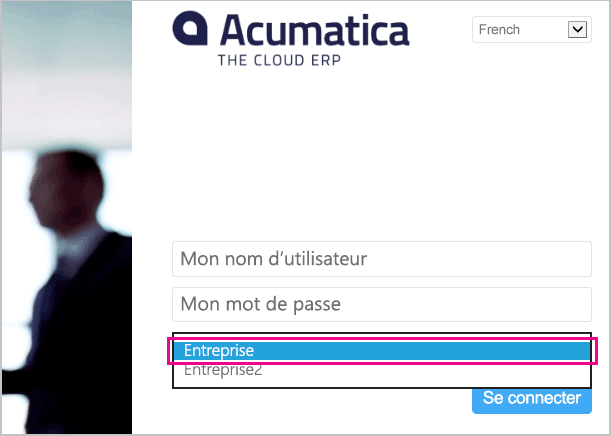

# Se connecter à Acumatica avec Power BI
Le pack de contenu Acumatica pour Power BI vous permet d’obtenir rapidement une vue d’ensemble de vos données d’opportunité. Power BI récupère vos données, y compris celles relatives aux opportunités, aux comptes et aux clients, puis génère un tableau de bord par défaut et des rapports associés à partir de ces données.

Connectez-vous au [pack de contenu Acumatica](https://app.powerbi.com/getdata/services/acumatica) pour Power BI ou obtenez davantage d’informations sur [l’intégration d’Acumatica](https://powerbi.microsoft.com/integrations/acumatica) à Power BI.

>[!NOTE]
>Ce pack de contenu nécessite Acumatica version 5.2 ou ultérieure.

## Comment se connecter
1. Sélectionnez **Obtenir des données** en bas du volet de navigation gauche.
   
   
2. Dans la zone **Services** , sélectionnez **Obtenir**.
   
   
3. Sélectionnez **Acumatica** \> **Obtenir**.
   
   
4. Entrez votre point de terminaison OData Acumatica. Un point de terminaison OData permet à un système externe de demander des données à Acumatica. Un point de terminaison OData Acumatica est formaté comme suit et doit utiliser HTTPS:
   
     https://[domaine_site]/OData/[nom_entreprise]
   
   Le nom de l’entreprise est requis uniquement si vous avez un déploiement de plusieurs entreprises. Des informations supplémentaires sur la recherche de ce paramètre dans votre compte Acumatica figurent ci-dessous.
   
   
5. Pour la méthode d’authentification, sélectionnez **De base**. Entrez vos nom d’utilisateur et mot de passe de votre compte Acumatica, puis cliquez sur **Se connecter**.
   
    
6. Une fois les données importées dans Power BI, vous verrez un nouveau tableau de bord, un nouveau rapport et un nouveau jeu de données dans le volet de navigation gauche. Les nouveaux éléments sont signalés par un astérisque jaune \* qui disparaît quand ils sont sélectionnés. Si vous sélectionnez le tableau de bord, sa disposition est semblable à celle présentée ci -dessous :
   
    

**Et maintenant ?**

* Essayez de [poser une question dans la zone Q&R](power-bi-q-and-a.md) en haut du tableau de bord.
* [Modifiez les vignettes](service-dashboard-edit-tile.md) dans le tableau de bord.
* [Sélectionnez une vignette](service-dashboard-tiles.md) pour ouvrir le rapport sous-jacent.
* Même si une actualisation quotidienne de votre jeu de données est planifiée, vous pouvez modifier la planification de l’actualisation ou essayer d’actualiser le jeu de données sur demande à l’aide de l’option **Actualiser maintenant**.

## Configuration requise
Ce pack de contenu nécessite Acumatica version 5.2 ou ultérieure. Contactez votre administrateur Acumatica pour confirmer la version.

## Recherche de paramètres
**Point de terminaison OData Acumatica**

Le point de terminaison OData Acumatica est formaté comme suit et doit utiliser HTTPS:

    https://[sitedomain]/odata/[companyname]

Vous trouvez le domaine du site d’application dans la barre d’adresses de votre navigateur quand vous êtes connecté à Acumatica. Dans l’exemple ci-dessous, le domaine de site est « https://pbi.acumatica.com » pour que le point de terminaison OData à fournir soit « https://pbi.acumatica.com/odata ».

 

Le nom de l’entreprise est requis uniquement si vous avez un déploiement de plusieurs entreprises. Vous trouverez ces informations dans la page de connexion Acumatica.

## Résolution des problèmes
Si vous n’êtes pas en mesure de vous connecter, vérifiez que le point de terminaison OData Acumatica que vous avez fourni est correctement formaté.

    https://<application site domain>/odata/<company name>

Si vous avez des problèmes de connexion, vérifiez votre version d’Acumatica auprès de votre administrateur. Ce pack de contenu requiert la version 5.2 ou ultérieure.

## Étapes suivantes
[Prise en main de Power BI](service-get-started.md)

[Obtenir des données dans Power BI](service-get-data.md)

