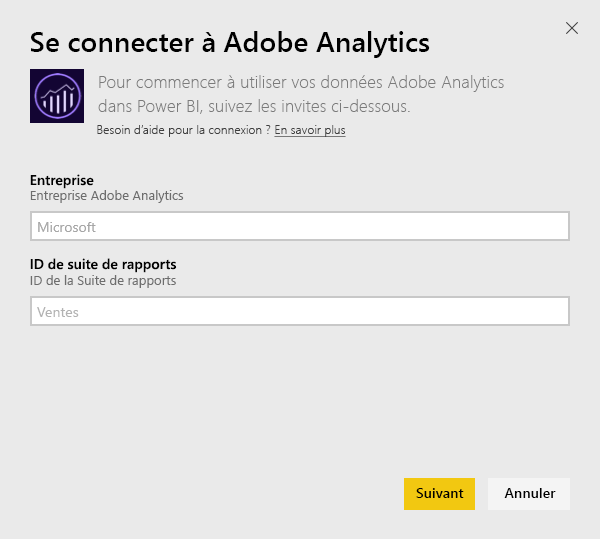
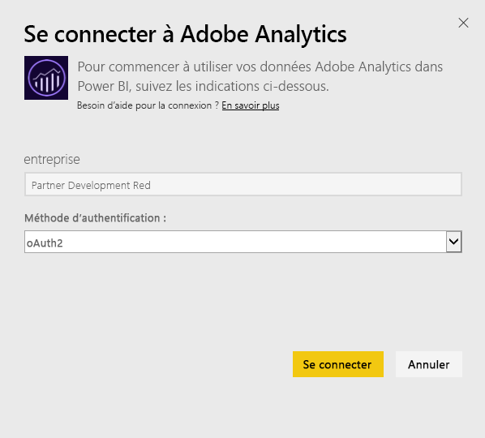
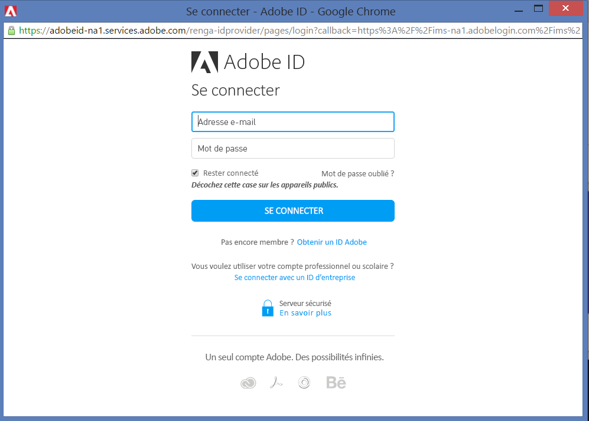
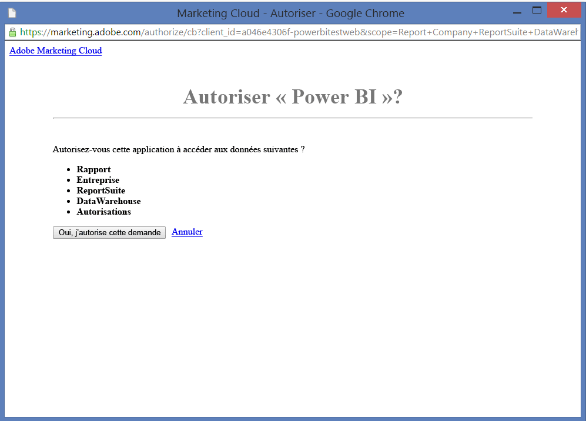
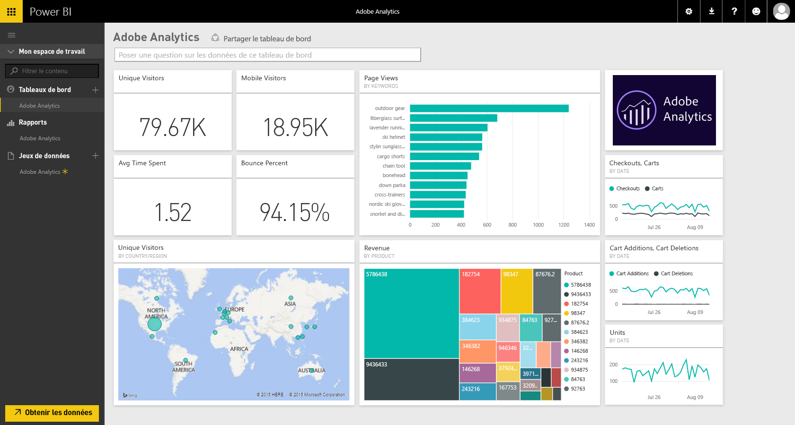
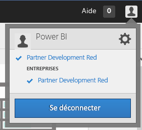
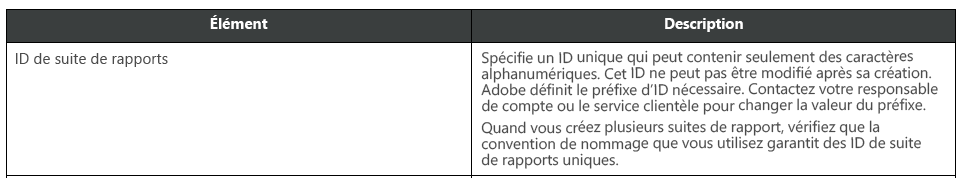

# Se connecter à Adobe Analytics avec Power BI
La connexion à Adobe Analytics via Power BI commence par la connexion à votre compte Adobe Analytics Marketing Cloud. Vous obtenez une application avec un tableau de bord Power BI et un ensemble de rapports Power BI qui fournissent des analyses relatives aux dimensions utilisateur et au trafic sur votre site. Les données sont actualisées automatiquement une fois par jour. Vous pouvez interagir avec le tableau de bord et les rapports, mais vous ne pouvez pas enregistrer les modifications.

Connectez-vous à [Adobe Analytics](https://app.powerbi.com/getdata/services/adobe-analytics) ou apprenez-en davantage sur l’[intégration d’Adobe Analytics](https://powerbi.microsoft.com/integrations/adobe-analytics) avec Power BI.

## Comment se connecter
[!INCLUDE [powerbi-service-apps-get-more-apps](./includes/powerbi-service-apps-get-more-apps.md)]

1. Sélectionnez **Adobe Analytics** \>  **Obtenir**.
   
   
2. Power BI se connecte en utilisant les champs Adobe Analytics Company et Report Suite ID (pas le nom de Report Suite). Voir les détails sur la [recherche de ces paramètres](#FindingParams) ci-dessous.
   
   
3. Pour la **Méthode d’authentification**, sélectionnez **oAuth2** \> **Se connecter**. Quand vous y êtes invité, entrez vos informations d’identification Adobe Analytics. 
   
    
   
    
4. Cliquez sur **Accepter** pour autoriser Power BI à accéder à vos données Adobe Analytics.
   
   
5. Après approbation, le processus d’importation démarre automatiquement. 

## Afficher le tableau de bord et les rapports Adobe Analytics
[!INCLUDE [powerbi-service-apps-open-app](./includes/powerbi-service-apps-open-app.md)]

      

[!INCLUDE [powerbi-service-apps-open-app](./includes/powerbi-service-apps-what-now.md)]

## Ce qui est inclus
Power BI utilise l’API de rapport Adobe Analytics pour définir et créer des rapports pour les tables suivantes :

| **Nom du tableau** | **Détails des colonnes** |
| --- | --- |
| Produits |elements=  "product" (top 25)   metrics="cartadditions", "cartremovals", "carts", "cartviews", "checkouts", "revenue", "units" |
| Browsers |elements= "browser" (top 25)   metrics="bounces", "bouncerate", "visitors", "visits", "uniquevisitors", "totaltimespent", "pageviews" |
| Pages |elements= "page" (top 25)   metrics="cartadditions", "cartremovals", "carts", "cartviews", "checkouts", "revenue", "units", "visits", "uniquevisitors", "pageviews", "bounces", "bouncerate", "totaltimespent" |
| JavaScript activé |elements=  "javascriptenabled”, “browser” (top 25) |
| Mobile OS |elements= "mobileos"(top 25)  metrics="bounces", "bouncerate", "visitors", "visits", "uniquevisitors", "totaltimespent", "cartadditions", "cartremovals", "checkouts", "revenue", "units", "pageviews" |
| Search Engines Keywords |elements= "searchengine" "searchenginekeyword"   metrics="bounces", "bouncerate", "visitors", "visits", "entries", "uniquevisitors", "totaltimespent", "cartadditions", "cartremovals", "carts", "cartviews", "checkouts", "revenue", "units", "pageviews" |
| Search Engine to Products |elements= "searchengine", "product"   metrics="bounces", "bouncerate", "visitors", "visits", "entries", "uniquevisitors", "totaltimespent", "cartadditions", "cartremovals", "carts", "cartviews", "checkouts", "revenue", "units", "pageviews" |
| Referring Pages |elements= "referrer" (top 15), “page" (top 10)   metrics="bounces", "bouncerate", "visitors", "visits", "entries", "uniquevisitors", "totaltimespent", "cartadditions", "cartremovals", "carts", "cartviews", "checkouts", "revenue", "units", "pageviews" |
| Geocountry Pages |elements= "geocountry" (Top 20), "page"   metrics="bounces", "bouncerate", "visitors", "visits", "entries", "uniquevisitors", "totaltimespent", "cartadditions", "cartremovals", "carts", "cartviews", "checkouts", "revenue", "units", "pageviews" |
| Geocountry Product |elements= "geocountry" (Top 20), "product"  metrics="bounces", "bouncerate", "visitors", "visits", "entries", "uniquevisitors", "totaltimespent", "cartadditions", "cartremovals", "carts", "cartviews", "checkouts", "revenue", "units" |
| Country and Region Lookup |elements= "geocountry" (Top 200)   metrics="bounces", "bouncerate", "visitors", "visits", "entries", "uniquevisitors", "totaltimespent", "cartadditions", "cartremovals", "carts", "cartviews", "checkouts", "revenue", "units" |
| Language |elements= "language", "browser" (Top 25)   metrics="bounces", "bouncerate", "visitors", "visits", "uniquevisitors", "totaltimespent", "pageviews", "cartadditions", "cartremovals", "checkouts", "carts", "cartviews" |
| Search Engines Look Up |elements= "searchengine" (top 100)   metrics="bounces", "bouncerate", "visitors", "visits", "entries", "uniquevisitors", "totaltimespent", "cartadditions", "cartremovals", "carts", "cartviews", "checkouts", "revenue", "units" |
| Browser Lookup |elements= "browser" (top 25) |

## Configuration requise
L’accès à [Adobe Analytics](http://www.adobe.com/marketing-cloud/web-analytics.html) est obligatoire, dont l’accès aux paramètres corrects, comme décrit ci-dessous.

## Recherche de paramètres
**Company**

La valeur du champ Company se trouve en haut à droite de votre compte une fois que vous êtes connecté. La valeur respecte la casse et l’espacement. Entrez-la exactement comme vous le voyez dans votre compte.

**Report Suite ID**

L’ID de suite est créé lors de la création de Report Suite. Vous pouvez contacter votre administrateur pour identifier la valeur de l’ID. Notez qu’il ne s’agit pas du nom de Report Suite.

Partie de la [documentation](https://marketing.adobe.com/resources/help/en_US/reference/new_report_suite.html) Adobe :

## Résolution des problèmes
Si vous voyez une erreur après avoir entré vos informations d'identification indiquant que vous ne disposez pas d’autorisations, demandez à votre administrateur si vous avez accès à l’API Adobe Analytics. Vérifiez également que l’ID Adobe fourni est liée à votre organisation Cloud Marketing (associée à une société Adobe Analytics).

Si vous rencontrez une erreur après avoir entré correctement les informations d’identification, il se peut que la création des rapports prenne trop de temps. Une erreur courante se présente sous la forme *« Impossible d’obtenir les données du rapport Adobe Analytics. Le contenu incluait &quot;référent, page&quot;, la durée approximative était de xx secondes »*. Consultez la section «Ce qui est inclus » et comparez ces éléments à la taille de votre instance Adobe. Malheureusement, il n’existe actuellement aucun moyen de contourner ce problème de délai d’expiration. Toutefois, nous envisageons d’apporter des mises à jour afin de mieux prendre en charge les plus grandes instances. Envoyez vos commentaires à l’équipe Power BI sur https://ideas.powerbi.com

## Étapes suivantes
* [Que sont les applications dans Power BI ?](consumer/end-user-apps.md)
* [Obtenir des données dans Power BI](service-get-data.md)
* D’autres questions ? [Essayez d’interroger la communauté Power BI](http://community.powerbi.com/)

