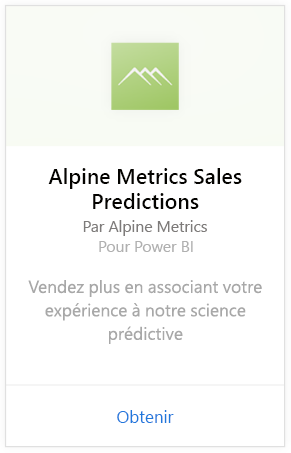
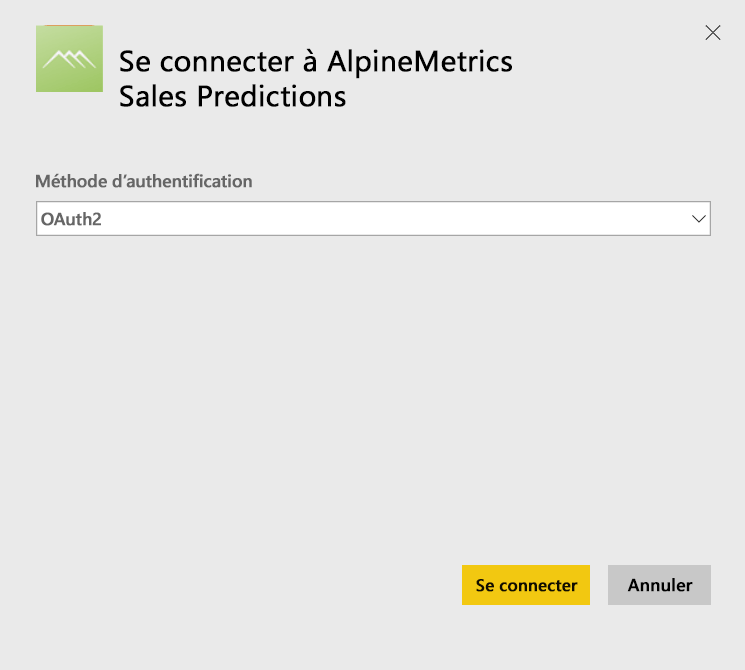
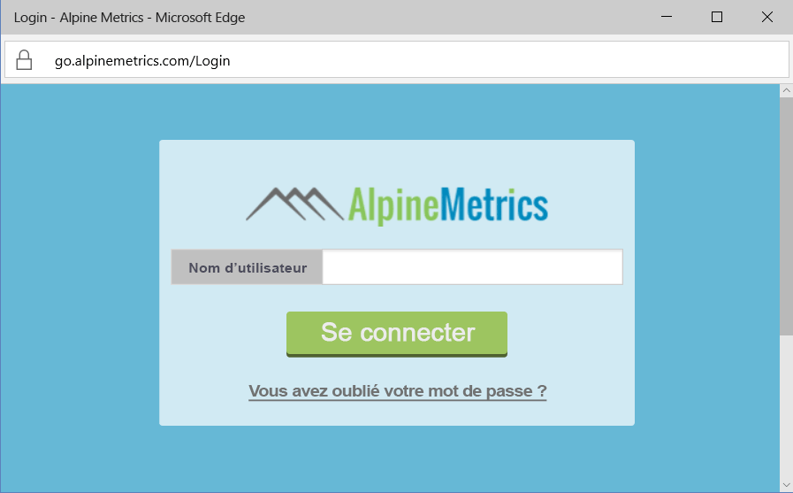
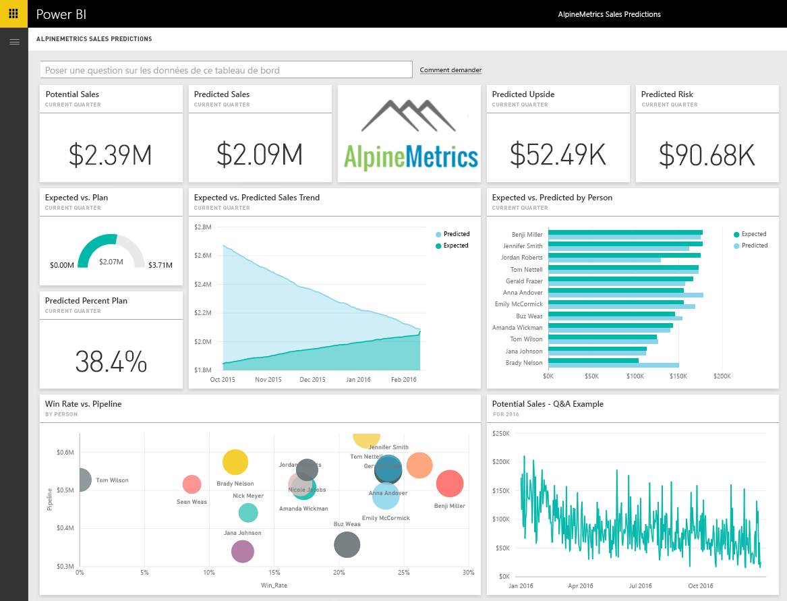

# Se connecter à Alpine Metrics Sales Predictions avec Power BI
Alpine Metrics offre une optimisation des processus de ventes prévisionnelles dans le cloud et à la demande pour les ventes des petites et grandes organisations. Le pack de contenu Alpine Metrics Sales Predictions pour Power BI contient des métriques, telles que les ventes et les risques potentiels et prévisionnels, qui vous permettent de mieux prévoir l’avenir de votre entreprise. 

Connectez-vous au pack de contenu [Alpine Metrics Sales Predictions](https://app.powerbi.com/getdata/services/alpine-metrics) pour Power BI.

## Comment se connecter
1. Sélectionnez Obtenir des données en bas du volet de navigation gauche.  
   
    
2. Dans la zone **Services** , sélectionnez **Obtenir**.  
   
    
3. Sélectionnez **AlpineMetrics Sales Predictions**, puis sélectionnez **Obtenir**.  
   
    
4. Sélectionnez **OAuth 2**, puis **Se connecter**. Quand vous y êtes invité, entrez vos informations d’identification Alpine Metrics.
   
    
   
    
5. Après connexion, un tableau de bord, un rapport et un ensemble de données sont chargés automatiquement. Les vignettes sont ensuite mises à jour avec les données de votre compte.
   
    

**Et maintenant ?**

* Essayez de [poser une question dans la zone Q&R](power-bi-q-and-a.md) en haut du tableau de bord.
* [Modifiez les vignettes](service-dashboard-edit-tile.md) dans le tableau de bord.
* [Sélectionnez une vignette](service-dashboard-tiles.md) pour ouvrir le rapport sous-jacent.
* Même si une actualisation quotidienne de votre jeu de données est planifiée, vous pouvez modifier la planification de l’actualisation ou essayer d’actualiser le jeu de données sur demande à l’aide de l’option **Actualiser maintenant**.

## Ce qui est inclus
Le pack de contenu inclut les tables suivantes :  

    - Account    
    - Business    
    - Country    
    - Industry    
    - Opportunity  
    - Person  
    - Prediction    
    - Prediction History    
    - Product  
    - Region    

## Configuration requise
Un compte Alpine Metrics avec des autorisations sur les tables ci-dessus est nécessaire afin d’instancier ce pack de contenu.

## Étapes suivantes
[Prise en main de Power BI](service-get-started.md)

[Power BI – Concepts de base](service-basic-concepts.md)

