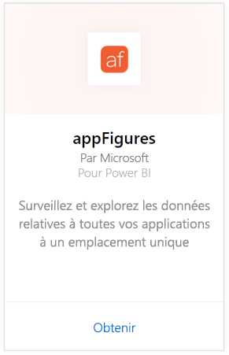
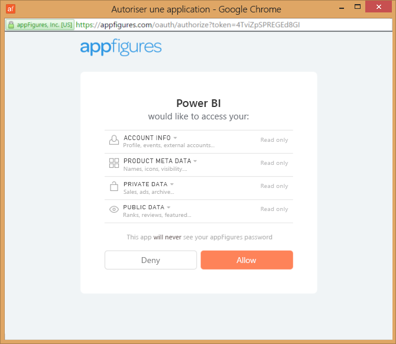
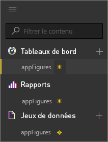
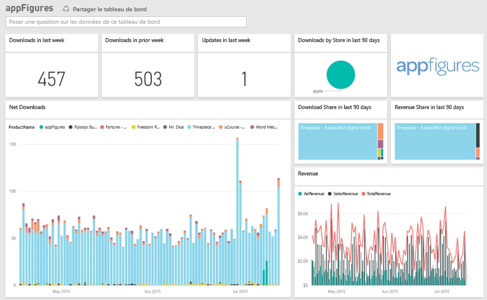
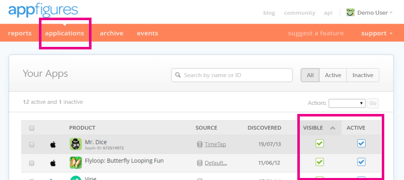

# Se connecter à appFigures avec Power BI
Grâce à Power BI et au pack de contenu appFigures, il est facile de suivre les statistiques importantes concernant vos applications. Power BI récupère vos données, y compris celles relatives aux ventes d’applications, aux téléchargements et aux statistiques publicitaires, puis génère un tableau de bord par défaut et des rapports associés à partir de ces données.

Connectez-vous au [pack de contenu appFigures](https://app.powerbi.com/getdata/services/appfigures) ou obtenez davantage d’informations sur [l’intégration d’appFigures](https://powerbi.microsoft.com/integrations/appfigures) à Power BI.

## Comment se connecter
1. Sélectionnez **Obtenir des données** en bas du volet de navigation gauche.
   
   
2. Dans la zone **Services** , sélectionnez **Obtenir**.
   
   
3. Sélectionnez **appFigures** \>  **Obtenir**.
   
   
4. Pour la **Méthode d’authentification**, sélectionnez **oAuth2** \> **Se connecter**. Quand vous y êtes invité, entrez vos informations d’identification appFigures et suivez le processus d’authentification appFigures.
   
   Lors de votre première connexion, Power BI vous invite à autoriser l’accès en lecture seule à votre compte. Sélectionnez **Autoriser** pour commencer le processus d’importation. Celui-ci peut prendre quelques minutes selon le volume de données présentes dans votre compte.
   
   
5. Une fois les données importées dans Power BI, vous verrez un nouveau tableau de bord, un nouveau rapport et un nouveau jeu de données dans le volet de navigation gauche. Les nouveaux éléments sont signalés par un astérisque jaune \*:
   
    
6. Sélectionnez le tableau de bord appFigures. Il s’agit du tableau de bord par défaut créé par Power BI pour afficher vos données. Vous pouvez modifier ce tableau de bord pour afficher vos données comme vous le souhaitez.
   
    

**Et maintenant ?**

* Essayez de [poser une question dans la zone Q&R](consumer/end-user-q-and-a.md) en haut du tableau de bord.
* [Modifiez les vignettes](service-dashboard-edit-tile.md) dans le tableau de bord.
* [Sélectionnez une vignette](consumer/end-user-tiles.md) pour ouvrir le rapport sous-jacent.
* Même si une actualisation quotidienne de votre jeu de données est planifiée, vous pouvez modifier la planification de l’actualisation ou essayer d’actualiser le jeu de données sur demande à l’aide de l’option **Actualiser maintenant**.

## Ce qui est inclus
Les données suivantes sont disponibles à partir d’appFigures dans Power BI.

| **Nom du tableau** | **Description** |
| --- | --- |
| Pays |Ce tableau fournit le nom des pays. |
| Dates |Ce tableau contient les dates de publication des applications actives et visibles de votre compte appFigures, des publications du jour aux publications les plus anciennes. |
| Événements |Ce tableau contient des informations relatives aux téléchargements, aux ventes et à la publicité pour chaque application et chaque pays. Ces informations sont mises à jour quotidiennement. Notez que les informations relatives aux achats d’applications et aux achats effectués dans les applications se trouvent toutes dans ce tableau. Pour les distinguer, vous pouvez utiliser la colonne <strong>Type</strong>. |
| Achats dans l’application |Ce tableau contient des données concernant les différents types d’achats dans l’application qui sont associés aux applications actives et visibles de votre compte appFigures. |
| Produits |Ce tableau contient des données sur les différentes applications actives et visibles de votre compte appFigures. |

## Résolution des problèmes
Si les données provenant de certaines de vos applications ne s’affichent pas dans Power BI, vérifiez que ces applications sont visibles et actives sous l’onglet **Applications** du site appFigures.

## Étapes suivantes
* [Prise en main de Power BI](service-get-started.md)
* [Obtenir des données dans Power BI](service-get-data.md)

