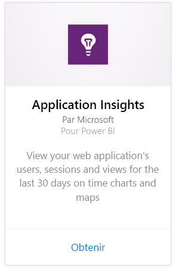
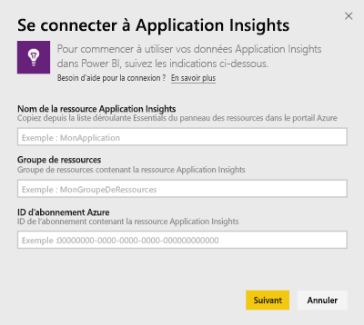
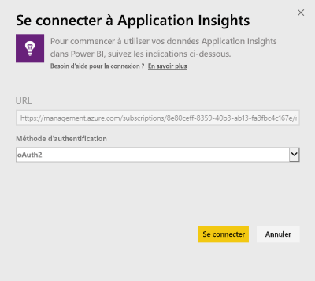
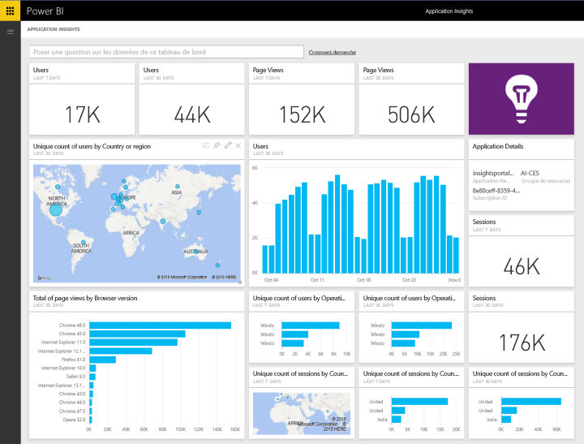
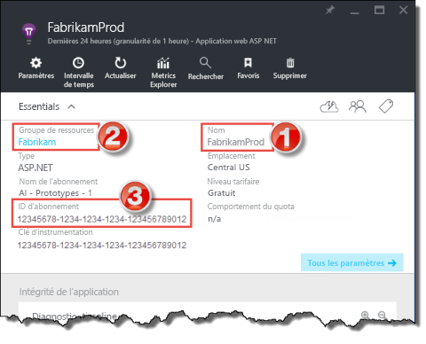
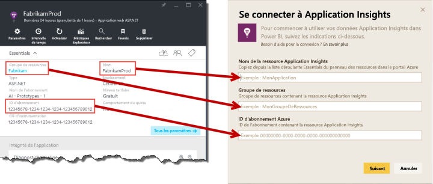

# Se connecter à Application Insights avec Power BI
Power BI permet de créer de puissants tableaux de bord personnalisés à partir de la télémétrie [Application Insight](https://azure.microsoft.com/documentation/articles/app-insights-overview/). Envisagez la télémétrie de votre application autrement. Combinez des mesures de plusieurs applications ou services de composants sur un tableau de bord unique. La première version du pack de contenu Power BI pour Application Insights inclut des widgets pour des mesures courantes relatives à l’utilisation, telles que les utilisateurs actifs, l’affichage de page, les sessions, la version du navigateur et du système d’exploitation, et la répartition géographique des utilisateurs sur une carte.

Connectez-vous au [pack de contenu Application Insights pour Power BI](https://app.powerbi.com/getdata/services/application-insights).

>[!NOTE]
>L’accès au panneau Vue d’ensemble d’Application Insights pour votre application dans le portail Azure en version préliminaire est nécessaire pour se connecter. Vous trouverez plus d’informations sur la configuration requise ci-dessous.

## Comment se connecter
1. Sélectionnez **Obtenir des données** en bas du volet de navigation gauche.
   
    
2. Dans la zone **Services** , sélectionnez **Obtenir**.
   
    
3. Sélectionnez **Application Insights** > **Obtenir**.
   
    
4. Fournissez les détails de l’application à laquelle vous souhaitez vous connecter, à savoir le **nom de la ressource Application Insights**, le **groupe de ressources**et l’ **ID d’abonnement**. Pour plus de détails, consultez [Recherche de vos paramètres Application Insights](#FindingAppInsightsParams) ci-dessous.
   
        
5. Sélectionnez **Se connecter** , puis suivez les instructions affichées pour vous connecter.
   
    
6. Le processus d’importation commence automatiquement. Lorsque vous avez terminé, une notification s’affiche et de nouveaux tableau de bord, rapport et jeu de données apparaissent dans le volet de navigation, marqués d’un astérisque.  Sélectionnez le tableau de bord pour afficher vos données importées.
   
    

**Et maintenant ?**

* Essayez de [poser une question dans la zone Q&R](power-bi-q-and-a.md) en haut du tableau de bord.
* [Modifiez les vignettes](service-dashboard-edit-tile.md) dans le tableau de bord.
* [Sélectionnez une vignette](service-dashboard-tiles.md) pour ouvrir le rapport sous-jacent.
* Même si une actualisation quotidienne de votre jeu de données est planifiée, vous pouvez modifier la planification de l’actualisation ou essayer d’actualiser le jeu de données sur demande à l’aide de l’option **Actualiser maintenant**.

## Ce qui est inclus
Le pack de contenu Application Insights contient les tables et les métriques suivantes :  

    ´´´
    - ApplicationDetails  
    - UniqueUsersLast7Days   
    - UniqueUsersLast30Days   
    - UniqueUsersDailyLast30Days  
    - UniqueUsersByCountryLast7Days  
    - UniqueUsersByCountryLast30Days   
    - PageViewsDailyLast30Days   
    - SessionsLast7Days   
    - SessionsLast30Days  
    - PageViewsByBrowserVersionDailyLast30Days   
    - UniqueUsersByOperatingSystemLast7Days   
    - UniqueUsersByOperatingSystemLast30Days    
    - SessionsDailyLast30Days   
    - SessionsByCountryLast7Days   
    - SessionsByCountryLast30Days   
    - PageViewsByCountryDailyLast30Days  
    ´´´ 

## Recherche de paramètres
Vos informations Nom de ressource, Groupe de ressources et ID d’abonnement sont toutes disponibles dans le portail Azure. La sélection du nom entraîne l’ouverture d’une vue détaillée, et vous pouvez utiliser la liste déroulante Bases pour rechercher toutes les valeurs dont vous avez besoin.

Copiez et collez celles-ci dans les champs correspondants de Power BI :

## Étapes suivantes
[Prise en main de Power BI](service-get-started.md)

[Obtenir des données dans Power BI](service-get-data.md)

