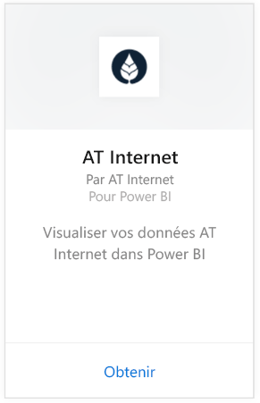
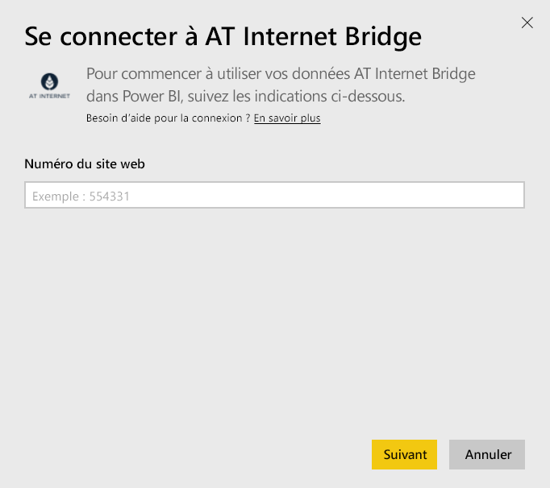
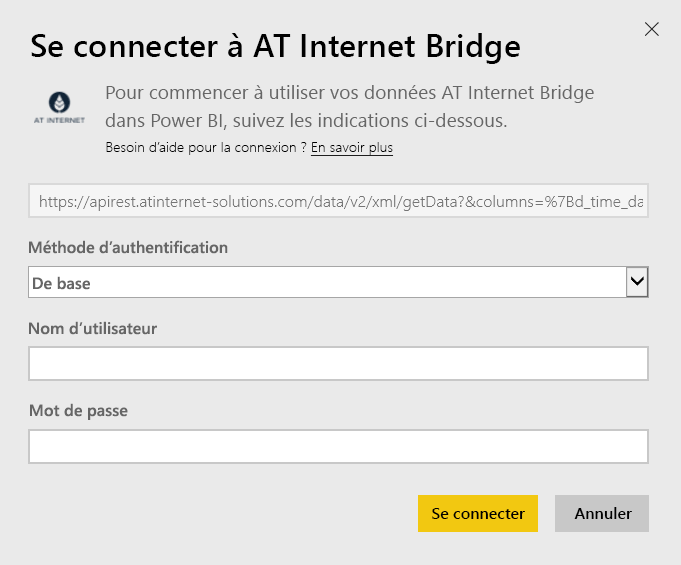

# Se connecter à AT Internet Bridge avec Power BI
AT Internet Bridge vous permet d’extraire la valeur immédiate de vos données à l’aide de sa plateforme d’analyse numérique unifiée, Analytics Suite. Le pack de contenu AT Internet Bridge pour Power BI inclut des données sur les visites, les sources, l’emplacement et les appareils pour votre site.

Connectez-vous au [pack de contenu AT Internet Bridge](https://app.powerbi.com/getdata/services/at-internet-bridge) pour Power BI.

## Comment se connecter
1. Sélectionnez **Obtenir des données** en bas du volet de navigation gauche.
   
    
2. Dans la zone **Services** , sélectionnez **Obtenir**.
   
    
3. Sélectionnez **AT Internet Bridge** \> **Obtenir**.
   
   
4. Spécifiez le numéro du site web AT Internet auquel vous voulez vous connecter.
   
   
5. Sélectionnez **De base** comme mécanisme d’authentification, spécifiez votre nom d’utilisateur et votre mot de passe AT Internet, puis cliquez sur **Se connecter**.
   
   
6. Cliquez sur **Se connecter** pour commencer le processus d’importation. Une fois terminé, de nouveaux tableau de bord, rapport et modèle apparaîtront dans le volet de navigation. Sélectionnez le tableau de bord pour afficher vos données importées.
   
    

**Et maintenant ?**

* Essayez de [poser une question dans la zone Q&R](power-bi-q-and-a.md) en haut du tableau de bord.
* [Modifiez les vignettes](service-dashboard-edit-tile.md) dans le tableau de bord.
* [Sélectionnez une vignette](service-dashboard-tiles.md) pour ouvrir le rapport sous-jacent.
* Même si une actualisation quotidienne de votre jeu de données est planifiée, vous pouvez modifier la planification de l’actualisation ou essayer d’actualiser le jeu de données sur demande à l’aide de l’option **Actualiser maintenant**.

## Ce qui est inclus
Ce pack de contenu contient des données concernant les 45 derniers jours dans les tableaux suivants :  

    - Conversion  
    - Appareils  
    - Localisation  
    - Sources  
    - Visites globales  

## Étapes suivantes
[Prise en main de Power BI](service-get-started.md)

[Power BI – Concepts de base](service-basic-concepts.md)

