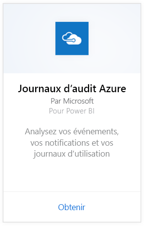
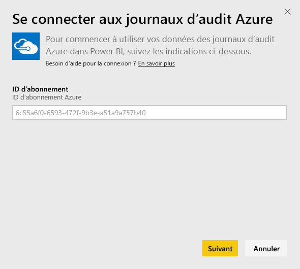
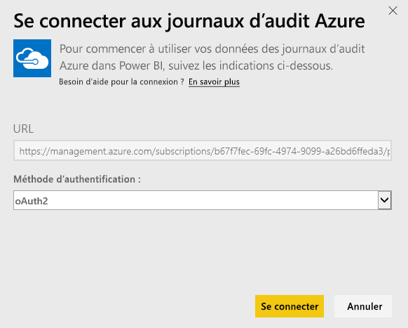
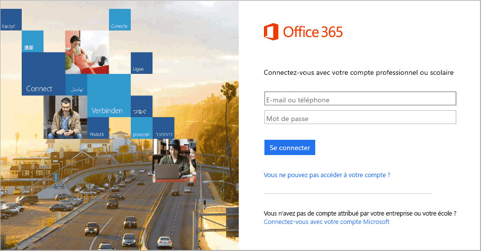

# Se connecter aux journaux d’audit Azure avec Power BI
Avec le pack de contenu Journaux d’audit Azure, vous pouvez analyser et visualiser les informations stockées dans les journaux d’audit. Power BI récupère vos données, génère un tableau de bord par défaut et crée des rapports basés sur ces données.

[Connectez-vous au pack de contenu des journaux d’audit Azure](https://app.powerbi.com/getdata/services/azure-audit-logs) ou obtenez davantage d’informations sur l’[intégration des journaux d’audit Azure](https://powerbi.microsoft.com/integrations/azure-audit-logs) avec Power BI.

## Comment se connecter
1. Sélectionnez **Obtenir des données** en bas du volet de navigation gauche.  
   
    
2. Dans la zone **Services** , sélectionnez **Obtenir**.  
   
     
3. Sélectionnez **Journaux d’audit Azure** > **Obtenir**.  
   
   
4. À l’invite, entrez votre **ID d’abonnement Azure**. Pour plus de détails sur la recherche de votre [ID d’abonnement](#FindingParams), voir plus bas.   
   
    
5. Pour la **Méthode d’authentification**, sélectionnez **oAuth2** \> **Se connecter**.
   
    
6. Entrez vos informations d’identification de compte pour terminer le processus de connexion.
   
    
7. Power BI récupère vos données Journaux d’audit Azure et crée un tableau de bord et un rapport prêts à l’emploi. 
   
    

**Et maintenant ?**

* Essayez de [poser une question dans la zone Q&R](power-bi-q-and-a.md) en haut du tableau de bord.
* [Modifiez les vignettes](service-dashboard-edit-tile.md) dans le tableau de bord.
* [Sélectionnez une vignette](service-dashboard-tiles.md) pour ouvrir le rapport sous-jacent.
* Même si une actualisation quotidienne de votre jeu de données est planifiée, vous pouvez modifier la planification de l’actualisation ou essayer d’actualiser le jeu de données sur demande à l’aide de l’option **Actualiser maintenant**.

## Configuration requise
Le pack de contenu des journaux d’audit d’Azure nécessite l’accès aux journaux d’Audit dans le portail Azure. Vous trouverez plus de détails [ici](https://azure.microsoft.com/documentation/articles/insights-debugging-with-events/).

## Recherche de paramètres
Il existe deux moyens faciles de trouver votre ID d’abonnement.

1. Sur https://portal.azure.com -&gt; Parcourir -&gt; Abonnements -&gt; ID d’abonnement
2. Sur https://manage.windowsazure.com -&gt; Paramètres -&gt; ID d’abonnement

Votre ID d’abonnement est une longue série de chiffres et de caractères, semblable à l’exemple à l’étape\#4 ci-dessus. 

## Résolution des problèmes
Si vous voyez une erreur d’informations d’identification ou une erreur liée à une tentative d’actualiser en raison d’informations d’identification non valides, essayez de supprimer toutes les instances du pack de contenu des journaux d’audit Azure et de vous reconnecter.

## Étapes suivantes
[Prise en main de Power BI](service-get-started.md)  
[Power BI – Concepts de base](service-basic-concepts.md)  

