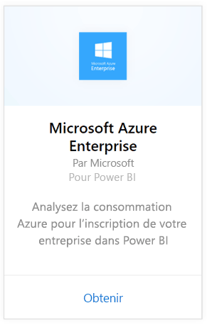
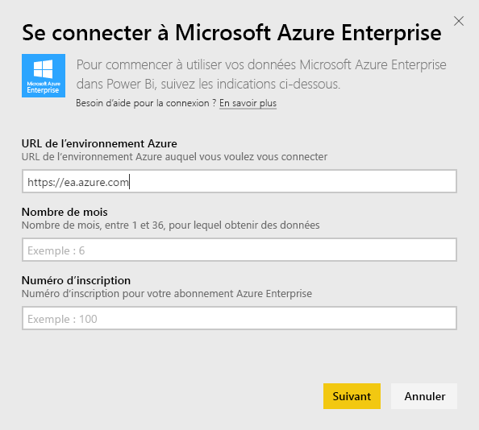
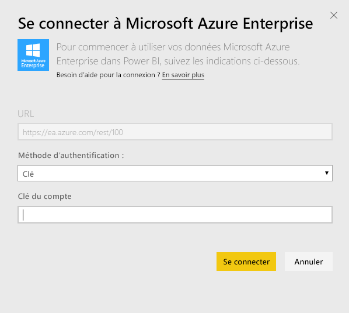
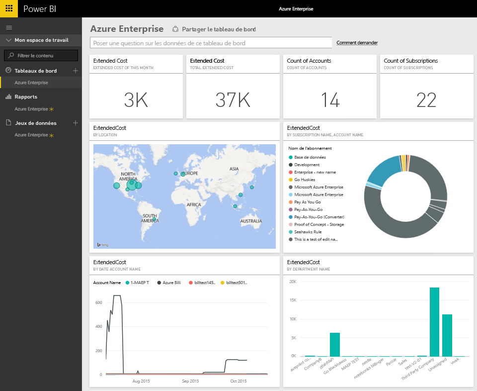
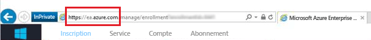
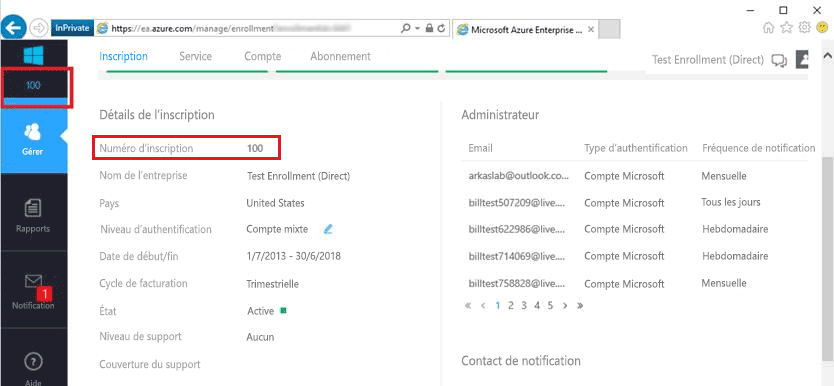
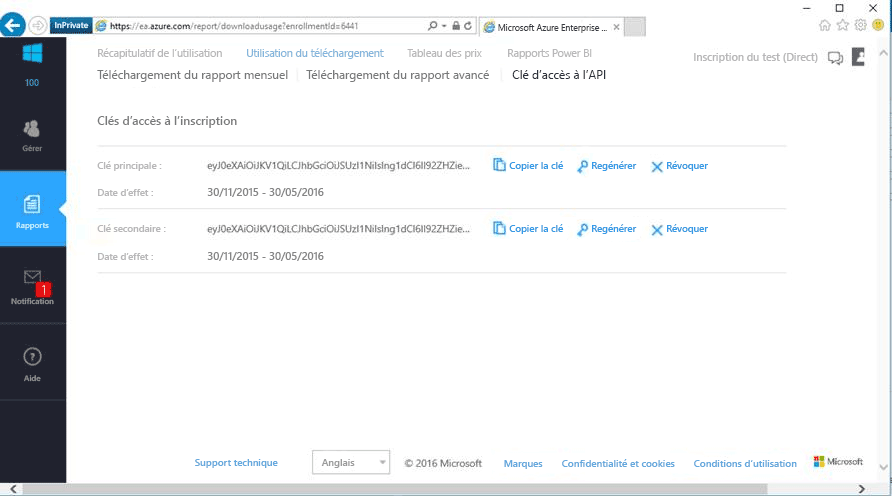

# Se connecter à Microsoft Azure Enterprise avec Power BI
Explorez et analysez vos données Microsoft Azure Enterprise dans Power BI avec le pack de contenu Power BI. Les données sont actualisées automatiquement une fois par jour.

Connectez-vous au [pack de contenu Microsoft Azure Enterprise](https://app.powerbi.com/getdata/services/azure-enterprise) pour Power BI.

## Comment se connecter
1. Sélectionnez **Obtenir des données** en bas du volet de navigation gauche.
   
    
2. Dans la zone **Services** , sélectionnez **Obtenir**.
   
   
3. Sélectionnez **Microsoft Azure Enterprise** \> **Obtenir**.
   
   
4. Fournissez l’URL de l’environnement Azure, le nombre de mois de données à importer et votre numéro d’inscription Azure Enterprise. L’URL de votre environnement Azure est `https://ea.azure.com` ou `https://ea.windowsazure.cn`. Consultez les détails sur la [recherche de ces paramètres](#FindingParams) ci-dessous.
   
    
5. Fournissez votre clé d’accès pour la connexion. La clé de votre inscription figure dans votre portail Azure EA.
   
    
6. Le processus d’importation démarre automatiquement. Une fois terminé, de nouveaux tableau de bord, rapport et modèle apparaîtront dans le volet de navigation. Sélectionnez le tableau de bord pour afficher vos données importées.
   
   

**Et maintenant ?**

* Essayez de [poser une question dans la zone Q&R](power-bi-q-and-a.md) en haut du tableau de bord.
* [Modifiez les vignettes](service-dashboard-edit-tile.md) dans le tableau de bord.
* [Sélectionnez une vignette](service-dashboard-tiles.md) pour ouvrir le rapport sous-jacent.
* Même si une actualisation quotidienne de votre jeu de données est planifiée, vous pouvez modifier la planification de l’actualisation ou essayer d’actualiser le jeu de données sur demande à l’aide de l’option **Actualiser maintenant**.

## Ce qui est inclus
Le pack de contenu Azure Enterprise contient des données de rapports mensuelles correspondant à la plage de mois indiquée pendant le flux de connexion. La plage est dynamique, ce qui signifie que les dates incluses sont mises à jour quand le jeu de données est actualisé.

## Configuration requise
Le pack de contenu exige l’accès aux fonctionnalités d’entreprise dans le portail Azure.

## Recherche de paramètres
Les rapports Power BI sont disponibles pour les clients directs, les partenaires et les clients indirects d’EA qui sont en mesure d’afficher des informations de facturation. Pour plus d’informations sur la recherche de chacune des valeurs qu’attend le flux de connexion, lisez ci-dessous.

**URL de l’environnement Azure**

* Cette valeur est généralement https://ea.azure.com, mais vous pouvez vérifier l’URL lorsque vous vous connectez pour confirmer.
  
    

**Nombre de mois**

* Il doit s’agir d’un nombre compris entre 1 et 36, correspondant au nombre de mois de données (à partir d’aujourd’hui) que vous souhaitez importer.

**Numéro d’inscription**

* Il s’agit du numéro d’inscription à Azure Enterprise qui se trouve sur l’écran d’accueil d’[Azure Enterprise Portal](https://ea.azure.com/) sous les détails de l’inscription.
  
    

**Clé d’accès**

* Votre clé est disponible sur le portail Azure Enterprise, sous « Télécharger l’utilisation » > « Clé d’accès API »
  
    

**Aide supplémentaire**

* Pour obtenir de l’aide supplémentaire sur la configuration du pack de contenu Azure Enterprise pour Power BI, connectez-vous à Azure Enterprise Portal pour afficher le fichier d’aide de l’API sous Aide. Vous trouverez des instructions supplémentaires sous Rapports -> Télécharger l’utilisation -> Clé d’accès API.

## Étapes suivantes
[Prise en main de Power BI](service-get-started.md)

[Obtenir des données dans Power BI](service-get-data.md)

