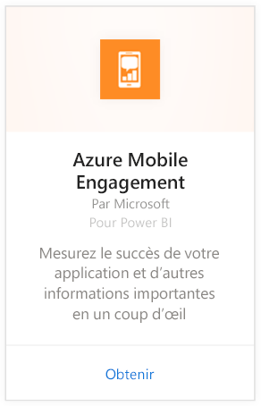
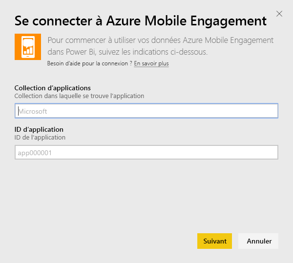
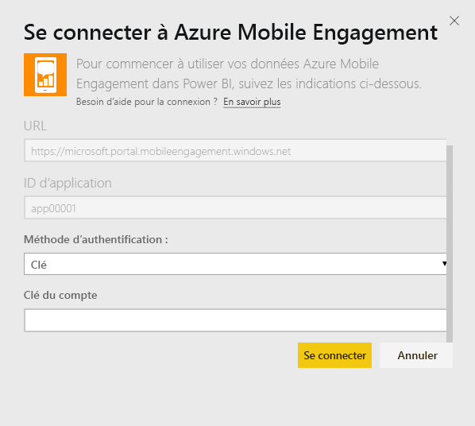
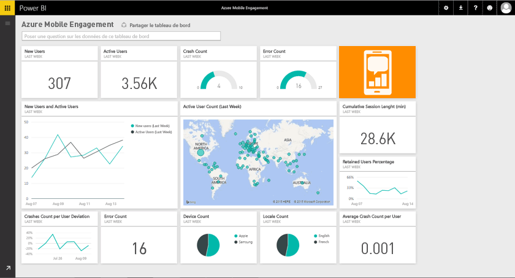

# Se connecter à Azure Mobile Engagement avec Power BI
Le pack de contenu Azure Mobile Engagement pour Power BI vous permet d’obtenir rapidement une vue d’ensemble de vos données d’application.

[!INCLUDE [include-short-name](./includes/service-deprecate-content-packs.md)]

Connectez-vous au [pack de contenu Azure Mobile Engagement](https://app.powerbi.com/groups/me/getdata/services/azme) pour Power BI.

## Comment se connecter
1. Sélectionnez **Obtenir des données** en bas du volet de navigation gauche.
   
    
2. Dans la zone **Services** , sélectionnez **Obtenir**.
   
    
3. Sélectionnez **Azure Mobile Engagement** \> **Obtenir**.
   
     
4. Spécifiez App Collection et le nom de l’application. Vous trouverez ces informations dans votre compte Azure Mobile Engagement.
   
     
5. Pour la méthode d’authentification, indiquez votre clé, puis cliquez sur Se connecter.
   
    
6. Une fois les données importées dans Power BI, vous verrez un nouveau tableau de bord, un nouveau rapport et un nouveau jeu de données dans le volet de navigation gauche. Les nouveaux éléments sont signalés par un astérisque jaune \*, qui disparaît lors de la sélection :
   
    

## Et maintenant ?

* Essayez de [poser une question dans la zone Q&R](consumer/end-user-q-and-a.md) en haut du tableau de bord.
* [Modifiez les vignettes](service-dashboard-edit-tile.md) dans le tableau de bord.
* [Sélectionnez une vignette](consumer/end-user-tiles.md) pour ouvrir le rapport sous-jacent.
* Même si une actualisation quotidienne de votre jeu de données est planifiée, vous pouvez modifier la planification de l’actualisation ou essayer d’actualiser le jeu de données sur demande à l’aide de l’option **Actualiser maintenant**.

## Étapes suivantes
[Prise en main de Power BI](service-get-started.md)

[Obtenir des données dans Power BI](service-get-data.md)

