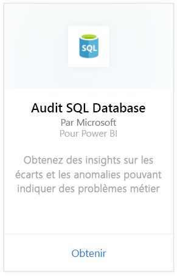
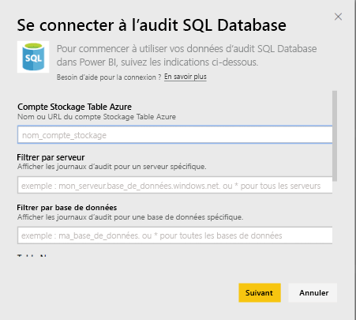
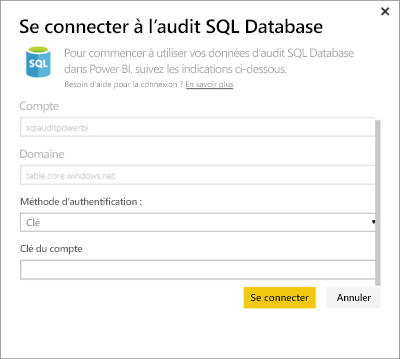

# Pack de contenu SQL Database Auditing pour Power BI
Le pack de contenu Azure [SQL Database Auditing](http://azure.microsoft.com/documentation/articles/sql-database-auditing-get-started/) pour Power BI vous permet de comprendre l’activité de votre base de données, ainsi que les écarts et les anomalies pouvant indiquer des problèmes au niveau de l’activité de votre entreprise ou des violations potentielles de sécurité. 

Connectez-vous au [pack de contenu SQL Database Auditing](https://app.powerbi.com/getdata/services/sql-db-auditing) pour Power BI.

>[!NOTE]
>Le pack de contenu importe les données de toutes les tables dont le nom comprend « AuditLogs », et les ajoute à une même table de modèle de données nommée « AuditLogs ». Les derniers 250 000 événements seront inclus et les données seront actualisées quotidiennement.

## Comment se connecter
1. Sélectionnez **Obtenir des données** en bas du volet de navigation gauche.
   
    
2. Dans la zone Services, sélectionnez Obtenir.
   
    
3. Sélectionnez **SQL Database Auditing** \> **Obtenir**.
   
   
4. Dans la fenêtre de connexion à SQL Database Auditing :
   
   - Entrez le nom ou l’URL du compte de stockage de tables Azure dans lequel sont stockés vos journaux.
   
   - Entrez le nom du serveur SQL qui vous intéresse. Entrez « \* » pour charger les journaux d’audit pour tous les serveurs.
   
   - Entrez le nom de la base de données SQL qui vous intéresse. Entrez « \* » pour charger les journaux d’audit pour toutes les bases de données.
   
   - Entrez le nom de la table Azure qui contient les journaux qui vous intéressent. Entrez « \* » pour charger les journaux d’audit de toutes les tables dont le nom comprend « AuditLogs ».
   
   >[!IMPORTANT]
   >Pour des raisons de performances, il est recommandé de toujours spécifier un nom de table explicite, même si tous les journaux d’audit sont stockés dans une table unique.
   
   - Entrez la date de début des journaux d’audit qui vous intéressent. Entrez « \* » pour charger les journaux d’audit sans limite de temps inférieure, ou « 1d » pour charger les journaux d’audit du dernier jour.
   
   - Entrez la date de fin des journaux d’audit qui vous intéressent. Entrez « \* » pour charger les journaux d’audit sans limite de temps supérieure.
   
   
5. Pour la méthode d’authentification, sélectionnez **Clé**, entrez votre **Clé de compte** \> **Se connecter**.
   
   
6. Une fois les données importées dans Power BI, vous verrez un nouveau tableau de bord, un nouveau rapport et un nouveau jeu de données dans le volet de navigation gauche. Les nouveaux éléments sont signalés par un astérisque jaune \*.
   
   

**Et maintenant ?**

* Essayez de [poser une question dans la zone Q&R](service-q-and-a.md) en haut du tableau de bord.
* [Modifiez les vignettes](service-dashboard-edit-tile.md) dans le tableau de bord.
* [Sélectionnez une vignette](service-dashboard-tiles.md) pour ouvrir le rapport sous-jacent.
* Même si une actualisation quotidienne de votre jeu de données est planifiée, vous pouvez modifier la planification de l’actualisation ou essayer d’actualiser le jeu de données sur demande à l’aide de l’option **Actualiser maintenant**.

## Étapes suivantes
[Obtenir des données pour Power BI](service-get-data.md)
[Prise en main de Power BI](service-get-started.md)