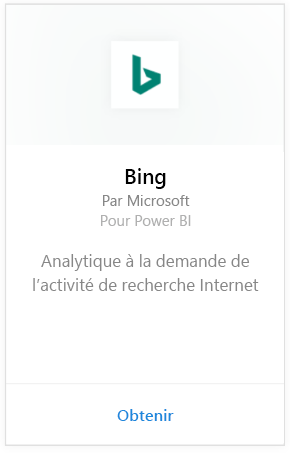
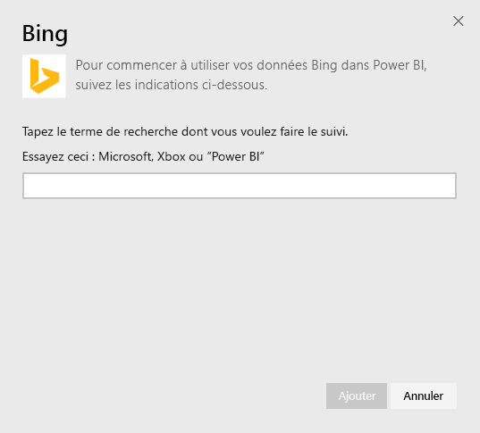
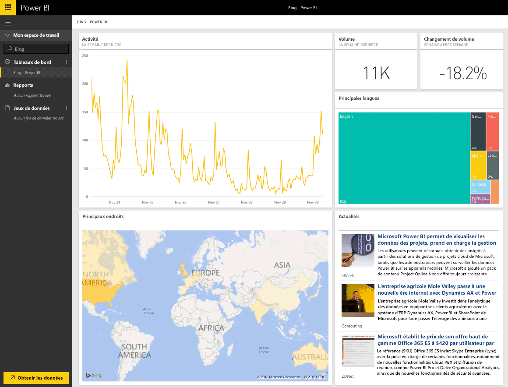

# Se connecter à Bing avec Power BI
Le pack de contenu Bing vous permet d’afficher les analyses d’activité de recherche Internet pour un terme de votre choix.

Connectez-vous au [pack de contenu Bing](https://app.powerbi.com/groups/me/getdata/services/bing) pour Power BI.

>[!NOTE]
>La mise à jour automatique des vignettes Bing a lieu toutes les 5 minutes environ. La seule vignette sélectionnable est la vignette Actualités qui permet d’accéder au bulletin d’informations correspondant. 

>[!NOTE]
>Les vignettes du pack de contenu Bing ne s’affichent pas dans les applications mobiles. Nous nous efforçons de résoudre ce problème.

1. Sélectionnez **Obtenir des données** en bas du volet de navigation gauche.
   
    
2. Dans la zone **Services** , sélectionnez **Obtenir**.
   
    
3. Sélectionnez **Bing** > **Obtenir**.
   
    
4. Dans la boîte de dialogue Paramètres, entrez le terme de recherche dont vous souhaitez effectuer le suivi et appuyez sur Ajouter.
   
        
5. La liste de tableaux de bord à gauche comprend une nouvelle entrée nommée Bing ainsi que le terme de recherche que vous avez fourni. Aucun jeu de données ou rapport n’est associé à ce tableau de bord. Le chargement des vignettes peut prendre un certain temps mais lorsqu’il est terminé, les vignettes sont disposées comme dans l’illustration ci-dessous.
   
    

Une fois le chargement terminé, vous pouvez commencer l’exploration de vos données, notamment épingler des vignettes entre ce tableau de bord et d’autres tableaux de bord de votre compte.

